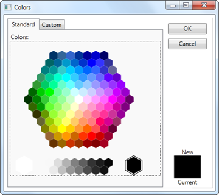
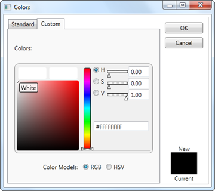

::: {style="DISPLAY: none"}
{#d2h_url_template}{#d2h_package_url style="WIDTH: 0px; DISPLAY: none; HEIGHT: 0px"}
:::

:::: {.d2h_secondary_topic style="PADDING-BOTTOM: 10pt; MARGIN: 0pt; PADDING-LEFT: 0pt; PADDING-RIGHT: 0pt; PADDING-TOP: 0pt"}
#### MoreColor Option {#morecolor-option style="tab-stops: 0pt"}

In addition to colors in Theme colors and Standard colors, MoreColor feature allows you to select wide range of color options. MoreColor feature includes two categories namely Standard Colors and Custom Colors. The Standard Colors includes 140 colors clustered in the shape of a Hexagon. The color chosen from this cluster will also be added in the RecentlyUsedPanel. You can also set the visibility of the MoreColor Option by using the MoreColorOptionVisibility property.

 

Use Case Scenarios

MoreColor Option can be used when you want to select colors using standard and custom colors.

 

Adding MoreColor Option to an Application

MoreColor Option can be added to an application by using XAML or C# code.

 

The following code example illustrates how to add the MoreColor Option to an Application through XAML.

 

+---------------------------------------------------------------------------------------------------------------------------------------------------------------------------------------------------------------------------------------------------------------------------------------------------------------------------------------------------------------------------------------------------------------------------------------------------------------------------------------------------------------------------------+
| **[\[XAML\]]{style="FONT-FAMILY: 'Courier New'"}**                                                                                                                                                                                                                                                                                                                                                                                                                                                                              |
|                                                                                                                                                                                                                                                                                                                                                                                                                                                                                                                                 |
| **[]{style="FONT-FAMILY: 'Courier New'"}**                                                                                                                                                                                                                                                                                                                                                                                                                                                                                      |
|                                                                                                                                                                                                                                                                                                                                                                                                                                                                                                                                 |
| [\<]{style="FONT-FAMILY: 'Courier New'; COLOR: blue"}[sync]{style="FONT-FAMILY: 'Courier New'; COLOR: #a31515"}[:]{style="FONT-FAMILY: 'Courier New'; COLOR: blue"}[ColorPickerPalette]{style="FONT-FAMILY: 'Courier New'; COLOR: #a31515"}[ x]{style="FONT-FAMILY: 'Courier New'; COLOR: red"}[:]{style="FONT-FAMILY: 'Courier New'; COLOR: blue"}[Name]{style="FONT-FAMILY: 'Courier New'; COLOR: red"}[=\"ColorPicker\"]{style="FONT-FAMILY: 'Courier New'; COLOR: blue"}[ ]{style="FONT-FAMILY: 'Courier New'; COLOR: red"} |
|                                                                                                                                                                                                                                                                                                                                                                                                                                                                                                                                 |
| [                         MoreColorOptionVisibility]{style="FONT-FAMILY: 'Courier New'; COLOR: red"}[=\"Visible\" /\>]{style="FONT-FAMILY: 'Courier New'; COLOR: blue"}                                                                                                                                                                                                                                                                                                                                                         |
|                                                                                                                                                                                                                                                                                                                                                                                                                                                                                                                                 |
|                                                                                                                                                                                                                                                                                                                                                                                                                                                                                                                                 |
+---------------------------------------------------------------------------------------------------------------------------------------------------------------------------------------------------------------------------------------------------------------------------------------------------------------------------------------------------------------------------------------------------------------------------------------------------------------------------------------------------------------------------------+

 

The following code example illustrates how to add the MoreColor Option to an Application through C#.

 

+---------------------------------------------------------------------------------------------------------------------------------------------------------------------------------------------------------+
| **[\[C#\]]{style="FONT-FAMILY: 'Courier New'"}**                                                                                                                                                        |
|                                                                                                                                                                                                         |
| **[]{style="FONT-FAMILY: 'Courier New'"}**                                                                                                                                                              |
|                                                                                                                                                                                                         |
| [ColorPickerPalette]{style="FONT-FAMILY: 'Courier New'; COLOR: #2b91af"}[ colorpicker = [new]{style="COLOR: blue"} [ColorPickerPalette]{style="COLOR: #2b91af"}();]{style="FONT-FAMILY: 'Courier New'"} |
|                                                                                                                                                                                                         |
| [colorpicker.MoreColorOptionVisibility = System.[Visibility]{style="COLOR: #2b91af"}.Visible;]{style="FONT-FAMILY: 'Courier New'"}                                                                      |
|                                                                                                                                                                                                         |
|                                                                                                                                                                                                         |
+---------------------------------------------------------------------------------------------------------------------------------------------------------------------------------------------------------+

 

 

{border="0"}

Figure 197: More Color Window with standard colors

[]{style="COLOR: #c00000"} 

{border="0"}

Figure 198: More Color Window with Custom colors[]{style="COLOR: #c00000"}

 

Properties

Table 20: MoreColorOptionVisibility Property Table

::: {align="center"}
  --------------------------- ------------------------------------------------------------- --------------------- -------------------- -----------------
  Property                    Description                                                   Type                  Data Type            Reference links
  MoreColorOptionVisibility   Enables or disables the visibility of the MoreColor Window.   Dependency Property   Visibility.Visible   
  --------------------------- ------------------------------------------------------------- --------------------- -------------------- -----------------
:::

**[]{style="FONT-FAMILY: 'Trebuchet MS','sans-serif'; COLOR: #15428b; FONT-SIZE: 9pt"}** 

Sample Link

To view samples:

1.   Select Start -\> Programs -\> Syncfusion -\> Essential Studio x.x.xx -\> Dashboard.

2.   Select   Run Locally Installed Samples in WPF Button.

3.   Now expand the DragAndDropManagerDemo tree-view item in the Sample Browser.

4.   Choose any one of the samples listed under it to launch.

[]{#related-topics}
::::
