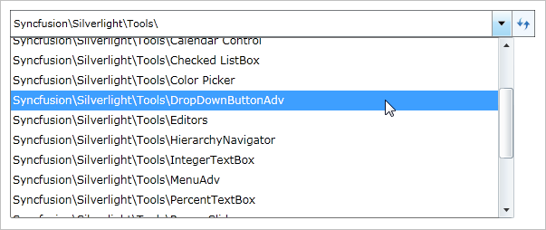
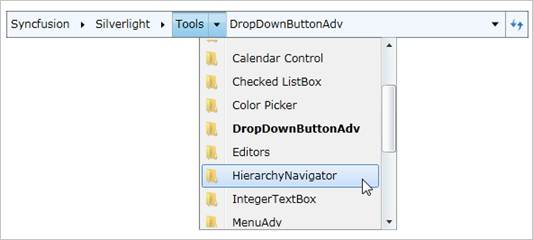

::: {style="DISPLAY: none"}
{#d2h_url_template}{#d2h_package_url style="WIDTH: 0px; DISPLAY: none; HEIGHT: 0px"}
:::

::: {.d2h_secondary_topic style="PADDING-BOTTOM: 10pt; MARGIN: 0pt; PADDING-LEFT: 0pt; PADDING-RIGHT: 0pt; PADDING-TOP: 0pt"}
#### Mouse Support {#mouse-support style="tab-stops: 0pt"}

An item can be selected by rolling the mouse over it. The highlight that appears on the rolled over item helps identify the item that is currently selected. You can click next to an item to view a navigation pop-up window.

The mouse wheel can be used to scroll a vertical scroll bar that is enabled in the History or Navigation pop-up control to view the full content.

{border="0"}

 

Figure 574: History popup

 

 

{border="0"}

 

Figure 575: Navigation popup items

 

The mouse can be rolled over a Hierarchy Navigator item to view a pop-up (without clicking the item) even when there is a pop-up displayed for another item.

[]{#related-topics}
:::
