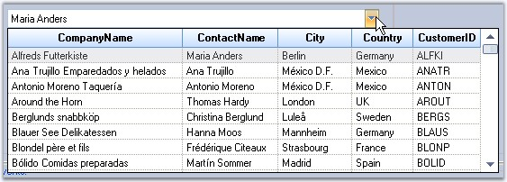

::: {style="DISPLAY: none"}
{#d2h_url_template}{#d2h_package_url style="WIDTH: 0px; DISPLAY: none; HEIGHT: 0px"}
:::

::: {.d2h_secondary_topic style="PADDING-BOTTOM: 10pt; MARGIN: 0pt; PADDING-LEFT: 0pt; PADDING-RIGHT: 0pt; PADDING-TOP: 0pt"}
#### MultiColumnComboBox {#multicolumncombobox style="tab-stops: 0pt"}

[]{style="COLOR: #15428b"} 

Based on our ComboBoxBase control, the **MultiColumnComboBox** is an advanced combo box control that has the capability to show multiple columns in the drop-down list. Also, since the drop-down list is bound virtually to the datasource, data binding to a very large datasource is instantaneous.

 

In this version, the **MultiColumnComboBox** can only be populated using data binding. You cannot manually add items to the combo box.

 

This combo box automatically shows all the fields in the datasource. You can data bind using the usual **DataSource**, **DisplayMember** and **ValueMember** properties.

[]{style="COLOR: #15428b"} 

{border="0"}

***[]{style="COLOR: #15428b"}*** 

Figure 368: MultiColumnComboBox

[]{style="COLOR: #15428b"} 

More:

[ ]{#related-topics}

[{border="0" align="absMiddle"}Features](ms-xhelp:///?Id=16129cac-5e2f-4fd6-a40c-7ae3b4f7f527){style="TEXT-DECORATION: none"}

[{border="0" align="absMiddle"}Creating MultiColumnComboBox](ms-xhelp:///?Id=a85e320d-745b-46d3-9c15-86f54001085e){style="TEXT-DECORATION: none"}

[{border="0" align="absMiddle"}Concepts and Features](ms-xhelp:///?Id=1b3d555c-c8a8-47b3-ac7b-2a3a05c284d3){style="TEXT-DECORATION: none"}

[{border="0" align="absMiddle"}Event Handling](ms-xhelp:///?Id=01bf5d5f-6829-4822-a9ff-dd8baec40e65){style="TEXT-DECORATION: none"}

[{border="0" align="absMiddle"}Frequently Asked Questions](ms-xhelp:///?Id=cdca5de6-6f29-4b40-9ff7-f15e57bd6948){style="TEXT-DECORATION: none"}
:::
