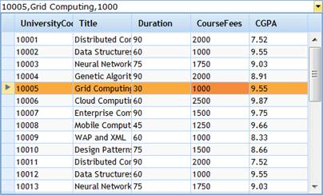

::: {style="DISPLAY: none"}
{#d2h_url_template}{#d2h_package_url style="WIDTH: 0px; DISPLAY: none; HEIGHT: 0px"}
:::

::::: {#nsbanner .d2h_main_nsbanner style="BORDER-BOTTOM: #999999 1px solid; POSITION: relative; PADDING-BOTTOM: 0px; BACKGROUND-COLOR: transparent; PADDING-LEFT: 0px; PADDING-RIGHT: 0px; DISPLAY: none; BORDER-TOP: #999999 1px solid; PADDING-TOP: 0px; LEFT: 0px"}
:::: {#TitleRow .d2h_main_titlerow style="PADDING-BOTTOM: 4px; BACKGROUND-COLOR: transparent; PADDING-LEFT: 22px; WIDTH: 100%; PADDING-RIGHT: 10px; DISPLAY: none; PADDING-TOP: 4px"}
::: {#ienav .d2h_main_ienav style="DISPLAY: none"}
{#D2HPrevious .D2HPreviousEnabled}  {#D2HNext .D2HNextEnabled}
:::
::::
:::::

:::: {#nstext .d2h_main_nstext style="PADDING-BOTTOM: 10px; BACKGROUND-COLOR: transparent; PADDING-LEFT: 22px; PADDING-RIGHT: 10px; HEIGHT: 100%; OVERFLOW: auto; PADDING-TOP: 5px" hasuserbackground="true" valign="bottom"}
::: {#d2h_breadcrumbs .d2h_breadcrumbs}
[Essential Studio User Guide Documentation](ms-xhelp:///?Id=12457748-09e3-4d74-a240-8e049cedf030){.d2h_breadcrumbsNormal}[ \> ]{.d2h_breadcrumbsLinkSeparator}[User Interface Edition](ms-xhelp:///?Id=c29296b7-531c-413b-a0ec-488ca1f7f669){.d2h_breadcrumbsNormal}[ \> ]{.d2h_breadcrumbsLinkSeparator}[Essential ASP.NET MVC](ms-xhelp:///?Id=4b14e7d1-65c4-4f67-b1aa-2c37709905a5){.d2h_breadcrumbsNormal}[ \> ]{.d2h_breadcrumbsLinkSeparator}[Essential Grid]{.d2h_breadcrumbsContentsOnly}[ \> ]{.d2h_breadcrumbsLinkSeparator}[Getting Started](ms-xhelp:///?Id=c7ed3902-b25b-4170-be58-1d3d0b57748a){.d2h_breadcrumbsNormal}[ \> ]{.d2h_breadcrumbsLinkSeparator}[Feature Summary](ms-xhelp:///?Id=1923e679-441a-44e0-9bca-e0e50988a857){.d2h_breadcrumbsNormal}[ \> ]{.d2h_breadcrumbsLinkSeparator}[Concepts and Features](ms-xhelp:///?Id=4a1657fa-4756-42b9-9153-aebf5dcfc503){.d2h_breadcrumbsNormal}
:::

## MultiColumnDropDown {#multicolumndropdown style="tab-stops: 0pt"}

 

MultiColumnDropDown is a data-bound control used to display multiple columns of data (presented in a tabular format) in a drop-down box. The data selected from the drop-down can be displayed in the combo box as you define. You can customize the header, text box, and style settings for the drop-down box.

 

 

{border="0"}

Figure 300: MultiColumnDropDown

 

In the figure above, a student can see all the university course details like course fees, duration, CGPA, course code, etc. But after selecting one, it is not necessary to show all the details.You can simply display the Univerity Code, fees, and CGPA.

 

Key Features

1.   Bind the data source directly to the control; it will generate columns accordingly. No further steps are required.

2.   The MultiColumnDropdown control has some predefined skins which can be controlled through a single property setting.

 

Some of the available skins are as follows.

[·      ]{style="FONT-FAMILY: Symbol"}Office 2007 Blue

[·      ]{style="FONT-FAMILY: Symbol"}Office 2007 Black

[·      ]{style="FONT-FAMILY: Symbol"}Office 2007 Silver

[·      ]{style="FONT-FAMILY: Symbol"}Vista

More:

[ ]{#related-topics}

[{border="0" align="absMiddle"}Elaborate Structure of MultiColumnDropDown](ms-xhelp:///?Id=e62d22bc-1ee3-47ed-a083-d3daa2dd7baa){style="TEXT-DECORATION: none"}

[{border="0" align="absMiddle"}Adding Essential Grid to an Application](ms-xhelp:///?Id=7380a341-f267-4a0a-af3f-ada89aac194a){style="TEXT-DECORATION: none"}

[{border="0" align="absMiddle"}Concepts and Features](ms-xhelp:///?Id=7e1c1423-1de0-4782-b407-fff4875578fc){style="TEXT-DECORATION: none"}

[{border="0" align="absMiddle"}Data Binding](ms-xhelp:///?Id=0c7cdd40-e7ea-4d50-a794-2f6cc0e8def6){style="TEXT-DECORATION: none"}

[{border="0" align="absMiddle"}Appearance](ms-xhelp:///?Id=cf66a97b-515c-4b11-a121-84b031379f49){style="TEXT-DECORATION: none"}

[{border="0" align="absMiddle"}RightToLeft](ms-xhelp:///?Id=4202f313-157a-437e-921b-9a9dcc089119){style="TEXT-DECORATION: none"}

[{border="0" align="absMiddle"}Setting the Orientation](ms-xhelp:///?Id=741e9a69-e014-4de3-a0d8-8517f3a0f94c){style="TEXT-DECORATION: none"}

[{border="0" align="absMiddle"}Defining the Display Conditions](ms-xhelp:///?Id=1f7ef432-4557-4315-984d-441b8a8647ec){style="TEXT-DECORATION: none"}

[{border="0" align="absMiddle"}Column Mapping](ms-xhelp:///?Id=d5215103-858b-49c2-96c7-4fe730a989e1){style="TEXT-DECORATION: none"}

[{border="0" align="absMiddle"}Client-Side Events](ms-xhelp:///?Id=8bb7541b-5278-49f1-ab76-943a576e0b19){style="TEXT-DECORATION: none"}

[{border="0" align="absMiddle"}Client-Side Methods](ms-xhelp:///?Id=3d5605cf-b939-4a9b-bc45-8401c83966a8){style="TEXT-DECORATION: none"}

[{border="0" align="absMiddle"}Sorting](ms-xhelp:///?Id=20205a1e-33a2-4edc-be50-a55b1603a83c){style="TEXT-DECORATION: none"}

[{border="0" align="absMiddle"}Filtering in the MultiColumnDropDown Control](ms-xhelp:///?Id=eca65cde-23d6-41ab-a006-55046e6784a9){style="TEXT-DECORATION: none"}
::::
