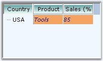

::: {style="DISPLAY: none"}
{#d2h_url_template}{#d2h_package_url style="WIDTH: 0px; DISPLAY: none; HEIGHT: 0px"}
:::

::: {.d2h_secondary_topic style="PADDING-BOTTOM: 10pt; MARGIN: 0pt; PADDING-LEFT: 0pt; PADDING-RIGHT: 0pt; PADDING-TOP: 0pt"}
#### MultiColumnTreeView Appearance {#multicolumntreeview-appearance style="MARGIN-LEFT: 18pt; tab-stops: 18.0pt"}

[]{style="COLOR: #15428b"} 

The appearance of the MultiColumnTreeView can be customized using background, foreground, border and spacing properties similar to TreeView control. The below topics are covered in this section.

 

 

**SubItem Appearance**

 

The background, foreground and border settings of a subitem can be specified using SubItem Style Editor. Refer to [SubItem Styles]{style="COLOR: black"} for all the style settings.

[]{style="COLOR: #15428b"} 

+----------------------------------------------------------------------------------------------------------------------------------------------------------------------------------------------------------------+
| **[\[C#\]]{style="FONT-FAMILY: 'Courier New'; COLOR: black"}**                                                                                                                                                 |
|                                                                                                                                                                                                                |
| []{style="COLOR: #15428b"}                                                                                                                                                                                     |
|                                                                                                                                                                                                                |
| [treeNodeAdvSubItem1.Background = [new]{style="COLOR: blue"} Syncfusion.Drawing.[BrushInfo]{style="COLOR: teal"}(System.Drawing.[Color]{style="COLOR: teal"}.SandyBrown);]{style="FONT-FAMILY: 'Courier New'"} |
|                                                                                                                                                                                                                |
| [treeNodeAdvSubItem1.Border3DStyle = System.Windows.Forms.[Border3DStyle]{style="COLOR: teal"}.SunkenInner;]{style="FONT-FAMILY: 'Courier New'"}                                                               |
|                                                                                                                                                                                                                |
| [treeNodeAdvSubItem1.BorderColor = System.Drawing.[Color]{style="COLOR: teal"}.SteelBlue;]{style="FONT-FAMILY: 'Courier New'"}                                                                                 |
|                                                                                                                                                                                                                |
| [treeNodeAdvSubItem1.BorderSingle = System.Windows.Forms.[ButtonBorderStyle]{style="COLOR: teal"}.Dotted;]{style="FONT-FAMILY: 'Courier New'"}                                                                 |
|                                                                                                                                                                                                                |
| [treeNodeAdvSubItem1.BorderStyle = System.Windows.Forms.[BorderStyle]{style="COLOR: teal"}.FixedSingle;]{style="FONT-FAMILY: 'Courier New'"}                                                                   |
|                                                                                                                                                                                                                |
| [treeNodeAdvSubItem1.TextColor = System.Drawing.[Color]{style="COLOR: teal"}.Navy;]{style="FONT-FAMILY: 'Courier New'"}                                                                                        |
|                                                                                                                                                                                                                |
| []{style="FONT-FAMILY: 'Courier New'"}                                                                                                                                                                         |
|                                                                                                                                                                                                                |
| [treeNodeAdvSubItem2.Background = [new]{style="COLOR: blue"} Syncfusion.Drawing.[BrushInfo]{style="COLOR: teal"}(System.Drawing.[Color]{style="COLOR: teal"}.SandyBrown);]{style="FONT-FAMILY: 'Courier New'"} |
|                                                                                                                                                                                                                |
| [treeNodeAdvSubItem2.Border3DStyle = System.Windows.Forms.[Border3DStyle]{style="COLOR: teal"}.SunkenOuter;]{style="FONT-FAMILY: 'Courier New'"}                                                               |
|                                                                                                                                                                                                                |
| [treeNodeAdvSubItem2.BorderColor = System.Drawing.[Color]{style="COLOR: teal"}.SteelBlue;]{style="FONT-FAMILY: 'Courier New'"}                                                                                 |
|                                                                                                                                                                                                                |
| [treeNodeAdvSubItem2.BorderSingle = System.Windows.Forms.[ButtonBorderStyle]{style="COLOR: teal"}.Dotted;]{style="FONT-FAMILY: 'Courier New'"}                                                                 |
|                                                                                                                                                                                                                |
| [treeNodeAdvSubItem2.BorderStyle = System.Windows.Forms.[BorderStyle]{style="COLOR: teal"}.FixedSingle;]{style="FONT-FAMILY: 'Courier New'"}                                                                   |
|                                                                                                                                                                                                                |
| [treeNodeAdvSubItem2.TextColor = System.Drawing.[Color]{style="COLOR: teal"}.Navy;]{style="FONT-FAMILY: 'Courier New'"}[]{style="FONT-FAMILY: 'Courier New'"}                                                  |
+----------------------------------------------------------------------------------------------------------------------------------------------------------------------------------------------------------------+

[]{style="COLOR: #15428b"} 

+------------------------------------------------------------------------------------------------------------------------------------------------------------------+
| **[\[VB.NET\]]{style="FONT-FAMILY: 'Courier New'; COLOR: black"}**                                                                                               |
|                                                                                                                                                                  |
| []{style="COLOR: #15428b"}                                                                                                                                       |
|                                                                                                                                                                  |
| [treeNodeAdvSubItem1.Background = [New]{style="COLOR: blue"} Syncfusion.Drawing.BrushInfo(System.Drawing.Color.SandyBrown) ]{style="FONT-FAMILY: 'Courier New'"} |
|                                                                                                                                                                  |
| [treeNodeAdvSubItem1.Border3DStyle = System.Windows.Forms.Border3DStyle.SunkenInner ]{style="FONT-FAMILY: 'Courier New'"}                                        |
|                                                                                                                                                                  |
| [treeNodeAdvSubItem1.BorderColor = System.Drawing.Color.SteelBlue ]{style="FONT-FAMILY: 'Courier New'"}                                                          |
|                                                                                                                                                                  |
| [treeNodeAdvSubItem1.BorderSingle = System.Windows.Forms.ButtonBorderStyle.Dotted ]{style="FONT-FAMILY: 'Courier New'"}                                          |
|                                                                                                                                                                  |
| [treeNodeAdvSubItem1.BorderStyle = System.Windows.Forms.BorderStyle.FixedSingle ]{style="FONT-FAMILY: 'Courier New'"}                                            |
|                                                                                                                                                                  |
| [treeNodeAdvSubItem1.TextColor = System.Drawing.Color.Navy ]{style="FONT-FAMILY: 'Courier New'"}                                                                 |
|                                                                                                                                                                  |
| []{style="FONT-FAMILY: 'Courier New'"}                                                                                                                           |
|                                                                                                                                                                  |
| [treeNodeAdvSubItem2.Background = [New]{style="COLOR: blue"} Syncfusion.Drawing.BrushInfo(System.Drawing.Color.SandyBrown) ]{style="FONT-FAMILY: 'Courier New'"} |
|                                                                                                                                                                  |
| [treeNodeAdvSubItem2.Border3DStyle = System.Windows.Forms.Border3DStyle.SunkenOuter ]{style="FONT-FAMILY: 'Courier New'"}                                        |
|                                                                                                                                                                  |
| [treeNodeAdvSubItem2.BorderColor = System.Drawing.Color.SteelBlue ]{style="FONT-FAMILY: 'Courier New'"}                                                          |
|                                                                                                                                                                  |
| [treeNodeAdvSubItem2.BorderSingle = System.Windows.Forms.ButtonBorderStyle.Dotted ]{style="FONT-FAMILY: 'Courier New'"}                                          |
|                                                                                                                                                                  |
| [treeNodeAdvSubItem2.BorderStyle = System.Windows.Forms.BorderStyle.FixedSingle ]{style="FONT-FAMILY: 'Courier New'"}                                            |
|                                                                                                                                                                  |
| [treeNodeAdvSubItem2.TextColor = System.Drawing.Color.Navy ]{style="FONT-FAMILY: 'Courier New'"}[]{style="FONT-FAMILY: 'Courier New'"}                           |
+------------------------------------------------------------------------------------------------------------------------------------------------------------------+

**[]{style="COLOR: #15428b"}** 

A MultiColumnTreeView with above settings is displayed below.

[]{style="COLOR: #15428b"} 

{border="0"}

[]{style="COLOR: #15428b"} 

Figure 1191: MultiColumnTreeView with Customized Appearance

 

 

 

 

More:

[ ]{#related-topics}

[{border="0" align="absMiddle"}Column Appearance](ms-xhelp:///?Id=5d62e7e8-7dcd-4fc8-967f-0d3fda0d9e46){style="TEXT-DECORATION: none"}
:::
