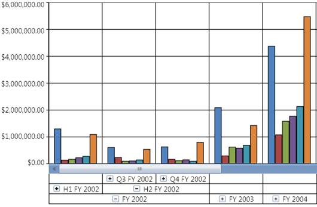

::: {style="DISPLAY: none"}
{#d2h_url_template}{#d2h_package_url style="WIDTH: 0px; DISPLAY: none; HEIGHT: 0px"}
:::

::: {.d2h_secondary_topic style="PADDING-BOTTOM: 10pt; MARGIN: 0pt; PADDING-LEFT: 0pt; PADDING-RIGHT: 0pt; PADDING-TOP: 0pt"}
#### Multi-level DrillDown {#multi-level-drilldown style="tab-stops: 0pt"}

[]{style="FONT-FAMILY: 'Calibri','sans-serif'; FONT-SIZE: 11pt"} 

While binding hierarchical dimensions (for example, the time dimension could include 3 levels namely Year, Quarter, and Month), the Chart allows you to visualize the data for different levels by using the collapsible labels. This is illustrated in the following screenshot:

[]{style="FONT-FAMILY: 'Calibri','sans-serif'; FONT-SIZE: 11pt"} 

{border="0"}

Figure 62: OLAP Chart showing the Drill Down feature in the x-axis[]{style="FONT-FAMILY: 'Calibri','sans-serif'; FONT-SIZE: 11pt"}

[]{style="FONT-FAMILY: 'Calibri','sans-serif'; FONT-SIZE: 11pt"} 

A sample, which demonstrates the multiple level Drill-Down feature, is available in the following sample installation location.

**..\\Syncfusion\\\<Version Number\>\\BI\\WPF\\OlapChart.WPF\\Samples\\Creating Reports\\Reports In Code**

 

See also:

How to toggle the visibility of PrimaryAxisLabelPanel?

 

More:

[ ]{#related-topics}

[{border="0" align="absMiddle"}How to show/hide the expanders in an OlapChart?](ms-xhelp:///?Id=06c8653b-b883-42b4-b32a-1ce04fc7be8d){style="TEXT-DECORATION: none"}
:::
