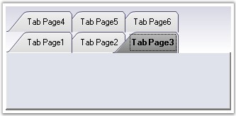

::: {style="DISPLAY: none"}
{#d2h_url_template}{#d2h_package_url style="WIDTH: 0px; DISPLAY: none; HEIGHT: 0px"}
:::

::::: {.d2h_secondary_topic style="PADDING-BOTTOM: 10pt; MARGIN: 0pt; PADDING-LEFT: 0pt; PADDING-RIGHT: 0pt; PADDING-TOP: 0pt"}
##### Multiline Support {#multiline-support style="MARGIN-LEFT: 18pt; tab-stops: 18.0pt"}

[]{style="COLOR: #15428b"} 

Multiple level of tabs can be created by setting the **Multiline** property of the TabControl to true, which places the tabs in more than one line. This allows the tabs to be arranged in multiple lines when the tabs exceed the width of the control, with all the tabitems in view.

 

The tabitem\'s text can be placed in more than one line by setting the **MultilineText** property.

[]{style="COLOR: #15428b"} 

::: {align="center"}
  ------------------------ --------------------------------------------------------------------------------------------------------------------------------
  TabControlAdv Property   Description
  Multiline                Allows the tabs to be arranged in multiple lines when the tabs exceed the width of the control, with all the tabitems in view.
  MultilineText            Allows the tabitem\'s text to be placed in more than one line.
  ------------------------ --------------------------------------------------------------------------------------------------------------------------------
:::

[]{style="COLOR: #15428b"} 

+-----------------------------------------------------------------------------------------------------------------------------------------------------------------------+
| **[\[C#\]]{style="FONT-FAMILY: 'Courier New'; COLOR: black"}**                                                                                                        |
|                                                                                                                                                                       |
| **[]{style="FONT-FAMILY: 'Courier New'; COLOR: black"}**                                                                                                              |
|                                                                                                                                                                       |
| [this]{style="FONT-FAMILY: 'Courier New'; COLOR: blue"}[.tabControlAdv1.Multiline = [true]{style="COLOR: blue"};]{style="FONT-FAMILY: 'Courier New'"}                 |
|                                                                                                                                                                       |
| [this]{style="FONT-FAMILY: 'Courier New'; COLOR: blue"}[.tabControlAdv1.MultilineText = [true]{style="COLOR: blue"};]{style="FONT-FAMILY: 'Courier New'"}             |
|                                                                                                                                                                       |
| [this]{style="FONT-FAMILY: 'Courier New'; COLOR: blue"}[.tabControlAdv1.KeepSelectedTabInFrontRow = [true]{style="COLOR: blue"};]{style="FONT-FAMILY: 'Courier New'"} |
+-----------------------------------------------------------------------------------------------------------------------------------------------------------------------+

[]{style="COLOR: #15428b"} 

+--------------------------------------------------------------------------------------------------------------------------------------------------------------------+
| **[\[VB.NET\]]{style="FONT-FAMILY: 'Courier New'; COLOR: black"}**                                                                                                 |
|                                                                                                                                                                    |
| **[]{style="FONT-FAMILY: 'Courier New'; COLOR: black"}**                                                                                                           |
|                                                                                                                                                                    |
| [Me]{style="FONT-FAMILY: 'Courier New'; COLOR: blue"}[.tabControlAdv1.Multiline = [True]{style="COLOR: blue"}]{style="FONT-FAMILY: 'Courier New'"}                 |
|                                                                                                                                                                    |
| [Me]{style="FONT-FAMILY: 'Courier New'; COLOR: blue"}[.tabControlAdv1.MultilineText = [True]{style="COLOR: blue"}]{style="FONT-FAMILY: 'Courier New'"}             |
|                                                                                                                                                                    |
| [Me]{style="FONT-FAMILY: 'Courier New'; COLOR: blue"}[.tabControlAdv1.KeepSelectedTabInFrontRow = [True]{style="COLOR: blue"}]{style="FONT-FAMILY: 'Courier New'"} |
+--------------------------------------------------------------------------------------------------------------------------------------------------------------------+

[]{style="COLOR: red; FONT-SIZE: 8pt"} 

{border="0"}

[]{style="COLOR: #15428b"} 

Figure 1040: Tabs in Multiple Lines

[]{style="COLOR: #15428b"} 

The **KeepSelectedTabInFrontRow** property will bring the selected tab to the front row (applicable only in the case of Multiline Tabs).

 

**UseMnemonic**

 

This property specifies whether the TabControlAdv interprets the Ampersand character (&) to be an Access key prefix character or not. The default value is set to False.

[]{style="COLOR: #15428b"} 

::: {align="center"}
  ------------------------ ------------------------------------------------------------------------------------------------------------------------------------------------------------
  TabControlAdv Property   Description
  UseMnemonic              Gets / sets the value which determines whether the TabControlAdv should interpret the Ampersand character (&) to be an Access key prefix character or not.
  ------------------------ ------------------------------------------------------------------------------------------------------------------------------------------------------------
:::

 

 

 

 

[]{#related-topics}
:::::
