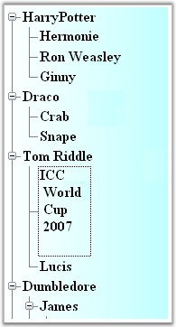

::: {style="DISPLAY: none"}
{#d2h_url_template}{#d2h_package_url style="WIDTH: 0px; DISPLAY: none; HEIGHT: 0px"}
:::

:::: {.d2h_secondary_topic style="PADDING-BOTTOM: 10pt; MARGIN: 0pt; PADDING-LEFT: 0pt; PADDING-RIGHT: 0pt; PADDING-TOP: 0pt"}
##### MultiLine Support {#multiline-support style="MARGIN-LEFT: 18pt; tab-stops: 18.0pt"}

[]{style="COLOR: #15428b"} 

TreeNodeAdv has multiline text option for each node by using the **Multiline** property. This can be set through NodeCollection Editor. We need to adjust the default Node height value to make it effective.

[]{style="COLOR: #15428b"} 

::: {align="center"}
  ---------------------- ----------------------------------------------------------------------
  TreeNodeAdv Property   Description
  Multiline              Specifies if the node text is drawn as multiple text or single line.
  ---------------------- ----------------------------------------------------------------------
:::

[]{style="COLOR: #15428b"} 

The node text should be provided through code as shown in the code snippet below.

[]{style="COLOR: #15428b"} 

+------------------------------------------------------------------------------------------------------------------------+
| **[\[C#\]]{style="FONT-FAMILY: 'Courier New'; COLOR: black"}**                                                         |
|                                                                                                                        |
| []{style="FONT-FAMILY: 'Courier New'; COLOR: black"}                                                                   |
|                                                                                                                        |
| [treeNodeAdv1.Multiline = [true]{style="COLOR: blue"};]{style="FONT-FAMILY: 'Courier New'"}                            |
|                                                                                                                        |
| [treeNodeAdv1.Height = 100;]{style="FONT-FAMILY: 'Courier New'"}                                                       |
|                                                                                                                        |
| [treeNodeAdv1.Text = [\"ICC \\n World \\n Cup \\n 2007\"]{style="COLOR: maroon"};]{style="FONT-FAMILY: 'Courier New'"} |
+------------------------------------------------------------------------------------------------------------------------+

[]{style="COLOR: #15428b"} 

+----------------------------------------------------------------------------------------------------------------------------------------------------------------------------+
| **[\[VB.NET\]]{style="FONT-FAMILY: 'Courier New'; COLOR: black"}**                                                                                                         |
|                                                                                                                                                                            |
| []{style="FONT-FAMILY: 'Courier New'; COLOR: black"}                                                                                                                       |
|                                                                                                                                                                            |
| [treeNodeAdv1.Multiline = [True]{style="COLOR: blue"}]{style="FONT-FAMILY: 'Courier New'"}                                                                                 |
|                                                                                                                                                                            |
| [treeNodeAdv1.Height = 100]{style="FONT-FAMILY: 'Courier New'"}                                                                                                            |
|                                                                                                                                                                            |
| [treeNodeAdv1.Text = [\"ICC \\n World \\n Cup \\n 2007\"]{style="COLOR: maroon"}]{style="FONT-FAMILY: 'Courier New'"}[]{style="FONT-FAMILY: 'Courier New'; COLOR: maroon"} |
+----------------------------------------------------------------------------------------------------------------------------------------------------------------------------+

[]{style="COLOR: #15428b"} 

The below image displays a node with multiline property set.

[]{style="COLOR: #15428b"} 

{border="0"}

Figure 1182: MultiLine Support Illustrated

 

 

 

[]{#related-topics}
::::
