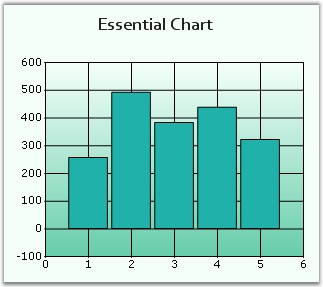

::: {style="DISPLAY: none"}
{#d2h_url_template}{#d2h_package_url style="WIDTH: 0px; DISPLAY: none; HEIGHT: 0px"}
:::

::::: {#nsbanner .d2h_main_nsbanner style="BORDER-BOTTOM: #999999 1px solid; POSITION: relative; PADDING-BOTTOM: 0px; BACKGROUND-COLOR: transparent; PADDING-LEFT: 0px; PADDING-RIGHT: 0px; DISPLAY: none; BORDER-TOP: #999999 1px solid; PADDING-TOP: 0px; LEFT: 0px"}
:::: {#TitleRow .d2h_main_titlerow style="PADDING-BOTTOM: 4px; BACKGROUND-COLOR: transparent; PADDING-LEFT: 22px; WIDTH: 100%; PADDING-RIGHT: 10px; DISPLAY: none; PADDING-TOP: 4px"}
::: {#ienav .d2h_main_ienav style="DISPLAY: none"}
{#D2HPrevious .D2HPreviousEnabled}  {#D2HNext .D2HNextEnabled}
:::
::::
:::::

:::::: {#nstext .d2h_main_nstext style="PADDING-BOTTOM: 10px; BACKGROUND-COLOR: transparent; PADDING-LEFT: 22px; PADDING-RIGHT: 10px; HEIGHT: 100%; OVERFLOW: auto; PADDING-TOP: 5px" hasuserbackground="true" valign="bottom"}
::: {#d2h_breadcrumbs .d2h_breadcrumbs}
[Essential Studio User Guide Documentation](ms-xhelp:///?Id=12457748-09e3-4d74-a240-8e049cedf030){.d2h_breadcrumbsNormal}[ \> ]{.d2h_breadcrumbsLinkSeparator}[User Interface Edition](ms-xhelp:///?Id=c29296b7-531c-413b-a0ec-488ca1f7f669){.d2h_breadcrumbsNormal}[ \> ]{.d2h_breadcrumbsLinkSeparator}[Essential ASP.NET](ms-xhelp:///?Id=25c35330-c127-4dad-9a92-ed79dc7261a6){.d2h_breadcrumbsNormal}[ \> ]{.d2h_breadcrumbsLinkSeparator}[Essential Chart]{.d2h_breadcrumbsContentsOnly}[ \> ]{.d2h_breadcrumbsLinkSeparator}[Concepts and Features](ms-xhelp:///?Id=100687ce-82f2-4424-9d16-0949ea76cf15){.d2h_breadcrumbsNormal}[ \> ]{.d2h_breadcrumbsLinkSeparator}[Chart Appearance](ms-xhelp:///?Id=ffd49f03-f677-452a-81e4-aa2f18f1b9a0){.d2h_breadcrumbsNormal}
:::

### Multiple Chart Titles {#multiple-chart-titles style="tab-stops: 0pt"}

**[]{style="FONT-FAMILY: 'Trebuchet MS','sans-serif'"}** 

Default Title

**[]{style="FONT-FAMILY: 'Trebuchet MS','sans-serif'"}** 

Essential Chart\'s **Title** property lets you edit the default title for a chart as follows. We can set font style for the title using **Title.Font** property. The default value is Verdana, 14, Regular.

[]{style="FONT-FAMILY: 'Trebuchet MS','sans-serif'; FONT-SIZE: 9pt"} 

+----------------------------------------------------------------------------------------------------------------------------------------------------------------------------------------------------------------------------------------------------------------------------------------------------+
| **[\[C#\]]{style="FONT-FAMILY: 'Courier New'; COLOR: black"}**                                                                                                                                                                                                                                     |
|                                                                                                                                                                                                                                                                                                    |
| **[]{style="FONT-FAMILY: 'Courier New'; COLOR: black"}**                                                                                                                                                                                                                                           |
|                                                                                                                                                                                                                                                                                                    |
| [//Default title]{style="FONT-FAMILY: 'Courier New'; COLOR: green"}                                                                                                                                                                                                                                |
|                                                                                                                                                                                                                                                                                                    |
| [ChartWebControl1.Title.Text = \"Essential Chart\";]{style="FONT-FAMILY: 'Courier New'; COLOR: black"}                                                                                                                                                                                             |
|                                                                                                                                                                                                                                                                                                    |
| [this]{style="FONT-FAMILY: 'Courier New'; COLOR: blue"}[.ChartWebControl1.Title.Font = [new]{style="COLOR: blue"} System.Drawing.[Font]{style="COLOR: teal"}([\"Candara\"]{style="COLOR: maroon"}, 9F, System.Drawing.[FontStyle]{style="COLOR: teal"}.Bold);]{style="FONT-FAMILY: 'Courier New'"} |
+----------------------------------------------------------------------------------------------------------------------------------------------------------------------------------------------------------------------------------------------------------------------------------------------------+

[]{style="FONT-FAMILY: 'Trebuchet MS','sans-serif'; FONT-SIZE: 9pt"} 

+---------------------------------------------------------------------------------------------------------------------------------------------------------------------------------------------------------------------------------------------+
| **[\[VB.NET\]]{style="FONT-FAMILY: 'Courier New'; COLOR: black"}**                                                                                                                                                                          |
|                                                                                                                                                                                                                                             |
| **[]{style="FONT-FAMILY: 'Courier New'; COLOR: black"}**                                                                                                                                                                                    |
|                                                                                                                                                                                                                                             |
| [\'Default title]{style="FONT-FAMILY: 'Courier New'; COLOR: green"}                                                                                                                                                                         |
|                                                                                                                                                                                                                                             |
| [ChartWebControl1.Title.Text = \"Essential Chart\"]{style="FONT-FAMILY: 'Courier New'; COLOR: black"}                                                                                                                                       |
|                                                                                                                                                                                                                                             |
| [ChartWebControl1.Title.Font = [New]{style="COLOR: blue"} System.Drawing.[Font]{style="COLOR: black"}([\"Candara\"]{style="COLOR: maroon"}, 9F, System.Drawing.[FontStyle.]{style="COLOR: black"}Bold)]{style="FONT-FAMILY: 'Courier New'"} |
+---------------------------------------------------------------------------------------------------------------------------------------------------------------------------------------------------------------------------------------------+

**[]{style="FONT-FAMILY: 'Trebuchet MS','sans-serif'; FONT-SIZE: 9pt"}** 

{border="0"}

**[]{style="FONT-FAMILY: 'Trebuchet MS','sans-serif'; FONT-SIZE: 9pt"}** 

Figure 302: Chart Title Set

[]{style="FONT-FAMILY: 'Trebuchet MS','sans-serif'; FONT-SIZE: 9pt"} 

The above default chart title is simply the first in the list of titles that can be specified for the Chart.

[]{style="FONT-FAMILY: 'Trebuchet MS','sans-serif'; FONT-SIZE: 9pt"} 

Multiple Titles

**[]{style="FONT-FAMILY: 'Trebuchet MS','sans-serif'; FONT-SIZE: 9pt"}** 

[·      ]{style="FONT-FAMILY: Symbol"}Multiple custom Chart Titles can be added to **Chart.Titles** Collection.

[·      ]{style="FONT-FAMILY: Symbol"}Supports numerous docking styles (Floating, Left, Right, Bottom or Top) for each title.

[·      ]{style="FONT-FAMILY: Symbol"}Each of the custom Titles can be aligned to any position as required.

**[]{style="FONT-FAMILY: 'Trebuchet MS','sans-serif'; FONT-SIZE: 9pt"}** 

Titles Positioning

[]{style="FONT-FAMILY: 'Trebuchet MS','sans-serif'; FONT-SIZE: 9pt"} 

Below listed properties will help you to modify the positioning of the Chart Title.

[]{style="FONT-FAMILY: 'Trebuchet MS','sans-serif'; FONT-SIZE: 9pt"} 

::: {align="center"}
+-----------------------------------+----------------------------------------------------------------------------------------------------------------------------+
| ChartTitle Properties             | Description                                                                                                                |
+-----------------------------------+----------------------------------------------------------------------------------------------------------------------------+
| Position                          | Specifies the position relative to the chart at which to render the chart title panel.                                     |
|                                   |                                                                                                                            |
|                                   | Top - above the chart(**Default setting**)                                                                                 |
|                                   |                                                                                                                            |
|                                   | Left - left of the chart                                                                                                   |
|                                   |                                                                                                                            |
|                                   | Right - right of the chart                                                                                                 |
|                                   |                                                                                                                            |
|                                   | Bottom - below the chart                                                                                                   |
|                                   |                                                                                                                            |
|                                   | Floating - will not be docked to any specific location. Can be docked manually by dragging the title panel.                |
+-----------------------------------+----------------------------------------------------------------------------------------------------------------------------+
| Alignment                         | When docked to a side, this property specifies how the title panel should be aligned with respect to the chart boundaries. |
|                                   |                                                                                                                            |
|                                   | Center - will be aligned to center. **Default** **setting**.                                                               |
|                                   |                                                                                                                            |
|                                   | Far - will be aligned Far.                                                                                                 |
|                                   |                                                                                                                            |
|                                   | Near - will be aligned Near.                                                                                               |
+-----------------------------------+----------------------------------------------------------------------------------------------------------------------------+
:::

**[]{style="FONT-FAMILY: 'Trebuchet MS','sans-serif'"}** 

Adding Chart Title

**[]{style="FONT-FAMILY: 'Trebuchet MS','sans-serif'"}** 

In code, you can add more titles to this list as follows.

**[]{style="FONT-FAMILY: 'Trebuchet MS','sans-serif'; FONT-SIZE: 9pt"}** 

+------------------------------------------------------------------------------------------------------------------------------------------------------------------------------------+
| **[\[C#\]]{style="FONT-FAMILY: 'Courier New'; COLOR: black"}**                                                                                                                     |
|                                                                                                                                                                                    |
| **[]{style="FONT-FAMILY: 'Courier New'; COLOR: black"}**                                                                                                                           |
|                                                                                                                                                                                    |
| [ChartTitle]{style="FONT-FAMILY: 'Courier New'; COLOR: #2b91af"}[ title1 = [new]{style="COLOR: blue"} [ChartTitle]{style="COLOR: #2b91af"}();]{style="FONT-FAMILY: 'Courier New'"} |
|                                                                                                                                                                                    |
| []{style="FONT-FAMILY: 'Courier New'"}                                                                                                                                             |
|                                                                                                                                                                                    |
| [//Set the text for the char title.]{style="FONT-FAMILY: 'Courier New'; COLOR: green"}                                                                                             |
|                                                                                                                                                                                    |
| [title1.Text = [\"Custom Chart Title\"]{style="COLOR: maroon"};]{style="FONT-FAMILY: 'Courier New'"}                                                                               |
|                                                                                                                                                                                    |
| []{style="FONT-FAMILY: 'Courier New'"}                                                                                                                                             |
|                                                                                                                                                                                    |
| [//Set the position of the chart title.]{style="FONT-FAMILY: 'Courier New'; COLOR: green"}                                                                                         |
|                                                                                                                                                                                    |
| [title1.Position = ChartTextPosition.Bottom;]{style="FONT-FAMILY: 'Courier New'"}                                                                                                  |
|                                                                                                                                                                                    |
| []{style="FONT-FAMILY: 'Courier New'"}                                                                                                                                             |
|                                                                                                                                                                                    |
| [//Set the font size and name for the chart title.]{style="FONT-FAMILY: 'Courier New'; COLOR: green"}                                                                              |
|                                                                                                                                                                                    |
| [title1.Font = [new]{style="COLOR: blue"} Font([\"Arial\"]{style="COLOR: #a31515"}, 9);]{style="FONT-FAMILY: 'Courier New'"}                                                       |
|                                                                                                                                                                                    |
| []{style="FONT-FAMILY: 'Courier New'"}                                                                                                                                             |
|                                                                                                                                                                                    |
| [//Set the chart title forecolor]{style="FONT-FAMILY: 'Courier New'; COLOR: green"}                                                                                                |
|                                                                                                                                                                                    |
| [title1.ForeColor = Color.White;]{style="FONT-FAMILY: 'Courier New'"}                                                                                                              |
|                                                                                                                                                                                    |
| []{style="FONT-FAMILY: 'Courier New'"}                                                                                                                                             |
|                                                                                                                                                                                    |
| [//Added chart title to the title collection.]{style="FONT-FAMILY: 'Courier New'; COLOR: green"}                                                                                   |
|                                                                                                                                                                                    |
| [this]{style="FONT-FAMILY: 'Courier New'; COLOR: blue"}[.ChartWebControl1.Titles.Add(title1);]{style="FONT-FAMILY: 'Courier New'"}                                                 |
+------------------------------------------------------------------------------------------------------------------------------------------------------------------------------------+

[]{style="FONT-FAMILY: 'Trebuchet MS','sans-serif'; FONT-SIZE: 9pt"} 

+-----------------------------------------------------------------------------------------------------------------------------------------------------------------------+
| **[\[VB.NET\]]{style="FONT-FAMILY: 'Courier New'; COLOR: black"}**                                                                                                    |
|                                                                                                                                                                       |
| **[]{style="FONT-FAMILY: 'Courier New'; COLOR: black"}**                                                                                                              |
|                                                                                                                                                                       |
| [Dim]{style="FONT-FAMILY: 'Courier New'; COLOR: blue"}[ title1 [As]{style="COLOR: blue"} [New]{style="COLOR: blue"} ChartTitle()]{style="FONT-FAMILY: 'Courier New'"} |
|                                                                                                                                                                       |
| []{style="FONT-FAMILY: 'Courier New'"}                                                                                                                                |
|                                                                                                                                                                       |
| [\'Set the text for the char title.]{style="FONT-FAMILY: 'Courier New'; COLOR: green"}                                                                                |
|                                                                                                                                                                       |
| [title1.Text = [\"Custom Chart Title\"]{style="COLOR: maroon"}]{style="FONT-FAMILY: 'Courier New'"}                                                                   |
|                                                                                                                                                                       |
| []{style="FONT-FAMILY: 'Courier New'; COLOR: maroon"}                                                                                                                 |
|                                                                                                                                                                       |
| [\'Set the position of the chart title.]{style="FONT-FAMILY: 'Courier New'; COLOR: green"}                                                                            |
|                                                                                                                                                                       |
| [title1.Position = ChartTextPosition.Bottom]{style="FONT-FAMILY: 'Courier New'"}                                                                                      |
|                                                                                                                                                                       |
| []{style="FONT-FAMILY: 'Courier New'"}                                                                                                                                |
|                                                                                                                                                                       |
| [\'Set the font size and name for the chart title.]{style="FONT-FAMILY: 'Courier New'; COLOR: green"}                                                                 |
|                                                                                                                                                                       |
| [title1.Font = [New]{style="COLOR: blue"} Font([\"Arial\"]{style="COLOR: maroon"}, 9)]{style="FONT-FAMILY: 'Courier New'"}                                            |
|                                                                                                                                                                       |
| []{style="FONT-FAMILY: 'Courier New'"}                                                                                                                                |
|                                                                                                                                                                       |
| [\'Set the chart title forecolor]{style="FONT-FAMILY: 'Courier New'; COLOR: green"}                                                                                   |
|                                                                                                                                                                       |
| [title1.ForeColor = Color.White]{style="FONT-FAMILY: 'Courier New'"}                                                                                                  |
|                                                                                                                                                                       |
| []{style="FONT-FAMILY: 'Courier New'"}                                                                                                                                |
|                                                                                                                                                                       |
| [\'Added chart title to the title collection.]{style="FONT-FAMILY: 'Courier New'; COLOR: green"}                                                                      |
|                                                                                                                                                                       |
| [Me]{style="FONT-FAMILY: 'Courier New'; COLOR: blue"}[.ChartWebControl1.Titles.Add(title1)]{style="FONT-FAMILY: 'Courier New'"}                                       |
+-----------------------------------------------------------------------------------------------------------------------------------------------------------------------+

**[]{style="FONT-FAMILY: 'Trebuchet MS','sans-serif'; FONT-SIZE: 9pt"}** 

{border="0"}

[]{style="FONT-FAMILY: 'Trebuchet MS','sans-serif'; FONT-SIZE: 9pt"} 

Figure 303: Chart with Multiple Chart Titles

**[]{style="FONT-FAMILY: 'Trebuchet MS','sans-serif'; FONT-SIZE: 9pt"}** 

You can insert a new title into an existing title collection or remove a title from the collection using the following methods.

[]{style="FONT-FAMILY: 'Trebuchet MS','sans-serif'; FONT-SIZE: 9pt"} 

::: {align="center"}
  -------------------- -------------------------------------------------------------------------------------------------------
  ChartTitle Methods   Description
  RemoveAt             Removes the title at the specified index, which is passed as parameter.
  Insert               Inserts a new title to the title collection at the specified index and with the title name specified.
  -------------------- -------------------------------------------------------------------------------------------------------
:::

[]{style="FONT-FAMILY: 'Trebuchet MS','sans-serif'; FONT-SIZE: 9pt"} 

+------------------------------------------------------------------------------------------------------------------------------------------+
| **[\[C#\]]{style="FONT-FAMILY: 'Courier New'; COLOR: black"}**                                                                           |
|                                                                                                                                          |
| []{style="FONT-FAMILY: 'Courier New'"}                                                                                                   |
|                                                                                                                                          |
| [//Removes the title at index 1]{style="FONT-FAMILY: 'Courier New'; COLOR: green"}                                                       |
|                                                                                                                                          |
| [this]{style="FONT-FAMILY: 'Courier New'; COLOR: blue"}[.ChartWebControl1.Titles.RemoveAt(1);]{style="FONT-FAMILY: 'Courier New'"}       |
|                                                                                                                                          |
| [//Inserts a new title at index 1]{style="FONT-FAMILY: 'Courier New'; COLOR: green"}                                                     |
|                                                                                                                                          |
| [this]{style="FONT-FAMILY: 'Courier New'; COLOR: blue"}[.ChartWebControl1.Titles.Insert(1, title1);]{style="FONT-FAMILY: 'Courier New'"} |
+------------------------------------------------------------------------------------------------------------------------------------------+

[]{style="FONT-FAMILY: 'Trebuchet MS','sans-serif'; FONT-SIZE: 9pt"} 

+---------------------------------------------------------------------------------------------------------------------------------------+
| **[\[VB.NET\]]{style="FONT-FAMILY: 'Courier New'; COLOR: black"}**                                                                    |
|                                                                                                                                       |
| []{style="FONT-FAMILY: 'Courier New'"}                                                                                                |
|                                                                                                                                       |
| [\'Removes the title at index 1]{style="FONT-FAMILY: 'Courier New'; COLOR: green"}                                                    |
|                                                                                                                                       |
| [Me]{style="FONT-FAMILY: 'Courier New'; COLOR: blue"}[.ChartWebControl1.Titles.RemoveAt(1)]{style="FONT-FAMILY: 'Courier New'"}       |
|                                                                                                                                       |
| [\'Inserts a new title at index 1]{style="FONT-FAMILY: 'Courier New'; COLOR: green"}                                                  |
|                                                                                                                                       |
| [Me]{style="FONT-FAMILY: 'Courier New'; COLOR: blue"}[.ChartWebControl1.Titles.Insert(1, title1)]{style="FONT-FAMILY: 'Courier New'"} |
+---------------------------------------------------------------------------------------------------------------------------------------+

**[]{style="FONT-FAMILY: 'Trebuchet MS','sans-serif'; FONT-SIZE: 9pt"}** 

Multiline Chart Title

[]{style="FONT-FAMILY: 'Trebuchet MS','sans-serif'; FONT-SIZE: 9pt"} 

You can now wrap the Chart titles and display them as multiline text. Set multiline title text in **ChartTitle.Text** property through designer as follows. Press ENTER key to begin a new line. Press CTRL+ENTER to set the text entered.

[]{style="FONT-FAMILY: 'Trebuchet MS','sans-serif'; FONT-SIZE: 9pt"} 

{border="0"}

[]{style="FONT-FAMILY: 'Trebuchet MS','sans-serif'; FONT-SIZE: 9pt"} 

Figure 304: Multiline Title for Essential Chart

**[]{style="FONT-FAMILY: 'Trebuchet MS','sans-serif'; FONT-SIZE: 9pt"}** 

A sample which demonstrates the above features is available in the following sample installation path.

\<Install Location\>\\Syncfusion\\EssentialStudio\\\<***Version Number***\>\\Web\\chart.web\\Samples\\3.5\\Chart Title and Legends\\Multiple Chart Titles

[]{#p210} 

[]{#related-topics}
::::::
