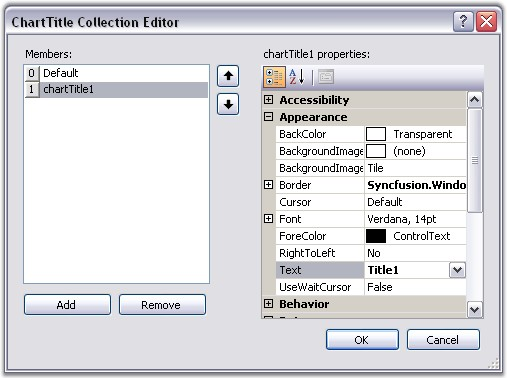
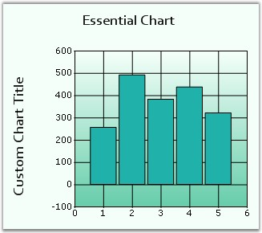
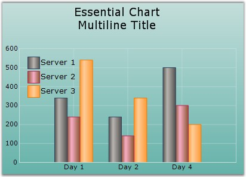

::: {style="DISPLAY: none"}
{#d2h_url_template}{#d2h_package_url style="WIDTH: 0px; DISPLAY: none; HEIGHT: 0px"}
:::

::::: {#nsbanner .d2h_main_nsbanner style="BORDER-BOTTOM: #999999 1px solid; POSITION: relative; PADDING-BOTTOM: 0px; BACKGROUND-COLOR: transparent; PADDING-LEFT: 0px; PADDING-RIGHT: 0px; DISPLAY: none; BORDER-TOP: #999999 1px solid; PADDING-TOP: 0px; LEFT: 0px"}
:::: {#TitleRow .d2h_main_titlerow style="PADDING-BOTTOM: 4px; BACKGROUND-COLOR: transparent; PADDING-LEFT: 22px; WIDTH: 100%; PADDING-RIGHT: 10px; DISPLAY: none; PADDING-TOP: 4px"}
::: {#ienav .d2h_main_ienav style="DISPLAY: none"}
{#D2HPrevious .D2HPreviousEnabled}  {#D2HNext .D2HNextEnabled}
:::
::::
:::::

::::: {#nstext .d2h_main_nstext style="PADDING-BOTTOM: 10px; BACKGROUND-COLOR: transparent; PADDING-LEFT: 22px; PADDING-RIGHT: 10px; HEIGHT: 100%; OVERFLOW: auto; PADDING-TOP: 5px" hasuserbackground="true" valign="bottom"}
::: {#d2h_breadcrumbs .d2h_breadcrumbs}
[Essential Studio User Guide Documentation](ms-xhelp:///?Id=12457748-09e3-4d74-a240-8e049cedf030){.d2h_breadcrumbsNormal}[ \> ]{.d2h_breadcrumbsLinkSeparator}[User Interface Edition](ms-xhelp:///?Id=c29296b7-531c-413b-a0ec-488ca1f7f669){.d2h_breadcrumbsNormal}[ \> ]{.d2h_breadcrumbsLinkSeparator}[Essential Windows](ms-xhelp:///?Id=e60759d8-47a4-4570-9d7a-16a68d63f2ea){.d2h_breadcrumbsNormal}[ \> ]{.d2h_breadcrumbsLinkSeparator}[Essential Chart]{.d2h_breadcrumbsContentsOnly}[ \> ]{.d2h_breadcrumbsLinkSeparator}[Concepts and Features](ms-xhelp:///?Id=71321e9c-336c-4c1c-a127-be9f135ad4bb){.d2h_breadcrumbsNormal}[ \> ]{.d2h_breadcrumbsLinkSeparator}[Chart Appearance](ms-xhelp:///?Id=eb9d5ffd-71db-4613-9396-75dd4913dca1){.d2h_breadcrumbsNormal}
:::

### Multiple Chart Titles {#multiple-chart-titles style="tab-stops: 0pt"}

 

Default Title

 

Essential Chart\'s **Title** property lets you edit the default title for a chart as follows. We can set font style for the title using **Title.Font** property. The default value is Verdana, 14, Regular.

[]{style="COLOR: red; FONT-SIZE: 8pt"} 

+-------------------------------------------------------------------------------------------------------------------------------------------------------------------------------------------------------------------------------------------------------------------------------------------------+
| **[\[C#\]]{style="FONT-FAMILY: 'Courier New'; COLOR: black"}**                                                                                                                                                                                                                                  |
|                                                                                                                                                                                                                                                                                                 |
| **[]{style="FONT-FAMILY: 'Courier New'; COLOR: black"}**                                                                                                                                                                                                                                        |
|                                                                                                                                                                                                                                                                                                 |
| [//Default title]{style="FONT-FAMILY: 'Courier New'; COLOR: green"}                                                                                                                                                                                                                             |
|                                                                                                                                                                                                                                                                                                 |
| [chartControl1.Title.Text = \"Essential Chart\";]{style="FONT-FAMILY: 'Courier New'; COLOR: black"}                                                                                                                                                                                             |
|                                                                                                                                                                                                                                                                                                 |
| [this]{style="FONT-FAMILY: 'Courier New'; COLOR: blue"}[.chartControl1.Title.Font = [new]{style="COLOR: blue"} System.Drawing.[Font]{style="COLOR: teal"}([\"Candara\"]{style="COLOR: maroon"}, 9F, System.Drawing.[FontStyle]{style="COLOR: teal"}.Bold);]{style="FONT-FAMILY: 'Courier New'"} |
+-------------------------------------------------------------------------------------------------------------------------------------------------------------------------------------------------------------------------------------------------------------------------------------------------+

 

+------------------------------------------------------------------------------------------------------------------------------------------------------------------------------------------------------------------------------------------+
| **[\[VB.NET\]]{style="FONT-FAMILY: 'Courier New'; COLOR: black"}**                                                                                                                                                                       |
|                                                                                                                                                                                                                                          |
| **[]{style="FONT-FAMILY: 'Courier New'; COLOR: black"}**                                                                                                                                                                                 |
|                                                                                                                                                                                                                                          |
| [\'Default title]{style="FONT-FAMILY: 'Courier New'; COLOR: green"}                                                                                                                                                                      |
|                                                                                                                                                                                                                                          |
| [chartControl1.Title.Text = \"Essential Chart\"]{style="FONT-FAMILY: 'Courier New'; COLOR: black"}                                                                                                                                       |
|                                                                                                                                                                                                                                          |
| [chartControl1.Title.Font = [New]{style="COLOR: blue"} System.Drawing.[Font]{style="COLOR: black"}([\"Candara\"]{style="COLOR: maroon"}, 9F, System.Drawing.[FontStyle.]{style="COLOR: black"}Bold)]{style="FONT-FAMILY: 'Courier New'"} |
+------------------------------------------------------------------------------------------------------------------------------------------------------------------------------------------------------------------------------------------+

 

{border="0"}

 

Figure 321: Chart Title Set

 

The above default chart title is simply the first in the list of titles that can be specified for the Chart.

 

Multiple Titles

 

[·      ]{style="FONT-FAMILY: Symbol"}Multiple custom Chart Titles can be added to **Chart.Titles** Collection.

[·      ]{style="FONT-FAMILY: Symbol"}Supports numerous docking styles (Floating, Left, Right, Bottom or Top) for each title.

[·      ]{style="FONT-FAMILY: Symbol"}Each of the custom Titles can be aligned to any position as required.

 

Titles Positioning

 

Below listed properties will help you to modify the positioning of the Chart Title.

 

::: {align="center"}
+-----------------------------------+-------------------------------------------------------------------------------------------------------------------------------------------------------+
| **ChartTitle Property**           | **Description**                                                                                                                                       |
+-----------------------------------+-------------------------------------------------------------------------------------------------------------------------------------------------------+
| Position                          | Specifies the position relative to the chart at which to render the chart title panel.                                                                |
|                                   |                                                                                                                                                       |
|                                   | [·      ]{style="FONT-FAMILY: Symbol"}**Top** - above the chart(**Default setting**)                                                                  |
|                                   |                                                                                                                                                       |
|                                   | [·      ]{style="FONT-FAMILY: Symbol"}**Left** - left of the chart                                                                                    |
|                                   |                                                                                                                                                       |
|                                   | [·      ]{style="FONT-FAMILY: Symbol"}**Right** - right of the chart                                                                                  |
|                                   |                                                                                                                                                       |
|                                   | [·      ]{style="FONT-FAMILY: Symbol"}**Bottom** - below the chart                                                                                    |
|                                   |                                                                                                                                                       |
|                                   | [·      ]{style="FONT-FAMILY: Symbol"}**Floating** - will not be docked to any specific location. Can be docked manually by dragging the title panel. |
+-----------------------------------+-------------------------------------------------------------------------------------------------------------------------------------------------------+
| Alignment                         | When docked to a side, this property specifies how the title panel should be aligned with respect to the chart boundaries.                            |
|                                   |                                                                                                                                                       |
|                                   | [·      ]{style="FONT-FAMILY: Symbol"}**Center** - will be aligned to center. **Default** **setting**.                                                |
|                                   |                                                                                                                                                       |
|                                   | [·      ]{style="FONT-FAMILY: Symbol"}**Far -** will be aligned Far.                                                                                  |
|                                   |                                                                                                                                                       |
|                                   | [·      ]{style="FONT-FAMILY: Symbol"}**Near** - will be aligned Near.                                                                                |
+-----------------------------------+-------------------------------------------------------------------------------------------------------------------------------------------------------+
| Behavior                          | Specifies the docking behavior of the title.                                                                                                          |
|                                   |                                                                                                                                                       |
|                                   | [·      ]{style="FONT-FAMILY: Symbol"}**Docking** - It is dockable on all four sides.                                                                 |
|                                   |                                                                                                                                                       |
|                                   | [·      ]{style="FONT-FAMILY: Symbol"}**Movable** - It is movable.                                                                                    |
|                                   |                                                                                                                                                       |
|                                   | [·      ]{style="FONT-FAMILY: Symbol"}**All** - It is movable and dockable.                                                                           |
|                                   |                                                                                                                                                       |
|                                   | [·      ]{style="FONT-FAMILY: Symbol"}**None** - It is neither movable nor dockable.                                                                  |
+-----------------------------------+-------------------------------------------------------------------------------------------------------------------------------------------------------+
:::

 

Title Look and Feel

 

There are several appearance options that can be applied on the ChartTitle instance as illustrated in this **ChartTitle Collection Editor**.

 

{border="0"}

 

Figure 322: ChartTitle Collection Editor

 

In code, you can add more titles to this list as follows.

 

+------------------------------------------------------------------------------------------------------------------------------------------------------------------------------------------------------------+
| **[\[C#\]]{style="FONT-FAMILY: 'Courier New'; COLOR: black"}**                                                                                                                                             |
|                                                                                                                                                                                                            |
| **[]{style="FONT-FAMILY: 'Courier New'; COLOR: black"}**                                                                                                                                                   |
|                                                                                                                                                                                                            |
| [//Default title (the first entry in the Titles list)]{style="FONT-FAMILY: 'Courier New'; COLOR: green"}                                                                                                   |
|                                                                                                                                                                                                            |
| [chartControl1.Title.Text = \"Essential Chart\";]{style="FONT-FAMILY: 'Courier New'; COLOR: black"}                                                                                                        |
|                                                                                                                                                                                                            |
| **[]{style="FONT-FAMILY: 'Courier New'; COLOR: black"}**                                                                                                                                                   |
|                                                                                                                                                                                                            |
| [// Add the title to the Chart control\'s Titles collection.                ]{style="FONT-FAMILY: 'Courier New'; COLOR: green"}                                                                            |
|                                                                                                                                                                                                            |
| [ChartTitle]{style="FONT-FAMILY: 'Courier New'; COLOR: teal"}[ title = [new]{style="COLOR: blue"} Syncfusion.Windows.Forms.Chart.[ChartTitle]{style="COLOR: teal"}();]{style="FONT-FAMILY: 'Courier New'"} |
|                                                                                                                                                                                                            |
| [title.Text = \"Custom Chart Title\";]{style="FONT-FAMILY: 'Courier New'"}                                                                                                                                 |
|                                                                                                                                                                                                            |
| [this]{style="FONT-FAMILY: 'Courier New'; COLOR: blue"}[.chartControl1.Titles.Add(title);]{style="FONT-FAMILY: 'Courier New'"}                                                                             |
+------------------------------------------------------------------------------------------------------------------------------------------------------------------------------------------------------------+

 

+---------------------------------------------------------------------------------------------------------------------------------------------------------------------------------------------------+
| **[\[VB.NET\]]{style="FONT-FAMILY: 'Courier New'; COLOR: black"}**                                                                                                                                |
|                                                                                                                                                                                                   |
| **[]{style="FONT-FAMILY: 'Courier New'; COLOR: black"}**                                                                                                                                          |
|                                                                                                                                                                                                   |
| [\'Default title (the first entry in the Titles list)]{style="FONT-FAMILY: 'Courier New'; COLOR: green"}                                                                                          |
|                                                                                                                                                                                                   |
| [chartControl1.Title.Text = \"Essential Chart\"]{style="FONT-FAMILY: 'Courier New'; COLOR: black"}                                                                                                |
|                                                                                                                                                                                                   |
| []{style="FONT-FAMILY: 'Courier New'; COLOR: black"}                                                                                                                                              |
|                                                                                                                                                                                                   |
| **[\' ]{style="FONT-FAMILY: 'Courier New'; COLOR: black"}**[Add the title to the Chart control\'s Titles collection.                ]{style="FONT-FAMILY: 'Courier New'; COLOR: green"}           |
|                                                                                                                                                                                                   |
| [Dim]{style="FONT-FAMILY: 'Courier New'; COLOR: blue"}[ title [As]{style="COLOR: blue"} [New]{style="COLOR: blue"} Syncfusion.Windows.Forms.Chart.ChartTitle]{style="FONT-FAMILY: 'Courier New'"} |
|                                                                                                                                                                                                   |
| [title.Text = \"Custom Chart Title\"]{style="FONT-FAMILY: 'Courier New'"}                                                                                                                         |
|                                                                                                                                                                                                   |
| [Me]{style="FONT-FAMILY: 'Courier New'; COLOR: blue"}[.ChartControl1.Titles.Add(title)]{style="FONT-FAMILY: 'Courier New'"}                                                                       |
+---------------------------------------------------------------------------------------------------------------------------------------------------------------------------------------------------+

 

{border="0"}

 

Figure 323: Chart with Multiple Chart Titles

 

Multiline Chart Title

 

You can now wrap the Chart titles and display them as multiline text. Set multiline title text in **ChartTitle.Text** property through designer as follows. Press ENTER key to begin a new line. Press CTRL+ENTER to set the text entered.

 

{border="0"}

 

Figure 324: Multiline Title for Essential Chart

 

[]{#related-topics}
:::::
