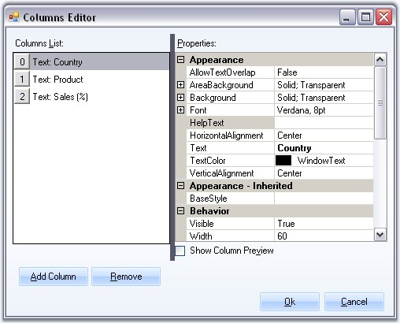
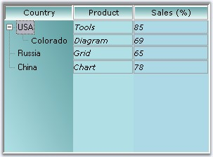

::: {style="DISPLAY: none"}
{#d2h_url_template}{#d2h_package_url style="WIDTH: 0px; DISPLAY: none; HEIGHT: 0px"}
:::

::::::: {.d2h_secondary_topic style="PADDING-BOTTOM: 10pt; MARGIN: 0pt; PADDING-LEFT: 0pt; PADDING-RIGHT: 0pt; PADDING-TOP: 0pt"}
##### Multiple Columns {#multiple-columns style="MARGIN-LEFT: 18pt; tab-stops: 18.0pt"}

[]{style="COLOR: #15428b"} 

Adding Multiple Columns

[]{style="COLOR: #15428b"} 

MultiColumnTreeView control lets you add multiple columns easily using Columns Editor. The [[SubItems]{style="COLOR: windowtext; TEXT-DECORATION: none; text-underline: none"}](../../../../../../../../Documents%20and%20Settings/sylviap/Desktop/Tools%20-%20Part%202.docx#_SubItems) can be added using the SubItems Collection Editor. There are also properties to modify the appearance of the columns.

[]{style="COLOR: #15428b"} 

{border="0"}

***[]{style="COLOR: #15428b"}*** 

Figure 1177: Columns Editor

[]{style="COLOR: #15428b"} 

This dialog can be accessed using the [[context menu]{.UGHyperlink}](../../../../../../../../Documents%20and%20Settings/sylviap/Desktop/Tools%20-%20Part%202.docx#_Context_Menu_at)[ ]{style="COLOR: #15428b"}of the control or the command available at the bottom of the property grid. The context menu also lets you add columns directly using \"Add Column\".

 

**Customizing the columns using Columns Editor**

 

The below properties can be used to customize the columns.

[]{style="COLOR: #15428b"} 

::: {align="center"}
+-----------------------------------+----------------------------------------------------------------------------------------------------------+
| TreeColumnAdv Properties          | Description                                                                                              |
+-----------------------------------+----------------------------------------------------------------------------------------------------------+
| AllowTextOverlap                  | Indicates whether the text can overlap or not. By default it false.                                      |
+-----------------------------------+----------------------------------------------------------------------------------------------------------+
| Background                        | Sets the background for the column (column header).                                                      |
+-----------------------------------+----------------------------------------------------------------------------------------------------------+
| Font                              | Sets the foreground style for the columns.                                                               |
+-----------------------------------+----------------------------------------------------------------------------------------------------------+
| HelpText                          | Sets the help text for the columns.                                                                      |
+-----------------------------------+----------------------------------------------------------------------------------------------------------+
| HorizontalAlignment               | Sets the horizontal alignment of the text in the columns.                                                |
+-----------------------------------+----------------------------------------------------------------------------------------------------------+
| Text                              | Sets text for the columns.                                                                               |
+-----------------------------------+----------------------------------------------------------------------------------------------------------+
| TextColor                         | Sets the text color for the columns.                                                                     |
+-----------------------------------+----------------------------------------------------------------------------------------------------------+
| Vertical Alignment                | Sets the vertical alignment of the text in the columns.                                                  |
+-----------------------------------+----------------------------------------------------------------------------------------------------------+
| BaseStyle                         | Sets the base style to be applied to the column.                                                         |
+-----------------------------------+----------------------------------------------------------------------------------------------------------+
| Visible                           | Sets the visibility of the particular column.                                                            |
+-----------------------------------+----------------------------------------------------------------------------------------------------------+
| Width                             | Specifies Column width.                                                                                  |
+-----------------------------------+----------------------------------------------------------------------------------------------------------+
| Border3DStyle                     | Sets the 3D border style for the column.                                                                 |
+-----------------------------------+----------------------------------------------------------------------------------------------------------+
| BorderColor                       | Border color for the column.                                                                             |
+-----------------------------------+----------------------------------------------------------------------------------------------------------+
| BorderSides                       | Specifies the sides of the column which should have border.                                              |
+-----------------------------------+----------------------------------------------------------------------------------------------------------+
| BorderStyle                       | Sets 2D or 3D border. The options are,                                                                   |
|                                   |                                                                                                          |
|                                   |                                                                                                          |
|                                   |                                                                                                          |
|                                   | [·      ]{style="FONT-FAMILY: Symbol"}FixedSingle and                                                    |
|                                   |                                                                                                          |
|                                   | [·      ]{style="FONT-FAMILY: Symbol"}Fixed3D.                                                           |
+-----------------------------------+----------------------------------------------------------------------------------------------------------+
| BorderSingle                      | Specifies the 2D border style for the columns, when BorderStyle is set to Fixed Single. The options are, |
|                                   |                                                                                                          |
|                                   |                                                                                                          |
|                                   |                                                                                                          |
|                                   | [·      ]{style="FONT-FAMILY: Symbol"}Dotted,                                                            |
|                                   |                                                                                                          |
|                                   | [·      ]{style="FONT-FAMILY: Symbol"}Dashed,                                                            |
|                                   |                                                                                                          |
|                                   | [·      ]{style="FONT-FAMILY: Symbol"}Solid,                                                             |
|                                   |                                                                                                          |
|                                   | [·      ]{style="FONT-FAMILY: Symbol"}Inset and                                                          |
|                                   |                                                                                                          |
|                                   | [·      ]{style="FONT-FAMILY: Symbol"}Outset.                                                            |
+-----------------------------------+----------------------------------------------------------------------------------------------------------+
| Comparer                          | Comparative value for sorting.                                                                           |
+-----------------------------------+----------------------------------------------------------------------------------------------------------+
| SortOrder                         | Specifies the sort order for the column.                                                                 |
+-----------------------------------+----------------------------------------------------------------------------------------------------------+
| LeftImage                         | Sets the left image for the column.                                                                      |
+-----------------------------------+----------------------------------------------------------------------------------------------------------+
| LeftImageIndices                  | Specifies the left image index.                                                                          |
+-----------------------------------+----------------------------------------------------------------------------------------------------------+
| RightImageIndices                 | Specifies the right image index.                                                                         |
+-----------------------------------+----------------------------------------------------------------------------------------------------------+
| LeftImagePadding                  | Sets the padding of the left image.                                                                      |
+-----------------------------------+----------------------------------------------------------------------------------------------------------+
| RightImagPadding                  | Sets the padding of the right image.                                                                     |
+-----------------------------------+----------------------------------------------------------------------------------------------------------+
| RightImage                        | Sets the right image for the column.                                                                     |
+-----------------------------------+----------------------------------------------------------------------------------------------------------+
:::

**[]{style="COLOR: #15428b"}** 

::: {style="BORDER-BOTTOM: windowtext 1pt solid; BORDER-LEFT: medium none; PADDING-BOTTOM: 1pt; MARGIN: 9pt 0pt 9pt 18pt; PADDING-LEFT: 0pt; PADDING-RIGHT: 0pt; BORDER-TOP: windowtext 1pt solid; BORDER-RIGHT: medium none; PADDING-TOP: 1pt"}
{border="0"} Note: The TreeColumnAdv1.Background settings overrides the MultiColumnTreeView.[[ColumnsHeaderBackground]{style="COLOR: windowtext; TEXT-DECORATION: none; text-underline: none"}](../../../../../../../../Documents%20and%20Settings/sylviap/Desktop/Tools%20-%20Part%202.docx#_Column_Appearance) property settings for individual column headers.
:::

[]{style="COLOR: #15428b"} 

Painting the Column Area

**[]{style="COLOR: #15428b"}** 

::: {align="center"}
  ------------------------ -------------------------------------------------
  TreeColumnAdv Property   Description
  AreaBackground           Gets / sets the background for the column area.
  ------------------------ -------------------------------------------------
:::

[]{style="COLOR: #15428b"} 

+------------------------------------------------------------------------------------------------------------------------------------------------------------------------------------------------------------------------------------------------------------------------------------------------------------------------------------------------+
| **[\[C#\]]{style="FONT-FAMILY: 'Courier New'; COLOR: black"}**                                                                                                                                                                                                                                                                                 |
|                                                                                                                                                                                                                                                                                                                                                |
| []{style="COLOR: #15428b"}                                                                                                                                                                                                                                                                                                                     |
|                                                                                                                                                                                                                                                                                                                                                |
| [treeColumnAdv1.AreaBackground = [new]{style="COLOR: blue"} Syncfusion.Drawing.[BrushInfo]{style="COLOR: teal"}(Syncfusion.Drawing.[GradientStyle]{style="COLOR: teal"}.BackwardDiagonal, System.Drawing.[Color]{style="COLOR: teal"}.CadetBlue, System.Drawing.[Color]{style="COLOR: teal"}.PowderBlue);]{style="FONT-FAMILY: 'Courier New'"} |
|                                                                                                                                                                                                                                                                                                                                                |
| [treeColumnAdv1.Background = [new]{style="COLOR: blue"} Syncfusion.Drawing.[BrushInfo]{style="COLOR: teal"}(Syncfusion.Drawing.[GradientStyle]{style="COLOR: teal"}.Vertical, System.Drawing.[Color]{style="COLOR: teal"}.CadetBlue, System.Drawing.[Color]{style="COLOR: teal"}.Azure);]{style="FONT-FAMILY: 'Courier New'"}                  |
|                                                                                                                                                                                                                                                                                                                                                |
| []{style="FONT-FAMILY: 'Courier New'"}                                                                                                                                                                                                                                                                                                         |
|                                                                                                                                                                                                                                                                                                                                                |
| [treeColumnAdv2.AreaBackground = [new]{style="COLOR: blue"} Syncfusion.Drawing.[BrushInfo]{style="COLOR: teal"}(System.Drawing.[Color]{style="COLOR: teal"}.PowderBlue);]{style="FONT-FAMILY: 'Courier New'"}                                                                                                                                  |
|                                                                                                                                                                                                                                                                                                                                                |
| [treeColumnAdv2.Background = [new]{style="COLOR: blue"} Syncfusion.Drawing.[BrushInfo]{style="COLOR: teal"}(Syncfusion.Drawing.[GradientStyle]{style="COLOR: teal"}.Vertical, System.Drawing.[Color]{style="COLOR: teal"}.CadetBlue, System.Drawing.[Color]{style="COLOR: teal"}.Azure);]{style="FONT-FAMILY: 'Courier New'"}                  |
|                                                                                                                                                                                                                                                                                                                                                |
| []{style="FONT-FAMILY: 'Courier New'"}                                                                                                                                                                                                                                                                                                         |
|                                                                                                                                                                                                                                                                                                                                                |
| [treeColumnAdv3.AreaBackground = [new]{style="COLOR: blue"} Syncfusion.Drawing.[BrushInfo]{style="COLOR: teal"}(System.Drawing.[Color]{style="COLOR: teal"}.LightBlue);]{style="FONT-FAMILY: 'Courier New'"}                                                                                                                                   |
|                                                                                                                                                                                                                                                                                                                                                |
| [treeColumnAdv3.Background = [new]{style="COLOR: blue"} Syncfusion.Drawing.[BrushInfo]{style="COLOR: teal"}(Syncfusion.Drawing.[GradientStyle]{style="COLOR: teal"}.Vertical, System.Drawing.[Color]{style="COLOR: teal"}.CadetBlue, System.Drawing.[Color]{style="COLOR: teal"}.Azure);]{style="FONT-FAMILY: 'Courier New'"}                  |
+------------------------------------------------------------------------------------------------------------------------------------------------------------------------------------------------------------------------------------------------------------------------------------------------------------------------------------------------+

[]{style="COLOR: #15428b"} 

+-------------------------------------------------------------------------------------------------------------------------------------------------------------------------------------------------------------------------------------------------------------------------+
| **[\[VB.NET\]]{style="FONT-FAMILY: 'Courier New'; COLOR: black"}**                                                                                                                                                                                                      |
|                                                                                                                                                                                                                                                                         |
| []{style="COLOR: #15428b"}                                                                                                                                                                                                                                              |
|                                                                                                                                                                                                                                                                         |
| [treeColumnAdv1.AreaBackground = [New]{style="COLOR: blue"} Syncfusion.Drawing.BrushInfo(Syncfusion.Drawing.GradientStyle.BackwardDiagonal, System.Drawing.Color.CadetBlue, System.Drawing.Color.PowderBlue) ]{style="FONT-FAMILY: 'Courier New'"}                      |
|                                                                                                                                                                                                                                                                         |
| [treeColumnAdv1.Background = [New]{style="COLOR: blue"} Syncfusion.Drawing.BrushInfo(Syncfusion.Drawing.GradientStyle.Vertical, System.Drawing.Color.CadetBlue, System.Drawing.Color.Azure) ]{style="FONT-FAMILY: 'Courier New'"}                                       |
|                                                                                                                                                                                                                                                                         |
| []{style="FONT-FAMILY: 'Courier New'"}                                                                                                                                                                                                                                  |
|                                                                                                                                                                                                                                                                         |
| [treeColumnAdv2.AreaBackground = [New]{style="COLOR: blue"} Syncfusion.Drawing.BrushInfo(System.Drawing.Color.PowderBlue) ]{style="FONT-FAMILY: 'Courier New'"}                                                                                                         |
|                                                                                                                                                                                                                                                                         |
| [treeColumnAdv2.Background = [New]{style="COLOR: blue"} Syncfusion.Drawing.BrushInfo(Syncfusion.Drawing.GradientStyle.Vertical, System.Drawing.Color.CadetBlue, System.Drawing.Color.Azure) ]{style="FONT-FAMILY: 'Courier New'"}                                       |
|                                                                                                                                                                                                                                                                         |
| []{style="FONT-FAMILY: 'Courier New'"}                                                                                                                                                                                                                                  |
|                                                                                                                                                                                                                                                                         |
| [treeColumnAdv3.AreaBackground = [New]{style="COLOR: blue"} Syncfusion.Drawing.BrushInfo(System.Drawing.Color.LightBlue) ]{style="FONT-FAMILY: 'Courier New'"}                                                                                                          |
|                                                                                                                                                                                                                                                                         |
| [treeColumnAdv3.Background = [New]{style="COLOR: blue"} Syncfusion.Drawing.BrushInfo(Syncfusion.Drawing.GradientStyle.Vertical, System.Drawing.Color.CadetBlue, System.Drawing.Color.Azure) ]{style="FONT-FAMILY: 'Courier New'"}[]{style="FONT-FAMILY: 'Courier New'"} |
+-------------------------------------------------------------------------------------------------------------------------------------------------------------------------------------------------------------------------------------------------------------------------+

**[]{style="COLOR: #15428b"}** 

{border="0"}

[]{style="COLOR: #15428b"} 

Figure 1178: Background for Column Headers and Area Background for the MultiColumns

[]{style="COLOR: #15428b"} 

::: {style="BORDER-BOTTOM: windowtext 1pt solid; BORDER-LEFT: medium none; PADDING-BOTTOM: 1pt; MARGIN: 9pt 0pt 9pt 18pt; PADDING-LEFT: 0pt; PADDING-RIGHT: 0pt; BORDER-TOP: windowtext 1pt solid; BORDER-RIGHT: medium none; PADDING-TOP: 1pt"}
{border="0"} Note: The appearance of the columns can also be controlled using the standard [[column styles]{style="COLOR: windowtext; TEXT-DECORATION: none; text-underline: none"}](../../../../../../../../Documents%20and%20Settings/sylviap/Desktop/Tools%20-%20Part%202.docx#_Column_Styles) settings. []{#p1041}This overrides the above settings.
:::

 

 

 

 

[]{#related-topics}
:::::::
