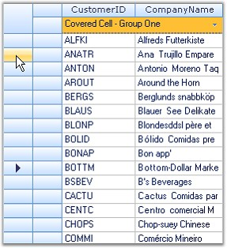

::: {style="DISPLAY: none"}
{#d2h_url_template}{#d2h_package_url style="WIDTH: 0px; DISPLAY: none; HEIGHT: 0px"}
:::

::: {.d2h_secondary_topic style="PADDING-BOTTOM: 10pt; MARGIN: 0pt; PADDING-LEFT: 0pt; PADDING-RIGHT: 0pt; PADDING-TOP: 0pt"}
#### Multiple Headers {#multiple-headers style="tab-stops: 0pt"}

[]{style="FONT-FAMILY: 'Trebuchet MS','sans-serif'; COLOR: #15428b; FONT-SIZE: 9pt"} 

Grid Data Bound Grid supports display of multiple row and column headers. Additional row headers can be added along side the existing header by setting Model.Rows.HeaderCount and additional column headers can be added below the existing column header by setting the Model.Cols.HeaderCount property.

 

The following code example illustrates how to display multiple row and column headers.

[]{style="FONT-FAMILY: 'Trebuchet MS','sans-serif'; COLOR: #15428b; FONT-SIZE: 9pt"} 

+------------------------------------------------------------------------------------------------------------------------------------------------------------+
| **[\[C#\]]{style="FONT-FAMILY: 'Courier New'; COLOR: black"}**                                                                                             |
|                                                                                                                                                            |
| []{style="FONT-FAMILY: 'Courier New'; COLOR: black"}                                                                                                       |
|                                                                                                                                                            |
| [int]{style="FONT-FAMILY: 'Courier New'; COLOR: blue"}[ extraRowHeaders = 1;]{style="FONT-FAMILY: 'Courier New'"}                                          |
|                                                                                                                                                            |
| [int]{style="FONT-FAMILY: 'Courier New'; COLOR: blue"}[ extraColHeaders = 1;]{style="FONT-FAMILY: 'Courier New'"}                                          |
|                                                                                                                                                            |
| []{style="FONT-FAMILY: 'Courier New'; COLOR: green"}                                                                                                       |
|                                                                                                                                                            |
| [// Initialize extra row and column headers.]{style="FONT-FAMILY: 'Courier New'; COLOR: green"}                                                            |
|                                                                                                                                                            |
| [this]{style="FONT-FAMILY: 'Courier New'; COLOR: blue"}[.gridDataBoundGrid1.Model.Rows.HeaderCount = extraRowHeaders;]{style="FONT-FAMILY: 'Courier New'"} |
|                                                                                                                                                            |
| [this]{style="FONT-FAMILY: 'Courier New'; COLOR: blue"}[.gridDataBoundGrid1.Model.Cols.HeaderCount = extraColHeaders;]{style="FONT-FAMILY: 'Courier New'"} |
+------------------------------------------------------------------------------------------------------------------------------------------------------------+

[]{style="FONT-FAMILY: 'Trebuchet MS','sans-serif'; COLOR: #15428b; FONT-SIZE: 9pt"} 

+---------------------------------------------------------------------------------------------------------------------------------------------------------------------------+
| **[\[VB.NET\]]{style="FONT-FAMILY: 'Courier New'; COLOR: black"}**                                                                                                        |
|                                                                                                                                                                           |
| **[]{style="FONT-FAMILY: 'Courier New'; COLOR: black"}**                                                                                                                  |
|                                                                                                                                                                           |
| [Dim]{style="FONT-FAMILY: 'Courier New'; COLOR: blue"}[ extraRowHeaders [As]{style="COLOR: blue"} [Integer]{style="COLOR: blue"} = 1]{style="FONT-FAMILY: 'Courier New'"} |
|                                                                                                                                                                           |
| [Dim]{style="FONT-FAMILY: 'Courier New'; COLOR: blue"}[ extraColHeaders [As]{style="COLOR: blue"} [Integer]{style="COLOR: blue"} = 1]{style="FONT-FAMILY: 'Courier New'"} |
|                                                                                                                                                                           |
| []{style="FONT-FAMILY: 'Courier New'; COLOR: green"}                                                                                                                      |
|                                                                                                                                                                           |
| [\' Initialize extra row and column headers.]{style="FONT-FAMILY: 'Courier New'; COLOR: green"}                                                                           |
|                                                                                                                                                                           |
| [Me]{style="FONT-FAMILY: 'Courier New'; COLOR: blue"}[.gridDataBoundGrid1.Model.Rows.HeaderCount = extraRowHeaders]{style="FONT-FAMILY: 'Courier New'"}                   |
|                                                                                                                                                                           |
| [Me]{style="FONT-FAMILY: 'Courier New'; COLOR: blue"}[.gridDataBoundGrid1.Model.Cols.HeaderCount = extraColHeaders]{style="FONT-FAMILY: 'Courier New'"}                   |
+---------------------------------------------------------------------------------------------------------------------------------------------------------------------------+

[]{style="FONT-FAMILY: 'Trebuchet MS','sans-serif'; COLOR: #15428b; FONT-SIZE: 9pt"} 

The resultant output is shown below.

[]{style="FONT-FAMILY: 'Times New Roman','serif'; FONT-SIZE: 12pt"} 

{border="0"}

[]{style="FONT-FAMILY: 'Trebuchet MS','sans-serif'; COLOR: #15428b; FONT-SIZE: 9pt"} 

*[Figure ]{style="FONT-SIZE: 9pt"}[225]{style="FONT-SIZE: 9pt"}[: Multiple Headers]{style="FONT-SIZE: 9pt"}*

 

[]{#p385} 

 

[]{#related-topics}
:::
