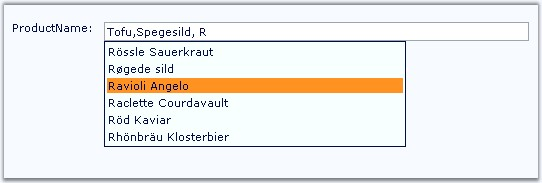

::: {style="DISPLAY: none"}
{#d2h_url_template}{#d2h_package_url style="WIDTH: 0px; DISPLAY: none; HEIGHT: 0px"}
:::

:::: {.d2h_secondary_topic style="PADDING-BOTTOM: 10pt; MARGIN: 0pt; PADDING-LEFT: 0pt; PADDING-RIGHT: 0pt; PADDING-TOP: 0pt"}
##### Multiple Item Selection {#multiple-item-selection style="tab-stops: 0pt"}

[]{style="FONT-FAMILY: 'Trebuchet MS','sans-serif'; COLOR: #15428b; FONT-SIZE: 9pt"} 

Delimiters or the visual separators can be used to delimit when multiple entries are allowed or required. AutoComplete allows you to set the required delimiter from the pre-defined options.

[]{style="FONT-FAMILY: 'Trebuchet MS','sans-serif'; COLOR: #15428b; FONT-SIZE: 9pt"} 

Set DelimiterChars property to any special characters like comma, semicolon, from the options.

[]{style="FONT-FAMILY: 'Trebuchet MS','sans-serif'; COLOR: #15428b; FONT-SIZE: 9pt"} 

Only when the delimiter character is set, using which, multiple entries can be made in the textbox with autocomplete feature.

[  ]{style="COLOR: black"}

::: {align="center"}
+-----------------------------------+-----------------------------------------------------------------------------------------------------+
|                                   |                                                                                                     |
|                                   |                                                                                                     |
| Property                          | Description                                                                                         |
+-----------------------------------+-----------------------------------------------------------------------------------------------------+
| DelimiterChars                    | Specifies the character to use as delimiter when multiple items are to be displayed in the textbox. |
+-----------------------------------+-----------------------------------------------------------------------------------------------------+
:::

[]{style="FONT-FAMILY: 'Trebuchet MS','sans-serif'; COLOR: #15428b; FONT-SIZE: 9pt"} 

Programmatically it can be set as follows.

[]{style="FONT-FAMILY: 'Trebuchet MS','sans-serif'; COLOR: #15428b; FONT-SIZE: 9pt"} 

+-------------------------------------------------------------------------------------------------------------+
| **[\[C#\]]{style="FONT-FAMILY: 'Courier New'"}**                                                            |
|                                                                                                             |
| **[]{style="FONT-FAMILY: 'Courier New'"}**                                                                  |
|                                                                                                             |
| [AutoCompleteTextBox1.DelimiterChars = [\",\"]{style="COLOR: maroon"};]{style="FONT-FAMILY: 'Courier New'"} |
+-------------------------------------------------------------------------------------------------------------+

[]{style="FONT-FAMILY: 'Trebuchet MS','sans-serif'; COLOR: #15428b; FONT-SIZE: 9pt"} 

+-----------------------------------------------------------------------------------------------------------------------------------------------------------------------+
| **[\[VB\]]{style="FONT-FAMILY: 'Courier New'"}**                                                                                                                      |
|                                                                                                                                                                       |
| **[]{style="FONT-FAMILY: 'Courier New'"}**                                                                                                                            |
|                                                                                                                                                                       |
| [Private]{style="FONT-FAMILY: 'Courier New'; COLOR: blue"}[ AutoCompleteTextBox1.DelimiterChars = [\",\"]{style="COLOR: maroon"}]{style="FONT-FAMILY: 'Courier New'"} |
+-----------------------------------------------------------------------------------------------------------------------------------------------------------------------+

[]{style="FONT-FAMILY: 'Trebuchet MS','sans-serif'; COLOR: #15428b; FONT-SIZE: 9pt"} 

Select an item and insert the special character. Unless the special character is used, you will not be able to input another item.

[]{style="FONT-FAMILY: 'Trebuchet MS','sans-serif'; COLOR: #15428b; FONT-SIZE: 9pt"} 

{border="0"}

**[]{style="FONT-FAMILY: 'Trebuchet MS','sans-serif'; COLOR: #15428b; FONT-SIZE: 9pt"}** 

Figure 31: Multiple selection with delimiter and autocomplete feature

 

[]{#related-topics}
::::
