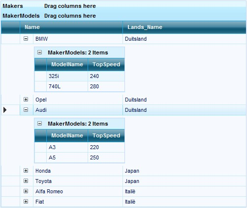

::: {style="DISPLAY: none"}
{#d2h_url_template}{#d2h_package_url style="WIDTH: 0px; DISPLAY: none; HEIGHT: 0px"}
:::

::::: {#nsbanner .d2h_main_nsbanner style="BORDER-BOTTOM: #999999 1px solid; POSITION: relative; PADDING-BOTTOM: 0px; BACKGROUND-COLOR: transparent; PADDING-LEFT: 0px; PADDING-RIGHT: 0px; DISPLAY: none; BORDER-TOP: #999999 1px solid; PADDING-TOP: 0px; LEFT: 0px"}
:::: {#TitleRow .d2h_main_titlerow style="PADDING-BOTTOM: 4px; BACKGROUND-COLOR: transparent; PADDING-LEFT: 22px; WIDTH: 100%; PADDING-RIGHT: 10px; DISPLAY: none; PADDING-TOP: 4px"}
::: {#ienav .d2h_main_ienav style="DISPLAY: none"}
{#D2HPrevious .D2HPreviousEnabled}  {#D2HNext .D2HNextEnabled}
:::
::::
:::::

:::: {#nstext .d2h_main_nstext style="PADDING-BOTTOM: 10px; BACKGROUND-COLOR: transparent; PADDING-LEFT: 22px; PADDING-RIGHT: 10px; HEIGHT: 100%; OVERFLOW: auto; PADDING-TOP: 5px" hasuserbackground="true" valign="bottom"}
::: {#d2h_breadcrumbs .d2h_breadcrumbs}
[Essential Studio User Guide Documentation](ms-xhelp:///?Id=12457748-09e3-4d74-a240-8e049cedf030){.d2h_breadcrumbsNormal}[ \> ]{.d2h_breadcrumbsLinkSeparator}[User Interface Edition](ms-xhelp:///?Id=c29296b7-531c-413b-a0ec-488ca1f7f669){.d2h_breadcrumbsNormal}[ \> ]{.d2h_breadcrumbsLinkSeparator}[Essential ASP.NET](ms-xhelp:///?Id=25c35330-c127-4dad-9a92-ed79dc7261a6){.d2h_breadcrumbsNormal}[ \> ]{.d2h_breadcrumbsLinkSeparator}[Essential Grid]{.d2h_breadcrumbsContentsOnly}[ \> ]{.d2h_breadcrumbsLinkSeparator}[Concepts and Features](ms-xhelp:///?Id=9e489974-524d-457c-9881-e458b1321685){.d2h_breadcrumbsNormal}[ \> ]{.d2h_breadcrumbsLinkSeparator}[Nested Relationship](ms-xhelp:///?Id=b9f71f14-2850-40d8-8438-293a0b032fc5){.d2h_breadcrumbsNormal}
:::

### Multiple Kind Relation {#multiple-kind-relation style="tab-stops: 0pt"}

[]{style="FONT-FAMILY: 'Trebuchet MS','sans-serif'; COLOR: #15428b; FONT-SIZE: 9pt"} 

Illustrates how to specify hierarchy relations with multiple relation kinds.

For our example scenario, let us consider a Car Maker and the Models made.

[]{style="FONT-FAMILY: 'Trebuchet MS','sans-serif'; COLOR: #15428b; FONT-SIZE: 9pt"} 

[·      ]{style="FONT-FAMILY: Symbol"}Populate the data in the two lists, Maker and Model.

[·      ]{style="FONT-FAMILY: Symbol"}Generate the Association between the two lists and store it in another list.

[·      ]{style="FONT-FAMILY: Symbol"}Establish the Relation between the Maker and Association - RelationKind is RelatedMasterDetails.

[·      ]{style="FONT-FAMILY: Symbol"}Specify Relations in the grouping engine.

[·      ]{style="FONT-FAMILY: Symbol"}Adding Relation to Parent table.

[·      ]{style="FONT-FAMILY: Symbol"}Land and Maker List\<T\> Item Collections share a ForeignKeyReference Relationship.

[·      ]{style="FONT-FAMILY: Symbol"}RelatedMasterDetail relation kind is specified between the Maker and MakerModel Item Collections.

[]{style="FONT-FAMILY: 'Trebuchet MS','sans-serif'; FONT-SIZE: 9pt"} 

+------------------------------------------------------------------------------------------------------------------------------------------------------------------------------------------------------------------------------------------------------------------------------+
| **[\[C#\]]{style="FONT-FAMILY: 'Courier New'; COLOR: black"}**                                                                                                                                                                                                               |
|                                                                                                                                                                                                                                                                              |
| []{style="FONT-FAMILY: 'Courier New'; COLOR: black"}                                                                                                                                                                                                                         |
|                                                                                                                                                                                                                                                                              |
| [//Populate the List DTOs]{style="FONT-FAMILY: 'Courier New'; COLOR: green"}                                                                                                                                                                                                 |
|                                                                                                                                                                                                                                                                              |
| [List]{style="FONT-FAMILY: 'Courier New'; COLOR: teal"}[\<MakerDTO_CS\> \_MakerData = GenerateMakerData();]{style="FONT-FAMILY: 'Courier New'"}                                                                                                                              |
|                                                                                                                                                                                                                                                                              |
| [List]{style="FONT-FAMILY: 'Courier New'; COLOR: teal"}[\<LandDTO_CS\> \_LandData = GenerateLandData();]{style="FONT-FAMILY: 'Courier New'"}                                                                                                                                 |
|                                                                                                                                                                                                                                                                              |
| [List]{style="FONT-FAMILY: 'Courier New'; COLOR: teal"}[\<ModelDTO_CS\> \_ModelData = GenerateModelData();]{style="FONT-FAMILY: 'Courier New'"}                                                                                                                              |
|                                                                                                                                                                                                                                                                              |
| []{style="FONT-FAMILY: 'Courier New'"}                                                                                                                                                                                                                                       |
|                                                                                                                                                                                                                                                                              |
| [// Maker and Model DTOs are combined to form another DTO]{style="FONT-FAMILY: 'Courier New'; COLOR: green"}                                                                                                                                                                 |
|                                                                                                                                                                                                                                                                              |
| [List]{style="FONT-FAMILY: 'Courier New'; COLOR: teal"}[\<MakerModelDTO_CS\> \_Associations = GenerateAssociation(\_ModelData, \_MakerData);]{style="FONT-FAMILY: 'Courier New'"}                                                                                            |
|                                                                                                                                                                                                                                                                              |
| []{style="FONT-FAMILY: 'Courier New'"}                                                                                                                                                                                                                                       |
|                                                                                                                                                                                                                                                                              |
| [//Establish Relation between \_Maker and \_Associations - RelationKind is RelatedMasterDetails        ]{style="FONT-FAMILY: 'Courier New'; COLOR: green"}                                                                                                                   |
|                                                                                                                                                                                                                                                                              |
| [this]{style="FONT-FAMILY: 'Courier New'; COLOR: blue"}[.GridGroupingControl1.Engine.SourceListSet.Add([new]{style="COLOR: blue"} [SourceListSetEntry]{style="COLOR: teal"}([\"Makers\"]{style="COLOR: maroon"}, \_MakerData));]{style="FONT-FAMILY: 'Courier New'"}         |
|                                                                                                                                                                                                                                                                              |
| [this]{style="FONT-FAMILY: 'Courier New'; COLOR: blue"}[.GridGroupingControl1.Engine.SourceListSet.Add([new]{style="COLOR: blue"} [SourceListSetEntry]{style="COLOR: teal"}([\"MakerModels\"]{style="COLOR: maroon"}, \_Associations));]{style="FONT-FAMILY: 'Courier New'"} |
|                                                                                                                                                                                                                                                                              |
| [this]{style="FONT-FAMILY: 'Courier New'; COLOR: blue"}[.GridGroupingControl1.TableDescriptor.Name = [\"Makers\"]{style="COLOR: maroon"};]{style="FONT-FAMILY: 'Courier New'"}                                                                                               |
|                                                                                                                                                                                                                                                                              |
| [this]{style="FONT-FAMILY: 'Courier New'; COLOR: blue"}[.GridGroupingControl1.DataMember = [\"DefaultView\"]{style="COLOR: maroon"};]{style="FONT-FAMILY: 'Courier New'"}                                                                                                    |
|                                                                                                                                                                                                                                                                              |
| [this]{style="FONT-FAMILY: 'Courier New'; COLOR: blue"}[.GridGroupingControl1.DataSource = \_MakerData;]{style="FONT-FAMILY: 'Courier New'"}                                                                                                                                 |
|                                                                                                                                                                                                                                                                              |
| []{style="FONT-FAMILY: 'Courier New'"}                                                                                                                                                                                                                                       |
|                                                                                                                                                                                                                                                                              |
| [//Specifying relations in grouping engine. ]{style="FONT-FAMILY: 'Courier New'; COLOR: green"}                                                                                                                                                                              |
|                                                                                                                                                                                                                                                                              |
| [GridRelationDescriptor]{style="FONT-FAMILY: 'Courier New'; COLOR: teal"}[ gridRelationDescriptor = [new]{style="COLOR: blue"} [GridRelationDescriptor]{style="COLOR: teal"}();]{style="FONT-FAMILY: 'Courier New'"}                                                         |
|                                                                                                                                                                                                                                                                              |
| [gridRelationDescriptor.ChildTableName = [\"MakerModels\"]{style="COLOR: maroon"};]{style="FONT-FAMILY: 'Courier New'"}                                                                                                                                                      |
|                                                                                                                                                                                                                                                                              |
| [gridRelationDescriptor.RelationKind = [RelationKind]{style="COLOR: teal"}.RelatedMasterDetails;]{style="FONT-FAMILY: 'Courier New'"}                                                                                                                                        |
|                                                                                                                                                                                                                                                                              |
| [gridRelationDescriptor.RelationKeys.Add([\"ID\"]{style="COLOR: maroon"}, [\"ParentID\"]{style="COLOR: maroon"});]{style="FONT-FAMILY: 'Courier New'"}                                                                                                                       |
|                                                                                                                                                                                                                                                                              |
| [gridRelationDescriptor.ChildTableDescriptor.AllowNew = [false]{style="COLOR: blue"};]{style="FONT-FAMILY: 'Courier New'"}                                                                                                                                                   |
|                                                                                                                                                                                                                                                                              |
| [gridRelationDescriptor.ChildTableDescriptor.AllowEdit = [false]{style="COLOR: blue"};]{style="FONT-FAMILY: 'Courier New'"}                                                                                                                                                  |
|                                                                                                                                                                                                                                                                              |
| []{style="FONT-FAMILY: 'Courier New'"}                                                                                                                                                                                                                                       |
|                                                                                                                                                                                                                                                                              |
| [//Adding relation to parent table]{style="FONT-FAMILY: 'Courier New'; COLOR: green"}                                                                                                                                                                                        |
|                                                                                                                                                                                                                                                                              |
| [GridGroupingControl1.TableDescriptor.Relations.Add(gridRelationDescriptor);]{style="FONT-FAMILY: 'Courier New'"}                                                                                                                                                            |
|                                                                                                                                                                                                                                                                              |
| [gridRelationDescriptor.ChildTableDescriptor.VisibleColumns.Remove([\"ID\"]{style="COLOR: maroon"});]{style="FONT-FAMILY: 'Courier New'"}                                                                                                                                    |
|                                                                                                                                                                                                                                                                              |
| [GridColumnDescriptor]{style="FONT-FAMILY: 'Courier New'; COLOR: teal"}[ x = gridRelationDescriptor.ChildTableDescriptor.Columns\[0\];]{style="FONT-FAMILY: 'Courier New'"}                                                                                                  |
|                                                                                                                                                                                                                                                                              |
| [gridRelationDescriptor.ChildTableDescriptor.Columns.RemoveAt(0);]{style="FONT-FAMILY: 'Courier New'"}                                                                                                                                                                       |
|                                                                                                                                                                                                                                                                              |
| [gridRelationDescriptor.ChildTableDescriptor.Columns.Add(x);]{style="FONT-FAMILY: 'Courier New'"}                                                                                                                                                                            |
|                                                                                                                                                                                                                                                                              |
| []{style="FONT-FAMILY: 'Courier New'"}                                                                                                                                                                                                                                       |
|                                                                                                                                                                                                                                                                              |
| [this]{style="FONT-FAMILY: 'Courier New'; COLOR: blue"}[.GridGroupingControl1.Engine.SourceListSet.Add([new]{style="COLOR: blue"} [SourceListSetEntry]{style="COLOR: teal"}([\"Lands\"]{style="COLOR: maroon"}, \_LandData));]{style="FONT-FAMILY: 'Courier New'"}           |
|                                                                                                                                                                                                                                                                              |
| [GridRelationDescriptor]{style="FONT-FAMILY: 'Courier New'; COLOR: teal"}[ ggd = [new]{style="COLOR: blue"} [GridRelationDescriptor]{style="COLOR: teal"}();]{style="FONT-FAMILY: 'Courier New'"}                                                                            |
|                                                                                                                                                                                                                                                                              |
| [ggd.ChildTableName = [\"Lands\"]{style="COLOR: maroon"};]{style="FONT-FAMILY: 'Courier New'"}                                                                                                                                                                               |
|                                                                                                                                                                                                                                                                              |
| [ggd.RelationKind = [RelationKind]{style="COLOR: teal"}.ForeignKeyReference;]{style="FONT-FAMILY: 'Courier New'"}                                                                                                                                                            |
|                                                                                                                                                                                                                                                                              |
| [ggd.RelationKeys.Add([\"Land\"]{style="COLOR: maroon"}, [\"ID\"]{style="COLOR: maroon"});]{style="FONT-FAMILY: 'Courier New'"}                                                                                                                                              |
|                                                                                                                                                                                                                                                                              |
| [ggd.ChildTableDescriptor.AllowNew = [false]{style="COLOR: blue"};]{style="FONT-FAMILY: 'Courier New'"}                                                                                                                                                                      |
|                                                                                                                                                                                                                                                                              |
| [GridGroupingControl1.TableDescriptor.Relations.Add(ggd);]{style="FONT-FAMILY: 'Courier New'"}                                                                                                                                                                               |
+------------------------------------------------------------------------------------------------------------------------------------------------------------------------------------------------------------------------------------------------------------------------------+

[]{style="FONT-FAMILY: 'Trebuchet MS','sans-serif'; COLOR: #15428b; FONT-SIZE: 9pt"} 

+------------------------------------------------------------------------------------------------------------------------------------------------------------------------------------------------------------------------------------------------------------------------+
| **[\[VB.NET\]]{style="FONT-FAMILY: 'Courier New'; COLOR: black"}**                                                                                                                                                                                                     |
|                                                                                                                                                                                                                                                                        |
| []{style="FONT-FAMILY: 'Courier New'; COLOR: black"}                                                                                                                                                                                                                   |
|                                                                                                                                                                                                                                                                        |
| [\'Populate the List DTOs]{style="FONT-FAMILY: 'Courier New'; COLOR: green"}                                                                                                                                                                                           |
|                                                                                                                                                                                                                                                                        |
| [Dim]{style="FONT-FAMILY: 'Courier New'; COLOR: blue"}[ \_MakerData [As]{style="COLOR: blue"} List([Of]{style="COLOR: blue"} MakerDTO_CS) = GenerateMakerData()]{style="FONT-FAMILY: 'Courier New'"}                                                                   |
|                                                                                                                                                                                                                                                                        |
| [Dim]{style="FONT-FAMILY: 'Courier New'; COLOR: blue"}[ \_LandData [As]{style="COLOR: blue"} List([Of]{style="COLOR: blue"} LandDTO_CS) = GenerateLandData()]{style="FONT-FAMILY: 'Courier New'"}                                                                      |
|                                                                                                                                                                                                                                                                        |
| [Dim]{style="FONT-FAMILY: 'Courier New'; COLOR: blue"}[ \_ModelData [As]{style="COLOR: blue"} List([Of]{style="COLOR: blue"} ModelDTO_CS) = GenerateModelData()]{style="FONT-FAMILY: 'Courier New'"}                                                                   |
|                                                                                                                                                                                                                                                                        |
| []{style="FONT-FAMILY: 'Courier New'"}                                                                                                                                                                                                                                 |
|                                                                                                                                                                                                                                                                        |
| [\' Maker and Model DTOs are combined to form another DTO]{style="FONT-FAMILY: 'Courier New'; COLOR: green"}                                                                                                                                                           |
|                                                                                                                                                                                                                                                                        |
| [Dim]{style="FONT-FAMILY: 'Courier New'; COLOR: blue"}[ \_Associations [As]{style="COLOR: blue"} List([Of]{style="COLOR: blue"} MakerModelDTO_CS) = GenerateAssociation(\_ModelData, \_MakerData)]{style="FONT-FAMILY: 'Courier New'"}                                 |
|                                                                                                                                                                                                                                                                        |
| []{style="FONT-FAMILY: 'Courier New'"}                                                                                                                                                                                                                                 |
|                                                                                                                                                                                                                                                                        |
| [\'Establish Relation between \_Maker and \_Associations - RelationKind is RelatedMasterDetails        ]{style="FONT-FAMILY: 'Courier New'; COLOR: green"}                                                                                                             |
|                                                                                                                                                                                                                                                                        |
| [Me]{style="FONT-FAMILY: 'Courier New'; COLOR: blue"}[.GridGroupingControl1.Engine.SourceListSet.Add([New]{style="COLOR: blue"} SourceListSetEntry([\"Makers\"]{style="COLOR: maroon"}, \_MakerData))]{style="FONT-FAMILY: 'Courier New'"}                             |
|                                                                                                                                                                                                                                                                        |
| [Me]{style="FONT-FAMILY: 'Courier New'; COLOR: blue"}[.GridGroupingControl1.Engine.SourceListSet.Add([New]{style="COLOR: blue"} SourceListSetEntry([\"MakerModels\"]{style="COLOR: maroon"}, \_Associations))]{style="FONT-FAMILY: 'Courier New'"}                     |
|                                                                                                                                                                                                                                                                        |
| [Me]{style="FONT-FAMILY: 'Courier New'; COLOR: blue"}[.GridGroupingControl1.TableDescriptor.Name = [\"Makers\"]{style="COLOR: maroon"}]{style="FONT-FAMILY: 'Courier New'"}                                                                                            |
|                                                                                                                                                                                                                                                                        |
| [Me]{style="FONT-FAMILY: 'Courier New'; COLOR: blue"}[.GridGroupingControl1.DataMember = [\"DefaultView\"]{style="COLOR: maroon"}]{style="FONT-FAMILY: 'Courier New'"}                                                                                                 |
|                                                                                                                                                                                                                                                                        |
| [Me]{style="FONT-FAMILY: 'Courier New'; COLOR: blue"}[.GridGroupingControl1.DataSource = \_MakerData]{style="FONT-FAMILY: 'Courier New'"}                                                                                                                              |
|                                                                                                                                                                                                                                                                        |
| []{style="FONT-FAMILY: 'Courier New'; COLOR: green"}                                                                                                                                                                                                                   |
|                                                                                                                                                                                                                                                                        |
| [\'Specifying relations in grouping engine. ]{style="FONT-FAMILY: 'Courier New'; COLOR: green"}                                                                                                                                                                        |
|                                                                                                                                                                                                                                                                        |
| [Dim]{style="FONT-FAMILY: 'Courier New'; COLOR: blue"}[ gridRelationDescriptor [As]{style="COLOR: blue"} Syncfusion.Web.UI.WebControls.Grid.Grouping.GridRelationDescriptor = [New]{style="COLOR: blue"} GridRelationDescriptor()]{style="FONT-FAMILY: 'Courier New'"} |
|                                                                                                                                                                                                                                                                        |
| [gridRelationDescriptor.ChildTableName = [\"MakerModels\"]{style="COLOR: maroon"}]{style="FONT-FAMILY: 'Courier New'"}                                                                                                                                                 |
|                                                                                                                                                                                                                                                                        |
| [gridRelationDescriptor.RelationKind = RelationKind.RelatedMasterDetails]{style="FONT-FAMILY: 'Courier New'"}                                                                                                                                                          |
|                                                                                                                                                                                                                                                                        |
| [gridRelationDescriptor.RelationKeys.Add([\"ID\"]{style="COLOR: maroon"}, [\"ParentID\"]{style="COLOR: maroon"})]{style="FONT-FAMILY: 'Courier New'"}                                                                                                                  |
|                                                                                                                                                                                                                                                                        |
| [gridRelationDescriptor.ChildTableDescriptor.AllowNew = [False]{style="COLOR: blue"}]{style="FONT-FAMILY: 'Courier New'"}                                                                                                                                              |
|                                                                                                                                                                                                                                                                        |
| [gridRelationDescriptor.ChildTableDescriptor.AllowEdit = [False]{style="COLOR: blue"}]{style="FONT-FAMILY: 'Courier New'"}                                                                                                                                             |
|                                                                                                                                                                                                                                                                        |
| []{style="FONT-FAMILY: 'Courier New'; COLOR: green"}                                                                                                                                                                                                                   |
|                                                                                                                                                                                                                                                                        |
| [\'Adding relation to parent table]{style="FONT-FAMILY: 'Courier New'; COLOR: green"}                                                                                                                                                                                  |
|                                                                                                                                                                                                                                                                        |
| [GridGroupingControl1.TableDescriptor.Relations.Add(gridRelationDescriptor)]{style="FONT-FAMILY: 'Courier New'"}                                                                                                                                                       |
|                                                                                                                                                                                                                                                                        |
| [gridRelationDescriptor.ChildTableDescriptor.VisibleColumns.Remove([\"ID\"]{style="COLOR: maroon"})]{style="FONT-FAMILY: 'Courier New'"}                                                                                                                               |
|                                                                                                                                                                                                                                                                        |
| [Dim]{style="FONT-FAMILY: 'Courier New'; COLOR: blue"}[ x [As]{style="COLOR: blue"} Syncfusion.Web.UI.WebControls.Grid.Grouping.GridColumnDescriptor = gridRelationDescriptor.ChildTableDescriptor.Columns(0)]{style="FONT-FAMILY: 'Courier New'"}                     |
|                                                                                                                                                                                                                                                                        |
| [gridRelationDescriptor.ChildTableDescriptor.Columns.RemoveAt(0)]{style="FONT-FAMILY: 'Courier New'"}                                                                                                                                                                  |
|                                                                                                                                                                                                                                                                        |
| [gridRelationDescriptor.ChildTableDescriptor.Columns.Add(x)]{style="FONT-FAMILY: 'Courier New'"}                                                                                                                                                                       |
|                                                                                                                                                                                                                                                                        |
| []{style="FONT-FAMILY: 'Courier New'"}                                                                                                                                                                                                                                 |
|                                                                                                                                                                                                                                                                        |
| [Me]{style="FONT-FAMILY: 'Courier New'; COLOR: blue"}[.GridGroupingControl1.Engine.SourceListSet.Add([New]{style="COLOR: blue"} SourceListSetEntry([\"Lands\"]{style="COLOR: maroon"}, \_LandData))]{style="FONT-FAMILY: 'Courier New'"}                               |
|                                                                                                                                                                                                                                                                        |
| [Dim]{style="FONT-FAMILY: 'Courier New'; COLOR: blue"}[ ggd [As]{style="COLOR: blue"} Syncfusion.Web.UI.WebControls.Grid.Grouping.GridRelationDescriptor = [New]{style="COLOR: blue"} GridRelationDescriptor()]{style="FONT-FAMILY: 'Courier New'"}                    |
|                                                                                                                                                                                                                                                                        |
| [ggd.ChildTableName = [\"Lands\"]{style="COLOR: maroon"}]{style="FONT-FAMILY: 'Courier New'"}                                                                                                                                                                          |
|                                                                                                                                                                                                                                                                        |
| [ggd.RelationKind = RelationKind.ForeignKeyReference]{style="FONT-FAMILY: 'Courier New'"}                                                                                                                                                                              |
|                                                                                                                                                                                                                                                                        |
| [ggd.RelationKeys.Add([\"Land\"]{style="COLOR: maroon"}, [\"ID\"]{style="COLOR: maroon"})]{style="FONT-FAMILY: 'Courier New'"}                                                                                                                                         |
|                                                                                                                                                                                                                                                                        |
| [ggd.ChildTableDescriptor.AllowNew = [False]{style="COLOR: blue"}]{style="FONT-FAMILY: 'Courier New'"}                                                                                                                                                                 |
|                                                                                                                                                                                                                                                                        |
| [GridGroupingControl1.TableDescriptor.Relations.Add(ggd)]{style="FONT-FAMILY: 'Courier New'"}                                                                                                                                                                          |
+------------------------------------------------------------------------------------------------------------------------------------------------------------------------------------------------------------------------------------------------------------------------+

[]{style="FONT-FAMILY: 'Trebuchet MS','sans-serif'; COLOR: #15428b; FONT-SIZE: 9pt"} 

{border="0"}

Figure 70

[]{#p59} 

[]{#related-topics}
::::
