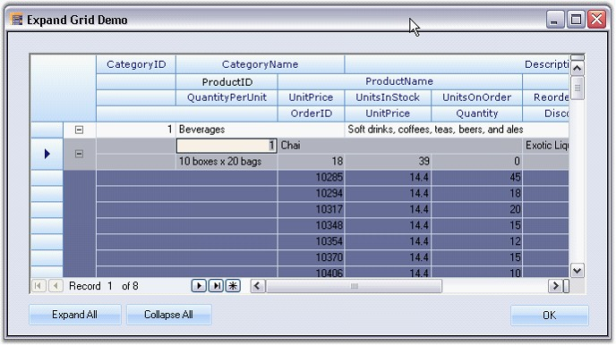

::: {style="DISPLAY: none"}
{#d2h_url_template}{#d2h_package_url style="WIDTH: 0px; DISPLAY: none; HEIGHT: 0px"}
:::

::: {.d2h_secondary_topic style="PADDING-BOTTOM: 10pt; MARGIN: 0pt; PADDING-LEFT: 0pt; PADDING-RIGHT: 0pt; PADDING-TOP: 0pt"}
##### Multiple Nested Relations {#multiple-nested-relations style="tab-stops: 0pt"}

[]{style="FONT-FAMILY: 'Trebuchet MS','sans-serif'; COLOR: #15428b; FONT-SIZE: 9pt"} 

Grid Data Bound Grid control supports multiple nested relations. A relation can be added in the data source and the data source can be set to the Grid Data Bound Grid. Then the name of the relation can be passed through the **Grid.Binder.AddRelation** function to show a hierarchical pattern.

 

**Example:**

 

This following code example illustrates the display of a DataSet with multiple nested relations. The sample displays the NorthWind\'s \'Category\', \'Products\' and the \'Orders_Details\' table, and allows you to expand and collapse the order details for each order and the products for each category. After adding a relation in the dataset and setting the DataSource to the grid, the name of the relation is passed through the Grid.Binder.AddRelation function in order to show a hierarchical pattern.

[]{style="FONT-FAMILY: 'Trebuchet MS','sans-serif'; COLOR: #15428b; FONT-SIZE: 9pt"} 

+-----------------------------------------------------------------------------------------------------------------------------------------------------------------------------------------------------------------------+
| **[\[C#\]]{style="FONT-FAMILY: 'Courier New'; COLOR: black"}**                                                                                                                                                        |
|                                                                                                                                                                                                                       |
| []{style="FONT-FAMILY: 'Courier New'; COLOR: black"}                                                                                                                                                                  |
|                                                                                                                                                                                                                       |
| [GridHierarchyLevel]{style="FONT-FAMILY: 'Courier New'; COLOR: #2b91af"}[ hlCategory_Products = gridBinder.AddRelation([\"Category_Products\"]{style="COLOR: #a31515"});]{style="FONT-FAMILY: 'Courier New'"}         |
|                                                                                                                                                                                                                       |
| [GridHierarchyLevel]{style="FONT-FAMILY: 'Courier New'; COLOR: #2b91af"}[ hlProducts_OrderDetails = gridBinder.AddRelation([\"Products_OrderDetails\"]{style="COLOR: #a31515"});]{style="FONT-FAMILY: 'Courier New'"} |
+-----------------------------------------------------------------------------------------------------------------------------------------------------------------------------------------------------------------------+

[]{style="FONT-FAMILY: 'Trebuchet MS','sans-serif'; COLOR: #15428b; FONT-SIZE: 9pt"} 

+-------------------------------------------------------------------------------------------------------------------------------------------------------------------------------------------------------------------------------------------------+
| **[\[VB.NET\]]{style="FONT-FAMILY: 'Courier New'; COLOR: black"}**                                                                                                                                                                              |
|                                                                                                                                                                                                                                                 |
| []{style="FONT-FAMILY: 'Courier New'; COLOR: black"}                                                                                                                                                                                            |
|                                                                                                                                                                                                                                                 |
| [Dim]{style="FONT-FAMILY: 'Courier New'; COLOR: blue"}[ hlCategory_Products [As]{style="COLOR: blue"} GridHierarchyLevel = gridBinder.AddRelation([\"Category_Products\"]{style="COLOR: #a31515"})]{style="FONT-FAMILY: 'Courier New'"}         |
|                                                                                                                                                                                                                                                 |
| [Dim]{style="FONT-FAMILY: 'Courier New'; COLOR: blue"}[ hlProducts_OrderDetails [As]{style="COLOR: blue"} GridHierarchyLevel = gridBinder.AddRelation([\"Products_OrderDetails\"]{style="COLOR: #a31515"})]{style="FONT-FAMILY: 'Courier New'"} |
+-------------------------------------------------------------------------------------------------------------------------------------------------------------------------------------------------------------------------------------------------+

[]{style="FONT-FAMILY: 'Trebuchet MS','sans-serif'; COLOR: #15428b; FONT-SIZE: 9pt"} 

{border="0"}

[]{style="FONT-FAMILY: 'Trebuchet MS','sans-serif'; COLOR: #15428b; FONT-SIZE: 9pt"} 

*[Figure ]{style="FONT-SIZE: 9pt"}[216]{style="FONT-SIZE: 9pt"}[: Expand Grid]{style="FONT-SIZE: 9pt"}*

[]{style="FONT-FAMILY: 'Trebuchet MS','sans-serif'; COLOR: #15428b; FONT-SIZE: 9pt"} 

A sample demonstrating this feature is available under the following sample installation path.

[]{style="FONT-FAMILY: 'Trebuchet MS','sans-serif'; COLOR: #15428b; FONT-SIZE: 9pt"} 

***\<Install Location\>\\Syncfusion\\EssentialStudio\\\[Version Number\]\\Windows\\Grid.Windows\\Samples\\2.0\\Data Bound\\Hierarchy\\Expand Grid Demo***

 

[]{#p380} 

 

[]{#related-topics}
:::
