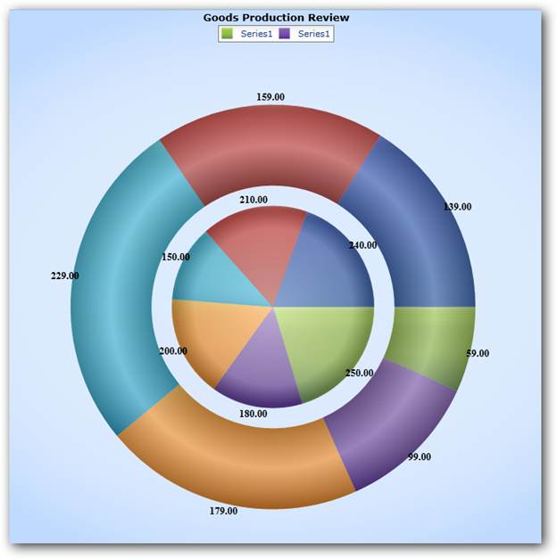

::: {style="DISPLAY: none"}
{#d2h_url_template}{#d2h_package_url style="WIDTH: 0px; DISPLAY: none; HEIGHT: 0px"}
:::

:::: {.d2h_secondary_topic style="PADDING-BOTTOM: 10pt; MARGIN: 0pt; PADDING-LEFT: 0pt; PADDING-RIGHT: 0pt; PADDING-TOP: 0pt"}
#### Multiple Pie Series {#multiple-pie-series style="tab-stops: 0pt"}

 

Multiple Pie Series enables displaying more than one series in the same Chart Area. This avoids overlapping of series. Legend can be added for the Series or the Series' Segments as needed. Adornments can be added for both the Series and the Series' segments.

 

Use Case Scenarios

 

This feature enables you to compare data.

 

Properties

Table 3: PropertyTable

::: {align="center"}
  ----------------- ------------------------------------------------------------ ----------- ----------- -----------------
  Property          Description                                                  Type        Data Type   Reference links
  PieCoefficient    Used to set the coefficient of space between the series.      Attached   Double      NA
  ----------------- ------------------------------------------------------------ ----------- ----------- -----------------
:::

[]{style="FONT-FAMILY: 'Calibri','sans-serif'; COLOR: black"} 

Adding Multiple Pie Series

To add Multiple Pie Series, set the Chart the type as Pie, and add multiple series to the chart. It will be added as a Multiple Pie Series.

 

Following code illustrates this:

 

+-------------------------------------------------------------------------------------------------------------------------------------------------------------------------------------------------------------------------------------------------------------------------------------------------------------------------------------------------------------------------------------------------------------------------------------------------------------------------------------------------------------------------------------------------------------------------------------------------------------------------------------------------------------------------------------------------------------------------------------------------------------------------------------------------+
| **[\[Xaml\][                    ]{style="COLOR: blue"}]{style="FONT-FAMILY: 'Courier New'"}**                                                                                                                                                                                                                                                                                                                                                                                                                                                                                                                                                                                                                                                                                                   |
|                                                                                                                                                                                                                                                                                                                                                                                                                                                                                                                                                                                                                                                                                                                                                                                                 |
| []{style="FONT-FAMILY: 'Courier New'; COLOR: blue"}                                                                                                                                                                                                                                                                                                                                                                                                                                                                                                                                                                                                                                                                                                                                             |
|                                                                                                                                                                                                                                                                                                                                                                                                                                                                                                                                                                                                                                                                                                                                                                                                 |
| [\<]{style="FONT-FAMILY: 'Courier New'; COLOR: blue"}[syncfusion:ChartSeries]{style="FONT-FAMILY: 'Courier New'; COLOR: #a31515"}[ ]{style="FONT-FAMILY: 'Courier New'; COLOR: black"}[Name]{style="FONT-FAMILY: 'Courier New'; COLOR: red"}[=\"series31\"]{style="FONT-FAMILY: 'Courier New'; COLOR: blue"}[  ]{style="FONT-FAMILY: 'Courier New'; COLOR: black"}[Label]{style="FONT-FAMILY: 'Courier New'; COLOR: red"}[=\"Revenue" ]{style="FONT-FAMILY: 'Courier New'; COLOR: blue"}[Type]{style="FONT-FAMILY: 'Courier New'; COLOR: red"}[=\"Pie\"]{style="FONT-FAMILY: 'Courier New'; COLOR: blue"}[ ]{style="FONT-FAMILY: 'Courier New'; COLOR: black"}[/\>]{style="FONT-FAMILY: 'Courier New'; COLOR: blue"}                                                                            |
|                                                                                                                                                                                                                                                                                                                                                                                                                                                                                                                                                                                                                                                                                                                                                                                                 |
| [\<syncfusion:ChartSeries]{style="FONT-FAMILY: 'Courier New'; COLOR: #a31515"}[ ]{style="FONT-FAMILY: 'Courier New'; COLOR: black"}[Name]{style="FONT-FAMILY: 'Courier New'; COLOR: red"}[=\"series32\"]{style="FONT-FAMILY: 'Courier New'; COLOR: blue"}[ ]{style="FONT-FAMILY: 'Courier New'; COLOR: black"}[Label]{style="FONT-FAMILY: 'Courier New'; COLOR: red"}[=\"Expenses"]{style="FONT-FAMILY: 'Courier New'; COLOR: blue"}[ ]{style="FONT-FAMILY: 'Courier New'; COLOR: black"}[Type]{style="FONT-FAMILY: 'Courier New'; COLOR: red"}[=\"Pie\"]{style="FONT-FAMILY: 'Courier New'; COLOR: blue"}[ ]{style="FONT-FAMILY: 'Courier New'; COLOR: black"}[/\>]{style="FONT-FAMILY: 'Courier New'; COLOR: blue"}[                      ]{style="FONT-FAMILY: 'Courier New'; COLOR: black"} |
+-------------------------------------------------------------------------------------------------------------------------------------------------------------------------------------------------------------------------------------------------------------------------------------------------------------------------------------------------------------------------------------------------------------------------------------------------------------------------------------------------------------------------------------------------------------------------------------------------------------------------------------------------------------------------------------------------------------------------------------------------------------------------------------------------+

 

+--------------------------------------------------------------------------------------------------------------------------------------------------------------------------------------------+
| **[\[C#]{style="FONT-FAMILY: 'Courier New'; COLOR: black"}**[\]]{style="FONT-FAMILY: 'Courier New'; COLOR: black"}                                                                         |
|                                                                                                                                                                                            |
| []{style="FONT-FAMILY: 'Courier New'"}                                                                                                                                                     |
|                                                                                                                                                                                            |
| [            [ChartArea]{style="COLOR: #2b91af"} area = [new]{style="COLOR: blue"} [ChartArea]{style="COLOR: #2b91af"}();]{style="FONT-FAMILY: 'Courier New'"}                             |
|                                                                                                                                                                                            |
| [            area.Series.Add([new]{style="COLOR: blue"} [ChartSeries]{style="COLOR: #2b91af"}() { Type = [ChartTypes]{style="COLOR: #2b91af"}.Pie });]{style="FONT-FAMILY: 'Courier New'"} |
|                                                                                                                                                                                            |
| [            area.Series.Add([new]{style="COLOR: blue"} [ChartSeries]{style="COLOR: #2b91af"}() { Type = [ChartTypes]{style="COLOR: #2b91af"}.Pie });]{style="FONT-FAMILY: 'Courier New'"} |
+--------------------------------------------------------------------------------------------------------------------------------------------------------------------------------------------+

 

 

[]{style="FONT-FAMILY: 'Courier New'; COLOR: black"} 

Sample Link

To view samples:

[]{style="COLOR: #c00000"} 

1)   Open the Syncfusion Dashboard.

2)   Click the WPF drop-down list and select Explore Samples.

3)   Navigate to Chart Area \> Multiple Chart Area.

[     ]{style="FONT-FAMILY: 'Courier New'; COLOR: black"}{border="0"}

Figure 48: Multiple Pie Series[]{style="FONT-FAMILY: 'Courier New'; COLOR: black"}

[]{style="FONT-FAMILY: 'Courier New'; COLOR: black"} 

 

 

**[]{style="COLOR: #15428b"}** 

 

[]{#related-topics}
::::
