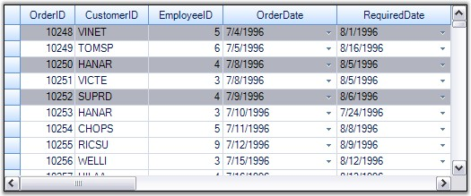
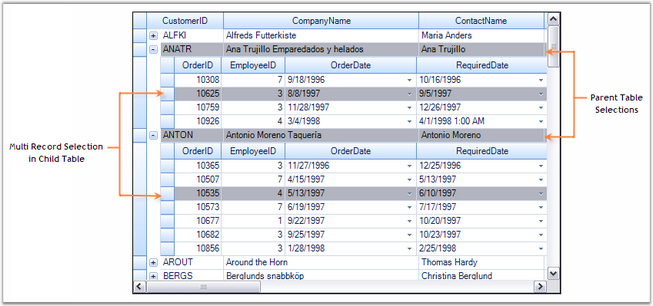

::: {style="DISPLAY: none"}
{#d2h_url_template}{#d2h_package_url style="WIDTH: 0px; DISPLAY: none; HEIGHT: 0px"}
:::

::::: {.d2h_secondary_topic style="PADDING-BOTTOM: 10pt; MARGIN: 0pt; PADDING-LEFT: 0pt; PADDING-RIGHT: 0pt; PADDING-TOP: 0pt"}
##### Multiple Record Selection {#multiple-record-selection style="tab-stops: 0pt"}

[]{style="FONT-FAMILY: 'Trebuchet MS','sans-serif'; COLOR: #15428b; FONT-SIZE: 9pt"} 

Grid Table supports selection of multiple records. Each record that is being selected is added into the **SelectedRecords** collection which manages these records. You can iterate through this collection in order to step through all records marked as selected. When records are added or removed from this collection, the grid raises the events, **SelectedRecordsChanging** and **SelectedRecordsChanged**. This section demonstrates how to work with the SelectedRecords collection.

 

**Selecting Multiple Records**

 

Multiple records can be selected at a time by adding the desired record specifications into the **SelectedRecords** collection. The following code example illustrates this process. It selects the records with indexes 2, 4 and 0 by adding them into the **SelectedRecords** collection.

[]{style="FONT-FAMILY: 'Trebuchet MS','sans-serif'; COLOR: #15428b; FONT-SIZE: 9pt"} 

+------------------------------------------------------------------------------------------------------------------------------------------------------------------------------+
| **[\[C#\]]{style="FONT-FAMILY: 'Courier New'; COLOR: black"}**                                                                                                               |
|                                                                                                                                                                              |
| []{style="FONT-FAMILY: 'Courier New'; COLOR: black"}                                                                                                                         |
|                                                                                                                                                                              |
| [Record]{style="FONT-FAMILY: 'Courier New'; COLOR: #2b91af"}[ r1 = [this]{style="COLOR: blue"}.gridGroupingControl1.Table.Records\[2\];]{style="FONT-FAMILY: 'Courier New'"} |
|                                                                                                                                                                              |
| [Record]{style="FONT-FAMILY: 'Courier New'; COLOR: #2b91af"}[ r2 = [this]{style="COLOR: blue"}.gridGroupingControl1.Table.Records\[4\];]{style="FONT-FAMILY: 'Courier New'"} |
|                                                                                                                                                                              |
| [Record]{style="FONT-FAMILY: 'Courier New'; COLOR: #2b91af"}[ r3 = [this]{style="COLOR: blue"}.gridGroupingControl1.Table.Records\[0\];]{style="FONT-FAMILY: 'Courier New'"} |
|                                                                                                                                                                              |
| []{style="FONT-FAMILY: 'Courier New'"}                                                                                                                                       |
|                                                                                                                                                                              |
| [Table]{style="FONT-FAMILY: 'Courier New'; COLOR: #2b91af"}[ t = [this]{style="COLOR: blue"}.gridGroupingControl1.Table;]{style="FONT-FAMILY: 'Courier New'"}                |
|                                                                                                                                                                              |
| [t.SelectedRecords.Add(r1);]{style="FONT-FAMILY: 'Courier New'"}                                                                                                             |
|                                                                                                                                                                              |
| [t.SelectedRecords.Add(r2);]{style="FONT-FAMILY: 'Courier New'"}                                                                                                             |
|                                                                                                                                                                              |
| [t.SelectedRecords.Add(r3);]{style="FONT-FAMILY: 'Courier New'"}                                                                                                             |
+------------------------------------------------------------------------------------------------------------------------------------------------------------------------------+

[]{style="FONT-FAMILY: 'Trebuchet MS','sans-serif'; COLOR: #15428b; FONT-SIZE: 9pt"} 

+----------------------------------------------------------------------------------------------------------------------------------------------------------------------------------------------------+
| **[\[VB.NET\]]{style="FONT-FAMILY: 'Courier New'; COLOR: black"}**                                                                                                                                 |
|                                                                                                                                                                                                    |
| []{style="FONT-FAMILY: 'Courier New'; COLOR: black"}                                                                                                                                               |
|                                                                                                                                                                                                    |
| [Dim]{style="FONT-FAMILY: 'Courier New'; COLOR: blue"}[ r1 [As]{style="COLOR: blue"} Record = [Me]{style="COLOR: blue"}.gridGroupingControl1.Table.Records(2)]{style="FONT-FAMILY: 'Courier New'"} |
|                                                                                                                                                                                                    |
| [Dim]{style="FONT-FAMILY: 'Courier New'; COLOR: blue"}[ r2 [As]{style="COLOR: blue"} Record = [Me]{style="COLOR: blue"}.gridGroupingControl1.Table.Records(4)]{style="FONT-FAMILY: 'Courier New'"} |
|                                                                                                                                                                                                    |
| [Dim]{style="FONT-FAMILY: 'Courier New'; COLOR: blue"}[ r3 [As]{style="COLOR: blue"} Record = [Me]{style="COLOR: blue"}.gridGroupingControl1.Table.Records(0)]{style="FONT-FAMILY: 'Courier New'"} |
|                                                                                                                                                                                                    |
| []{style="FONT-FAMILY: 'Courier New'"}                                                                                                                                                             |
|                                                                                                                                                                                                    |
| [Dim]{style="FONT-FAMILY: 'Courier New'; COLOR: blue"}[ t [As]{style="COLOR: blue"} Table = [Me]{style="COLOR: blue"}.gridGroupingControl1.Table]{style="FONT-FAMILY: 'Courier New'"}              |
|                                                                                                                                                                                                    |
| [t.SelectedRecords.Add(r1)]{style="FONT-FAMILY: 'Courier New'"}                                                                                                                                    |
|                                                                                                                                                                                                    |
| [t.SelectedRecords.Add(r2)]{style="FONT-FAMILY: 'Courier New'"}                                                                                                                                    |
|                                                                                                                                                                                                    |
| [t.SelectedRecords.Add(r3)]{style="FONT-FAMILY: 'Courier New'"}                                                                                                                                    |
+----------------------------------------------------------------------------------------------------------------------------------------------------------------------------------------------------+

[]{style="FONT-FAMILY: 'Trebuchet MS','sans-serif'; COLOR: #15428b; FONT-SIZE: 9pt"} 

{border="0"}

[]{style="FONT-FAMILY: 'Trebuchet MS','sans-serif'; COLOR: #15428b; FONT-SIZE: 9pt"} 

*[Figure ]{style="FONT-SIZE: 9pt"}[368]{style="FONT-SIZE: 9pt"}[: Selecting Multiple Records]{style="FONT-SIZE: 9pt"}*

**[]{style="COLOR: #4a5c8c; FONT-SIZE: 9pt"}** 

::: {style="BORDER-BOTTOM: windowtext 1pt solid; BORDER-LEFT: medium none; PADDING-BOTTOM: 1pt; MARGIN-TOP: 9pt; PADDING-LEFT: 0pt; PADDING-RIGHT: 0pt; MARGIN-BOTTOM: 9pt; BORDER-TOP: windowtext 1pt solid; BORDER-RIGHT: medium none; PADDING-TOP: 1pt"}
[{border="0"}]{style="COLOR: #4a5c8c"}Note: For more details, refer the following browser sample:

 

\<Install Location\>\\Syncfusion\\EssentialStudio\\\[Version Number\]\\Windows\\Grid.Grouping.Windows\\Samples\\2.0\\Selection\\Multi Record Selection Demo
:::

[]{style="FONT-FAMILY: 'Trebuchet MS','sans-serif'; COLOR: #15428b; FONT-SIZE: 9pt"} 

RecordSelection with NestedTables

[]{style="FONT-SIZE: 9pt"} 

When nested tables are used, you can extend the record selection mechanisms to each of the child table by accessing the SelectedRecords collection of the desired child table.

[]{style="FONT-SIZE: 8pt"} 

+-------------------------------------------------------------------------------------------------------------------------------------------------------------------------------------------------------------------------+
| **[\[C#\]]{style="FONT-FAMILY: 'Courier New'; COLOR: black"}**                                                                                                                                                          |
|                                                                                                                                                                                                                         |
| []{style="FONT-FAMILY: 'Courier New'; COLOR: black"}                                                                                                                                                                    |
|                                                                                                                                                                                                                         |
| [// For Parent Table.]{style="FONT-FAMILY: 'Courier New'; COLOR: green"}                                                                                                                                                |
|                                                                                                                                                                                                                         |
| [Record]{style="FONT-FAMILY: 'Courier New'; COLOR: #2b91af"}[ r1 = [this]{style="COLOR: blue"}.gridGroupingControl1.Table.Records\[1\];]{style="FONT-FAMILY: 'Courier New'"}                                            |
|                                                                                                                                                                                                                         |
| [Record]{style="FONT-FAMILY: 'Courier New'; COLOR: #2b91af"}[ r2 = [this]{style="COLOR: blue"}.gridGroupingControl1.Table.Records\[2\];]{style="FONT-FAMILY: 'Courier New'"}                                            |
|                                                                                                                                                                                                                         |
| []{style="FONT-FAMILY: 'Courier New'"}                                                                                                                                                                                  |
|                                                                                                                                                                                                                         |
| [Table]{style="FONT-FAMILY: 'Courier New'; COLOR: #2b91af"}[ t = [this]{style="COLOR: blue"}.gridGroupingControl1.Table;]{style="FONT-FAMILY: 'Courier New'"}                                                           |
|                                                                                                                                                                                                                         |
| [t.SelectedRecords.Add(r1);]{style="FONT-FAMILY: 'Courier New'"}                                                                                                                                                        |
|                                                                                                                                                                                                                         |
| [t.SelectedRecords.Add(r2);]{style="FONT-FAMILY: 'Courier New'"}                                                                                                                                                        |
|                                                                                                                                                                                                                         |
| [t.SelectedRecords.Add(r3);]{style="FONT-FAMILY: 'Courier New'"}                                                                                                                                                        |
|                                                                                                                                                                                                                         |
| [            ]{style="FONT-FAMILY: 'Courier New'"}                                                                                                                                                                      |
|                                                                                                                                                                                                                         |
| [// For Child Table.]{style="FONT-FAMILY: 'Courier New'; COLOR: green"}                                                                                                                                                 |
|                                                                                                                                                                                                                         |
| [Record]{style="FONT-FAMILY: 'Courier New'; COLOR: #2b91af"}[ cr1 = [this]{style="COLOR: blue"}.gridGroupingControl1.GetTable([\"Orders\"]{style="COLOR: #a31515"}).Records\[7\];]{style="FONT-FAMILY: 'Courier New'"}  |
|                                                                                                                                                                                                                         |
| [Record]{style="FONT-FAMILY: 'Courier New'; COLOR: #2b91af"}[ cr2 = [this]{style="COLOR: blue"}.gridGroupingControl1.GetTable([\"Orders\"]{style="COLOR: #a31515"}).Records\[12\];]{style="FONT-FAMILY: 'Courier New'"} |
|                                                                                                                                                                                                                         |
| []{style="FONT-FAMILY: 'Courier New'"}                                                                                                                                                                                  |
|                                                                                                                                                                                                                         |
| [this]{style="FONT-FAMILY: 'Courier New'; COLOR: blue"}[.gridGroupingControl1.GetTable([\"Orders\"]{style="COLOR: #a31515"}).SelectedRecords.Add(or1);]{style="FONT-FAMILY: 'Courier New'"}                             |
|                                                                                                                                                                                                                         |
| [this]{style="FONT-FAMILY: 'Courier New'; COLOR: blue"}[.gridGroupingControl1.GetTable([\"Orders\"]{style="COLOR: #a31515"}).SelectedRecords.Add(or2);]{style="FONT-FAMILY: 'Courier New'"}                             |
+-------------------------------------------------------------------------------------------------------------------------------------------------------------------------------------------------------------------------+

[]{style="FONT-FAMILY: 'Trebuchet MS','sans-serif'; COLOR: #15428b; FONT-SIZE: 9pt"} 

+-----------------------------------------------------------------------------------------------------------------------------------------------------------------------------------------------------------------------------------------------+
| **[\[VB.NET\]]{style="FONT-FAMILY: 'Courier New'; COLOR: black"}**                                                                                                                                                                            |
|                                                                                                                                                                                                                                               |
| []{style="FONT-FAMILY: 'Courier New'; COLOR: black"}                                                                                                                                                                                          |
|                                                                                                                                                                                                                                               |
| [\' For Parent Table.]{style="FONT-FAMILY: 'Courier New'; COLOR: green"}                                                                                                                                                                      |
|                                                                                                                                                                                                                                               |
| [Dim]{style="FONT-FAMILY: 'Courier New'; COLOR: blue"}[ r1 [As]{style="COLOR: blue"} Record = [Me]{style="COLOR: blue"}.gridGroupingControl1.Table.Records(1)]{style="FONT-FAMILY: 'Courier New'"}                                            |
|                                                                                                                                                                                                                                               |
| [Dim]{style="FONT-FAMILY: 'Courier New'; COLOR: blue"}[ r2 [As]{style="COLOR: blue"} Record = [Me]{style="COLOR: blue"}.gridGroupingControl1.Table.Records(2)]{style="FONT-FAMILY: 'Courier New'"}                                            |
|                                                                                                                                                                                                                                               |
| []{style="FONT-FAMILY: 'Courier New'"}                                                                                                                                                                                                        |
|                                                                                                                                                                                                                                               |
| [Dim]{style="FONT-FAMILY: 'Courier New'; COLOR: blue"}[ t [As]{style="COLOR: blue"} Table = [Me]{style="COLOR: blue"}.gridGroupingControl1.Table]{style="FONT-FAMILY: 'Courier New'"}                                                         |
|                                                                                                                                                                                                                                               |
| [t.SelectedRecords.Add(r1)]{style="FONT-FAMILY: 'Courier New'"}                                                                                                                                                                               |
|                                                                                                                                                                                                                                               |
| [t.SelectedRecords.Add(r2)]{style="FONT-FAMILY: 'Courier New'"}                                                                                                                                                                               |
|                                                                                                                                                                                                                                               |
| [t.SelectedRecords.Add(r3)]{style="FONT-FAMILY: 'Courier New'"}                                                                                                                                                                               |
|                                                                                                                                                                                                                                               |
| []{style="FONT-FAMILY: 'Courier New'"}                                                                                                                                                                                                        |
|                                                                                                                                                                                                                                               |
| [\' For Child Table.]{style="FONT-FAMILY: 'Courier New'; COLOR: green"}                                                                                                                                                                       |
|                                                                                                                                                                                                                                               |
| [Dim]{style="FONT-FAMILY: 'Courier New'; COLOR: blue"}[ cr1 [As]{style="COLOR: blue"} Record = [Me]{style="COLOR: blue"}.gridGroupingControl1.GetTable([\"Orders\"]{style="COLOR: #a31515"}).Records(7)]{style="FONT-FAMILY: 'Courier New'"}  |
|                                                                                                                                                                                                                                               |
| [Dim]{style="FONT-FAMILY: 'Courier New'; COLOR: blue"}[ cr2 [As]{style="COLOR: blue"} Record = [Me]{style="COLOR: blue"}.gridGroupingControl1.GetTable([\"Orders\"]{style="COLOR: #a31515"}).Records(12)]{style="FONT-FAMILY: 'Courier New'"} |
|                                                                                                                                                                                                                                               |
| []{style="FONT-FAMILY: 'Courier New'"}                                                                                                                                                                                                        |
|                                                                                                                                                                                                                                               |
| [Me]{style="FONT-FAMILY: 'Courier New'; COLOR: blue"}[.gridGroupingControl1.GetTable([\"Orders\"]{style="COLOR: #a31515"}).SelectedRecords.Add(or1)]{style="FONT-FAMILY: 'Courier New'"}                                                      |
|                                                                                                                                                                                                                                               |
| [Me]{style="FONT-FAMILY: 'Courier New'; COLOR: blue"}[.gridGroupingControl1.GetTable([\"Orders\"]{style="COLOR: #a31515"}).SelectedRecords.Add(or2)]{style="FONT-FAMILY: 'Courier New'"}                                                      |
+-----------------------------------------------------------------------------------------------------------------------------------------------------------------------------------------------------------------------------------------------+

[]{style="FONT-FAMILY: 'Trebuchet MS','sans-serif'; COLOR: #15428b; FONT-SIZE: 9pt"} 

{border="0"}

***[]{style="FONT-FAMILY: 'Trebuchet MS','sans-serif'; COLOR: #15428b; FONT-SIZE: 9pt"}*** 

*[Figure ]{style="FONT-SIZE: 9pt"}[369]{style="FONT-SIZE: 9pt"}[: Record Selection in Nested Tables]{style="FONT-SIZE: 9pt"}*

[]{style="FONT-FAMILY: 'Trebuchet MS','sans-serif'; COLOR: #15428b; FONT-SIZE: 9pt"} 

Record Search

 

To search for a particular record, the SelectedRecords collection provides a method called FindRecord(). This method search for the occurrences of the specified record and returns a zero-based index of the occurrence found. If there is no such record, then returns -1. It comes in two versions: one accepts the whole record as its parameter and the other accepts the position of the record in the underlying datasource.

[]{style="FONT-FAMILY: 'Trebuchet MS','sans-serif'; COLOR: #15428b; FONT-SIZE: 9pt"} 

+----------------------------------------------------------------------------------------------------------------------------------------------------------------------------------------------+
| **[\[C#\]]{style="FONT-FAMILY: 'Courier New'; COLOR: black"}**                                                                                                                               |
|                                                                                                                                                                                              |
| []{style="FONT-FAMILY: 'Courier New'; COLOR: black"}                                                                                                                                         |
|                                                                                                                                                                                              |
| [Record]{style="FONT-FAMILY: 'Courier New'; COLOR: #2b91af"}[ rec = [this]{style="COLOR: blue"}.gridGroupingControl1.Table.Records\[2\];]{style="FONT-FAMILY: 'Courier New'"}                |
|                                                                                                                                                                                              |
| []{style="FONT-FAMILY: 'Courier New'"}                                                                                                                                                       |
|                                                                                                                                                                                              |
| [// Search for the record \'rec\'.]{style="FONT-FAMILY: 'Courier New'; COLOR: green"}                                                                                                        |
|                                                                                                                                                                                              |
| [int]{style="FONT-FAMILY: 'Courier New'; COLOR: blue"}[ index = [this]{style="COLOR: blue"}.gridGroupingControl1.Table.SelectedRecords.FindRecord(rec);]{style="FONT-FAMILY: 'Courier New'"} |
|                                                                                                                                                                                              |
| []{style="FONT-FAMILY: 'Courier New'"}                                                                                                                                                       |
|                                                                                                                                                                                              |
| [// Search for the record with index 2.]{style="FONT-FAMILY: 'Courier New'; COLOR: green"}                                                                                                   |
|                                                                                                                                                                                              |
| [int]{style="FONT-FAMILY: 'Courier New'; COLOR: blue"}[ index2 = [this]{style="COLOR: blue"}.gridGroupingControl1.Table.SelectedRecords.FindRecord(2);]{style="FONT-FAMILY: 'Courier New'"}  |
+----------------------------------------------------------------------------------------------------------------------------------------------------------------------------------------------+

[]{style="FONT-FAMILY: 'Trebuchet MS','sans-serif'; COLOR: #15428b; FONT-SIZE: 9pt"} 

+-----------------------------------------------------------------------------------------------------------------------------------------------------------------------------------------------------------------------------+
| **[\[VB.NET\]]{style="FONT-FAMILY: 'Courier New'; COLOR: black"}**                                                                                                                                                          |
|                                                                                                                                                                                                                             |
| []{style="FONT-FAMILY: 'Courier New'; COLOR: black"}                                                                                                                                                                        |
|                                                                                                                                                                                                                             |
| [Dim]{style="FONT-FAMILY: 'Courier New'; COLOR: blue"}[ rec [As]{style="COLOR: blue"} Record = [Me]{style="COLOR: blue"}.gridGroupingControl1.Table.Records(2)]{style="FONT-FAMILY: 'Courier New'"}                         |
|                                                                                                                                                                                                                             |
| []{style="FONT-FAMILY: 'Courier New'; COLOR: green"}                                                                                                                                                                        |
|                                                                                                                                                                                                                             |
| [\' Search for the record \'rec\'.]{style="FONT-FAMILY: 'Courier New'; COLOR: green"}                                                                                                                                       |
|                                                                                                                                                                                                                             |
| [Dim ]{style="FONT-FAMILY: 'Courier New'; COLOR: blue"}[index[ As Integer]{style="COLOR: blue"} = [Me]{style="COLOR: blue"}.gridGroupingControl1.Table.SelectedRecords.FindRecord(rec)]{style="FONT-FAMILY: 'Courier New'"} |
|                                                                                                                                                                                                                             |
| []{style="FONT-FAMILY: 'Courier New'; COLOR: green"}                                                                                                                                                                        |
|                                                                                                                                                                                                                             |
| [\' Search for the record with index 2.]{style="FONT-FAMILY: 'Courier New'; COLOR: green"}                                                                                                                                  |
|                                                                                                                                                                                                                             |
| [Dim ]{style="FONT-FAMILY: 'Courier New'; COLOR: blue"}[index2[ As Integer]{style="COLOR: blue"} = [Me]{style="COLOR: blue"}.gridGroupingControl1.Table.SelectedRecords.FindRecord(2)]{style="FONT-FAMILY: 'Courier New'"}  |
+-----------------------------------------------------------------------------------------------------------------------------------------------------------------------------------------------------------------------------+

[]{style="FONT-FAMILY: 'Trebuchet MS','sans-serif'; COLOR: #15428b; FONT-SIZE: 9pt"} 

Removing a RecordSelection

 

A record can be removed from the SelectedRecords collection by using the methods Remove() and RemoveAt(). A call to Remove() requires you to specify the whole record itself as parameter. In case if you know only the record index, you could then make use of RemoveAt(). Both the methods remove the specified record from the collection and mark it as deselect.

[]{style="FONT-FAMILY: 'Trebuchet MS','sans-serif'; COLOR: #15428b; FONT-SIZE: 9pt"} 

+-------------------------------------------------------------------------------------------------------------------------------------------------------------------------------+
| **[\[C#\]]{style="FONT-FAMILY: 'Courier New'; COLOR: black"}**                                                                                                                |
|                                                                                                                                                                               |
| []{style="FONT-FAMILY: 'Courier New'; COLOR: black"}                                                                                                                          |
|                                                                                                                                                                               |
| [Record]{style="FONT-FAMILY: 'Courier New'; COLOR: #2b91af"}[ rec = [this]{style="COLOR: blue"}.gridGroupingControl1.Table.Records\[2\];]{style="FONT-FAMILY: 'Courier New'"} |
|                                                                                                                                                                               |
| []{style="FONT-FAMILY: 'Courier New'"}                                                                                                                                        |
|                                                                                                                                                                               |
| [// Remove the record \'rec\'.]{style="FONT-FAMILY: 'Courier New'; COLOR: green"}                                                                                             |
|                                                                                                                                                                               |
| [this]{style="FONT-FAMILY: 'Courier New'; COLOR: blue"}[.gridGroupingControl1.Table.SelectedRecords.Remove(rec);]{style="FONT-FAMILY: 'Courier New'"}                         |
|                                                                                                                                                                               |
| []{style="FONT-FAMILY: 'Courier New'"}                                                                                                                                        |
|                                                                                                                                                                               |
| [// Remove the record at the index 2.]{style="FONT-FAMILY: 'Courier New'; COLOR: green"}                                                                                      |
|                                                                                                                                                                               |
| [this]{style="FONT-FAMILY: 'Courier New'; COLOR: blue"}[.gridGroupingControl1.Table.SelectedRecords.RemoveAt(2);]{style="FONT-FAMILY: 'Courier New'"}                         |
+-------------------------------------------------------------------------------------------------------------------------------------------------------------------------------+

[]{style="FONT-FAMILY: 'Trebuchet MS','sans-serif'; COLOR: #15428b; FONT-SIZE: 9pt"} 

+-----------------------------------------------------------------------------------------------------------------------------------------------------------------------------------------------------+
| **[\[VB.NET\]]{style="FONT-FAMILY: 'Courier New'; COLOR: black"}**                                                                                                                                  |
|                                                                                                                                                                                                     |
| []{style="FONT-FAMILY: 'Courier New'; COLOR: black"}                                                                                                                                                |
|                                                                                                                                                                                                     |
| [Dim]{style="FONT-FAMILY: 'Courier New'; COLOR: blue"}[ rec [As]{style="COLOR: blue"} Record = [Me]{style="COLOR: blue"}.gridGroupingControl1.Table.Records(2)]{style="FONT-FAMILY: 'Courier New'"} |
|                                                                                                                                                                                                     |
| []{style="FONT-FAMILY: 'Courier New'; COLOR: green"}                                                                                                                                                |
|                                                                                                                                                                                                     |
| [\' Remove the record \'rec\'.]{style="FONT-FAMILY: 'Courier New'; COLOR: green"}                                                                                                                   |
|                                                                                                                                                                                                     |
| [Me]{style="FONT-FAMILY: 'Courier New'; COLOR: blue"}[.gridGroupingControl1.Table.SelectedRecords.Remove(rec)]{style="FONT-FAMILY: 'Courier New'"}                                                  |
|                                                                                                                                                                                                     |
| []{style="FONT-FAMILY: 'Courier New'; COLOR: green"}                                                                                                                                                |
|                                                                                                                                                                                                     |
| [\' Remove the record at the index 2.]{style="FONT-FAMILY: 'Courier New'; COLOR: green"}                                                                                                            |
|                                                                                                                                                                                                     |
| [Me]{style="FONT-FAMILY: 'Courier New'; COLOR: blue"}[.gridGroupingControl1.Table.SelectedRecords.RemoveAt(2)]{style="FONT-FAMILY: 'Courier New'"}                                                  |
+-----------------------------------------------------------------------------------------------------------------------------------------------------------------------------------------------------+

[]{style="FONT-FAMILY: 'Trebuchet MS','sans-serif'; COLOR: #15428b; FONT-SIZE: 9pt"} 

Clear Selection

 

To remove all the selections from the grid, you can call SelectedRecords.Clear() method that removes all the elements from the collection and mark them as deselect.

[]{style="FONT-SIZE: 8pt"} 

+---------------------------------------------------------------------------------------------------------------------------------------------------+
| **[\[C#\]]{style="FONT-FAMILY: 'Courier New'; COLOR: black"}**                                                                                    |
|                                                                                                                                                   |
| []{style="FONT-FAMILY: 'Courier New'"}                                                                                                            |
|                                                                                                                                                   |
| [this]{style="FONT-FAMILY: 'Courier New'; COLOR: blue"}[.gridGroupingControl1.Table.SelectedRecords.Clear();]{style="FONT-FAMILY: 'Courier New'"} |
+---------------------------------------------------------------------------------------------------------------------------------------------------+

[]{style="FONT-FAMILY: 'Trebuchet MS','sans-serif'; COLOR: #15428b; FONT-SIZE: 9pt"} 

+------------------------------------------------------------------------------------------------------------------------------------------------+
| **[\[VB.NET\]]{style="FONT-FAMILY: 'Courier New'; COLOR: black"}**                                                                             |
|                                                                                                                                                |
| []{style="FONT-FAMILY: 'Courier New'; COLOR: black"}                                                                                           |
|                                                                                                                                                |
| [Me]{style="FONT-FAMILY: 'Courier New'; COLOR: blue"}[.gridGroupingControl1.Table.SelectedRecords.Clear()]{style="FONT-FAMILY: 'Courier New'"} |
+------------------------------------------------------------------------------------------------------------------------------------------------+

[]{style="FONT-FAMILY: 'Trebuchet MS','sans-serif'; COLOR: #15428b; FONT-SIZE: 9pt"} 

::: {style="BORDER-BOTTOM: windowtext 1pt solid; BORDER-LEFT: medium none; PADDING-BOTTOM: 1pt; MARGIN-TOP: 9pt; PADDING-LEFT: 0pt; PADDING-RIGHT: 0pt; MARGIN-BOTTOM: 9pt; BORDER-TOP: windowtext 1pt solid; BORDER-RIGHT: medium none; PADDING-TOP: 1pt"}
{border="0"}Note: For more details, refer the following browser sample:

 

\<Install Location\>\\Syncfusion\\EssentialStudio\\\[Version Number\]\\Windows\\Grid.Grouping.Windows\\Samples\\2.0\\Selection\\Multi Record Selection Demo
:::

 

[]{#p466} 

 

[]{#related-topics}
:::::
