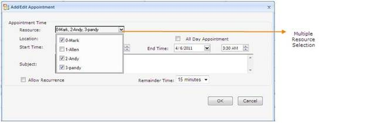
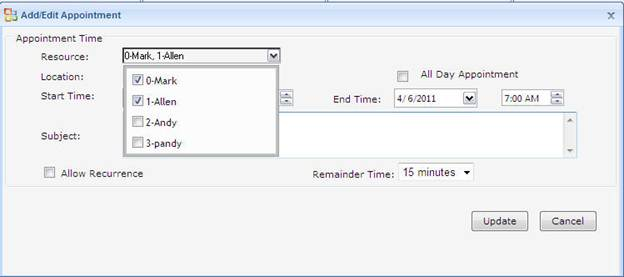

::: {style="DISPLAY: none"}
{#d2h_url_template}{#d2h_package_url style="WIDTH: 0px; DISPLAY: none; HEIGHT: 0px"}
:::

::::: {#nsbanner .d2h_main_nsbanner style="BORDER-BOTTOM: #999999 1px solid; POSITION: relative; PADDING-BOTTOM: 0px; BACKGROUND-COLOR: transparent; PADDING-LEFT: 0px; PADDING-RIGHT: 0px; DISPLAY: none; BORDER-TOP: #999999 1px solid; PADDING-TOP: 0px; LEFT: 0px"}
:::: {#TitleRow .d2h_main_titlerow style="PADDING-BOTTOM: 4px; BACKGROUND-COLOR: transparent; PADDING-LEFT: 22px; WIDTH: 100%; PADDING-RIGHT: 10px; DISPLAY: none; PADDING-TOP: 4px"}
::: {#ienav .d2h_main_ienav style="DISPLAY: none"}
{#D2HPrevious .D2HPreviousEnabled}  {#D2HNext .D2HNextEnabled}
:::
::::
:::::

::::::: {#nstext .d2h_main_nstext style="PADDING-BOTTOM: 10px; BACKGROUND-COLOR: transparent; PADDING-LEFT: 22px; PADDING-RIGHT: 10px; HEIGHT: 100%; OVERFLOW: auto; PADDING-TOP: 5px" hasuserbackground="true" valign="bottom"}
::: {#d2h_breadcrumbs .d2h_breadcrumbs}
[Essential Studio User Guide Documentation](ms-xhelp:///?Id=12457748-09e3-4d74-a240-8e049cedf030){.d2h_breadcrumbsNormal}[ \> ]{.d2h_breadcrumbsLinkSeparator}[User Interface Edition](ms-xhelp:///?Id=c29296b7-531c-413b-a0ec-488ca1f7f669){.d2h_breadcrumbsNormal}[ \> ]{.d2h_breadcrumbsLinkSeparator}[Essential ASP.NET](ms-xhelp:///?Id=25c35330-c127-4dad-9a92-ed79dc7261a6){.d2h_breadcrumbsNormal}[ \> ]{.d2h_breadcrumbsLinkSeparator}[Essential Schedule]{.d2h_breadcrumbsContentsOnly}[ \> ]{.d2h_breadcrumbsLinkSeparator}[Concepts and Features](ms-xhelp:///?Id=64869483-f57f-4838-b322-b1a3d1ce8e40){.d2h_breadcrumbsNormal}[ \> ]{.d2h_breadcrumbsLinkSeparator}[Resources](ms-xhelp:///?Id=64c8cec7-e58f-48d8-b376-08116ec9ca9f){.d2h_breadcrumbsNormal}
:::

### Multiple Resource Selection {#multiple-resource-selection style="tab-stops: 0pt"}

 

Essential Schedule supports selecting several resources [(recipients)]{style="FONT-SIZE: 11pt"} when adding or editing appointments in Schedule.

 

Use Case Scenarios

This feature enables you to create the same appointment with several resources.

 

Selecting Multiple Resource When Adding Appointment

You can select several recipients  when adding an appointment by  two methods namely:

[·      ]{style="FONT-FAMILY: Symbol"}Design time and Code behind

[·      ]{style="FONT-FAMILY: Symbol"}Callback

Design time and Code behind

You can select several recipients in design time /code behind by setting the "MultipleOwner" property in schedule.

 

+----------------------------------------------------------------------------------------------------------------------------------------------------------------------------------------------------------------------------------------------------------------------------------------------------------------------------------------------------------------------------------------------------------------------------------------------------------------------------------------------------------------------------------------------------------------------------------------------------------------------------------------------------------------------------------------------------------------------------------------------------------------------------------------------------------------------------------------------------------------+
| [ ]{style="FONT-FAMILY: 'Times New Roman','serif'"}**[\[ASPX\]]{style="FONT-FAMILY: 'Courier New'"}**                                                                                                                                                                                                                                                                                                                                                                                                                                                                                                                                                                                                                                                                                                                                                          |
|                                                                                                                                                                                                                                                                                                                                                                                                                                                                                                                                                                                                                                                                                                                                                                                                                                                                |
| [\<]{style="FONT-FAMILY: 'Courier New'; COLOR: blue"}[Resources]{style="FONT-FAMILY: 'Courier New'; COLOR: #a31515"}[\>]{style="FONT-FAMILY: 'Courier New'; COLOR: blue"}                                                                                                                                                                                                                                                                                                                                                                                                                                                                                                                                                                                                                                                                                      |
|                                                                                                                                                                                                                                                                                                                                                                                                                                                                                                                                                                                                                                                                                                                                                                                                                                                                |
| [\<]{style="FONT-FAMILY: 'Courier New'; COLOR: blue"}[syncfusion]{style="FONT-FAMILY: 'Courier New'; COLOR: #a31515"}[:]{style="FONT-FAMILY: 'Courier New'; COLOR: blue"}[ScheduleWebResource]{style="FONT-FAMILY: 'Courier New'; COLOR: #a31515"}[ [Name]{style="COLOR: red"}[=\"Mark\"]{style="COLOR: blue"} [/\>]{style="COLOR: blue"}]{style="FONT-FAMILY: 'Courier New'"}                                                                                                                                                                                                                                                                                                                                                                                                                                                                                 |
|                                                                                                                                                                                                                                                                                                                                                                                                                                                                                                                                                                                                                                                                                                                                                                                                                                                                |
| [\<]{style="FONT-FAMILY: 'Courier New'; COLOR: blue"}[syncfusion]{style="FONT-FAMILY: 'Courier New'; COLOR: #a31515"}[:]{style="FONT-FAMILY: 'Courier New'; COLOR: blue"}[ScheduleWebResource]{style="FONT-FAMILY: 'Courier New'; COLOR: #a31515"}[ [Name]{style="COLOR: red"}[=\"Allen\"]{style="COLOR: blue"} [UniqueID]{style="COLOR: red"}[=\"1\"]{style="COLOR: blue"} [/\>]{style="COLOR: blue"}]{style="FONT-FAMILY: 'Courier New'"}                                                                                                                                                                                                                                                                                                                                                                                                                    |
|                                                                                                                                                                                                                                                                                                                                                                                                                                                                                                                                                                                                                                                                                                                                                                                                                                                                |
| [\<]{style="FONT-FAMILY: 'Courier New'; COLOR: blue"}[syncfusion]{style="FONT-FAMILY: 'Courier New'; COLOR: #a31515"}[:]{style="FONT-FAMILY: 'Courier New'; COLOR: blue"}[ScheduleWebResource]{style="FONT-FAMILY: 'Courier New'; COLOR: #a31515"}[ [Name]{style="COLOR: red"}[=\"Andy\"]{style="COLOR: blue"} [UniqueID]{style="COLOR: red"}[=\"2\"]{style="COLOR: blue"} [/\>]{style="COLOR: blue"}]{style="FONT-FAMILY: 'Courier New'"}                                                                                                                                                                                                                                                                                                                                                                                                                     |
|                                                                                                                                                                                                                                                                                                                                                                                                                                                                                                                                                                                                                                                                                                                                                                                                                                                                |
| [\<]{style="FONT-FAMILY: 'Courier New'; COLOR: blue"}[syncfusion]{style="FONT-FAMILY: 'Courier New'; COLOR: #a31515"}[:]{style="FONT-FAMILY: 'Courier New'; COLOR: blue"}[ScheduleWebResource]{style="FONT-FAMILY: 'Courier New'; COLOR: #a31515"}[ [Name]{style="COLOR: red"}[=\"pandy\"]{style="COLOR: blue"} [UniqueID]{style="COLOR: red"}[=\"3\"]{style="COLOR: blue"} [/\>]{style="COLOR: blue"}]{style="FONT-FAMILY: 'Courier New'"}                                                                                                                                                                                                                                                                                                                                                                                                                    |
|                                                                                                                                                                                                                                                                                                                                                                                                                                                                                                                                                                                                                                                                                                                                                                                                                                                                |
| [\</]{style="FONT-FAMILY: 'Courier New'; COLOR: blue"}[Resources]{style="FONT-FAMILY: 'Courier New'; COLOR: #a31515"}[\>]{style="FONT-FAMILY: 'Courier New'; COLOR: blue"}                                                                                                                                                                                                                                                                                                                                                                                                                                                                                                                                                                                                                                                                                     |
|                                                                                                                                                                                                                                                                                                                                                                                                                                                                                                                                                                                                                                                                                                                                                                                                                                                                |
| [\<]{style="FONT-FAMILY: 'Courier New'; COLOR: blue"}[Appointments]{style="FONT-FAMILY: 'Courier New'; COLOR: #a31515"}[\>]{style="FONT-FAMILY: 'Courier New'; COLOR: blue"}                                                                                                                                                                                                                                                                                                                                                                                                                                                                                                                                                                                                                                                                                   |
|                                                                                                                                                                                                                                                                                                                                                                                                                                                                                                                                                                                                                                                                                                                                                                                                                                                                |
| [\<]{style="FONT-FAMILY: 'Courier New'; COLOR: blue"}[syncfusion]{style="FONT-FAMILY: 'Courier New'; COLOR: #a31515"}[:]{style="FONT-FAMILY: 'Courier New'; COLOR: blue"}[ScheduleWebAppointment]{style="FONT-FAMILY: 'Courier New'; COLOR: #a31515"}[ [Subject]{style="COLOR: red"}[=\"Meeting\"]{style="COLOR: blue"} [Owner]{style="COLOR: red"}[=\"0\"]{style="COLOR: blue"}  [StartTime]{style="COLOR: red"}[=\"04-07-2011 09:00:00\"]{style="COLOR: blue"} [EndTime]{style="COLOR: red"}[=\"04-07-2011 10:00:00\"]{style="COLOR: blue"}  [MultipleOwner]{style="COLOR: red"}[=\"1,2,3\"]{style="COLOR: blue"} [UniqueID]{style="COLOR: red"}[=\"1\"\>\</]{style="COLOR: blue"}[syncfusion]{style="COLOR: #a31515"}[:]{style="COLOR: blue"}[ScheduleWebAppointment]{style="COLOR: #a31515"}[\>]{style="COLOR: blue"}]{style="FONT-FAMILY: 'Courier New'"} |
|                                                                                                                                                                                                                                                                                                                                                                                                                                                                                                                                                                                                                                                                                                                                                                                                                                                                |
| [\<]{style="FONT-FAMILY: 'Courier New'; COLOR: blue"}[syncfusion]{style="FONT-FAMILY: 'Courier New'; COLOR: #a31515"}[:]{style="FONT-FAMILY: 'Courier New'; COLOR: blue"}[ScheduleWebAppointment]{style="FONT-FAMILY: 'Courier New'; COLOR: #a31515"}[ [Subject]{style="COLOR: red"}[=\"Travel\"]{style="COLOR: blue"}  [StartTime]{style="COLOR: red"}[=\"04-07-2011 08:00:00\"]{style="COLOR: blue"} [EndTime]{style="COLOR: red"}[=\"04-07-2011 09:00:00\"]{style="COLOR: blue"}  [MultipleOwner]{style="COLOR: red"}[=\"2,3\"]{style="COLOR: blue"} [Owner]{style="COLOR: red"}[=\"1\"]{style="COLOR: blue"} [UniqueID]{style="COLOR: red"}[=\"2\"\>\</]{style="COLOR: blue"}[syncfusion]{style="COLOR: #a31515"}[:]{style="COLOR: blue"}[ScheduleWebAppointment]{style="COLOR: #a31515"}[\>]{style="COLOR: blue"}]{style="FONT-FAMILY: 'Courier New'"}    |
|                                                                                                                                                                                                                                                                                                                                                                                                                                                                                                                                                                                                                                                                                                                                                                                                                                                                |
| [\<]{style="FONT-FAMILY: 'Courier New'; COLOR: blue"}[syncfusion]{style="FONT-FAMILY: 'Courier New'; COLOR: #a31515"}[:]{style="FONT-FAMILY: 'Courier New'; COLOR: blue"}[ScheduleWebAppointment]{style="FONT-FAMILY: 'Courier New'; COLOR: #a31515"}[ [Subject]{style="COLOR: red"}[=\"Breakfast\"]{style="COLOR: blue"}  [StartTime]{style="COLOR: red"}[=\"04-07-2011 07:00:00\"]{style="COLOR: blue"} [EndTime]{style="COLOR: red"}[=\"04-07-2011 08:00:00\"]{style="COLOR: blue"}  [MultipleOwner]{style="COLOR: red"}[=\"1,3\"]{style="COLOR: blue"} [Owner]{style="COLOR: red"}[=\"2\"]{style="COLOR: blue"} [UniqueID]{style="COLOR: red"}[=\"3\"\>\</]{style="COLOR: blue"}[syncfusion]{style="COLOR: #a31515"}[:]{style="COLOR: blue"}[ScheduleWebAppointment]{style="COLOR: #a31515"}[\>]{style="COLOR: blue"}]{style="FONT-FAMILY: 'Courier New'"} |
|                                                                                                                                                                                                                                                                                                                                                                                                                                                                                                                                                                                                                                                                                                                                                                                                                                                                |
| [\</]{style="FONT-FAMILY: 'Courier New'; COLOR: blue"}[Appointments]{style="FONT-FAMILY: 'Courier New'; COLOR: #a31515"}[\>]{style="FONT-FAMILY: 'Courier New'; COLOR: blue"}[]{style="FONT-FAMILY: 'Calibri','sans-serif'"}                                                                                                                                                                                                                                                                                                                                                                                                                                                                                                                                                                                                                                   |
+----------------------------------------------------------------------------------------------------------------------------------------------------------------------------------------------------------------------------------------------------------------------------------------------------------------------------------------------------------------------------------------------------------------------------------------------------------------------------------------------------------------------------------------------------------------------------------------------------------------------------------------------------------------------------------------------------------------------------------------------------------------------------------------------------------------------------------------------------------------+

[]{style="LINE-HEIGHT: 115%; FONT-FAMILY: 'Calibri','sans-serif'; FONT-SIZE: 11pt"} 

+---------------------------------------------------------------------------------------------------------------------------------------------------------------------------------------------------------+
| [ ]{style="FONT-FAMILY: 'Times New Roman','serif'"}**[\[C#\]]{style="FONT-FAMILY: 'Courier New'"}**                                                                                                     |
|                                                                                                                                                                                                         |
| [ScheduleWebAppointment]{style="FONT-FAMILY: 'Courier New'; COLOR: #2b91af"}[ swa = [new]{style="COLOR: blue"} [ScheduleWebAppointment]{style="COLOR: #2b91af"}();]{style="FONT-FAMILY: 'Courier New'"} |
|                                                                                                                                                                                                         |
| [swa.Subject = [\"Conference\"]{style="COLOR: #a31515"};]{style="FONT-FAMILY: 'Courier New'"}                                                                                                           |
|                                                                                                                                                                                                         |
| [DateTime]{style="FONT-FAMILY: 'Courier New'; COLOR: #2b91af"}[ dt = [new]{style="COLOR: blue"} [DateTime]{style="COLOR: #2b91af"}(2011, 4, 06, 06, 00, 00);]{style="FONT-FAMILY: 'Courier New'"}       |
|                                                                                                                                                                                                         |
| [swa.StartTime = dt;]{style="FONT-FAMILY: 'Courier New'"}                                                                                                                                               |
|                                                                                                                                                                                                         |
| [DateTime]{style="FONT-FAMILY: 'Courier New'; COLOR: #2b91af"}[ dt1 = [new]{style="COLOR: blue"} [DateTime]{style="COLOR: #2b91af"}(2011, 4, 06, 07, 00, 00);]{style="FONT-FAMILY: 'Courier New'"}      |
|                                                                                                                                                                                                         |
| [swa.EndTime = dt1;]{style="FONT-FAMILY: 'Courier New'"}                                                                                                                                                |
|                                                                                                                                                                                                         |
| [swa.UniqueID = 6;]{style="FONT-FAMILY: 'Courier New'"}                                                                                                                                                 |
|                                                                                                                                                                                                         |
| [swa.Owner = 0;]{style="FONT-FAMILY: 'Courier New'"}                                                                                                                                                    |
|                                                                                                                                                                                                         |
| [swa.MultipleOwner=[\"1,2,3\"]{style="COLOR: #a31515"};]{style="FONT-FAMILY: 'Courier New'"}                                                                                                            |
|                                                                                                                                                                                                         |
| [this]{style="FONT-FAMILY: 'Courier New'; COLOR: blue"}[.Schedule1.Appointments.Add(swa);]{style="FONT-FAMILY: 'Courier New'"}[]{style="FONT-FAMILY: 'Calibri','sans-serif'"}                           |
+---------------------------------------------------------------------------------------------------------------------------------------------------------------------------------------------------------+

[]{style="LINE-HEIGHT: 115%; FONT-FAMILY: 'Calibri','sans-serif'; FONT-SIZE: 11pt"} 

+-------------------------------------------------------------------------------------------------------------------------------------------------------------------------------------+
| [ ]{style="FONT-FAMILY: 'Times New Roman','serif'"}**[\[VB\]]{style="FONT-FAMILY: 'Courier New'"}**                                                                                 |
|                                                                                                                                                                                     |
| [Dim]{style="FONT-FAMILY: 'Courier New'; COLOR: blue"}[ swa [As]{style="COLOR: blue"} [New]{style="COLOR: blue"} ScheduleWebAppointment()]{style="FONT-FAMILY: 'Courier New'"}      |
|                                                                                                                                                                                     |
| [swa.Subject = [\"Conference\"]{style="COLOR: #a31515"}]{style="FONT-FAMILY: 'Courier New'"}                                                                                        |
|                                                                                                                                                                                     |
| [Dim]{style="FONT-FAMILY: 'Courier New'; COLOR: blue"}[ dt [As]{style="COLOR: blue"} [New]{style="COLOR: blue"} DateTime(2011, 4, 6, 6, 0, 0)]{style="FONT-FAMILY: 'Courier New'"}  |
|                                                                                                                                                                                     |
| [swa.StartTime = dt]{style="FONT-FAMILY: 'Courier New'"}                                                                                                                            |
|                                                                                                                                                                                     |
| [Dim]{style="FONT-FAMILY: 'Courier New'; COLOR: blue"}[ dt1 [As]{style="COLOR: blue"} [New]{style="COLOR: blue"} DateTime(2011, 4, 6, 7, 0, 0)]{style="FONT-FAMILY: 'Courier New'"} |
|                                                                                                                                                                                     |
| [swa.EndTime = dt1]{style="FONT-FAMILY: 'Courier New'"}                                                                                                                             |
|                                                                                                                                                                                     |
| [swa.UniqueID = 6]{style="FONT-FAMILY: 'Courier New'"}                                                                                                                              |
|                                                                                                                                                                                     |
| [swa.Owner = 0]{style="FONT-FAMILY: 'Courier New'"}                                                                                                                                 |
|                                                                                                                                                                                     |
| [swa.MultipleOwner = [\"1,2,3\"]{style="COLOR: #a31515"}]{style="FONT-FAMILY: 'Courier New'"}                                                                                       |
|                                                                                                                                                                                     |
| [Me]{style="FONT-FAMILY: 'Courier New'; COLOR: blue"}[.Schedule1.Appointments.Add(swa)]{style="FONT-FAMILY: 'Courier New'"}[]{style="FONT-FAMILY: 'Calibri','sans-serif'"}          |
+-------------------------------------------------------------------------------------------------------------------------------------------------------------------------------------+

[]{style="LINE-HEIGHT: 115%; FONT-FAMILY: 'Calibri','sans-serif'; FONT-SIZE: 11pt"} 

{border="0"}

Figure 90: Appointment Added in Multiple Resources.

 

Callback

To select multiple resources through Callback:

1.   Double-click the schedule cells.

2.   The **Add/Edit Appointment** dialog opens.

 

 

 

{border="0"}

Figure 91: Add/Edit Appointment dialog

 

3.   Select the required check box in the **Resource** drop-down list.

4.   Enter the appointment details in the **Subject** field.

5.   Click **OK** to add the appointment.

[]{style="LINE-HEIGHT: 115%; FONT-FAMILY: 'Calibri','sans-serif'; FONT-SIZE: 11pt"} 

Selecting Multiple Resource When Editing Appointment

To select multiple resources when editing an appointment: 

 

1.   Select the Edit Appointment in **Context** menu or the **Edit** or **Delete** icon.

2.   The **Add/Edit Appointment** dialog opens.

 

{border="0"}

Figure 92: Edit Appointment dialog

[]{style="LINE-HEIGHT: 115%; FONT-FAMILY: 'Calibri','sans-serif'; FONT-SIZE: 11pt"} 

3.   Select the required check box in the **Resource** drop-down list.

4.   Enter the appointment details in the **Subject** field.

5.   Click **OK** to edit the appointment.

 

Database Support

**OwnerCollectionField** in Appointment Bind properties enables you to store and retrieve the **MultipleOwner** property value. You have to specify the multiple owner value as string data type in database.

 

::: {align="center"}
  --------------------------------------------------------------------------- ------------------------------------------------------------------------ -----------------------------------------------------------------------
  Database Column                                                             Return type                                                              Value
  Fieldname[]{style="FONT-FAMILY: 'Calibri','sans-serif'; FONT-SIZE: 11pt"}   String[]{style="FONT-FAMILY: 'Calibri','sans-serif'; FONT-SIZE: 11pt"}   1,2,3[]{style="FONT-FAMILY: 'Calibri','sans-serif'; FONT-SIZE: 11pt"}
  --------------------------------------------------------------------------- ------------------------------------------------------------------------ -----------------------------------------------------------------------
:::

[]{style="LINE-HEIGHT: 115%; FONT-FAMILY: 'Calibri','sans-serif'; FONT-SIZE: 11pt"} 

[]{style="LINE-HEIGHT: 115%; FONT-FAMILY: 'Calibri','sans-serif'; FONT-SIZE: 11pt"} 

::: {style="BORDER-BOTTOM: windowtext 1pt solid; BORDER-LEFT: medium none; PADDING-BOTTOM: 1pt; MARGIN-TOP: 9pt; PADDING-LEFT: 0pt; PADDING-RIGHT: 0pt; MARGIN-BOTTOM: 9pt; BORDER-TOP: windowtext 1pt solid; BORDER-RIGHT: medium none; PADDING-TOP: 1pt"}
Note: Resource IDs specified in MultipleOwner are separated by commas.[]{style="FONT-FAMILY: 'Calibri','sans-serif'; FONT-SIZE: 11pt"}
:::

[]{style="LINE-HEIGHT: 115%; FONT-FAMILY: 'Calibri','sans-serif'; FONT-SIZE: 11pt"} 

+-------------------------------------------------------------------------------------------------------------------------------------------------------------------------------------------------------------------------------------------------------------------------------------------------------------------------------------------------------------------------------------------------------------------------------------------------------------------------------------------------------------------------------------------------------------------------------------------------------------------------------------------------------------------------------------------------------------------------------------------------------------------------------------------------------------------------------------------------+
| [ ]{style="FONT-FAMILY: 'Times New Roman','serif'"}**[\[ASPX\]]{style="FONT-FAMILY: 'Courier New'"}**                                                                                                                                                                                                                                                                                                                                                                                                                                                                                                                                                                                                                                                                                                                                           |
|                                                                                                                                                                                                                                                                                                                                                                                                                                                                                                                                                                                                                                                                                                                                                                                                                                                 |
| [\<]{style="FONT-FAMILY: 'Courier New'; COLOR: blue"}[AppointmentBindProperties]{style="FONT-FAMILY: 'Courier New'; COLOR: #a31515"}[ [AllDayField]{style="COLOR: red"}[=\"AllDay\"]{style="COLOR: blue"} [WeekDayField]{style="COLOR: red"}[=\"WeekDay\"]{style="COLOR: blue"} [MonthNumberField]{style="COLOR: red"}[=\"MonthNumber\"]{style="COLOR: blue"}[MonthDateValueField]{style="COLOR: red"}[=\"MonthDateValue\"]{style="COLOR: blue"} [EndReccurenceField]{style="COLOR: red"}[=\"EndRecurrence\"]{style="COLOR: blue"} [StartReccurenceField]{style="COLOR: red"}[=\"StartRecurrence\" ]{style="COLOR: blue"}[OccurrencesNumberField]{style="COLOR: red"}[=\"OccurrenceNumber\"]{style="COLOR: blue"}[ReccurencePatternField]{style="COLOR: red"}[=\"RecurrencePattern\"]{style="COLOR: blue"}]{style="FONT-FAMILY: 'Courier New'"} |
|                                                                                                                                                                                                                                                                                                                                                                                                                                                                                                                                                                                                                                                                                                                                                                                                                                                 |
| [UseFridayField]{style="FONT-FAMILY: 'Courier New'; COLOR: red"}[=\"UseFriday\"]{style="FONT-FAMILY: 'Courier New'; COLOR: blue"}[ [UseSundayField]{style="COLOR: red"}[=\"UseSunday\"]{style="COLOR: blue"} [UseTuesdayField]{style="COLOR: red"}[=\"UseTuesday\"]{style="COLOR: blue"}]{style="FONT-FAMILY: 'Courier New'"}                                                                                                                                                                                                                                                                                                                                                                                                                                                                                                                   |
|                                                                                                                                                                                                                                                                                                                                                                                                                                                                                                                                                                                                                                                                                                                                                                                                                                                 |
| [UseWednesdayField]{style="FONT-FAMILY: 'Courier New'; COLOR: red"}[=\"UseWednesday\"]{style="FONT-FAMILY: 'Courier New'; COLOR: blue"}[ [UseThursdayField]{style="COLOR: red"}[=\"UseThursday\"]{style="COLOR: blue"} [UseSaturdayField]{style="COLOR: red"}[=\"UseSaturday\"]{style="COLOR: blue"}  [FirstConditionField]{style="COLOR: red"}[=\"FirstCondition\"]{style="COLOR: blue"} [UseMondayField]{style="COLOR: red"}[=\"UseMonday\"]{style="COLOR: blue"} [ContentField]{style="COLOR: red"}[=\"Content\"]{style="COLOR: blue"} [SubjectField]{style="COLOR: red"}[=\"Subject\"]{style="COLOR: blue"} [UniqueIDField]{style="COLOR: red"}[=\"Id\"]{style="COLOR: blue"} [EndTimeField]{style="COLOR: red"}[=\"EndTime\"]{style="COLOR: blue"}]{style="FONT-FAMILY: 'Courier New'"}                                                    |
|                                                                                                                                                                                                                                                                                                                                                                                                                                                                                                                                                                                                                                                                                                                                                                                                                                                 |
| [LocationValueField]{style="FONT-FAMILY: 'Courier New'; COLOR: red"}[=\"LocationValue\"]{style="FONT-FAMILY: 'Courier New'; COLOR: blue"}[StartTimeField]{style="FONT-FAMILY: 'Courier New'; COLOR: red"}[=\"StartTime\"]{style="FONT-FAMILY: 'Courier New'; COLOR: blue"}[ [OwnerField]{style="COLOR: red"}[=\"Owner\"]{style="COLOR: blue"}[OwnerCollectionField]{style="COLOR: red"}[=\"OwnerCollection\"/\>]{style="COLOR: blue"}]{style="FONT-FAMILY: 'Courier New'"}                                                                                                                                                                                                                                                                                                                                                                      |
|                                                                                                                                                                                                                                                                                                                                                                                                                                                                                                                                                                                                                                                                                                                                                                                                                                                 |
| [\<]{style="FONT-FAMILY: 'Courier New'; COLOR: blue"}[ResourceBindProperties]{style="FONT-FAMILY: 'Courier New'; COLOR: #a31515"}[ [DescriptionField]{style="COLOR: red"}[=\"Description\"]{style="COLOR: blue"} [InfoField]{style="COLOR: red"}[=\"Info\"]{style="COLOR: blue"} [NameField]{style="COLOR: red"}[=\"Name\"]{style="COLOR: blue"} [CategoryField]{style="COLOR: red"}[=\"Category\"]{style="COLOR: blue"}  [/\>]{style="COLOR: blue"}]{style="FONT-FAMILY: 'Courier New'"}                                                                                                                                                                                                                                                                                                                                                       |
|                                                                                                                                                                                                                                                                                                                                                                                                                                                                                                                                                                                                                                                                                                                                                                                                                                                 |
| [\<]{style="FONT-FAMILY: 'Courier New'; COLOR: blue"}[CategoryBindProperties]{style="FONT-FAMILY: 'Courier New'; COLOR: #a31515"}[ [ExpandedField]{style="COLOR: red"}[=\"Expanded\"]{style="COLOR: blue"} [InfoField]{style="COLOR: red"}[=\"Info\"]{style="COLOR: blue"} [NameField]{style="COLOR: red"}[=\"Name\"]{style="COLOR: blue"} [ShortNameField]{style="COLOR: red"}[=\"ShortName\"]{style="COLOR: blue"} [/\>]{style="COLOR: blue"}]{style="FONT-FAMILY: 'Courier New'"}                                                                                                                                                                                                                                                                                                                                                            |
+-------------------------------------------------------------------------------------------------------------------------------------------------------------------------------------------------------------------------------------------------------------------------------------------------------------------------------------------------------------------------------------------------------------------------------------------------------------------------------------------------------------------------------------------------------------------------------------------------------------------------------------------------------------------------------------------------------------------------------------------------------------------------------------------------------------------------------------------------+

[]{style="FONT-FAMILY: 'Courier New'"} 

[]{style="FONT-FAMILY: 'Courier New'"} 

Properties

Table 5: Mutiple Resource Property

::: {align="center"}
+---------------+------------------------------------------+-------------+-------------+-----------------+
| Property      | Description                              | Type        | Data Type   | Reference links |
+---------------+------------------------------------------+-------------+-------------+-----------------+
| MultipleOwner | Specifies the recipients to be selected. | Server-Side | String      | NA              |
|               |                                          |             |             |                 |
|               |                                          |             |             |                 |
+---------------+------------------------------------------+-------------+-------------+-----------------+
:::

 

Sample Link

To view the samples:

1.   Open the **ASP.NET** **Schedule** Sample Browser from the dashboard. (Refer to Samples and Location)

2.   Navigate to **ASP.NET**-\> **Basic Features** -\> **MultiResource**.

[]{#p56} 

 

[]{#related-topics}
:::::::
