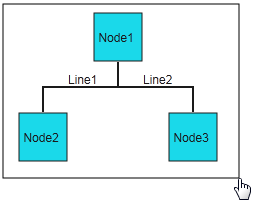
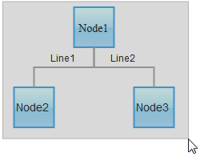
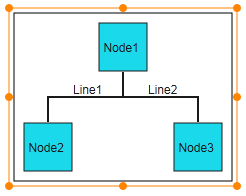
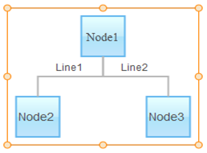
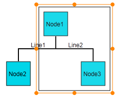
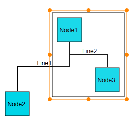
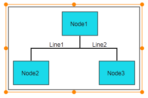
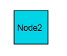

::: {style="DISPLAY: none"}
{#d2h_url_template}{#d2h_package_url style="WIDTH: 0px; DISPLAY: none; HEIGHT: 0px"}
:::

::::: {#nsbanner .d2h_main_nsbanner style="BORDER-BOTTOM: #999999 1px solid; POSITION: relative; PADDING-BOTTOM: 0px; BACKGROUND-COLOR: transparent; PADDING-LEFT: 0px; PADDING-RIGHT: 0px; DISPLAY: none; BORDER-TOP: #999999 1px solid; PADDING-TOP: 0px; LEFT: 0px"}
:::: {#TitleRow .d2h_main_titlerow style="PADDING-BOTTOM: 4px; BACKGROUND-COLOR: transparent; PADDING-LEFT: 22px; WIDTH: 100%; PADDING-RIGHT: 10px; DISPLAY: none; PADDING-TOP: 4px"}
::: {#ienav .d2h_main_ienav style="DISPLAY: none"}
{#D2HPrevious .D2HPreviousEnabled}  {#D2HNext .D2HNextEnabled}
:::
::::
:::::

:::: {#nstext .d2h_main_nstext style="PADDING-BOTTOM: 10px; BACKGROUND-COLOR: transparent; PADDING-LEFT: 22px; PADDING-RIGHT: 10px; HEIGHT: 100%; OVERFLOW: auto; PADDING-TOP: 5px" hasuserbackground="true" valign="bottom"}
::: {#d2h_breadcrumbs .d2h_breadcrumbs}
[Essential Studio User Guide Documentation](ms-xhelp:///?Id=12457748-09e3-4d74-a240-8e049cedf030){.d2h_breadcrumbsNormal}[ \> ]{.d2h_breadcrumbsLinkSeparator}[User Interface Edition](ms-xhelp:///?Id=c29296b7-531c-413b-a0ec-488ca1f7f669){.d2h_breadcrumbsNormal}[ \> ]{.d2h_breadcrumbsLinkSeparator}[Essential ASP.NET MVC](ms-xhelp:///?Id=4b14e7d1-65c4-4f67-b1aa-2c37709905a5){.d2h_breadcrumbsNormal}[ \> ]{.d2h_breadcrumbsLinkSeparator}[Essential Diagram]{.d2h_breadcrumbsContentsOnly}[ \> ]{.d2h_breadcrumbsLinkSeparator}[Concepts and Features](ms-xhelp:///?Id=04839cdf-94fc-4d24-9f6b-119fdbd7bbfb){.d2h_breadcrumbsNormal}
:::

## Multiple Selection {#multiple-selection style="tab-stops: 0pt"}

This feature allows you to select more than one node, connector, or nodes and connectors at one time using the multiple selector based on the region in the diagram page that you select.

This feature makes it convenient for you to drag, resize, and delete multiple selected nodes and connectors at the same time. 

 

Appearance and Structure

The following figures illustrate the function of the multiple selection feature in Essential Diagram for ASP.NET MVC.

 

 

{border="0"}              {border="0"}

Figure 83: Nodes and Connectors before Selection                    Figure 84: Nodes and Connectors before Selection

 (In Canvas Mode)                                                                      (In SVG Mode)

{border="0"}                     {border="0"}

        Figure 85: Nodes and Connectors after                                    Figure 86: Nodes and Connectors after       

             Multiple Selection (in Canvas Mode)                                                   Multiple Selection (in SVG Mode)

 

 

{border="0"}

Figure 87: Nodes and Connectors before Dragging (on Multiple Selection)

 

 

{border="0"}

 

Figure 88: Nodes and Connectors after Multiple Selection and Dragging

 

{border="0"}

Figure 89: Nodes and Connectors before Resizing (on Multiple Selection)

{border="0"}

Figure 90: Nodes and Connectors after Multiple Selection and Dragging

 

{border="0"}

Figure 91: Nodes and Connectors before Deletion (on Multiple Selection)

 

 

{border="0"}

Figure 92: Node and Connectors after Multiple Selection and Deletion

 

Where do I find the installed samples?

[To view the samples:]{style="BACKGROUND: white"}

1.   [Open the Essential Diagram sample browser from the dashboard. (Refer to the ]{style="BACKGROUND: white"}**[Samples and Locations]{style="BACKGROUND: white"}**[ section).]{style="BACKGROUND: white"}

2.   [Go to the **Getting Started** tab and click **Flat Diagram**.]{style="BACKGROUND: white"}

 

Properties

  --------------------- ----------------------------------------------------------------------------------------------------------- --------------------- ---------------------- --------------
  Property              Description                                                                                                 Type of Property      Value it Accepts       Dependencies
  AllowMultipleSelect   Gets or sets a value indicating whether multiple nodes can be selected. The default value is set to true.   Dependency property   Boolean (true/false)   No
  --------------------- ----------------------------------------------------------------------------------------------------------- --------------------- ---------------------- --------------

 

More:

[ ]{#related-topics}

[{border="0" align="absMiddle"}Enabling Multiple Selection in Diagram MVC](ms-xhelp:///?Id=8639afd6-4c9b-42db-87a6-ad365c02c29e){style="TEXT-DECORATION: none"}
::::
