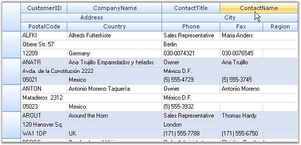

::: {style="DISPLAY: none"}
{#d2h_url_template}{#d2h_package_url style="WIDTH: 0px; DISPLAY: none; HEIGHT: 0px"}
:::

:::: {.d2h_secondary_topic style="PADDING-BOTTOM: 10pt; MARGIN: 0pt; PADDING-LEFT: 0pt; PADDING-RIGHT: 0pt; PADDING-TOP: 0pt"}
#### Multi Row Record {#multi-row-record style="tab-stops: 0pt"}

[]{style="FONT-FAMILY: 'Trebuchet MS','sans-serif'; COLOR: #15428b; FONT-SIZE: 9pt"} 

The Grid Data Bound Grid has support for displaying a single record in multiple rows.

[]{style="FONT-FAMILY: 'Trebuchet MS','sans-serif'; COLOR: #15428b; FONT-SIZE: 9pt"} 

{border="0"}

[]{style="FONT-FAMILY: 'Trebuchet MS','sans-serif'; COLOR: #15428b; FONT-SIZE: 9pt"} 

*[Figure ]{style="FONT-SIZE: 9pt"}[220]{style="FONT-SIZE: 9pt"}[: Multi Row Record]{style="FONT-SIZE: 9pt"}*

***[]{style="FONT-FAMILY: 'Trebuchet MS','sans-serif'; COLOR: #15428b; FONT-SIZE: 9pt"}*** 

::: {style="BORDER-BOTTOM: windowtext 1pt solid; BORDER-LEFT: medium none; PADDING-BOTTOM: 1pt; MARGIN-TOP: 9pt; PADDING-LEFT: 0pt; PADDING-RIGHT: 0pt; MARGIN-BOTTOM: 9pt; BORDER-TOP: windowtext 1pt solid; BORDER-RIGHT: medium none; PADDING-TOP: 1pt"}
{border="0"}Note: For more details, refer the following browser sample:
:::

[]{style="FONT-FAMILY: 'Trebuchet MS','sans-serif'; COLOR: #15428b; FONT-SIZE: 9pt"} 

***\<Install Location\>\\Syncfusion\\EssentialStudio\\\[Version Number\]\\Windows\\Grid.Windows\\Samples\\2.0\\Data Bound\\Multi Row Record Demo***

 

Example

 

Using the following code example, you can switch the display of the records from the NorthWind\'s Customers table between displaying a single row per record and multiple rows per record. The Binder.LayoutColumns function can be used to break the records into multiple rows. The record can be broken by inserting a \".\" in the LayoutColumns() function of the GridHierarchyLevel class.

[]{style="FONT-FAMILY: 'Trebuchet MS','sans-serif'; COLOR: #15428b; FONT-SIZE: 9pt"} 

+----------------------------------------------------------------------------------------------------------------------------------------------------------------------------------------------------------------------------------------------------------------------------------------------------------------------------------------------------------------------------------------------------------------------------------------------------------------------------------------------------------------------------------------------------------------------------------------------------------------------------------------------------+
| **[\[C#\]]{style="FONT-FAMILY: 'Courier New'; COLOR: black"}**                                                                                                                                                                                                                                                                                                                                                                                                                                                                                                                                                                                     |
|                                                                                                                                                                                                                                                                                                                                                                                                                                                                                                                                                                                                                                                    |
| []{style="FONT-FAMILY: 'Courier New'; COLOR: black"}                                                                                                                                                                                                                                                                                                                                                                                                                                                                                                                                                                                               |
|                                                                                                                                                                                                                                                                                                                                                                                                                                                                                                                                                                                                                                                    |
| [GridModel]{style="FONT-FAMILY: 'Courier New'; COLOR: #2b91af"}[ gridModel = gridDataBoundGrid1.Model;]{style="FONT-FAMILY: 'Courier New'"}                                                                                                                                                                                                                                                                                                                                                                                                                                                                                                        |
|                                                                                                                                                                                                                                                                                                                                                                                                                                                                                                                                                                                                                                                    |
| [GridModelDataBinder]{style="FONT-FAMILY: 'Courier New'; COLOR: #2b91af"}[ binder = gridDataBoundGrid1.Binder;]{style="FONT-FAMILY: 'Courier New'"}                                                                                                                                                                                                                                                                                                                                                                                                                                                                                                |
|                                                                                                                                                                                                                                                                                                                                                                                                                                                                                                                                                                                                                                                    |
| []{style="FONT-FAMILY: 'Courier New'"}                                                                                                                                                                                                                                                                                                                                                                                                                                                                                                                                                                                                             |
|                                                                                                                                                                                                                                                                                                                                                                                                                                                                                                                                                                                                                                                    |
| [// \".\" indicates a new row.]{style="FONT-FAMILY: 'Courier New'; COLOR: green"}                                                                                                                                                                                                                                                                                                                                                                                                                                                                                                                                                                  |
|                                                                                                                                                                                                                                                                                                                                                                                                                                                                                                                                                                                                                                                    |
| [binder.LayoutColumns([new]{style="COLOR: blue"} [string]{style="COLOR: blue"}\[\] {[\"CustomerID\"]{style="COLOR: #a31515"}, [\"CompanyName\"]{style="COLOR: #a31515"}, [\"ContactTitle\"]{style="COLOR: #a31515"}, [\"ContactName\"]{style="COLOR: #a31515"}, [\".\"]{style="COLOR: #a31515"}, [\"Address\"]{style="COLOR: #a31515"}, [\"City\"]{style="COLOR: #a31515"}, [\".\"]{style="COLOR: #a31515"}, [\"PostalCode\"]{style="COLOR: #a31515"}, [\"Country\"]{style="COLOR: #a31515"}, [\"Phone\"]{style="COLOR: #a31515"}, [\"Fax\"]{style="COLOR: #a31515"}, [\"Region\"]{style="COLOR: #a31515"}});]{style="FONT-FAMILY: 'Courier New'"} |
+----------------------------------------------------------------------------------------------------------------------------------------------------------------------------------------------------------------------------------------------------------------------------------------------------------------------------------------------------------------------------------------------------------------------------------------------------------------------------------------------------------------------------------------------------------------------------------------------------------------------------------------------------+

[]{style="FONT-FAMILY: 'Trebuchet MS','sans-serif'; COLOR: #15428b; FONT-SIZE: 9pt"} 

+-------------------------------------------------------------------------------------------------------------------------------------------------------------------------------------------------------------------------------------------------------------------------------------------------------------------------------------------------------------------------------------------------------------------------------------------------------------------------------------------+
| **[\[VB.NET\]]{style="FONT-FAMILY: 'Courier New'; COLOR: black"}**                                                                                                                                                                                                                                                                                                                                                                                                                        |
|                                                                                                                                                                                                                                                                                                                                                                                                                                                                                           |
| []{style="FONT-FAMILY: 'Courier New'; COLOR: black"}                                                                                                                                                                                                                                                                                                                                                                                                                                      |
|                                                                                                                                                                                                                                                                                                                                                                                                                                                                                           |
| [Dim]{style="FONT-FAMILY: 'Courier New'; COLOR: blue"}[ gridModel [As]{style="COLOR: blue"} GridModel = gridDataBoundGrid1.Model]{style="FONT-FAMILY: 'Courier New'"}                                                                                                                                                                                                                                                                                                                     |
|                                                                                                                                                                                                                                                                                                                                                                                                                                                                                           |
| [Dim]{style="FONT-FAMILY: 'Courier New'; COLOR: blue"}[ binder [As]{style="COLOR: blue"} GridModelDataBinder = gridDataBoundGrid1.Binder]{style="FONT-FAMILY: 'Courier New'"}                                                                                                                                                                                                                                                                                                             |
|                                                                                                                                                                                                                                                                                                                                                                                                                                                                                           |
| []{style="FONT-FAMILY: 'Courier New'"}                                                                                                                                                                                                                                                                                                                                                                                                                                                    |
|                                                                                                                                                                                                                                                                                                                                                                                                                                                                                           |
| [\' \".\" indicates a new row.]{style="FONT-FAMILY: 'Courier New'; COLOR: green"}                                                                                                                                                                                                                                                                                                                                                                                                         |
|                                                                                                                                                                                                                                                                                                                                                                                                                                                                                           |
| [binder.LayoutColumns([New]{style="COLOR: blue"} [String]{style="COLOR: blue"}() {[\"CustomerID\"]{style="COLOR: #a31515"}, [\"CompanyName\"]{style="COLOR: #a31515"}, [\"ContactTitle\"]{style="COLOR: #a31515"}, [\"ContactName\"]{style="COLOR: #a31515"}, [\".\"]{style="COLOR: #a31515"}, [\"Address\"]{style="COLOR: #a31515"}, [\"City\"]{style="COLOR: #a31515"}, [\".\"]{style="COLOR: #a31515"}, [\"PostalCode\"]{style="COLOR: #a31515"},]{style="FONT-FAMILY: 'Courier New'"} |
|                                                                                                                                                                                                                                                                                                                                                                                                                                                                                           |
| [\"Country\"]{style="FONT-FAMILY: 'Courier New'; COLOR: #a31515"}[, [\"Phone\"]{style="COLOR: #a31515"}, [\"Fax\"]{style="COLOR: #a31515"}, [\"Region\"]{style="COLOR: #a31515"}})]{style="FONT-FAMILY: 'Courier New'"}                                                                                                                                                                                                                                                                   |
+-------------------------------------------------------------------------------------------------------------------------------------------------------------------------------------------------------------------------------------------------------------------------------------------------------------------------------------------------------------------------------------------------------------------------------------------------------------------------------------------+

 

[]{#p383} 

 

[]{#related-topics}
::::
