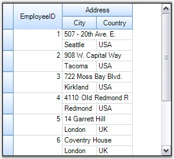
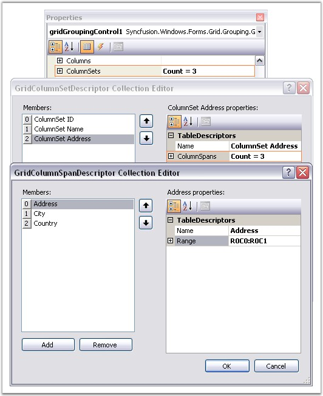

::: {style="DISPLAY: none"}
{#d2h_url_template}{#d2h_package_url style="WIDTH: 0px; DISPLAY: none; HEIGHT: 0px"}
:::

:::: {.d2h_secondary_topic style="PADDING-BOTTOM: 10pt; MARGIN: 0pt; PADDING-LEFT: 0pt; PADDING-RIGHT: 0pt; PADDING-TOP: 0pt"}
##### Multi Row Record {#multi-row-record style="tab-stops: 0pt"}

[]{style="FONT-FAMILY: 'Trebuchet MS','sans-serif'; COLOR: #15428b; FONT-SIZE: 9pt"} 

Grid Grouping control offers built-in support for MultiRowRecords. This feature allows the records to span across multiple rows and columns. It is achieved through the property **TableDescriptor.ColumnSets**. It allows you to modify the default alignment of the visible columns.

 

**The ColumnSets Collection**

 

ColumnSets acts as a superset of TableDescriptor.Columns collection. Once the ColumnSets are defined, the grouping grid will then loop through the collection and organize the data display accordingly. Each ColumnSet is defined by a **GridColumnSetDescriptor**. ColumnSets are managed by **GridColumnSetDescriptorCollection** that is returned by the TableDescriptor.ColumnSets property.

 

**Programmatically**

**[]{style="FONT-FAMILY: 'Verdana','sans-serif'; COLOR: #4a5c8c"}** 

Follow the steps below to span the records across multiple rows.

[]{style="FONT-FAMILY: 'Trebuchet MS','sans-serif'; COLOR: #15428b; FONT-SIZE: 9pt"} 

1.   Define a GridColumnSpanDescriptor for each column to be spanned across grid rows or columns. Specify the range that the column spans. Rows and Columns are zero-based.

[]{style="FONT-FAMILY: 'Trebuchet MS','sans-serif'; COLOR: #15428b; FONT-SIZE: 9pt"} 

+------------------------------------------------------------------------------------------------------------------------------------------------------------------------------------------------------------------------------------------------------+
| **[\[C#\]]{style="FONT-FAMILY: 'Courier New'; COLOR: black"}**                                                                                                                                                                                       |
|                                                                                                                                                                                                                                                      |
| []{style="FONT-FAMILY: 'Courier New'; COLOR: black"}                                                                                                                                                                                                 |
|                                                                                                                                                                                                                                                      |
| [GridColumnSpanDescriptor]{style="FONT-FAMILY: 'Courier New'; COLOR: #2b91af"}[ csd0 = [new]{style="COLOR: blue"} [GridColumnSpanDescriptor]{style="COLOR: #2b91af"}([\"EmployeeID\"]{style="COLOR: #a31515"});]{style="FONT-FAMILY: 'Courier New'"} |
|                                                                                                                                                                                                                                                      |
| [csd0.Range = [GridRangeInfo]{style="COLOR: #2b91af"}.Cells(0, 0, 1, 0);]{style="FONT-FAMILY: 'Courier New'"}                                                                                                                                        |
|                                                                                                                                                                                                                                                      |
| [GridColumnSpanDescriptor]{style="FONT-FAMILY: 'Courier New'; COLOR: #2b91af"}[ csd1 = [new]{style="COLOR: blue"} [GridColumnSpanDescriptor]{style="COLOR: #2b91af"}([\"Address\"]{style="COLOR: #a31515"});]{style="FONT-FAMILY: 'Courier New'"}    |
|                                                                                                                                                                                                                                                      |
| [csd1.Range = [GridRangeInfo]{style="COLOR: #2b91af"}.Cells(0, 1, 0, 2);]{style="FONT-FAMILY: 'Courier New'"}                                                                                                                                        |
|                                                                                                                                                                                                                                                      |
| [GridColumnSpanDescriptor]{style="FONT-FAMILY: 'Courier New'; COLOR: #2b91af"}[ csd2 = [new]{style="COLOR: blue"} [GridColumnSpanDescriptor]{style="COLOR: #2b91af"}([\"City\"]{style="COLOR: #a31515"});]{style="FONT-FAMILY: 'Courier New'"}       |
|                                                                                                                                                                                                                                                      |
| [csd2.Range = [GridRangeInfo]{style="COLOR: #2b91af"}.Cells(1, 1, 1, 1);]{style="FONT-FAMILY: 'Courier New'"}                                                                                                                                        |
|                                                                                                                                                                                                                                                      |
| [GridColumnSpanDescriptor]{style="FONT-FAMILY: 'Courier New'; COLOR: #2b91af"}[ csd3 = [new]{style="COLOR: blue"} [GridColumnSpanDescriptor]{style="COLOR: #2b91af"}([\"Country\"]{style="COLOR: #a31515"});]{style="FONT-FAMILY: 'Courier New'"}    |
|                                                                                                                                                                                                                                                      |
| [csd3.Range = [GridRangeInfo]{style="COLOR: #2b91af"}.Cells(1, 2, 1, 2);]{style="FONT-FAMILY: 'Courier New'"}                                                                                                                                        |
+------------------------------------------------------------------------------------------------------------------------------------------------------------------------------------------------------------------------------------------------------+

[]{style="FONT-FAMILY: 'Trebuchet MS','sans-serif'; COLOR: #15428b; FONT-SIZE: 9pt"} 

+------------------------------------------------------------------------------------------------------------------------------------------------------------------------------------------------------------------------------------------------------+
| **[\[VB.NET\]]{style="FONT-FAMILY: 'Courier New'; COLOR: black"}**                                                                                                                                                                                   |
|                                                                                                                                                                                                                                                      |
| []{style="FONT-FAMILY: 'Courier New'; COLOR: black"}                                                                                                                                                                                                 |
|                                                                                                                                                                                                                                                      |
| [Dim]{style="FONT-FAMILY: 'Courier New'; COLOR: blue"}[ csd0 [As]{style="COLOR: blue"} GridColumnSpanDescriptor = [New]{style="COLOR: blue"} GridColumnSpanDescriptor([\"EmployeeID\"]{style="COLOR: #a31515"})]{style="FONT-FAMILY: 'Courier New'"} |
|                                                                                                                                                                                                                                                      |
| [csd0.Range = GridRangeInfo.Cells(0, 0, 1, 0)]{style="FONT-FAMILY: 'Courier New'"}                                                                                                                                                                   |
|                                                                                                                                                                                                                                                      |
| [Dim]{style="FONT-FAMILY: 'Courier New'; COLOR: blue"}[ csd1 [As]{style="COLOR: blue"} GridColumnSpanDescriptor = [New]{style="COLOR: blue"} GridColumnSpanDescriptor([\"Address\"]{style="COLOR: #a31515"})]{style="FONT-FAMILY: 'Courier New'"}    |
|                                                                                                                                                                                                                                                      |
| [csd1.Range = GridRangeInfo.Cells(0, 1, 0, 2)]{style="FONT-FAMILY: 'Courier New'"}                                                                                                                                                                   |
|                                                                                                                                                                                                                                                      |
| [Dim]{style="FONT-FAMILY: 'Courier New'; COLOR: blue"}[ csd2 [As]{style="COLOR: blue"} GridColumnSpanDescriptor = [New]{style="COLOR: blue"} GridColumnSpanDescriptor([\"City\"]{style="COLOR: #a31515"})]{style="FONT-FAMILY: 'Courier New'"}       |
|                                                                                                                                                                                                                                                      |
| [csd2.Range = GridRangeInfo.Cells(1, 1, 1, 1)]{style="FONT-FAMILY: 'Courier New'"}                                                                                                                                                                   |
|                                                                                                                                                                                                                                                      |
| [Dim]{style="FONT-FAMILY: 'Courier New'; COLOR: blue"}[ csd3 [As]{style="COLOR: blue"} GridColumnSpanDescriptor = [New]{style="COLOR: blue"} GridColumnSpanDescriptor([\"Country\"]{style="COLOR: #a31515"})]{style="FONT-FAMILY: 'Courier New'"}    |
|                                                                                                                                                                                                                                                      |
| [csd3.Range = GridRangeInfo.Cells(1, 2, 1, 2)]{style="FONT-FAMILY: 'Courier New'"}                                                                                                                                                                   |
+------------------------------------------------------------------------------------------------------------------------------------------------------------------------------------------------------------------------------------------------------+

[]{style="FONT-FAMILY: 'Trebuchet MS','sans-serif'; COLOR: #15428b; FONT-SIZE: 9pt"} 

2.   Create a GridColumnSetDescriptor whose ColumnSpans property stores the information about the columns that need to be spanned. Hence you need to initialize the ColumnSpans property with the Columns (the ColumnSpanDescriptors of the desired columns) you want to spread.

[]{style="FONT-FAMILY: 'Trebuchet MS','sans-serif'; COLOR: #15428b; FONT-SIZE: 9pt"} 

+-----------------------------------------------------------------------------------------------------------------------------------------------------------------------------------------------------------+
| **[\[C#\]]{style="FONT-FAMILY: 'Courier New'; COLOR: black"}**                                                                                                                                            |
|                                                                                                                                                                                                           |
| []{style="FONT-FAMILY: 'Courier New'; COLOR: black"}                                                                                                                                                      |
|                                                                                                                                                                                                           |
| [GridColumnSetDescriptor]{style="FONT-FAMILY: 'Courier New'; COLOR: #2b91af"}[ csd = [new]{style="COLOR: blue"} [GridColumnSetDescriptor]{style="COLOR: #2b91af"}();]{style="FONT-FAMILY: 'Courier New'"} |
|                                                                                                                                                                                                           |
| [csd.ColumnSpans.Add(csd0);]{style="FONT-FAMILY: 'Courier New'"}                                                                                                                                          |
|                                                                                                                                                                                                           |
| [csd.ColumnSpans.Add(csd1);]{style="FONT-FAMILY: 'Courier New'"}                                                                                                                                          |
|                                                                                                                                                                                                           |
| [csd.ColumnSpans.Add(csd2);]{style="FONT-FAMILY: 'Courier New'"}                                                                                                                                          |
|                                                                                                                                                                                                           |
| [csd.ColumnSpans.Add(csd3);]{style="FONT-FAMILY: 'Courier New'"}                                                                                                                                          |
+-----------------------------------------------------------------------------------------------------------------------------------------------------------------------------------------------------------+

[]{style="FONT-FAMILY: 'Trebuchet MS','sans-serif'; COLOR: #15428b; FONT-SIZE: 9pt"} 

+-----------------------------------------------------------------------------------------------------------------------------------------------------------------------------------------------------------+
| **[\[VB.NET\]]{style="FONT-FAMILY: 'Courier New'; COLOR: black"}**                                                                                                                                        |
|                                                                                                                                                                                                           |
| []{style="FONT-FAMILY: 'Courier New'; COLOR: black"}                                                                                                                                                      |
|                                                                                                                                                                                                           |
| [Dim]{style="FONT-FAMILY: 'Courier New'; COLOR: blue"}[ csd [As]{style="COLOR: blue"} GridColumnSetDescriptor = [New]{style="COLOR: blue"} GridColumnSetDescriptor()]{style="FONT-FAMILY: 'Courier New'"} |
|                                                                                                                                                                                                           |
| [csd.ColumnSpans.Add(csd0)]{style="FONT-FAMILY: 'Courier New'"}                                                                                                                                           |
|                                                                                                                                                                                                           |
| [csd.ColumnSpans.Add(csd1)]{style="FONT-FAMILY: 'Courier New'"}                                                                                                                                           |
|                                                                                                                                                                                                           |
| [csd.ColumnSpans.Add(csd2)]{style="FONT-FAMILY: 'Courier New'"}                                                                                                                                           |
|                                                                                                                                                                                                           |
| [csd.ColumnSpans.Add(csd3)]{style="FONT-FAMILY: 'Courier New'"}                                                                                                                                           |
+-----------------------------------------------------------------------------------------------------------------------------------------------------------------------------------------------------------+

[]{style="FONT-FAMILY: 'Trebuchet MS','sans-serif'; COLOR: #15428b; FONT-SIZE: 9pt"} 

3.   Finally bind this ColumnSet to the grid by adding the above created GridColumnSetDescriptor into the TableDescriptor.ColumnSets property.

[]{style="FONT-FAMILY: 'Trebuchet MS','sans-serif'; COLOR: #15428b; FONT-SIZE: 9pt"} 

+---------------------------------------------------------------------------------------------------------------------------------------------------------+
| **[\[C#\]]{style="FONT-FAMILY: 'Courier New'; COLOR: black"}**                                                                                          |
|                                                                                                                                                         |
| []{style="FONT-FAMILY: 'Courier New'; COLOR: black"}                                                                                                    |
|                                                                                                                                                         |
| [this]{style="FONT-FAMILY: 'Courier New'; COLOR: blue"}[.gridGroupingControl1.TableDescriptor.ColumnSets.Add(csd);]{style="FONT-FAMILY: 'Courier New'"} |
+---------------------------------------------------------------------------------------------------------------------------------------------------------+

[]{style="FONT-FAMILY: 'Trebuchet MS','sans-serif'; COLOR: #15428b; FONT-SIZE: 9pt"} 

+------------------------------------------------------------------------------------------------------------------------------------------------------+
| **[\[VB.NET\]]{style="FONT-FAMILY: 'Courier New'; COLOR: black"}**                                                                                   |
|                                                                                                                                                      |
| []{style="FONT-FAMILY: 'Courier New'; COLOR: black"}                                                                                                 |
|                                                                                                                                                      |
| [Me]{style="FONT-FAMILY: 'Courier New'; COLOR: blue"}[.gridGroupingControl1.TableDescriptor.ColumnSets.Add(csd)]{style="FONT-FAMILY: 'Courier New'"} |
+------------------------------------------------------------------------------------------------------------------------------------------------------+

[]{style="FONT-FAMILY: 'Trebuchet MS','sans-serif'; COLOR: #15428b; FONT-SIZE: 9pt"} 

4.   Here is a sample output.

**[]{style="COLOR: #4a5c8c; FONT-SIZE: 9pt"}** 

{border="0"}

[]{style="FONT-FAMILY: 'Trebuchet MS','sans-serif'; COLOR: #15428b; FONT-SIZE: 9pt"} 

*[Figure ]{style="FONT-SIZE: 9pt"}[348]{style="FONT-SIZE: 9pt"}[: Spanning Records across Multiple Rows]{style="FONT-SIZE: 9pt"}*

**[]{style="COLOR: #4a5c8c; FONT-SIZE: 9pt"}** 

Through Designer

[]{style="FONT-FAMILY: 'Verdana','sans-serif'; COLOR: #4a5c8c"} 

To create ColumnSets that defines the ColumnSpans for a grid, select the TableDescriptor.ColumnSets property in the property window. This will open the GridColumnSetDescriptor Collection Editor that will let you specify the columns to span and the range, for each of the columns.

[]{style="FONT-SIZE: 8pt"} 

{border="0"}

***[]{style="FONT-FAMILY: 'Trebuchet MS','sans-serif'; COLOR: #15428b; FONT-SIZE: 9pt"}*** 

*[Figure ]{style="FONT-SIZE: 9pt"}[349]{style="FONT-SIZE: 9pt"}[: Creating Column Sets to Span Columns in the Grid]{style="FONT-SIZE: 9pt"}*

[]{style="FONT-FAMILY: 'Trebuchet MS','sans-serif'; COLOR: #15428b; FONT-SIZE: 9pt"} 

::: {style="BORDER-BOTTOM: windowtext 1pt solid; BORDER-LEFT: medium none; PADDING-BOTTOM: 1pt; MARGIN-TOP: 9pt; PADDING-LEFT: 0pt; PADDING-RIGHT: 0pt; MARGIN-BOTTOM: 9pt; BORDER-TOP: windowtext 1pt solid; BORDER-RIGHT: medium none; PADDING-TOP: 1pt"}
{border="0"}Note: For more details, refer the following browser sample:

 

\<Install Location\>\\Syncfusion\\EssentialStudio\\\[Version Number\]\\Windows\\Grid.Grouping.Windows\\Samples\\2.0\\Grouping Grid Layout\\Employee View Demo
:::

 

[]{#p460} 

 

[]{#related-topics}
::::
