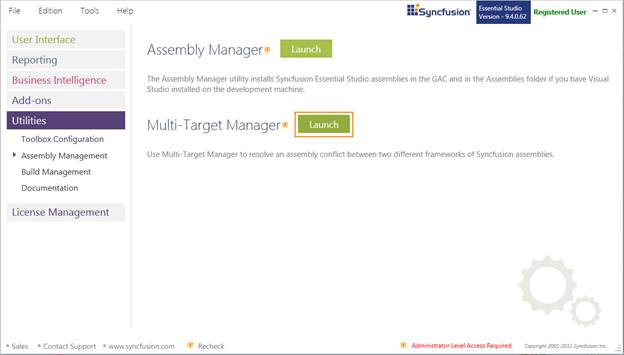
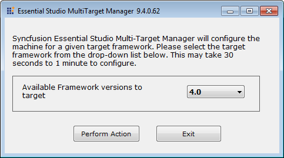
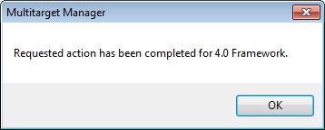

::: {style="DISPLAY: none"}
{#d2h_url_template}{#d2h_package_url style="WIDTH: 0px; DISPLAY: none; HEIGHT: 0px"}
:::

::::: {#nsbanner .d2h_main_nsbanner style="BORDER-BOTTOM: #999999 1px solid; POSITION: relative; PADDING-BOTTOM: 0px; BACKGROUND-COLOR: transparent; PADDING-LEFT: 0px; PADDING-RIGHT: 0px; DISPLAY: none; BORDER-TOP: #999999 1px solid; PADDING-TOP: 0px; LEFT: 0px"}
:::: {#TitleRow .d2h_main_titlerow style="PADDING-BOTTOM: 4px; BACKGROUND-COLOR: transparent; PADDING-LEFT: 22px; WIDTH: 100%; PADDING-RIGHT: 10px; DISPLAY: none; PADDING-TOP: 4px"}
::: {#ienav .d2h_main_ienav style="DISPLAY: none"}
{#D2HPrevious .D2HPreviousEnabled}  {#D2HNext .D2HNextEnabled}
:::
::::
:::::

::::::: {#nstext .d2h_main_nstext style="PADDING-BOTTOM: 10px; BACKGROUND-COLOR: transparent; PADDING-LEFT: 22px; PADDING-RIGHT: 10px; HEIGHT: 100%; OVERFLOW: auto; PADDING-TOP: 5px" hasuserbackground="true" valign="bottom"}
::: {#d2h_breadcrumbs .d2h_breadcrumbs}
[Essential Studio User Guide Documentation](ms-xhelp:///?Id=12457748-09e3-4d74-a240-8e049cedf030){.d2h_breadcrumbsNormal}[ \> ]{.d2h_breadcrumbsLinkSeparator}[Essential Common](ms-xhelp:///?Id=2bfe10b6-fac1-4f91-a173-04db314f10c3){.d2h_breadcrumbsNormal}[ \> ]{.d2h_breadcrumbsLinkSeparator}[Dashboard Utilities](ms-xhelp:///?Id=2f121e36-ec61-4721-87d7-ef6b9a6b8c4c){.d2h_breadcrumbsNormal}[ \> ]{.d2h_breadcrumbsLinkSeparator}[Assembly Management](ms-xhelp:///?Id=1d9c1c0b-9932-4f6f-bd89-c4aeafccf534){.d2h_breadcrumbsNormal}
:::

### Multi-Target Manager {#multi-target-manager style="tab-stops: 0pt"}

MultiTarget Manager helps in managing multiple .NET frameworks in your Visual Studio 2008 project i.e., \[Switching between multiple framework\].

::: {style="BORDER-BOTTOM: windowtext 1pt solid; BORDER-LEFT: medium none; PADDING-BOTTOM: 1pt; MARGIN-TOP: 9pt; PADDING-LEFT: 0pt; PADDING-RIGHT: 0pt; MARGIN-BOTTOM: 9pt; BORDER-TOP: windowtext 1pt solid; BORDER-RIGHT: medium none; PADDING-TOP: 1pt"}
      {border="0"}Note: This is not essential for VS 2010 because Common Language Runtime (CLR) is differs for both 3.5 and 4.0 frameworks. VS 2010 selects the required .NET framework assembly for the corresponding projects. 3.5 and 4.0 are the only frameworks configured; MultiTarget Manager utility allows you to work on Framework 2.0 with VS 2010.
:::

 

When to Use MultiTarget Manager?

When Essential Studio is installed in a machine comprising both 2.0 and 3.5 frameworks, then by default target framework set to 3.5 and the following registry entry AssemblyFoldersEx is also set to 3.5 assemblies. You can use the **Multi-Target Manager** to change the target framework to 2.0.

 

HKLM\\Software\\Microsoft\\.NetFramework\\v2.0.50727\\AssemblyFoldersEx\\Syncfusion Essential Studio 3.5

 

 

Launching MultiTarget Manager

[]{style="FONT-FAMILY: 'Trebuchet MS','sans-serif'; COLOR: #15428b; FONT-SIZE: 9pt"} 

1.   Open **Syncfusion Dashboard**.

2.   Click **Utilities \> Assembly Management**.

3.   Click **Launch** button for **Multi-Target Manager**.

 

{border="0"}

Figure 123: Assembly Management

**** 

::: {style="BORDER-BOTTOM: windowtext 1pt solid; BORDER-LEFT: medium none; PADDING-BOTTOM: 1pt; MARGIN-TOP: 9pt; PADDING-LEFT: 0pt; PADDING-RIGHT: 0pt; MARGIN-BOTTOM: 9pt; BORDER-TOP: windowtext 1pt solid; BORDER-RIGHT: medium none; PADDING-TOP: 1pt"}
{border="0"}Note: You can also open the Multi-Target Manager from the following location:

{Installed location}\\Syncfusion\\Essential Studio\\x.x.x.x\\ Utilities\\MultiTargetManager\\ MultiTargetManager.exe
:::

[]{style="FONT-FAMILY: 'Trebuchet MS','sans-serif'; COLOR: #15428b; FONT-SIZE: 9pt"} 

4.   The **Essential Studio MultiTarget Manager x.x.x.x** dialog box opens.

 

{border="0"}

Figure 124: Essential Studio MultiTarget Manager x.x.x.x Dialog[]{style="FONT-FAMILY: 'Trebuchet MS','sans-serif'; COLOR: #15428b"}

[]{style="FONT-FAMILY: 'Trebuchet MS','sans-serif'; COLOR: #15428b; FONT-SIZE: 9pt"} 

5.   Select the required version from the drop-down. The **Multitarget Manager** dialog will open.

[]{style="FONT-FAMILY: 'Trebuchet MS','sans-serif'; COLOR: #15428b; FONT-SIZE: 9pt"} 

 

***{border="0"}***

Figure 125: Multitarget Manager

***[]{style="FONT-FAMILY: 'Trebuchet MS','sans-serif'; COLOR: #15428b; FONT-SIZE: 9pt"}*** 

[]{style="FONT-FAMILY: 'Trebuchet MS','sans-serif'; COLOR: #15428b; FONT-SIZE: 9pt"} 

6.   Click **OK**.

7.   Open an application.

8.   Refresh the application before build.

[]{style="FONT-FAMILY: 'Trebuchet MS','sans-serif'; COLOR: #15428b; FONT-SIZE: 9pt"} 

::: {style="BORDER-BOTTOM: windowtext 1pt solid; BORDER-LEFT: medium none; PADDING-BOTTOM: 1pt; MARGIN-TOP: 9pt; PADDING-LEFT: 0pt; PADDING-RIGHT: 0pt; MARGIN-BOTTOM: 9pt; BORDER-TOP: windowtext 1pt solid; BORDER-RIGHT: medium none; PADDING-TOP: 1pt"}
{border="0"}Note: The target value and the registry value will be changed to the selected framework version.

 
:::

[]{#related-topics}
:::::::
