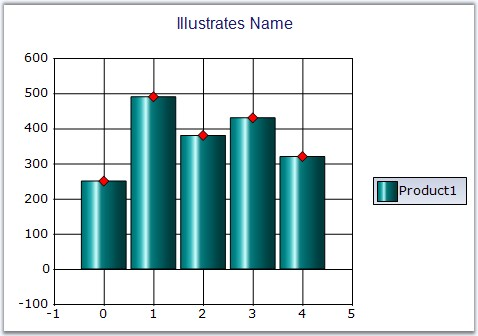

::: {style="DISPLAY: none"}
{#d2h_url_template}{#d2h_package_url style="WIDTH: 0px; DISPLAY: none; HEIGHT: 0px"}
:::

:::: {.d2h_secondary_topic style="PADDING-BOTTOM: 10pt; MARGIN: 0pt; PADDING-LEFT: 0pt; PADDING-RIGHT: 0pt; PADDING-TOP: 0pt"}
#### Name {#name style="tab-stops: 0pt"}

 

Specifies the name of the Series. This name can also be used to retrieve the series by name from the series collection.

 

::: {align="center"}
+-------------------------------------+-------------------------------------+
|                                                                           |
|                                                                           |
| **Details**                                                               |
+-------------------------------------+-------------------------------------+
| **Possible Values**                 | Any user defined string             |
+-------------------------------------+-------------------------------------+
| **Default Value    **               | **Null**                            |
+-------------------------------------+-------------------------------------+
| **2D / 3D Limitations**             | No                                  |
+-------------------------------------+-------------------------------------+
| **Applies to Chart Element**        | Any Series points                   |
+-------------------------------------+-------------------------------------+
| **Applies to Chart Types**          | All chart types                     |
+-------------------------------------+-------------------------------------+
:::

 

Here is the code snippet using **Name** in Column Chart.

 

+-----------------------------------------------------------------------------------------------------------------------------------------------------------------------------------------------------------------------------------+
| **[\[C#\]]{style="FONT-FAMILY: 'Courier New'; COLOR: black"}**                                                                                                                                                                    |
|                                                                                                                                                                                                                                   |
| **[]{style="FONT-FAMILY: 'Courier New'; COLOR: black"}**                                                                                                                                                                          |
|                                                                                                                                                                                                                                   |
| [//This Code Snippet gives the name of the series as Product1]{style="FONT-FAMILY: 'Courier New'; COLOR: green"}                                                                                                                  |
|                                                                                                                                                                                                                                   |
| [ChartSeries]{style="FONT-FAMILY: 'Courier New'; COLOR: teal"}[ s1 = [this]{style="COLOR: blue"}.chartControl1.Model.NewSeries(); ]{style="FONT-FAMILY: 'Courier New'"}                                                           |
|                                                                                                                                                                                                                                   |
| [s1.Type = Syncfusion.Windows.Forms.Chart.[ChartSeriesType]{style="COLOR: teal"}.Column;          ]{style="FONT-FAMILY: 'Courier New'"}                                                                                           |
|                                                                                                                                                                                                                                   |
| [s1.Name=\"[Product1]{style="COLOR: maroon"}\";]{style="FONT-FAMILY: 'Courier New'"}                                                                                                                                              |
|                                                                                                                                                                                                                                   |
| [// Points to be added]{style="FONT-FAMILY: 'Courier New'; COLOR: green"}                                                                                                                                                         |
|                                                                                                                                                                                                                                   |
| [this]{style="FONT-FAMILY: 'Courier New'; COLOR: blue"}[.chartControl1.Series.Add(s1);]{style="FONT-FAMILY: 'Courier New'"}                                                                                                       |
|                                                                                                                                                                                                                                   |
| [  ]{style="FONT-FAMILY: 'Courier New'"}                                                                                                                                                                                          |
|                                                                                                                                                                                                                                   |
| [//Series retrieved using Name]{style="FONT-FAMILY: 'Courier New'; COLOR: green"}                                                                                                                                                 |
|                                                                                                                                                                                                                                   |
| [this]{style="FONT-FAMILY: 'Courier New'; COLOR: blue"}[.chartControl1.Series\[[\"Product1\"]{style="COLOR: maroon"}\].Style.Symbol.Shape = [ChartSymbolShape.Diamond]{style="COLOR: teal"};]{style="FONT-FAMILY: 'Courier New'"} |
|                                                                                                                                                                                                                                   |
| [this]{style="FONT-FAMILY: 'Courier New'; COLOR: blue"}[.chartControl1.Series\[[\"Product1\"]{style="COLOR: maroon"}\].Style.Symbol.Color = [Color]{style="COLOR: teal"}.Red;]{style="FONT-FAMILY: 'Courier New'"}                |
+-----------------------------------------------------------------------------------------------------------------------------------------------------------------------------------------------------------------------------------+

 

+--------------------------------------------------------------------------------------------------------------------------------------------------------------------------------------------------------------------------------------------------------------------------------------------------------------------------+
| **[\[VB.NET\]]{style="FONT-FAMILY: 'Courier New'; COLOR: black"}**                                                                                                                                                                                                                                                       |
|                                                                                                                                                                                                                                                                                                                          |
| **[]{style="FONT-FAMILY: 'Courier New'; COLOR: black"}**                                                                                                                                                                                                                                                                 |
|                                                                                                                                                                                                                                                                                                                          |
| [\' This Code Snippet gives the name of the series as Product]{style="FONT-FAMILY: 'Courier New'; COLOR: green"}                                                                                                                                                                                                         |
|                                                                                                                                                                                                                                                                                                                          |
| [s1 ]{style="FONT-FAMILY: 'Courier New'; COLOR: black"}[As]{style="FONT-FAMILY: 'Courier New'; COLOR: blue"}[ ChartSeries =]{style="FONT-FAMILY: 'Courier New'; COLOR: black"}[ Me]{style="FONT-FAMILY: 'Courier New'; COLOR: blue"}[.chartControl1.Model.NewSeries()]{style="FONT-FAMILY: 'Courier New'; COLOR: black"} |
|                                                                                                                                                                                                                                                                                                                          |
| [s1.Type = Syncfusion.Windows.Forms.Chart.]{style="FONT-FAMILY: 'Courier New'; COLOR: black"}[ChartSeriesType]{style="FONT-FAMILY: 'Courier New'; COLOR: teal"}[.Column]{style="FONT-FAMILY: 'Courier New'; COLOR: black"}                                                                                               |
|                                                                                                                                                                                                                                                                                                                          |
| [s1.Name=\"]{style="FONT-FAMILY: 'Courier New'; COLOR: black"}[Product1]{style="FONT-FAMILY: 'Courier New'; COLOR: maroon"}[\"]{style="FONT-FAMILY: 'Courier New'; COLOR: black"}                                                                                                                                        |
|                                                                                                                                                                                                                                                                                                                          |
| [\' Points to be added]{style="FONT-FAMILY: 'Courier New'; COLOR: green"}                                                                                                                                                                                                                                                |
|                                                                                                                                                                                                                                                                                                                          |
| [Me]{style="FONT-FAMILY: 'Courier New'; COLOR: blue"}[.chartControl1.Series.Add(s1) ]{style="FONT-FAMILY: 'Courier New'"}                                                                                                                                                                                                |
|                                                                                                                                                                                                                                                                                                                          |
| [  ]{style="FONT-FAMILY: 'Courier New'"}                                                                                                                                                                                                                                                                                 |
|                                                                                                                                                                                                                                                                                                                          |
| [\'Series retrieved using Name]{style="FONT-FAMILY: 'Courier New'; COLOR: green"}                                                                                                                                                                                                                                        |
|                                                                                                                                                                                                                                                                                                                          |
| [Me]{style="FONT-FAMILY: 'Courier New'; COLOR: blue"}[.chartControl1.Series\[[\"Product1\"]{style="COLOR: maroon"}\].Style.Symbol.Shape = [ChartSymbolShape.Diamond ]{style="COLOR: teal"}]{style="FONT-FAMILY: 'Courier New'"}                                                                                          |
|                                                                                                                                                                                                                                                                                                                          |
| [Me]{style="FONT-FAMILY: 'Courier New'; COLOR: blue"}[.chartControl1.Series\[[\"Product1\"]{style="COLOR: maroon"}\].Style.Symbol.Color = [Color]{style="COLOR: teal"}.Red ]{style="FONT-FAMILY: 'Courier New'"}                                                                                                         |
+--------------------------------------------------------------------------------------------------------------------------------------------------------------------------------------------------------------------------------------------------------------------------------------------------------------------------+

**[]{style="FONT-FAMILY: 'Courier New'; COLOR: black"}** 

{border="0"}

 

Figure 162: Chart with Legend for the Series

**** 

See Also

 

[Chart Types]{.UGHyperlink}[]{.UGHyperlink}

 

[]{#p124} 

[]{#related-topics}
::::
