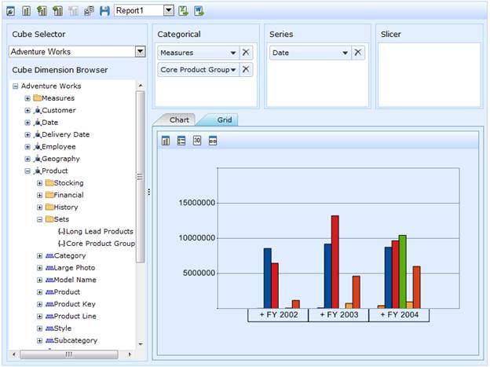

::: {style="DISPLAY: none"}
{#d2h_url_template}{#d2h_package_url style="WIDTH: 0px; DISPLAY: none; HEIGHT: 0px"}
:::

::::: {#nsbanner .d2h_main_nsbanner style="BORDER-BOTTOM: #999999 1px solid; POSITION: relative; PADDING-BOTTOM: 0px; BACKGROUND-COLOR: transparent; PADDING-LEFT: 0px; PADDING-RIGHT: 0px; DISPLAY: none; BORDER-TOP: #999999 1px solid; PADDING-TOP: 0px; LEFT: 0px"}
:::: {#TitleRow .d2h_main_titlerow style="PADDING-BOTTOM: 4px; BACKGROUND-COLOR: transparent; PADDING-LEFT: 22px; WIDTH: 100%; PADDING-RIGHT: 10px; DISPLAY: none; PADDING-TOP: 4px"}
::: {#ienav .d2h_main_ienav style="DISPLAY: none"}
{#D2HPrevious .D2HPreviousEnabled}  {#D2HNext .D2HNextEnabled}
:::
::::
:::::

:::: {#nstext .d2h_main_nstext style="PADDING-BOTTOM: 10px; BACKGROUND-COLOR: transparent; PADDING-LEFT: 22px; PADDING-RIGHT: 10px; HEIGHT: 100%; OVERFLOW: auto; PADDING-TOP: 5px" hasuserbackground="true" valign="bottom"}
::: {#d2h_breadcrumbs .d2h_breadcrumbs}
[Essential Studio User Guide Documentation](ms-xhelp:///?Id=12457748-09e3-4d74-a240-8e049cedf030){.d2h_breadcrumbsNormal}[ \> ]{.d2h_breadcrumbsLinkSeparator}[Business Intelligence Edition](ms-xhelp:///?Id=fdf33dd8-62b2-47b9-ad7b-fc50e590bca5){.d2h_breadcrumbsNormal}[ \> ]{.d2h_breadcrumbsLinkSeparator}[Essential BI ASP.NET](ms-xhelp:///?Id=99c6694e-59c3-4c59-abb5-ce9ce9a948bc){.d2h_breadcrumbsNormal}[ \> ]{.d2h_breadcrumbsLinkSeparator}[Essential BI Client]{.d2h_breadcrumbsContentsOnly}[ \> ]{.d2h_breadcrumbsLinkSeparator}[Concepts and Features](ms-xhelp:///?Id=01073408-6fb5-4943-a653-da9fd3358a53){.d2h_breadcrumbsNormal}
:::

## Named Set Records {#named-set-records style="tab-stops: 0pt"}

OLAP Client now supports binding of OLAP data with named set records pre-defined in cube. A named set is a collection of tuples and members which can be defined and saved as a part of the cube definition. Named set records reside inside the sets folder, which is under a dimension element. These elements can be dragged to Categories/Series/Slicer axis of Axis Element Builder. To help make working with a lengthy, complex, or commonly used expression easier, Multidimensional Expressions (MDX) lets you define a named set.

[]{style="COLOR: black"} 

The **Cube Dimension** Browser displays the Dimensions and Measures along with the named set, from the selected cube, inside a tree on the left. To visualize these members, you can drag the members to the **Axis Element Builder** area.

{border="0"}

 

Figure 44: Named Set Records

Sample Link

A sample demo is available at the following link:

**..\\Syncfusion\\EssentialStudio\\\<Version Number\>\\BI\\Web\\OlapClient.Web\\Samples\\3.5\\OlapClient\\** **OlapClientDemo**

 

[]{#related-topics}
::::
