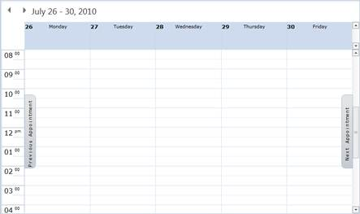
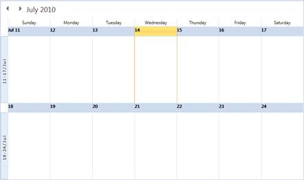
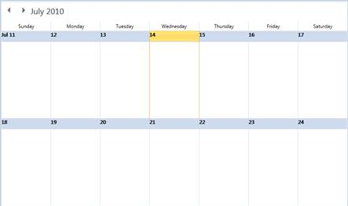

::: {style="DISPLAY: none"}
{#d2h_url_template}{#d2h_package_url style="WIDTH: 0px; DISPLAY: none; HEIGHT: 0px"}
:::

::::: {#nsbanner .d2h_main_nsbanner style="BORDER-BOTTOM: #999999 1px solid; POSITION: relative; PADDING-BOTTOM: 0px; BACKGROUND-COLOR: transparent; PADDING-LEFT: 0px; PADDING-RIGHT: 0px; DISPLAY: none; BORDER-TOP: #999999 1px solid; PADDING-TOP: 0px; LEFT: 0px"}
:::: {#TitleRow .d2h_main_titlerow style="PADDING-BOTTOM: 4px; BACKGROUND-COLOR: transparent; PADDING-LEFT: 22px; WIDTH: 100%; PADDING-RIGHT: 10px; DISPLAY: none; PADDING-TOP: 4px"}
::: {#ienav .d2h_main_ienav style="DISPLAY: none"}
{#D2HPrevious .D2HPreviousEnabled}  {#D2HNext .D2HNextEnabled}
:::
::::
:::::

:::: {#nstext .d2h_main_nstext style="PADDING-BOTTOM: 10px; BACKGROUND-COLOR: transparent; PADDING-LEFT: 22px; PADDING-RIGHT: 10px; HEIGHT: 100%; OVERFLOW: auto; PADDING-TOP: 5px" hasuserbackground="true" valign="bottom"}
::: {#d2h_breadcrumbs .d2h_breadcrumbs}
[Essential Studio User Guide Documentation](ms-xhelp:///?Id=12457748-09e3-4d74-a240-8e049cedf030){.d2h_breadcrumbsNormal}[ \> ]{.d2h_breadcrumbsLinkSeparator}[User Interface Edition](ms-xhelp:///?Id=c29296b7-531c-413b-a0ec-488ca1f7f669){.d2h_breadcrumbsNormal}[ \> ]{.d2h_breadcrumbsLinkSeparator}[Essential Silverlight](ms-xhelp:///?Id=66221bd1-ba2e-43c2-94a7-618f50e01d24){.d2h_breadcrumbsNormal}[ \> ]{.d2h_breadcrumbsLinkSeparator}[Essential Schedule]{.d2h_breadcrumbsContentsOnly}[ \> ]{.d2h_breadcrumbsLinkSeparator}[Schedule Control](ms-xhelp:///?Id=641660d5-c458-4c5d-9615-332d1a8eb458){.d2h_breadcrumbsNormal}[ \> ]{.d2h_breadcrumbsLinkSeparator}[Schedule Basics](ms-xhelp:///?Id=196be6e5-3594-41ef-920d-f4be62f74521){.d2h_breadcrumbsNormal}
:::

### Navigation {#navigation style="tab-stops: 0pt"}

Appointment Navigation

 

[·      ]{style="FONT-FAMILY: Symbol"}It is used for navigating to the Next / Previous Appointment in the schedule.

[·      ]{style="FONT-FAMILY: Symbol"}This navigation buttons are visible only if the current selected date(s) has no appointments. Using these buttons, easily navigates to the Next or Previous Appointments. This happens in all types of Views.

[·      ]{style="FONT-FAMILY: Symbol"}

{border="0"}

Figure 27: Next / Previous Appointment Navigation Button

 

MonthView to DaysView or WeekView Navigation

**[]{style="FONT-FAMILY: 'Trebuchet MS','sans-serif'; COLOR: #15428b; FONT-SIZE: 9pt"}** 

[·      ]{style="FONT-FAMILY: Symbol"}In each row of the Month View, we have the month view side items, which show the corresponding week view dates. When we click on the side items the corresponding week view is navigated. The Figure 28 shows the month view side items. For this, you must set the property **MonthViewWeekHeaderVisibility to** visible. By default, the value is collapsed which means by default, the month view side items is not shown.

[·      ]{style="FONT-FAMILY: Symbol"}You can navigate to the day view from the month view by clicking the corresponding day header in the month view. The Figure 29 shows the day header.

[·      ]{style="FONT-FAMILY: Symbol"}

{border="0"}

 

Figure 28: Week view Navigation from Month View

 

{border="0"}

 

Figure 29: Days view Navigation from Month View

 

[]{#related-topics}
::::
