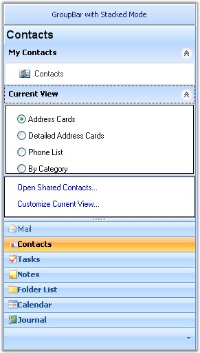

::: {style="DISPLAY: none"}
{#d2h_url_template}{#d2h_package_url style="WIDTH: 0px; DISPLAY: none; HEIGHT: 0px"}
:::

::::: {#nsbanner .d2h_main_nsbanner style="BORDER-BOTTOM: #999999 1px solid; POSITION: relative; PADDING-BOTTOM: 0px; BACKGROUND-COLOR: transparent; PADDING-LEFT: 0px; PADDING-RIGHT: 0px; DISPLAY: none; BORDER-TOP: #999999 1px solid; PADDING-TOP: 0px; LEFT: 0px"}
:::: {#TitleRow .d2h_main_titlerow style="PADDING-BOTTOM: 4px; BACKGROUND-COLOR: transparent; PADDING-LEFT: 22px; WIDTH: 100%; PADDING-RIGHT: 10px; DISPLAY: none; PADDING-TOP: 4px"}
::: {#ienav .d2h_main_ienav style="DISPLAY: none"}
{#D2HPrevious .D2HPreviousEnabled}  {#D2HNext .D2HNextEnabled}
:::
::::
:::::

:::: {#nstext .d2h_main_nstext style="PADDING-BOTTOM: 10px; BACKGROUND-COLOR: transparent; PADDING-LEFT: 22px; PADDING-RIGHT: 10px; HEIGHT: 100%; OVERFLOW: auto; PADDING-TOP: 5px" hasuserbackground="true" valign="bottom"}
::: {#d2h_breadcrumbs .d2h_breadcrumbs}
[Essential Studio User Guide Documentation](ms-xhelp:///?Id=12457748-09e3-4d74-a240-8e049cedf030){.d2h_breadcrumbsNormal}[ \> ]{.d2h_breadcrumbsLinkSeparator}[User Interface Edition](ms-xhelp:///?Id=c29296b7-531c-413b-a0ec-488ca1f7f669){.d2h_breadcrumbsNormal}[ \> ]{.d2h_breadcrumbsLinkSeparator}[Essential Windows](ms-xhelp:///?Id=e60759d8-47a4-4570-9d7a-16a68d63f2ea){.d2h_breadcrumbsNormal}[ \> ]{.d2h_breadcrumbsLinkSeparator}[Essential Tools]{.d2h_breadcrumbsContentsOnly}[ \> ]{.d2h_breadcrumbsLinkSeparator}[Tools Controls](ms-xhelp:///?Id=13c3c4f4-9d16-4b69-93f2-7e98eec67452){.d2h_breadcrumbsNormal}
:::

## Navigation Package {#navigation-package style="tab-stops: 0pt"}

[]{style="COLOR: #15428b"} 

Navigation package is a combination of controls designed to help navigation through various types of UI tasks, tools and more. The controls can be combined together to mimic popular user interface trends. Using Navigation package you can create toolboxes, categorized lists and view switchers.

**[]{style="COLOR: #15428b"}** 

{border="0"}

 

Figure 851: Syncfusion Navigation Controls

 

The following are the navigation controls that are primarily used for implementing command lists, where each command is represented by an image and / or text.

           

 

Popular examples of command lists are the Microsoft OutlookBar, VS.NET Toolbox, Windows 2000 / XP Folder Selectors and the Windows XPTaskBar. A great design time experience ensures the toolkit to be easily integrated into your application.

[]{style="COLOR: #15428b"} 

General features of Navigation Package

**[]{style="COLOR: #15428b"}** 

[·      ]{style="FONT-FAMILY: Symbol"}100% managed code.

[·      ]{style="FONT-FAMILY: Symbol"}Easy to design.

[·      ]{style="FONT-FAMILY: Symbol"}Languages supported : C# and .NET.

[·      ]{style="FONT-FAMILY: Symbol"}Environment supported : VS2003 and VS2005.

[·      ]{style="FONT-FAMILY: Symbol"}Used in any Operating system.

[·      ]{style="FONT-FAMILY: Symbol"}Provides look and feel.

[·      ]{style="FONT-FAMILY: Symbol"}Simplifies navigation options.

 

 

[]{#p588} 

 

More:

[ ]{#related-topics}

[{border="0" align="absMiddle"}GroupBar](ms-xhelp:///?Id=8f8cb210-dd17-4c9c-b181-45d7130df17d){style="TEXT-DECORATION: none"}

[{border="0" align="absMiddle"}GroupView](ms-xhelp:///?Id=a334dfd8-0bb1-48c9-8d85-513d2e8caa8b){style="TEXT-DECORATION: none"}

[{border="0" align="absMiddle"}XPTaskBar](ms-xhelp:///?Id=2b7aa450-2642-4c11-a3c9-67b6d980e2bb){style="TEXT-DECORATION: none"}
::::
