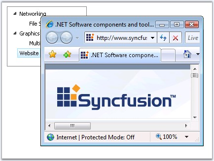

::: {style="DISPLAY: none"}
{#d2h_url_template}{#d2h_package_url style="WIDTH: 0px; DISPLAY: none; HEIGHT: 0px"}
:::

:::: {.d2h_secondary_topic style="PADDING-BOTTOM: 10pt; MARGIN: 0pt; PADDING-LEFT: 0pt; PADDING-RIGHT: 0pt; PADDING-TOP: 0pt"}
##### Navigation Support {#navigation-support style="tab-stops: 0pt"}

[]{style="FONT-FAMILY: 'Trebuchet MS','sans-serif'; COLOR: #15428b; FONT-SIZE: 9pt"} 

Navigation to the required url on clicking a particular node is possible by setting the **NavigateUrl** property in the TreeView Designer dialog. By setting the **Target** property, you can monopolize to open the page either in the same window, the same frame or open the page in a new window.

 

For this to be processed the **AutoPostBackOnSelect** property must be set to **True**.

**[]{style="FONT-FAMILY: 'Trebuchet MS','sans-serif'; COLOR: #15428b"}** 

::: {align="center"}
+-----------------------------------+-------------------------------------------------------------------------------------------------+
| Property                          | Description                                                                                     |
+-----------------------------------+-------------------------------------------------------------------------------------------------+
| NavigateUrl                       | Specifies the url to navigate to.                                                               |
+-----------------------------------+-------------------------------------------------------------------------------------------------+
| Target                            | Specifies where the target of the url has to be displayed. The options included are as follows: |
|                                   |                                                                                                 |
|                                   | [·      ]{style="FONT-FAMILY: Symbol"}self                                                      |
|                                   |                                                                                                 |
|                                   | [·      ]{style="FONT-FAMILY: Symbol"}blank                                                     |
|                                   |                                                                                                 |
|                                   | [·      ]{style="FONT-FAMILY: Symbol"}FrameName                                                 |
+-----------------------------------+-------------------------------------------------------------------------------------------------+
:::

[]{style="FONT-FAMILY: 'Trebuchet MS','sans-serif'; COLOR: #15428b; FONT-SIZE: 9pt"} 

{border="0"}

**[]{style="FONT-FAMILY: 'Trebuchet MS','sans-serif'; COLOR: #15428b; FONT-SIZE: 9pt"}** 

Figure 172: NavigateUrl set to Syncfusion\'s homepage and Target set to \'blank\' to open it in a new window

[]{style="FONT-FAMILY: 'Trebuchet MS','sans-serif'; COLOR: #15428b; FONT-SIZE: 9pt"} 

Programmatically this can be set as follows.

[]{style="FONT-FAMILY: 'Trebuchet MS','sans-serif'; COLOR: #15428b; FONT-SIZE: 9pt"} 

+----------------------------------------------------------------------------------------------------------------------------+
| **[\[C#\]]{style="FONT-FAMILY: 'Courier New'; FONT-SIZE: 9pt"}**                                                           |
|                                                                                                                            |
| []{style="FONT-FAMILY: 'Courier New'; COLOR: blue; FONT-SIZE: 9pt"}                                                        |
|                                                                                                                            |
| [Tree.AutopostbackOnSelect = [\"True\"]{style="COLOR: maroon"};]{style="FONT-FAMILY: 'Courier New'; FONT-SIZE: 9pt"}       |
|                                                                                                                            |
| [NodeP.NavigateUrl = [\"www.syncfusion.com\"]{style="COLOR: maroon"};]{style="FONT-FAMILY: 'Courier New'; FONT-SIZE: 9pt"} |
|                                                                                                                            |
| [Tree.Target = [\"\_blank\"]{style="COLOR: maroon"};]{style="FONT-FAMILY: 'Courier New'; FONT-SIZE: 9pt"}                  |
+----------------------------------------------------------------------------------------------------------------------------+

[]{style="FONT-FAMILY: 'Trebuchet MS','sans-serif'; COLOR: #15428b; FONT-SIZE: 9pt"} 

+------------------------------------------------------------------------------------------------------------------------------------------------------------------------------------------------------+
| **[\[VB\]]{style="FONT-FAMILY: 'Courier New'; FONT-SIZE: 9pt"}**                                                                                                                                     |
|                                                                                                                                                                                                      |
| []{style="FONT-FAMILY: 'Courier New'; COLOR: blue; FONT-SIZE: 9pt"}                                                                                                                                  |
|                                                                                                                                                                                                      |
| [Private ]{style="FONT-FAMILY: 'Courier New'; COLOR: blue; FONT-SIZE: 9pt"}[Tree.AutopostbackOnSelect = [\"True\"]{style="COLOR: maroon"}]{style="FONT-FAMILY: 'Courier New'; FONT-SIZE: 9pt"}       |
|                                                                                                                                                                                                      |
| [Private]{style="FONT-FAMILY: 'Courier New'; COLOR: blue; FONT-SIZE: 9pt"}[ NodeP.NavigateUrl = [\"www.syncfusion.com\"]{style="COLOR: maroon"}]{style="FONT-FAMILY: 'Courier New'; FONT-SIZE: 9pt"} |
|                                                                                                                                                                                                      |
| [Private]{style="FONT-FAMILY: 'Courier New'; COLOR: blue; FONT-SIZE: 9pt"}[ Tree.Target = [\"\_blank\"]{style="COLOR: maroon"}]{style="FONT-FAMILY: 'Courier New'; FONT-SIZE: 9pt"}                  |
+------------------------------------------------------------------------------------------------------------------------------------------------------------------------------------------------------+

 

[]{#related-topics}
::::
