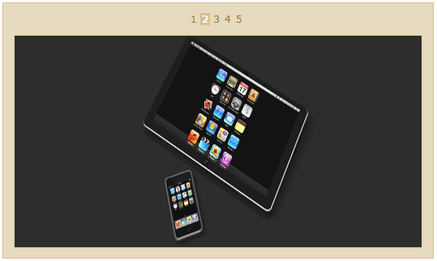

::: {style="DISPLAY: none"}
{#d2h_url_template}{#d2h_package_url style="WIDTH: 0px; DISPLAY: none; HEIGHT: 0px"}
:::

::: {.d2h_secondary_topic style="PADDING-BOTTOM: 10pt; MARGIN: 0pt; PADDING-LEFT: 0pt; PADDING-RIGHT: 0pt; PADDING-TOP: 0pt"}
##### Navigation type {#navigation-type style="tab-stops: 0pt"}

The Rotator Control allows you to set the navigation type so that you can customize how you navigate through the items.

You can either have it set so that-

1.   The items automatically scroll with a fixed time interval (AutoPlay)

2.   Using a button mode that allows you to scroll through the items when you click the arrow buttons (ButtonMode)

3.   Using a pager-mode so that you can select the page that you would like to view( PagerMode)

 

**Properties for Navigation type**

 

+-----------------+-------------------------------------------------------------------------------+------------------+-----------------------------------------------------------------+-------------+
| Name            | Description                                                                   | Type of property | Value it accepts                                                | Dependency  |
+-----------------+-------------------------------------------------------------------------------+------------------+-----------------------------------------------------------------+-------------+
| Navigation type | This property helps you to navigate among items, using AutoPlay or ButtonMode | enum             | [·      ]{style="FONT-FAMILY: Symbol"}NavigationType.AutoPlay   | NA          |
|                 |                                                                               |                  |                                                                 |             |
|                 |                                                                               |                  | [·      ]{style="FONT-FAMILY: Symbol"}NavigationType.ButtonMode |             |
|                 |                                                                               |                  |                                                                 |             |
|                 |                                                                               |                  | [·      ]{style="FONT-FAMILY: Symbol"}NavigationType.PagerMode  |             |
|                 |                                                                               |                  |                                                                 |             |
|                 |                                                                               |                  |                                                                 |             |
|                 |                                                                               |                  |                                                                 |             |
|                 |                                                                               |                  | Default Value is AutoPlay                                       |             |
+-----------------+-------------------------------------------------------------------------------+------------------+-----------------------------------------------------------------+-------------+

[[[]{style="TEXT-DECORATION: none"}]{style="COLOR: blue"}]{.underline} 

**Properties for the PagerMode navigation type**

[[[]{style="TEXT-DECORATION: none"}]{style="COLOR: blue"}]{.underline} 

+-------------+-------------------------------------------------------------------------------------------------------------------------------------------------------------------------------------------+--------------------------------+-----------------------------------------------------------+---------------------------------------------------------------------------------------------------------------------------+
| Name        | Description                                                                                                                                                                               | Type of property               | Value it accepts                                          | Dependency                                                                                                                |
+-------------+-------------------------------------------------------------------------------------------------------------------------------------------------------------------------------------------+--------------------------------+-----------------------------------------------------------+---------------------------------------------------------------------------------------------------------------------------+
| PageSetting | [This property is applicable only when you set the navigation type as pager mode. When you do so, all the other settings get overriden, since they are not applicable to the pager mode.\ | Action \<IRotatorPageBuilder\> | NA                                                        | Depends on NavigationType.PagerMode -- this property is only applicable for the Pager mode navigation type.               |
|             | \                                                                                                                                                                                         |                                |                                                           |                                                                                                                           |
|             | This property contains settings that you would need to customize the rotator page in case you select the pager mode.]{style="COLOR: black"}                                               |                                |                                                           |                                                                                                                           |
|             |                                                                                                                                                                                           |                                |                                                           |                                                                                                                           |
|             | []{style="COLOR: black"}                                                                                                                                                                  |                                |                                                           |                                                                                                                           |
+-------------+-------------------------------------------------------------------------------------------------------------------------------------------------------------------------------------------+--------------------------------+-----------------------------------------------------------+---------------------------------------------------------------------------------------------------------------------------+
| AllowPaging | [This property allows to to disable the pager mode in case you do not want it.\                                                                                                           | bool                           | [·      ]{style="FONT-FAMILY: Symbol"}True                | This is part of the PageSetting property---only when the NavigationType.PagerMode is enabled, this property is applicable |
|             | However, this choice will not allow you to view the  next items in the pager mode.]{style="COLOR: black"}                                                                                 |                                |                                                           |                                                                                                                           |
|             |                                                                                                                                                                                           |                                | [·      ]{style="FONT-FAMILY: Symbol"}False               |                                                                                                                           |
|             |                                                                                                                                                                                           |                                |                                                           |                                                                                                                           |
|             |                                                                                                                                                                                           |                                | Default value is True                                     |                                                                                                                           |
+-------------+-------------------------------------------------------------------------------------------------------------------------------------------------------------------------------------------+--------------------------------+-----------------------------------------------------------+---------------------------------------------------------------------------------------------------------------------------+
| PagerStyle  | [In the Numeric pager mode, you will have to select the page of the rotator that you want to view.]{style="COLOR: black"}                                                                 | PagerStyles                    | [·      ]{style="FONT-FAMILY: Symbol"}PagerStyles.Numeric | This is part of the PageSetting property---only when the NavigationType.PagerMode is enabled, this property is applicable |
|             |                                                                                                                                                                                           |                                |                                                           |                                                                                                                           |
|             |                                                                                                                                                                                           | enum                           | [·      ]{style="FONT-FAMILY: Symbol"}PagerStyles.Slider  |                                                                                                                           |
|             |                                                                                                                                                                                           |                                |                                                           |                                                                                                                           |
|             |                                                                                                                                                                                           |                                | Default value is PagerStyles.Numeric                      |                                                                                                                           |
|             |                                                                                                                                                                                           |                                |                                                           |                                                                                                                           |
|             |                                                                                                                                                                                           |                                |                                                           |                                                                                                                           |
+-------------+-------------------------------------------------------------------------------------------------------------------------------------------------------------------------------------------+--------------------------------+-----------------------------------------------------------+---------------------------------------------------------------------------------------------------------------------------+
| PageCount   | [This property  is applicable only for the Numeric Pager style. ]{style="COLOR: black"}                                                                                                   | int                            | Any integer                                               | Only when the NavigationType.PagerMode is enabled, the PageSetting property is applicable.\                               |
|             |                                                                                                                                                                                           |                                |                                                           | \                                                                                                                         |
|             | [It allows you to specify the number of pages that you would like to have in the rotator control. \                                                                                       |                                | There is no default value.                                | This property is apllicable only for the PagerStyles.Numeric property, which is part of the PagerStyle property.          |
|             | Each page will contain one item, and when you click on the next page, you can view the next item.\                                                                                        |                                |                                                           |                                                                                                                           |
|             | In every view, you will be able to choose from among only 5 items in the list. The next 5 items will render when you click on the 5^th^ item.]{style="COLOR: black"}                      |                                |                                                           |                                                                                                                           |
+-------------+-------------------------------------------------------------------------------------------------------------------------------------------------------------------------------------------+--------------------------------+-----------------------------------------------------------+---------------------------------------------------------------------------------------------------------------------------+
| SliderSize  | [This property is applicable only for the Slider pager style.]{style="COLOR: black"}                                                                                                      | int                            | Any integer value.                                        | Only when the NavigationType.PagerMode is enabled, the PageSetting property is applicable.\                               |
|             |                                                                                                                                                                                           |                                |                                                           | \                                                                                                                         |
|             | [It allows you to scroll through the items in the rotator, with the help of a slider.\                                                                                                    |                                | Default value is 50 (measured in pixels)                  | This property is apllicable only for the PagerStyles.Slider property, which is part of the PagerStyle property.           |
|             | You can set the length of the slider to your choice.]{style="COLOR: black"}                                                                                                               |                                |                                                           |                                                                                                                           |
+=============+===========================================================================================================================================================================================+================================+===========================================================+===========================================================================================================================+

[[[]{style="TEXT-DECORATION: none"}]{style="COLOR: blue"}]{.underline} 

In both the AutoPlay and the Button mode navigation types, you can set the number of items to be displayed during a single view, without scrolling.

For the Pager mode, however, you can have only one item on one page, and only one page is visible at a time. There are 2 sub modes for this navigation mode:

1.   **Numeric mode**- This mode allows you to select which page of the rotator you would like to view. You can choose within a set of 5 pages at a time. When you click on the 5^th^ page number, the next five pages will render.

2.   **Slider mode**- The slider mode is similar to the slider we use to scroll pages in Microsoft Office applications, except that it is only horizontally oriented, and that the size of the slider handle remains constant. However, the length of the slider path (given by the SliderSize property) varies based on the number of items in the rotator list. You can customize the size of the slider.

 

To set the navigation type, you can follow any one of the following modes-

 

**[Using Builder]{style="COLOR: black"}**

[The following steps guide you in configuring the navigation through Builder.]{style="COLOR: black"}

[1.   In **View**, create ul-li hierarchy of rotator items and invoke the rotator helper with the rotator Contents ID as the first argument and enable the **NavigationType** method with the desired option as argument.]{style="COLOR: black"}

[]{style="FONT-FAMILY: 'Times New Roman','serif'; COLOR: black; FONT-SIZE: 12pt"} 

+--------------------------------------------------------------------------------------------------------------------------------------------------------------------------------------------------------------------------------------------------------------------------------------------------------------------------------------------------------------------------------------------------------------------------------------------------------------------------------------------------------------------------------------------------------------------------+
| **[\[ASPX\]]{style="FONT-FAMILY: 'Courier New'"}**[]{style="FONT-FAMILY: 'Courier New'"}                                                                                                                                                                                                                                                                                                                                                                                                                                                                                 |
|                                                                                                                                                                                                                                                                                                                                                                                                                                                                                                                                                                          |
| []{style="FONT-FAMILY: 'Courier New'"}                                                                                                                                                                                                                                                                                                                                                                                                                                                                                                                                   |
|                                                                                                                                                                                                                                                                                                                                                                                                                                                                                                                                                                          |
| [\<]{style="FONT-FAMILY: 'Courier New'; COLOR: blue"}[ul]{style="FONT-FAMILY: 'Courier New'; COLOR: maroon"}[ [id]{style="COLOR: red"}[=\"rotatoritems\"]{style="COLOR: blue"} [style]{style="COLOR: red"}[=\"]{style="COLOR: blue"}[visibility]{style="COLOR: red"}[: hidden\"\>]{style="COLOR: blue"}]{style="FONT-FAMILY: 'Courier New'"}[]{style="FONT-FAMILY: 'Courier New'"}                                                                                                                                                                                       |
|                                                                                                                                                                                                                                                                                                                                                                                                                                                                                                                                                                          |
| [            [\<]{style="COLOR: blue"}[li]{style="COLOR: maroon"} [\>]{style="COLOR: blue"}]{style="FONT-FAMILY: 'Courier New'"}                                                                                                                                                                                                                                                                                                                                                                                                                                         |
|                                                                                                                                                                                                                                                                                                                                                                                                                                                                                                                                                                          |
| [                [\<]{style="COLOR: blue"}[img]{style="COLOR: maroon"} [src]{style="COLOR: red"}[=\']{style="COLOR: blue"}[\<%]{style="BACKGROUND: yellow"}[=]{style="COLOR: blue"} Url.Content(\"\~/Content/Images/1.jpg\")[%\>]{style="BACKGROUND: yellow"}[\']{style="COLOR: blue"} [/\>\</]{style="COLOR: blue"}[li]{style="COLOR: maroon"}[\>]{style="COLOR: blue"}]{style="FONT-FAMILY: 'Courier New'"}                                                                                                                                                            |
|                                                                                                                                                                                                                                                                                                                                                                                                                                                                                                                                                                          |
| [            [\<]{style="COLOR: blue"}[li]{style="COLOR: maroon"} [\>]{style="COLOR: blue"}]{style="FONT-FAMILY: 'Courier New'"}                                                                                                                                                                                                                                                                                                                                                                                                                                         |
|                                                                                                                                                                                                                                                                                                                                                                                                                                                                                                                                                                          |
| [                [\<]{style="COLOR: blue"}[img]{style="COLOR: maroon"} [src]{style="COLOR: red"}[=\']{style="COLOR: blue"}[\<%]{style="BACKGROUND: yellow"}[=]{style="COLOR: blue"} Url.Content(\"\~/Content/Images/2.jpg\")[%\>]{style="BACKGROUND: yellow"}[\']{style="COLOR: blue"} [/\>\</]{style="COLOR: blue"}[li]{style="COLOR: maroon"}[\>]{style="COLOR: blue"}]{style="FONT-FAMILY: 'Courier New'"}                                                                                                                                                            |
|                                                                                                                                                                                                                                                                                                                                                                                                                                                                                                                                                                          |
| [            [\<]{style="COLOR: blue"}[li]{style="COLOR: maroon"} [\>]{style="COLOR: blue"}]{style="FONT-FAMILY: 'Courier New'"}                                                                                                                                                                                                                                                                                                                                                                                                                                         |
|                                                                                                                                                                                                                                                                                                                                                                                                                                                                                                                                                                          |
| [                [\<]{style="COLOR: blue"}[img]{style="COLOR: maroon"} [src]{style="COLOR: red"}[=\']{style="COLOR: blue"}[\<%]{style="BACKGROUND: yellow"}[=]{style="COLOR: blue"} Url.Content(\"\~/Content/Images/3.jpg\")[%\>]{style="BACKGROUND: yellow"}[\']{style="COLOR: blue"} [/\>\</]{style="COLOR: blue"}[li]{style="COLOR: maroon"}[\>]{style="COLOR: blue"}]{style="FONT-FAMILY: 'Courier New'"}                                                                                                                                                            |
|                                                                                                                                                                                                                                                                                                                                                                                                                                                                                                                                                                          |
| [            [\<]{style="COLOR: blue"}[li]{style="COLOR: maroon"} [\>]{style="COLOR: blue"}]{style="FONT-FAMILY: 'Courier New'"}                                                                                                                                                                                                                                                                                                                                                                                                                                         |
|                                                                                                                                                                                                                                                                                                                                                                                                                                                                                                                                                                          |
| [                [\<]{style="COLOR: blue"}[img]{style="COLOR: maroon"} [src]{style="COLOR: red"}[=\']{style="COLOR: blue"}[\<%]{style="BACKGROUND: yellow"}[=]{style="COLOR: blue"} Url.Content(\"\~/Content/Images/4.jpg\")[%\>]{style="BACKGROUND: yellow"}[\']{style="COLOR: blue"} [/\>\</]{style="COLOR: blue"}[li]{style="COLOR: maroon"}[\>]{style="COLOR: blue"}]{style="FONT-FAMILY: 'Courier New'"}                                                                                                                                                            |
|                                                                                                                                                                                                                                                                                                                                                                                                                                                                                                                                                                          |
| [            [\<]{style="COLOR: blue"}[li]{style="COLOR: maroon"} [\>]{style="COLOR: blue"}]{style="FONT-FAMILY: 'Courier New'"}                                                                                                                                                                                                                                                                                                                                                                                                                                         |
|                                                                                                                                                                                                                                                                                                                                                                                                                                                                                                                                                                          |
| [                [\<]{style="COLOR: blue"}[img]{style="COLOR: maroon"} [src]{style="COLOR: red"}[=\']{style="COLOR: blue"}[\<%]{style="BACKGROUND: yellow"}[=]{style="COLOR: blue"} Url.Content(\"\~/Content/Images/5.jpg\")[%\>]{style="BACKGROUND: yellow"}[\']{style="COLOR: blue"} [/\>\</]{style="COLOR: blue"}[li]{style="COLOR: maroon"}[\>]{style="COLOR: blue"}]{style="FONT-FAMILY: 'Courier New'"}                                                                                                                                                            |
|                                                                                                                                                                                                                                                                                                                                                                                                                                                                                                                                                                          |
| [            [\<]{style="COLOR: blue"}[li]{style="COLOR: maroon"} [\>]{style="COLOR: blue"}]{style="FONT-FAMILY: 'Courier New'"}                                                                                                                                                                                                                                                                                                                                                                                                                                         |
|                                                                                                                                                                                                                                                                                                                                                                                                                                                                                                                                                                          |
| [                [\<]{style="COLOR: blue"}[img]{style="COLOR: maroon"} [src]{style="COLOR: red"}[=\']{style="COLOR: blue"}[\<%]{style="BACKGROUND: yellow"}[=]{style="COLOR: blue"} Url.Content(\"\~/Content/Images/6.jpg\")[%\>]{style="BACKGROUND: yellow"}[\']{style="COLOR: blue"} [/\>\</]{style="COLOR: blue"}[li]{style="COLOR: maroon"}[\>]{style="COLOR: blue"}            ]{style="FONT-FAMILY: 'Courier New'"}                                                                                                                                                |
|                                                                                                                                                                                                                                                                                                                                                                                                                                                                                                                                                                          |
| [               ]{style="FONT-FAMILY: 'Courier New'"}                                                                                                                                                                                                                                                                                                                                                                                                                                                                                                                    |
|                                                                                                                                                                                                                                                                                                                                                                                                                                                                                                                                                                          |
| [\</]{style="FONT-FAMILY: 'Courier New'; COLOR: blue"}[ul]{style="FONT-FAMILY: 'Courier New'; COLOR: maroon"}[\>]{style="FONT-FAMILY: 'Courier New'; COLOR: blue"}[]{style="FONT-FAMILY: 'Courier New'"}                                                                                                                                                                                                                                                                                                                                                                 |
|                                                                                                                                                                                                                                                                                                                                                                                                                                                                                                                                                                          |
| [\<%]{style="FONT-FAMILY: 'Courier New'; BACKGROUND: yellow"}[=]{style="FONT-FAMILY: 'Courier New'; COLOR: blue"}[Html.Syncfusion().Rotator([\"rotatoritems\"]{style="COLOR: #a31515"}).AutoFormat([Skins]{style="COLOR: #2b91af"}.Sandune)]{style="FONT-FAMILY: 'Courier New'"}                                                                                                                                                                                                                                                                                         |
|                                                                                                                                                                                                                                                                                                                                                                                                                                                                                                                                                                          |
| [ .NavigationType([RotatorNavigatingType]{style="COLOR: #2b91af"}.AutoPlay)[%\>]{style="BACKGROUND: yellow"}]{style="FONT-FAMILY: 'Courier New'"}                                                                                                                                                                                                                                                                                                                                                                                                                        |
|                                                                                                                                                                                                                                                                                                                                                                                                                                                                                                                                                                          |
| []{style="FONT-FAMILY: 'Courier New'"}                                                                                                                                                                                                                                                                                                                                                                                                                                                                                                                                   |
|                                                                                                                                                                                                                                                                                                                                                                                                                                                                                                                                                                          |
| [\[or\]]{style="FONT-FAMILY: 'Courier New'"}                                                                                                                                                                                                                                                                                                                                                                                                                                                                                                                             |
|                                                                                                                                                                                                                                                                                                                                                                                                                                                                                                                                                                          |
| []{style="FONT-FAMILY: 'Courier New'"}                                                                                                                                                                                                                                                                                                                                                                                                                                                                                                                                   |
|                                                                                                                                                                                                                                                                                                                                                                                                                                                                                                                                                                          |
| [//        rotator with navigation type button]{style="FONT-FAMILY: 'Courier New'; COLOR: green"}                                                                                                                                                                                                                                                                                                                                                                                                                                                                        |
|                                                                                                                                                                                                                                                                                                                                                                                                                                                                                                                                                                          |
| []{style="FONT-FAMILY: 'Courier New'"}                                                                                                                                                                                                                                                                                                                                                                                                                                                                                                                                   |
|                                                                                                                                                                                                                                                                                                                                                                                                                                                                                                                                                                          |
| [\<%]{style="FONT-FAMILY: 'Courier New'; BACKGROUND: yellow"}[=]{style="FONT-FAMILY: 'Courier New'; COLOR: blue"}[Html.Syncfusion().Rotator([\"rotatoritems\"]{style="COLOR: #a31515"}).AutoFormat([Skins]{style="COLOR: #2b91af"}.Sandune)]{style="FONT-FAMILY: 'Courier New'"}                                                                                                                                                                                                                                                                                         |
|                                                                                                                                                                                                                                                                                                                                                                                                                                                                                                                                                                          |
| [ .NavigationType([RotatorNavigatingType]{style="COLOR: #2b91af"}.ButtonMode)[%\>]{style="BACKGROUND: yellow"}]{style="FONT-FAMILY: 'Courier New'"}                                                                                                                                                                                                                                                                                                                                                                                                                      |
|                                                                                                                                                                                                                                                                                                                                                                                                                                                                                                                                                                          |
| []{style="FONT-FAMILY: 'Courier New'"}                                                                                                                                                                                                                                                                                                                                                                                                                                                                                                                                   |
|                                                                                                                                                                                                                                                                                                                                                                                                                                                                                                                                                                          |
| [\[or\]]{style="FONT-FAMILY: 'Courier New'"}                                                                                                                                                                                                                                                                                                                                                                                                                                                                                                                             |
|                                                                                                                                                                                                                                                                                                                                                                                                                                                                                                                                                                          |
| []{style="FONT-FAMILY: 'Courier New'"}                                                                                                                                                                                                                                                                                                                                                                                                                                                                                                                                   |
|                                                                                                                                                                                                                                                                                                                                                                                                                                                                                                                                                                          |
| [//        rotator with navigation type PagerMode with Numeric pagerstyle]{style="FONT-FAMILY: 'Courier New'; COLOR: green"}[]{style="FONT-FAMILY: 'Courier New'"}                                                                                                                                                                                                                                                                                                                                                                                                       |
|                                                                                                                                                                                                                                                                                                                                                                                                                                                                                                                                                                          |
| []{style="FONT-FAMILY: 'Courier New'"}                                                                                                                                                                                                                                                                                                                                                                                                                                                                                                                                   |
|                                                                                                                                                                                                                                                                                                                                                                                                                                                                                                                                                                          |
| [\<%]{style="FONT-FAMILY: 'Courier New'; BACKGROUND: yellow"}[=]{style="FONT-FAMILY: 'Courier New'; COLOR: blue"}[Html.Syncfusion().Rotator([\"rotatoritems\"]{style="COLOR: #a31515"}).AutoFormat([Skins]{style="COLOR: #2b91af"}.Sandune)]{style="FONT-FAMILY: 'Courier New'"}                                                                                                                                                                                                                                                                                         |
|                                                                                                                                                                                                                                                                                                                                                                                                                                                                                                                                                                          |
| [ .NavigationType([RotatorNavigatingType]{style="COLOR: #2b91af"}.ButtonMode)]{style="FONT-FAMILY: 'Courier New'"}[ ]{style="FONT-FAMILY: Consolas; FONT-SIZE: 9.5pt"}[.]{style="FONT-FAMILY: 'Courier New'; FONT-SIZE: 9.5pt"}[PageSetting]{style="FONT-FAMILY: 'Courier New'"}[(]{style="FONT-FAMILY: 'Courier New'; FONT-SIZE: 9.5pt"}[p=\>p.PageCount(7).PagerStyle([PagerStyles]{style="COLOR: #2b91af"}.Numeric]{style="FONT-FAMILY: 'Courier New'"}[)]{style="FONT-FAMILY: 'Courier New'; FONT-SIZE: 9.5pt"}[]{style="FONT-FAMILY: Consolas; FONT-SIZE: 9.5pt"}   |
|                                                                                                                                                                                                                                                                                                                                                                                                                                                                                                                                                                          |
| [%\>]{style="FONT-FAMILY: 'Courier New'; BACKGROUND: yellow"}[]{style="FONT-FAMILY: 'Courier New'"}                                                                                                                                                                                                                                                                                                                                                                                                                                                                      |
|                                                                                                                                                                                                                                                                                                                                                                                                                                                                                                                                                                          |
| []{style="FONT-FAMILY: 'Courier New'"}                                                                                                                                                                                                                                                                                                                                                                                                                                                                                                                                   |
|                                                                                                                                                                                                                                                                                                                                                                                                                                                                                                                                                                          |
| [\[or\]]{style="FONT-FAMILY: 'Courier New'"}                                                                                                                                                                                                                                                                                                                                                                                                                                                                                                                             |
|                                                                                                                                                                                                                                                                                                                                                                                                                                                                                                                                                                          |
| [//        rotator with navigation type PagerMode with Slider pagerstyle]{style="FONT-FAMILY: 'Courier New'; COLOR: green"}[]{style="FONT-FAMILY: 'Courier New'"}                                                                                                                                                                                                                                                                                                                                                                                                        |
|                                                                                                                                                                                                                                                                                                                                                                                                                                                                                                                                                                          |
| []{style="FONT-FAMILY: 'Courier New'"}                                                                                                                                                                                                                                                                                                                                                                                                                                                                                                                                   |
|                                                                                                                                                                                                                                                                                                                                                                                                                                                                                                                                                                          |
| [\<%]{style="FONT-FAMILY: 'Courier New'; BACKGROUND: yellow"}[=]{style="FONT-FAMILY: 'Courier New'; COLOR: blue"}[Html.Syncfusion().Rotator([\"rotatoritems\"]{style="COLOR: #a31515"}).AutoFormat([Skins]{style="COLOR: #2b91af"}.Sandune)]{style="FONT-FAMILY: 'Courier New'"}                                                                                                                                                                                                                                                                                         |
|                                                                                                                                                                                                                                                                                                                                                                                                                                                                                                                                                                          |
| [ .NavigationType([RotatorNavigatingType]{style="COLOR: #2b91af"}.ButtonMode)]{style="FONT-FAMILY: 'Courier New'"}[ ]{style="FONT-FAMILY: Consolas; FONT-SIZE: 9.5pt"}[.]{style="FONT-FAMILY: 'Courier New'; FONT-SIZE: 9.5pt"}[PageSetting]{style="FONT-FAMILY: 'Courier New'"}[(]{style="FONT-FAMILY: 'Courier New'; FONT-SIZE: 9.5pt"}[p=\>p.SliderSize(200).PagerStyle([PagerStyles]{style="COLOR: #2b91af"}.Slider]{style="FONT-FAMILY: 'Courier New'"}[)]{style="FONT-FAMILY: 'Courier New'; FONT-SIZE: 9.5pt"}[]{style="FONT-FAMILY: Consolas; FONT-SIZE: 9.5pt"} |
|                                                                                                                                                                                                                                                                                                                                                                                                                                                                                                                                                                          |
| [%\>]{style="FONT-FAMILY: 'Courier New'; BACKGROUND: yellow"}[]{style="FONT-FAMILY: 'Courier New'"}                                                                                                                                                                                                                                                                                                                                                                                                                                                                      |
|                                                                                                                                                                                                                                                                                                                                                                                                                                                                                                                                                                          |
| [   ]{style="FONT-FAMILY: 'Courier New'"}                                                                                                                                                                                                                                                                                                                                                                                                                                                                                                                                |
+--------------------------------------------------------------------------------------------------------------------------------------------------------------------------------------------------------------------------------------------------------------------------------------------------------------------------------------------------------------------------------------------------------------------------------------------------------------------------------------------------------------------------------------------------------------------------+

[]{style="COLOR: black"} 

[2.   Run the application.]{style="COLOR: black"}

**[]{style="COLOR: black"}** 

**[Using Properties Model]{style="COLOR: black"}**

[The following steps will guide you in setting the navigation type through the Properties model.]{style="COLOR: black"}

[1.   In the **Controller**, create an instance of RotatorModel, define the **NavigationType** property and pass the instance through view-specific data to View as given below.]{style="COLOR: black"}

[]{style="FONT-FAMILY: 'Times New Roman','serif'; COLOR: black; FONT-SIZE: 12pt"} 

+--------------------------------------------------------------------------------------------------------------------------------------------------------------------------+
| **[\[Controller\]]{style="FONT-FAMILY: 'Courier New'"}**[]{style="FONT-FAMILY: 'Courier New'"}                                                                           |
|                                                                                                                                                                          |
| []{style="FONT-FAMILY: 'Courier New'"}                                                                                                                                   |
|                                                                                                                                                                          |
| [public]{style="FONT-FAMILY: 'Courier New'; COLOR: blue"}[ [ActionResult]{style="COLOR: #2b91af"} Index()]{style="FONT-FAMILY: 'Courier New'"}                           |
|                                                                                                                                                                          |
| [        {]{style="FONT-FAMILY: 'Courier New'"}                                                                                                                          |
|                                                                                                                                                                          |
| [            [RotatorModel]{style="COLOR: #2b91af"} myModel = [new]{style="COLOR: blue"} [RotatorModel]{style="COLOR: #2b91af"}();]{style="FONT-FAMILY: 'Courier New'"}  |
|                                                                                                                                                                          |
| [            myModel.NavigationType=[RotatorNavigatingType]{style="COLOR: #2b91af"}.AutoPlay;]{style="FONT-FAMILY: 'Courier New'"}[]{style="FONT-FAMILY: 'Courier New'"} |
|                                                                                                                                                                          |
| []{style="FONT-FAMILY: 'Courier New'"}                                                                                                                                   |
|                                                                                                                                                                          |
| [              myModel.AutoFormat=[Skins]{style="COLOR: #2b91af"}.Sandune;]{style="FONT-FAMILY: 'Courier New'"}                                                          |
|                                                                                                                                                                          |
| []{style="FONT-FAMILY: 'Courier New'"}                                                                                                                                   |
|                                                                                                                                                                          |
| [            ViewData\[[\"myRotatorModel\"]{style="COLOR: #a31515"}\] = myModel;]{style="FONT-FAMILY: 'Courier New'"}                                                    |
|                                                                                                                                                                          |
| [            [return]{style="COLOR: blue"} View();]{style="FONT-FAMILY: 'Courier New'"}                                                                                  |
|                                                                                                                                                                          |
| [        }]{style="FONT-FAMILY: 'Courier New'"}                                                                                                                          |
|                                                                                                                                                                          |
| []{style="FONT-FAMILY: 'Courier New'"}                                                                                                                                   |
+--------------------------------------------------------------------------------------------------------------------------------------------------------------------------+

[]{style="COLOR: black"} 

[2.   In **View**, create ul-li hierarchy of rotator items and invoke the rotator helper with the rotator content ID as the first argument and view data key as the second argument. ]{style="COLOR: black"}

[]{style="FONT-FAMILY: 'Times New Roman','serif'; COLOR: black; FONT-SIZE: 12pt"} 

+---------------------------------------------------------------------------------------------------------------------------------------------------------------------------------------------------------------------------------------------------------------------------------------------------------------------------------------------------------------------------------------------------------------------------+
| **[\[ASPX\]]{style="FONT-FAMILY: 'Courier New'"}**[]{style="FONT-FAMILY: 'Courier New'"}                                                                                                                                                                                                                                                                                                                                  |
|                                                                                                                                                                                                                                                                                                                                                                                                                           |
| []{style="FONT-FAMILY: 'Courier New'"}                                                                                                                                                                                                                                                                                                                                                                                    |
|                                                                                                                                                                                                                                                                                                                                                                                                                           |
| [\<]{style="FONT-FAMILY: 'Courier New'; COLOR: blue"}[ul]{style="FONT-FAMILY: 'Courier New'; COLOR: maroon"}[ [id]{style="COLOR: red"}[=\"rotatoritems\"]{style="COLOR: blue"} [style]{style="COLOR: red"}[=\"]{style="COLOR: blue"}[visibility]{style="COLOR: red"}[: hidden\"\>]{style="COLOR: blue"}]{style="FONT-FAMILY: 'Courier New'"}[]{style="FONT-FAMILY: 'Courier New'"}                                        |
|                                                                                                                                                                                                                                                                                                                                                                                                                           |
| [            [\<]{style="COLOR: blue"}[li]{style="COLOR: maroon"} [\>]{style="COLOR: blue"}]{style="FONT-FAMILY: 'Courier New'"}                                                                                                                                                                                                                                                                                          |
|                                                                                                                                                                                                                                                                                                                                                                                                                           |
| [                [\<]{style="COLOR: blue"}[img]{style="COLOR: maroon"} [src]{style="COLOR: red"}[=\']{style="COLOR: blue"}[\<%]{style="BACKGROUND: yellow"}[=]{style="COLOR: blue"} Url.Content(\"\~/Content/Images/1.jpg\")[%\>]{style="BACKGROUND: yellow"}[\']{style="COLOR: blue"} [/\>\</]{style="COLOR: blue"}[li]{style="COLOR: maroon"}[\>]{style="COLOR: blue"}]{style="FONT-FAMILY: 'Courier New'"}             |
|                                                                                                                                                                                                                                                                                                                                                                                                                           |
| [            [\<]{style="COLOR: blue"}[li]{style="COLOR: maroon"} [\>]{style="COLOR: blue"}]{style="FONT-FAMILY: 'Courier New'"}                                                                                                                                                                                                                                                                                          |
|                                                                                                                                                                                                                                                                                                                                                                                                                           |
| [                [\<]{style="COLOR: blue"}[img]{style="COLOR: maroon"} [src]{style="COLOR: red"}[=\']{style="COLOR: blue"}[\<%]{style="BACKGROUND: yellow"}[=]{style="COLOR: blue"} Url.Content(\"\~/Content/Images/2.jpg\")[%\>]{style="BACKGROUND: yellow"}[\']{style="COLOR: blue"} [/\>\</]{style="COLOR: blue"}[li]{style="COLOR: maroon"}[\>]{style="COLOR: blue"}]{style="FONT-FAMILY: 'Courier New'"}             |
|                                                                                                                                                                                                                                                                                                                                                                                                                           |
| [            [\<]{style="COLOR: blue"}[li]{style="COLOR: maroon"} [\>]{style="COLOR: blue"}]{style="FONT-FAMILY: 'Courier New'"}                                                                                                                                                                                                                                                                                          |
|                                                                                                                                                                                                                                                                                                                                                                                                                           |
| [                [\<]{style="COLOR: blue"}[img]{style="COLOR: maroon"} [src]{style="COLOR: red"}[=\']{style="COLOR: blue"}[\<%]{style="BACKGROUND: yellow"}[=]{style="COLOR: blue"} Url.Content(\"\~/Content/Images/3.jpg\")[%\>]{style="BACKGROUND: yellow"}[\']{style="COLOR: blue"} [/\>\</]{style="COLOR: blue"}[li]{style="COLOR: maroon"}[\>]{style="COLOR: blue"}]{style="FONT-FAMILY: 'Courier New'"}             |
|                                                                                                                                                                                                                                                                                                                                                                                                                           |
| [            [\<]{style="COLOR: blue"}[li]{style="COLOR: maroon"} [\>]{style="COLOR: blue"}]{style="FONT-FAMILY: 'Courier New'"}                                                                                                                                                                                                                                                                                          |
|                                                                                                                                                                                                                                                                                                                                                                                                                           |
| [                [\<]{style="COLOR: blue"}[img]{style="COLOR: maroon"} [src]{style="COLOR: red"}[=\']{style="COLOR: blue"}[\<%]{style="BACKGROUND: yellow"}[=]{style="COLOR: blue"} Url.Content(\"\~/Content/Images/4.jpg\")[%\>]{style="BACKGROUND: yellow"}[\']{style="COLOR: blue"} [/\>\</]{style="COLOR: blue"}[li]{style="COLOR: maroon"}[\>]{style="COLOR: blue"}]{style="FONT-FAMILY: 'Courier New'"}             |
|                                                                                                                                                                                                                                                                                                                                                                                                                           |
| [            [\<]{style="COLOR: blue"}[li]{style="COLOR: maroon"} [\>]{style="COLOR: blue"}]{style="FONT-FAMILY: 'Courier New'"}                                                                                                                                                                                                                                                                                          |
|                                                                                                                                                                                                                                                                                                                                                                                                                           |
| [                [\<]{style="COLOR: blue"}[img]{style="COLOR: maroon"} [src]{style="COLOR: red"}[=\']{style="COLOR: blue"}[\<%]{style="BACKGROUND: yellow"}[=]{style="COLOR: blue"} Url.Content(\"\~/Content/Images/5.jpg\")[%\>]{style="BACKGROUND: yellow"}[\']{style="COLOR: blue"} [/\>\</]{style="COLOR: blue"}[li]{style="COLOR: maroon"}[\>]{style="COLOR: blue"}]{style="FONT-FAMILY: 'Courier New'"}             |
|                                                                                                                                                                                                                                                                                                                                                                                                                           |
| [            [\<]{style="COLOR: blue"}[li]{style="COLOR: maroon"} [\>]{style="COLOR: blue"}]{style="FONT-FAMILY: 'Courier New'"}                                                                                                                                                                                                                                                                                          |
|                                                                                                                                                                                                                                                                                                                                                                                                                           |
| [                [\<]{style="COLOR: blue"}[img]{style="COLOR: maroon"} [src]{style="COLOR: red"}[=\']{style="COLOR: blue"}[\<%]{style="BACKGROUND: yellow"}[=]{style="COLOR: blue"} Url.Content(\"\~/Content/Images/6.jpg\")[%\>]{style="BACKGROUND: yellow"}[\']{style="COLOR: blue"} [/\>\</]{style="COLOR: blue"}[li]{style="COLOR: maroon"}[\>]{style="COLOR: blue"}            ]{style="FONT-FAMILY: 'Courier New'"} |
|                                                                                                                                                                                                                                                                                                                                                                                                                           |
| [               ]{style="FONT-FAMILY: 'Courier New'"}                                                                                                                                                                                                                                                                                                                                                                     |
|                                                                                                                                                                                                                                                                                                                                                                                                                           |
| [\</]{style="FONT-FAMILY: 'Courier New'; COLOR: blue"}[ul]{style="FONT-FAMILY: 'Courier New'; COLOR: maroon"}[\>]{style="FONT-FAMILY: 'Courier New'; COLOR: blue"}[]{style="FONT-FAMILY: 'Courier New'"}                                                                                                                                                                                                                  |
|                                                                                                                                                                                                                                                                                                                                                                                                                           |
| []{style="FONT-FAMILY: 'Courier New'; COLOR: blue"}                                                                                                                                                                                                                                                                                                                                                                       |
|                                                                                                                                                                                                                                                                                                                                                                                                                           |
| [\<%]{style="FONT-FAMILY: 'Courier New'; BACKGROUND: yellow"}[=]{style="FONT-FAMILY: 'Courier New'; COLOR: blue"}[Html.Syncfusion().Rotator([\"rotatoritems\"]{style="COLOR: #a31515"}, [\"myRotatorModel\"]{style="COLOR: #a31515"})[%\>]{style="BACKGROUND: yellow"}]{style="FONT-FAMILY: 'Courier New'"}                                                                                                               |
|                                                                                                                                                                                                                                                                                                                                                                                                                           |
| []{style="FONT-FAMILY: 'Courier New'"}                                                                                                                                                                                                                                                                                                                                                                                    |
+---------------------------------------------------------------------------------------------------------------------------------------------------------------------------------------------------------------------------------------------------------------------------------------------------------------------------------------------------------------------------------------------------------------------------+

[]{style="FONT-FAMILY: 'Calibri','sans-serif'; FONT-SIZE: 11pt"} 

The figures show the Rotator Control with Autoplay and  ButtonModes enabled: 

{border="0"}[]{style="FONT-FAMILY: 'Calibri','sans-serif'; FONT-SIZE: 11pt"}

Figure 227: Rating with Autoplay mode enabled

 

{border="0"}

Figure 228: Rotator control with ButtonMode enabled

 

**        ** {border="0"}

Figure 229: Rotator with Numeric Pager Mode

 

                 {border="0"}

Figure 230: Rotator With Slider Pager Mode

**[]{style="FONT-STYLE: normal"}** 

[]{#related-topics}
:::
