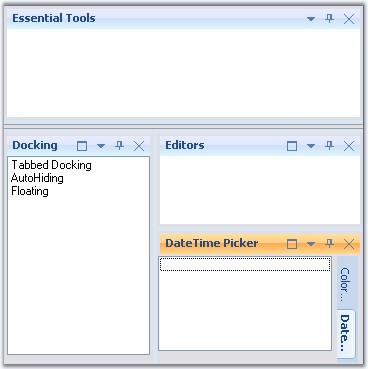
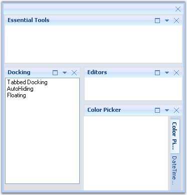

::: {style="DISPLAY: none"}
{#d2h_url_template}{#d2h_package_url style="WIDTH: 0px; DISPLAY: none; HEIGHT: 0px"}
:::

::: {.d2h_secondary_topic style="PADDING-BOTTOM: 10pt; MARGIN: 0pt; PADDING-LEFT: 0pt; PADDING-RIGHT: 0pt; PADDING-TOP: 0pt"}
##### Nested Docking and Floating[]{#p81} {#nested-docking-and-floating style="tab-stops: 0pt"}

[]{style="COLOR: #15428b"} 

Docking windows framework provides full-fledged support for nested docking and Floating at runtime without implementing a single piece of code.

[]{style="COLOR: #15428b"} 

{border="0"}

[]{style="COLOR: #15428b"} 

Figure 98: Nested Docking

[]{style="COLOR: #15428b"} 

{border="0"}

**[]{style="COLOR: #15428b"}** 

Figure 99: Nested Floating

[]{style="COLOR: #15428b"} 

You can create Nested Docking Layouts using UserControls. A sample demonstrating this is available in the below sample installation path.

 

..\\My Documents\\Syncfusion\\EssentialStudio\\***Version Number***\\Windows\\Tools.Windows\\Samples\\2.0\\Docking Package\\NestedDockingLayouts

[]{#related-topics}
:::
