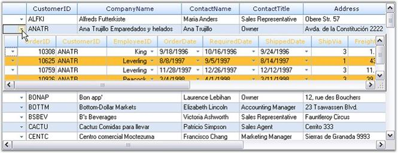

::: {style="DISPLAY: none"}
{#d2h_url_template}{#d2h_package_url style="WIDTH: 0px; DISPLAY: none; HEIGHT: 0px"}
:::

::: {.d2h_secondary_topic style="PADDING-BOTTOM: 10pt; MARGIN: 0pt; PADDING-LEFT: 0pt; PADDING-RIGHT: 0pt; PADDING-TOP: 0pt"}
##### Nested Drop-down Grids {#nested-drop-down-grids style="tab-stops: 0pt"}

[]{style="FONT-FAMILY: 'Trebuchet MS','sans-serif'; COLOR: #15428b; FONT-SIZE: 9pt"} 

Nested Drop-down grids are used to represent multi-level data in a grid. For example, if a bank wants to load all the accounts of an enrolled user in a grid control for a financial project, and some of the accounts have subaccounts with options to be selected under each subaccount, which need to be loaded/ shown as a subelement to that account, Nested Drop-down grids can be used to represent the data. The data can be distributed in parent (primary) grid, child grid, and so on. Grid Data Bound Grid control can display hierarchical data using Nested Drop-down grids.

 

**Example:**

 

In the code example below, the parent (primary) grid is the \'Customers\' table from the NorthWind database. On clicking a row of this table, the \'Orders\' table will be displayed in a new grid providing details on orders placed by the customers. On clicking any of the rows in Orders table, another grid named \'Order_Details\' table is displayed providing details on the order details of the selected row in the Orders table. 

 

This example has a derived GridDataBoundGrid class called the **GridHierDataBoundGrid** used for all the grids to be displayed. In the constructor for this class, the tables for parent and child are to be passed.

[]{style="FONT-FAMILY: 'Trebuchet MS','sans-serif'; COLOR: #15428b; FONT-SIZE: 9pt"} 

+-----------------------------------------------------------------------------------------------------------------------------------------------------------------------------------------------------------------------------------------------+
| **[\[C#\]]{style="FONT-FAMILY: 'Courier New'; COLOR: black"}**                                                                                                                                                                                |
|                                                                                                                                                                                                                                               |
| []{style="COLOR: black"}                                                                                                                                                                                                                      |
|                                                                                                                                                                                                                                               |
| [// Parent table to Child table.]{style="FONT-FAMILY: 'Courier New'; COLOR: green"}                                                                                                                                                           |
|                                                                                                                                                                                                                                               |
| [// Create the outermost grid for the customers table-uses GridHierDataBoundGrid class.]{style="FONT-FAMILY: 'Courier New'; COLOR: green"}                                                                                                    |
|                                                                                                                                                                                                                                               |
| [this]{style="FONT-FAMILY: 'Courier New'; COLOR: blue"}[.customerGrid1 = [new]{style="COLOR: blue"} GridHierDataBoundGrid([this]{style="COLOR: blue"}, [this]{style="COLOR: blue"}.dataSet11.Customers,]{style="FONT-FAMILY: 'Courier New'"}  |
|                                                                                                                                                                                                                                               |
| [this]{style="FONT-FAMILY: 'Courier New'; COLOR: blue"}[.dataSet11.Orders, [this]{style="COLOR: blue"}.orderGrid2, [new]{style="COLOR: blue"} QueryFilterStringEventHandler(ProvideOrdersFilterStrings),]{style="FONT-FAMILY: 'Courier New'"} |
|                                                                                                                                                                                                                                               |
| [new]{style="FONT-FAMILY: 'Courier New'; COLOR: blue"}[ QueryFormatGridEventHandler(ProvideOrderFormat), [true]{style="COLOR: blue"});]{style="FONT-FAMILY: 'Courier New'"}                                                                   |
+-----------------------------------------------------------------------------------------------------------------------------------------------------------------------------------------------------------------------------------------------+

[]{style="FONT-FAMILY: 'Trebuchet MS','sans-serif'; COLOR: #15428b; FONT-SIZE: 9pt"} 

+-------------------------------------------------------------------------------------------------------------------------------------------------------------------------------------------------------------------------------------------------------------------------------------------------------------------------------------------------------------------------------------------------------------------------------------------------------------------------------------------------------------------------------------------------------------------------------------------+
| **[\[VB.NET\]]{style="FONT-FAMILY: 'Courier New'; COLOR: black"}**                                                                                                                                                                                                                                                                                                                                                                                                                                                                                                                        |
|                                                                                                                                                                                                                                                                                                                                                                                                                                                                                                                                                                                           |
| []{style="FONT-FAMILY: 'Courier New'; COLOR: black"}                                                                                                                                                                                                                                                                                                                                                                                                                                                                                                                                      |
|                                                                                                                                                                                                                                                                                                                                                                                                                                                                                                                                                                                           |
| [\' Parent table to Child table.]{style="FONT-FAMILY: 'Courier New'; COLOR: green"}                                                                                                                                                                                                                                                                                                                                                                                                                                                                                                       |
|                                                                                                                                                                                                                                                                                                                                                                                                                                                                                                                                                                                           |
| [\' Create the outermost grid for the customers table-uses GridHierDataBoundGrid class.]{style="FONT-FAMILY: 'Courier New'; COLOR: green"}                                                                                                                                                                                                                                                                                                                                                                                                                                                |
|                                                                                                                                                                                                                                                                                                                                                                                                                                                                                                                                                                                           |
| [Me]{style="FONT-FAMILY: 'Courier New'; COLOR: blue"}[.customerGrid1 = [New]{style="COLOR: blue"} GridHierDataBoundGrid([Me]{style="COLOR: blue"}, [Me]{style="COLOR: blue"}.dataSet11.Customers, [Me]{style="COLOR: blue"}.dataSet11.Orders, [Me]{style="COLOR: blue"}.orderGrid2, [New]{style="COLOR: blue"} QueryFilterStringEventHandler([AddressOf]{style="COLOR: blue"} ProvideOrdersFilterStrings), [New]{style="COLOR: blue"} QueryFormatGridEventHandler([AddressOf]{style="COLOR: blue"} ProvideOrderFormat), [True]{style="COLOR: blue"})]{style="FONT-FAMILY: 'Courier New'"} |
+-------------------------------------------------------------------------------------------------------------------------------------------------------------------------------------------------------------------------------------------------------------------------------------------------------------------------------------------------------------------------------------------------------------------------------------------------------------------------------------------------------------------------------------------------------------------------------------------+

 

Finally, to specify a relationship between a parent table and a child table, an event handler must be passed for the **QueryFilterString** event. The event should specify the FilterString that defines the relationship between the parent table and the child table.

[]{style="FONT-FAMILY: 'Trebuchet MS','sans-serif'; COLOR: #15428b; FONT-SIZE: 9pt"} 

+-------------------------------------------------------------------------------------------------------------------------------------------------------------------------------------------------------------------------------+
| **[\[C#\]]{style="FONT-FAMILY: 'Courier New'; COLOR: black"}**                                                                                                                                                                |
|                                                                                                                                                                                                                               |
| []{style="FONT-FAMILY: 'Courier New'; COLOR: black"}                                                                                                                                                                          |
|                                                                                                                                                                                                                               |
| [// Parent table to Child table.]{style="FONT-FAMILY: 'Courier New'; COLOR: green"}                                                                                                                                           |
|                                                                                                                                                                                                                               |
| [private]{style="FONT-FAMILY: 'Courier New'; COLOR: blue"}[ [void]{style="COLOR: blue"} ProvideOrdersFilterStrings([object]{style="COLOR: blue"} sender, QueryFilterStringEventArgs e)]{style="FONT-FAMILY: 'Courier New'"}   |
|                                                                                                                                                                                                                               |
| [{]{style="FONT-FAMILY: 'Courier New'"}                                                                                                                                                                                       |
|                                                                                                                                                                                                                               |
| [if]{style="FONT-FAMILY: 'Courier New'; COLOR: blue"}[ ([this]{style="COLOR: blue"}.customerGrid1.Model\[e.Row, e.Column + 1\].Text != [\"\"]{style="COLOR: #a31515"})]{style="FONT-FAMILY: 'Courier New'"}                   |
|                                                                                                                                                                                                                               |
| []{style="FONT-FAMILY: 'Courier New'; COLOR: green"}                                                                                                                                                                          |
|                                                                                                                                                                                                                               |
| [// Add 1 to get to Customer ID.]{style="FONT-FAMILY: 'Courier New'; COLOR: green"}                                                                                                                                           |
|                                                                                                                                                                                                                               |
| [e.FilterString = [string]{style="COLOR: blue"}.Format([\"CustomerID = \'{0}\'\"]{style="COLOR: #a31515"}, [this]{style="COLOR: blue"}.customerGrid1.Model\[e.Row, e.Column + 1\].Text);]{style="FONT-FAMILY: 'Courier New'"} |
|                                                                                                                                                                                                                               |
| [}]{style="FONT-FAMILY: 'Courier New'"}                                                                                                                                                                                       |
+-------------------------------------------------------------------------------------------------------------------------------------------------------------------------------------------------------------------------------+

[]{style="FONT-FAMILY: 'Trebuchet MS','sans-serif'; COLOR: #15428b; FONT-SIZE: 9pt"} 

+------------------------------------------------------------------------------------------------------------------------------------------------------------------------------------------------------------------------------------------------------------------------------------------------------------------------------------------+
| **[\[VB.NET\]]{style="FONT-FAMILY: 'Courier New'; COLOR: black"}**                                                                                                                                                                                                                                                                       |
|                                                                                                                                                                                                                                                                                                                                          |
| []{style="FONT-FAMILY: 'Courier New'; COLOR: black"}                                                                                                                                                                                                                                                                                     |
|                                                                                                                                                                                                                                                                                                                                          |
| [\' Parent table to Child table.]{style="FONT-FAMILY: 'Courier New'; COLOR: green"}                                                                                                                                                                                                                                                      |
|                                                                                                                                                                                                                                                                                                                                          |
| [Private]{style="FONT-FAMILY: 'Courier New'; COLOR: blue"}[ [Sub]{style="COLOR: blue"} ProvideOrdersFilterStrings([ByVal]{style="COLOR: blue"} sender [As]{style="COLOR: blue"} [Object]{style="COLOR: blue"}, [ByVal]{style="COLOR: blue"} e [As]{style="COLOR: blue"} QueryFilterStringEventArgs)]{style="FONT-FAMILY: 'Courier New'"} |
|                                                                                                                                                                                                                                                                                                                                          |
| [If]{style="FONT-FAMILY: 'Courier New'; COLOR: blue"}[ [Me]{style="COLOR: blue"}.customerGrid1.Model(e.Row, e.Column + 1).Text \<\> [\"\"]{style="COLOR: #a31515"} [Then]{style="COLOR: blue"}]{style="FONT-FAMILY: 'Courier New'"}                                                                                                      |
|                                                                                                                                                                                                                                                                                                                                          |
| []{style="FONT-FAMILY: 'Courier New'; COLOR: green"}                                                                                                                                                                                                                                                                                     |
|                                                                                                                                                                                                                                                                                                                                          |
| [\' Add 1 to get to Customer ID.]{style="FONT-FAMILY: 'Courier New'; COLOR: green"}                                                                                                                                                                                                                                                      |
|                                                                                                                                                                                                                                                                                                                                          |
| [e.FilterString = [String]{style="COLOR: blue"}.Format([\"CustomerID = \'{0}\'\"]{style="COLOR: #a31515"}, [Me]{style="COLOR: blue"}.customerGrid1.Model(e.Row, e.Column + 1).Text)]{style="FONT-FAMILY: 'Courier New'"}                                                                                                                 |
|                                                                                                                                                                                                                                                                                                                                          |
| [End]{style="FONT-FAMILY: 'Courier New'; COLOR: blue"}[ [If]{style="COLOR: blue"}]{style="FONT-FAMILY: 'Courier New'"}                                                                                                                                                                                                                   |
|                                                                                                                                                                                                                                                                                                                                          |
| [End]{style="FONT-FAMILY: 'Courier New'; COLOR: blue"}[ [Sub]{style="COLOR: blue"}]{style="FONT-FAMILY: 'Courier New'"}                                                                                                                                                                                                                  |
+------------------------------------------------------------------------------------------------------------------------------------------------------------------------------------------------------------------------------------------------------------------------------------------------------------------------------------------+

[]{style="FONT-FAMILY: 'Trebuchet MS','sans-serif'; COLOR: #15428b; FONT-SIZE: 9pt"} 

{border="0"}

[]{style="FONT-FAMILY: 'Trebuchet MS','sans-serif'; COLOR: #15428b; FONT-SIZE: 9pt"} 

*[Figure ]{style="FONT-SIZE: 9pt"}[215]{style="FONT-SIZE: 9pt"}[: Nested Drop-down Grids]{style="FONT-SIZE: 9pt"}*

[]{style="FONT-FAMILY: 'Trebuchet MS','sans-serif'; COLOR: #15428b; FONT-SIZE: 9pt"} 

A sample demonstrating this feature is available under the following sample installation path.

[]{style="FONT-FAMILY: 'Trebuchet MS','sans-serif'; COLOR: #15428b; FONT-SIZE: 9pt"} 

***\<Install Location\>\\Syncfusion\\EssentialStudio\\\[Version Number\]\\Windows\\Grid.Windows\\Samples\\2.0\\Data Bound\\GDBG Drop Grid Demo***

 

[]{#p379} 

 

[]{#related-topics}
:::
