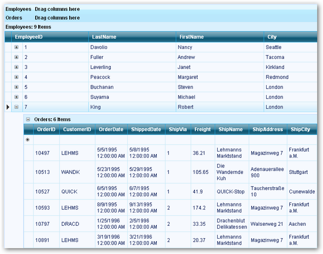

::: {style="DISPLAY: none"}
{#d2h_url_template}{#d2h_package_url style="WIDTH: 0px; DISPLAY: none; HEIGHT: 0px"}
:::

::: {.d2h_secondary_topic style="PADDING-BOTTOM: 10pt; MARGIN: 0pt; PADDING-LEFT: 0pt; PADDING-RIGHT: 0pt; PADDING-TOP: 0pt"}
#### Nested Expressions {#nested-expressions style="tab-stops: 0pt"}

[]{style="FONT-FAMILY: 'Trebuchet MS','sans-serif'; COLOR: #15428b; FONT-SIZE: 9pt"} 

Nested Expressions are nothing but, combing the expression fields from different ExpressionFieldDescriptors to create a new ExpressionFieldDescriptors. The following code example illustrates this.

[]{style="FONT-FAMILY: 'Trebuchet MS','sans-serif'; COLOR: #15428b; FONT-SIZE: 9pt"} 

+------------------------------------------------------------------------------------------------------------------------------------------------------------------------------------------------------------------------------------------------------+
| **[\[C#\]]{style="FONT-FAMILY: 'Courier New'; COLOR: black"}**                                                                                                                                                                                       |
|                                                                                                                                                                                                                                                      |
| []{style="FONT-FAMILY: 'Courier New'; COLOR: black"}                                                                                                                                                                                                 |
|                                                                                                                                                                                                                                                      |
| [ExpressionFieldDescriptor Expcolumn1 = [new]{style="COLOR: blue"} ExpressionFieldDescriptor([\"ExpressionColumn1\"]{style="COLOR: #a31515"}, [\"\[Col1\] + \[Col2\] + \[Col3\]\"]{style="COLOR: #a31515"});]{style="FONT-FAMILY: 'Courier New'"}    |
|                                                                                                                                                                                                                                                      |
| [this]{style="FONT-FAMILY: 'Courier New'; COLOR: blue"}[.GridGroupingControl1.TableDescriptor.ExpressionFields.Add(Expcolumn1);]{style="FONT-FAMILY: 'Courier New'"}                                                                                 |
|                                                                                                                                                                                                                                                      |
| [ExpressionFieldDescriptor Expcolumn2 = [new]{style="COLOR: blue"} ExpressionFieldDescriptor([\"ExpressionColumn2\"]{style="COLOR: #a31515"}, [\"\[ExpressionColumn1\] \* \[Col3\]\"]{style="COLOR: #a31515"});]{style="FONT-FAMILY: 'Courier New'"} |
|                                                                                                                                                                                                                                                      |
| [this]{style="FONT-FAMILY: 'Courier New'; COLOR: blue"}[.GridGroupingControl1.TableDescriptor.ExpressionFields.Add(Expcolumn2);]{style="FONT-FAMILY: 'Courier New'"}                                                                                 |
+------------------------------------------------------------------------------------------------------------------------------------------------------------------------------------------------------------------------------------------------------+

[]{style="FONT-FAMILY: 'Trebuchet MS','sans-serif'; COLOR: #15428b; FONT-SIZE: 9pt"} 

{border="0"}

Figure 50

[]{#p38} 

[]{#related-topics}
:::
