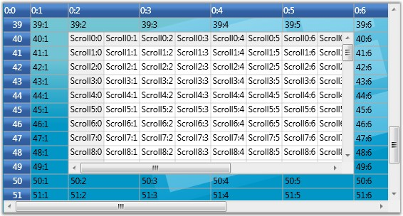
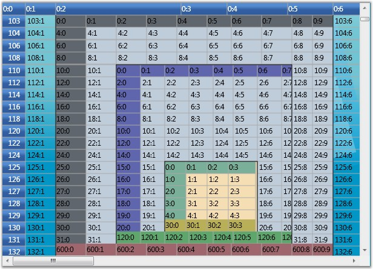
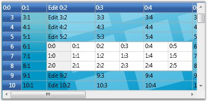

::: {style="DISPLAY: none"}
{#d2h_url_template}{#d2h_package_url style="WIDTH: 0px; DISPLAY: none; HEIGHT: 0px"}
:::

::::: {#nsbanner .d2h_main_nsbanner style="BORDER-BOTTOM: #999999 1px solid; POSITION: relative; PADDING-BOTTOM: 0px; BACKGROUND-COLOR: transparent; PADDING-LEFT: 0px; PADDING-RIGHT: 0px; DISPLAY: none; BORDER-TOP: #999999 1px solid; PADDING-TOP: 0px; LEFT: 0px"}
:::: {#TitleRow .d2h_main_titlerow style="PADDING-BOTTOM: 4px; BACKGROUND-COLOR: transparent; PADDING-LEFT: 22px; WIDTH: 100%; PADDING-RIGHT: 10px; DISPLAY: none; PADDING-TOP: 4px"}
::: {#ienav .d2h_main_ienav style="DISPLAY: none"}
{#D2HPrevious .D2HPreviousEnabled}  {#D2HNext .D2HNextEnabled}
:::
::::
:::::

:::: {#nstext .d2h_main_nstext style="PADDING-BOTTOM: 10px; BACKGROUND-COLOR: transparent; PADDING-LEFT: 22px; PADDING-RIGHT: 10px; HEIGHT: 100%; OVERFLOW: auto; PADDING-TOP: 5px" hasuserbackground="true" valign="bottom"}
::: {#d2h_breadcrumbs .d2h_breadcrumbs}
[Essential Studio User Guide Documentation](ms-xhelp:///?Id=12457748-09e3-4d74-a240-8e049cedf030){.d2h_breadcrumbsNormal}[ \> ]{.d2h_breadcrumbsLinkSeparator}[User Interface Edition](ms-xhelp:///?Id=c29296b7-531c-413b-a0ec-488ca1f7f669){.d2h_breadcrumbsNormal}[ \> ]{.d2h_breadcrumbsLinkSeparator}[Essential Silverlight](ms-xhelp:///?Id=66221bd1-ba2e-43c2-94a7-618f50e01d24){.d2h_breadcrumbsNormal}[ \> ]{.d2h_breadcrumbsLinkSeparator}[Essential Grid]{.d2h_breadcrumbsContentsOnly}[ \> ]{.d2h_breadcrumbsLinkSeparator}[Concepts and Features](ms-xhelp:///?Id=8126789d-b192-4c3c-9e36-f0119f12b8b9){.d2h_breadcrumbsNormal}[ \> ]{.d2h_breadcrumbsLinkSeparator}[Grid Control](ms-xhelp:///?Id=103363c3-4afe-437d-9f1e-5976ee438b68){.d2h_breadcrumbsNormal}
:::

###   Nested Grid Cells {#nested-grid-cells style="tab-stops: 0pt"}

[]{style="FONT-FAMILY: 'Trebuchet MS','sans-serif'; COLOR: #15428b; FONT-SIZE: 9pt"} 

Nested grids are an important component of the basic architecture of Essential Grid. They provide for the easy display of complex user interfaces using a flat grid. They also form the underpinnings for the display of hierarchical and grouped data. You can nest grids inside a row, column or covered range. When you nest a grid inside a covered range you can specify whether the rows or columns derive their state from the parent control. You have multiple independent options for both rows and columns.

[]{style="FONT-FAMILY: 'Trebuchet MS','sans-serif'; COLOR: #15428b; FONT-SIZE: 9pt"} 

API definition

[]{style="FONT-FAMILY: 'Trebuchet MS','sans-serif'; COLOR: #15428b; FONT-SIZE: 9pt"} 

GridCellNestedGridModel is the class to be used as model class for this cell type. Its constructor accepts two objects of type GridNestedAxisLayout enum, where the first parameter corresponds to row and second parameter corresponds to grid column. This enum value determines whether to share the row layout or column layout or the rows and columns are independent of parent grid.

[]{style="FONT-FAMILY: 'Trebuchet MS','sans-serif'; COLOR: #15428b; FONT-SIZE: 9pt"} 

Nested Grid inside a Row of Parent Grid

[]{style="FONT-FAMILY: 'Trebuchet MS','sans-serif'; COLOR: #15428b; FONT-SIZE: 9pt"} 

In this case, the grid will maintain its own row heights. When you resize rows the grid will also notify the parent grid that its total height is changed. While scrolling you can scroll row by row through the nested grid. The nested grid will have no separate scrollbars. They are shared with the parent grid.

[]{style="FONT-FAMILY: 'Trebuchet MS','sans-serif'; COLOR: #15428b; FONT-SIZE: 9pt"} 

Example

[]{style="FONT-FAMILY: 'Trebuchet MS','sans-serif'; COLOR: #15428b; FONT-SIZE: 9pt"} 

The code below implements a nested scroll grid. The GridCellNestedScrollGridModel is the model class to be used.

[]{style="FONT-FAMILY: 'Trebuchet MS','sans-serif'; COLOR: #15428b; FONT-SIZE: 9pt"} 

+-----------------------------------------------------------------------------------------------------------------------------------------------------------------------------------------------------------------------------------+
| **[\[C#\]]{style="FONT-FAMILY: 'Courier New'; COLOR: black"}**                                                                                                                                                                    |
|                                                                                                                                                                                                                                   |
| []{style="FONT-FAMILY: 'Courier New'; COLOR: black"}                                                                                                                                                                              |
|                                                                                                                                                                                                                                   |
| [// Add Nested Scroll Grid cell model.]{style="FONT-FAMILY: 'Courier New'; COLOR: green"}                                                                                                                                         |
|                                                                                                                                                                                                                                   |
| [GridCellNestedScrollGridModel ]{style="FONT-FAMILY: 'Courier New'; COLOR: #2b91af"}[scrollGridModel = [new]{style="COLOR: blue"} [GridCellNestedScrollGridModel]{style="COLOR: #2b91af"}();]{style="FONT-FAMILY: 'Courier New'"} |
|                                                                                                                                                                                                                                   |
| [Model.CellModels.Add([\"ScrollGrid\"]{style="COLOR: #a31515"}, scrollGridModel);]{style="FONT-FAMILY: 'Courier New'"}                                                                                                            |
|                                                                                                                                                                                                                                   |
| [Model\[40, 2\].CellType = [\"ScrollGrid\"]{style="COLOR: #a31515"};]{style="FONT-FAMILY: 'Courier New'"}                                                                                                                         |
|                                                                                                                                                                                                                                   |
| []{style="FONT-FAMILY: 'Courier New'"}                                                                                                                                                                                            |
|                                                                                                                                                                                                                                   |
| [// Create scroll nested grid.]{style="FONT-FAMILY: 'Courier New'; COLOR: green"}                                                                                                                                                 |
|                                                                                                                                                                                                                                   |
| [GridModel]{style="FONT-FAMILY: 'Courier New'; COLOR: #2b91af"}[ nestedGrid = [new]{style="COLOR: blue"} [GridModel]{style="COLOR: #2b91af"}();]{style="FONT-FAMILY: 'Courier New'"}                                              |
|                                                                                                                                                                                                                                   |
| [nestedGrid.Options.AllowSelection = [GridSelectionFlags]{style="COLOR: #2b91af"}.Cell;]{style="FONT-FAMILY: 'Courier New'"}                                                                                                      |
|                                                                                                                                                                                                                                   |
| [nestedGrid.RowHeights.DefaultLineSize = 20;]{style="FONT-FAMILY: 'Courier New'"}                                                                                                                                                 |
|                                                                                                                                                                                                                                   |
| [nestedGrid.RowCount = 50;]{style="FONT-FAMILY: 'Courier New'"}                                                                                                                                                                   |
|                                                                                                                                                                                                                                   |
| [nestedGrid.ColumnWidths.DefaultLineSize = 50;]{style="FONT-FAMILY: 'Courier New'"}                                                                                                                                               |
|                                                                                                                                                                                                                                   |
| [nestedGrid.ColumnCount = 12;]{style="FONT-FAMILY: 'Courier New'"}                                                                                                                                                                |
|                                                                                                                                                                                                                                   |
| []{style="FONT-FAMILY: 'Courier New'"}                                                                                                                                                                                            |
|                                                                                                                                                                                                                                   |
| [Brush]{style="FONT-FAMILY: 'Courier New'; COLOR: #2b91af"}[ headerBrush = ColorHelper.CreateFrozenSolidColorBrush(128, [Colors]{style="COLOR: #2b91af"}.DarkGray);]{style="FONT-FAMILY: 'Courier New'"}                          |
|                                                                                                                                                                                                                                   |
| [nestedGrid.BaseStylesMap\[[\"Header\"]{style="COLOR: #a31515"}\].StyleInfo.Background = headerBrush;]{style="FONT-FAMILY: 'Courier New'"}                                                                                        |
|                                                                                                                                                                                                                                   |
| []{style="FONT-FAMILY: 'Courier New'"}                                                                                                                                                                                            |
|                                                                                                                                                                                                                                   |
| [for]{style="FONT-FAMILY: 'Courier New'; COLOR: blue"}[ ([int]{style="COLOR: blue"} n = 0; n \< nestedGrid.RowCount; n++)]{style="FONT-FAMILY: 'Courier New'"}                                                                    |
|                                                                                                                                                                                                                                   |
| [{]{style="FONT-FAMILY: 'Courier New'"}                                                                                                                                                                                           |
|                                                                                                                                                                                                                                   |
| [    [for]{style="COLOR: blue"} ([int]{style="COLOR: blue"} c = 0; c \< nestedGrid.ColumnCount; c++)]{style="FONT-FAMILY: 'Courier New'"}                                                                                         |
|                                                                                                                                                                                                                                   |
| [    {]{style="FONT-FAMILY: 'Courier New'"}                                                                                                                                                                                       |
|                                                                                                                                                                                                                                   |
| [        [GridStyleInfo]{style="COLOR: #2b91af"} ci = [new]{style="COLOR: blue"} [GridStyleInfo]{style="COLOR: #2b91af"}();]{style="FONT-FAMILY: 'Courier New'"}                                                                  |
|                                                                                                                                                                                                                                   |
| [        ci.CellType = [\"TextBox\"]{style="COLOR: #a31515"};]{style="FONT-FAMILY: 'Courier New'"}                                                                                                                                |
|                                                                                                                                                                                                                                   |
| [        ci.CellValue = [String]{style="COLOR: #2b91af"}.Format([\"Scroll{0}:{1}\"]{style="COLOR: #a31515"}, n, c);]{style="FONT-FAMILY: 'Courier New'"}                                                                          |
|                                                                                                                                                                                                                                   |
| [        nestedGrid.Data\[n, c\] = ci.Store;]{style="FONT-FAMILY: 'Courier New'"}                                                                                                                                                 |
|                                                                                                                                                                                                                                   |
| [    }]{style="FONT-FAMILY: 'Courier New'"}                                                                                                                                                                                       |
|                                                                                                                                                                                                                                   |
| [}]{style="FONT-FAMILY: 'Courier New'"}                                                                                                                                                                                           |
|                                                                                                                                                                                                                                   |
| []{style="FONT-FAMILY: 'Courier New'"}                                                                                                                                                                                            |
|                                                                                                                                                                                                                                   |
| [Model\[40, 2\].CellValue = nestedGrid;]{style="FONT-FAMILY: 'Courier New'"}                                                                                                                                                      |
|                                                                                                                                                                                                                                   |
| [CoveredCells.Add([new]{style="COLOR: blue"} CoveredCellInfo(40, 2, 49, 5));]{style="FONT-FAMILY: 'Courier New'"}                                                                                                                 |
+-----------------------------------------------------------------------------------------------------------------------------------------------------------------------------------------------------------------------------------+

[]{style="FONT-FAMILY: 'Trebuchet MS','sans-serif'; COLOR: #15428b; FONT-SIZE: 9pt"} 

Output

**[]{style="FONT-FAMILY: 'Trebuchet MS','sans-serif'; COLOR: #15428b; FONT-SIZE: 9pt"}** 

The following output is generated using the code above.

[]{style="FONT-FAMILY: 'Trebuchet MS','sans-serif'; COLOR: #15428b; FONT-SIZE: 9pt"} 

{border="0"}

[]{style="FONT-FAMILY: 'Trebuchet MS','sans-serif'; COLOR: #15428b; FONT-SIZE: 9pt"} 

Figure 78: Nested Grid

***[]{style="FONT-FAMILY: 'Trebuchet MS','sans-serif'; COLOR: #15428b; FONT-SIZE: 9pt"}*** 

The same way you can nest a grid inside a complete row you can also nest a grid inside a whole column.

**[]{style="FONT-FAMILY: 'Trebuchet MS','sans-serif'; COLOR: #15428b"}** 

Nested Grid Inside a Covered Range with its Rows Tied to the Rows of the Parent Grid

[]{style="FONT-FAMILY: 'Trebuchet MS','sans-serif'; COLOR: #15428b; FONT-SIZE: 9pt"} 

In this case, the grid will have its own unique column widths but the row heights are shared with the parent grid. When scrolling through rows in the nested grid you also scroll the rows in the parent grid to keep them in sync. The nested grid will have no separate scrollbars. They are shared with the parent grid. When you resize rows they will also be resized in the parent grid and vice versa.

[]{style="FONT-FAMILY: 'Trebuchet MS','sans-serif'; COLOR: #15428b; FONT-SIZE: 9pt"} 

Example

[]{style="FONT-FAMILY: 'Trebuchet MS','sans-serif'; COLOR: #15428b; FONT-SIZE: 9pt"} 

The codes below show a grid whose cell contains a nested grid, which again contains a nested grid in its cell, and this second nested grid again contains a nested grid in its cell and thus forming four grids nested within one another.

[]{style="FONT-FAMILY: 'Trebuchet MS','sans-serif'; COLOR: #15428b; FONT-SIZE: 9pt"} 

To specify shared row layout, use Shared option of GridNestedAxisLayout enum in the first parameter.

[]{style="FONT-FAMILY: 'Trebuchet MS','sans-serif'; COLOR: #15428b; FONT-SIZE: 9pt"} 

+------------------------------------------------------------------------------------------------------------------------------------------------------------------------------------------------------------------------------------------------------------------------+
| **[\[C#\]]{style="FONT-FAMILY: 'Courier New'; COLOR: black"}**                                                                                                                                                                                                         |
|                                                                                                                                                                                                                                                                        |
| []{style="FONT-FAMILY: 'Courier New'"}                                                                                                                                                                                                                                 |
|                                                                                                                                                                                                                                                                        |
| [// Add appropriate Nested Grid cell model.]{style="FONT-FAMILY: 'Courier New'; COLOR: green"}                                                                                                                                                                         |
|                                                                                                                                                                                                                                                                        |
| [GridCellNestedGridModel]{style="FONT-FAMILY: 'Courier New'; COLOR: #2b91af"}[ shareRow = [new]{style="COLOR: blue"} [GridCellNestedGridModel]{style="COLOR: #2b91af"}(GridNestedAxisLayout.Shared, GridNestedAxisLayout.Normal);]{style="FONT-FAMILY: 'Courier New'"} |
|                                                                                                                                                                                                                                                                        |
| [Model.CellModels.Add([\"ShareRowLayoutGrid\"]{style="COLOR: #a31515"}, shareRow);]{style="FONT-FAMILY: 'Courier New'"}                                                                                                                                                |
|                                                                                                                                                                                                                                                                        |
| []{style="FONT-FAMILY: 'Courier New'"}                                                                                                                                                                                                                                 |
|                                                                                                                                                                                                                                                                        |
| [// Set up nested grid with shared row layout.]{style="FONT-FAMILY: 'Courier New'; COLOR: green"}                                                                                                                                                                      |
|                                                                                                                                                                                                                                                                        |
| [Model\[100, 2\].CellType = [\"ShareRowLayoutGrid\"]{style="COLOR: #a31515"};]{style="FONT-FAMILY: 'Courier New'"}                                                                                                                                                     |
|                                                                                                                                                                                                                                                                        |
| [Model\[100, 2\].BorderMargins.Top = 0;]{style="FONT-FAMILY: 'Courier New'"}                                                                                                                                                                                           |
|                                                                                                                                                                                                                                                                        |
| [Model\[100, 2\].BorderMargins.Left = 0;]{style="FONT-FAMILY: 'Courier New'"}                                                                                                                                                                                          |
|                                                                                                                                                                                                                                                                        |
| [Model\[100, 2\].BorderMargins.Right = 0;]{style="FONT-FAMILY: 'Courier New'"}                                                                                                                                                                                         |
|                                                                                                                                                                                                                                                                        |
| [Model\[100, 2\].BorderMargins.Bottom = 0;]{style="FONT-FAMILY: 'Courier New'"}                                                                                                                                                                                        |
|                                                                                                                                                                                                                                                                        |
| [Model\[100, 2\].Background = [SystemColors]{style="COLOR: #2b91af"}.InactiveCaptionBrush;]{style="FONT-FAMILY: 'Courier New'"}                                                                                                                                        |
|                                                                                                                                                                                                                                                                        |
| [GridModel]{style="FONT-FAMILY: 'Courier New'; COLOR: #2b91af"}[ nestedGridWithSharedRowsModel = GetNestedGridWithSharedRowsModel();]{style="FONT-FAMILY: 'Courier New'"}                                                                                              |
|                                                                                                                                                                                                                                                                        |
| [Model\[100, 2\].CellValue = nestedGridWithSharedRowsModel;]{style="FONT-FAMILY: 'Courier New'"}                                                                                                                                                                       |
|                                                                                                                                                                                                                                                                        |
| [CoveredCells.Add([new]{style="COLOR: blue"} CoveredCellInfo(100, 2, 100 + nestedGridWithSharedRowsModel.RowCount - 1, 5));]{style="FONT-FAMILY: 'Courier New'"}                                                                                                       |
|                                                                                                                                                                                                                                                                        |
| []{style="FONT-FAMILY: 'Courier New'"}                                                                                                                                                                                                                                 |
|                                                                                                                                                                                                                                                                        |
| [// Set up the top level (parent) nested grid.]{style="FONT-FAMILY: 'Courier New'; COLOR: green"}                                                                                                                                                                      |
|                                                                                                                                                                                                                                                                        |
| [private]{style="FONT-FAMILY: 'Courier New'; COLOR: blue"}[ [GridModel]{style="COLOR: #2b91af"} GetNestedGridWithSharedRowsModel()]{style="FONT-FAMILY: 'Courier New'"}                                                                                                |
|                                                                                                                                                                                                                                                                        |
| [{]{style="FONT-FAMILY: 'Courier New'"}                                                                                                                                                                                                                                |
|                                                                                                                                                                                                                                                                        |
| [    [GridModel]{style="COLOR: #2b91af"} model = [new]{style="COLOR: blue"} [GridModel]{style="COLOR: #2b91af"}();]{style="FONT-FAMILY: 'Courier New'"}                                                                                                                |
|                                                                                                                                                                                                                                                                        |
| []{style="FONT-FAMILY: 'Courier New'"}                                                                                                                                                                                                                                 |
|                                                                                                                                                                                                                                                                        |
| [    [Pen]{style="COLOR: #2b91af"} gridLinePen = [new]{style="COLOR: blue"} [Pen]{style="COLOR: #2b91af"}(Brushes.DarkGray, 1);]{style="FONT-FAMILY: 'Courier New'"}                                                                                                   |
|                                                                                                                                                                                                                                                                        |
| [    gridLinePen.Freeze();]{style="FONT-FAMILY: 'Courier New'"}                                                                                                                                                                                                        |
|                                                                                                                                                                                                                                                                        |
| []{style="FONT-FAMILY: 'Courier New'"}                                                                                                                                                                                                                                 |
|                                                                                                                                                                                                                                                                        |
| [    model.Options.AllowSelection = [GridSelectionFlags]{style="COLOR: #2b91af"}.Cell;]{style="FONT-FAMILY: 'Courier New'"}                                                                                                                                            |
|                                                                                                                                                                                                                                                                        |
| [    model.ColumnWidths.DefaultLineSize = 50;]{style="FONT-FAMILY: 'Courier New'"}                                                                                                                                                                                     |
|                                                                                                                                                                                                                                                                        |
| [    model.ColumnWidths.HeaderLineCount = 1;]{style="FONT-FAMILY: 'Courier New'"}                                                                                                                                                                                      |
|                                                                                                                                                                                                                                                                        |
| [    model.ColumnCount = 12;]{style="FONT-FAMILY: 'Courier New'"}                                                                                                                                                                                                      |
|                                                                                                                                                                                                                                                                        |
| []{style="FONT-FAMILY: 'Courier New'"}                                                                                                                                                                                                                                 |
|                                                                                                                                                                                                                                                                        |
| [    model.RowHeights.HeaderLineCount = 1;]{style="FONT-FAMILY: 'Courier New'"}                                                                                                                                                                                        |
|                                                                                                                                                                                                                                                                        |
| [    model.RowHeights.FooterLineCount = 1;]{style="FONT-FAMILY: 'Courier New'"}                                                                                                                                                                                        |
|                                                                                                                                                                                                                                                                        |
| [    model.RowCount = 601; ]{style="FONT-FAMILY: 'Courier New'"}                                                                                                                                                                                                       |
|                                                                                                                                                                                                                                                                        |
| [    [Color]{style="COLOR: #2b91af"} clr = [Color]{style="COLOR: #2b91af"}.FromArgb(128, 0, 0, 0);]{style="FONT-FAMILY: 'Courier New'"}                                                                                                                                |
|                                                                                                                                                                                                                                                                        |
| [    [Brush]{style="COLOR: #2b91af"} headerBrush = [new]{style="COLOR: blue"} [SolidColorBrush]{style="COLOR: #2b91af"}(clr);]{style="FONT-FAMILY: 'Courier New'"}                                                                                                     |
|                                                                                                                                                                                                                                                                        |
| [    headerBrush.Freeze();]{style="FONT-FAMILY: 'Courier New'"}                                                                                                                                                                                                        |
|                                                                                                                                                                                                                                                                        |
| []{style="FONT-FAMILY: 'Courier New'"}                                                                                                                                                                                                                                 |
|                                                                                                                                                                                                                                                                        |
| [    [Color]{style="COLOR: #2b91af"} clr2 = [Color]{style="COLOR: #2b91af"}.FromArgb(128, 128, 0, 0);]{style="FONT-FAMILY: 'Courier New'"}                                                                                                                             |
|                                                                                                                                                                                                                                                                        |
| [    [Brush]{style="COLOR: #2b91af"} footerBrush = [new]{style="COLOR: blue"} [SolidColorBrush]{style="COLOR: #2b91af"}(clr2);]{style="FONT-FAMILY: 'Courier New'"}                                                                                                    |
|                                                                                                                                                                                                                                                                        |
| [    footerBrush.Freeze();]{style="FONT-FAMILY: 'Courier New'"}                                                                                                                                                                                                        |
|                                                                                                                                                                                                                                                                        |
| []{style="FONT-FAMILY: 'Courier New'"}                                                                                                                                                                                                                                 |
|                                                                                                                                                                                                                                                                        |
| [    [for]{style="COLOR: blue"} ([int]{style="COLOR: blue"} n = 0; n \< model.RowCount; n++)]{style="FONT-FAMILY: 'Courier New'"}                                                                                                                                      |
|                                                                                                                                                                                                                                                                        |
| [    {]{style="FONT-FAMILY: 'Courier New'"}                                                                                                                                                                                                                            |
|                                                                                                                                                                                                                                                                        |
| [        [for]{style="COLOR: blue"} ([int]{style="COLOR: blue"} c = 0; c \< model.ColumnCount; c++)]{style="FONT-FAMILY: 'Courier New'"}                                                                                                                               |
|                                                                                                                                                                                                                                                                        |
| [        {]{style="FONT-FAMILY: 'Courier New'"}                                                                                                                                                                                                                        |
|                                                                                                                                                                                                                                                                        |
| [            [GridStyleInfo]{style="COLOR: #2b91af"} ci = [new]{style="COLOR: blue"} [GridStyleInfo]{style="COLOR: #2b91af"}();]{style="FONT-FAMILY: 'Courier New'"}                                                                                                   |
|                                                                                                                                                                                                                                                                        |
| [            ci.CellType = [\"TextBox\"]{style="COLOR: #a31515"};]{style="FONT-FAMILY: 'Courier New'"}                                                                                                                                                                 |
|                                                                                                                                                                                                                                                                        |
| [            ci.CellValue = [String]{style="COLOR: #2b91af"}.Format([\"{0}:{1}\"]{style="COLOR: #a31515"}, n, c);]{style="FONT-FAMILY: 'Courier New'"}                                                                                                                 |
|                                                                                                                                                                                                                                                                        |
| [            ci.BorderMargins.Top = gridLinePen.Thickness;]{style="FONT-FAMILY: 'Courier New'"}                                                                                                                                                                        |
|                                                                                                                                                                                                                                                                        |
| [            ci.BorderMargins.Left = gridLinePen.Thickness;]{style="FONT-FAMILY: 'Courier New'"}                                                                                                                                                                       |
|                                                                                                                                                                                                                                                                        |
| [            ci.BorderMargins.Right = gridLinePen.Thickness / 2;]{style="FONT-FAMILY: 'Courier New'"}                                                                                                                                                                  |
|                                                                                                                                                                                                                                                                        |
| [            ci.BorderMargins.Bottom = gridLinePen.Thickness / 2;]{style="FONT-FAMILY: 'Courier New'"}                                                                                                                                                                 |
|                                                                                                                                                                                                                                                                        |
| [            ci.Borders.Right = gridLinePen;]{style="FONT-FAMILY: 'Courier New'"}                                                                                                                                                                                      |
|                                                                                                                                                                                                                                                                        |
| [            ci.Background = [null]{style="COLOR: blue"};]{style="FONT-FAMILY: 'Courier New'"}                                                                                                                                                                         |
|                                                                                                                                                                                                                                                                        |
| [            ci.Borders.Bottom = gridLinePen;]{style="FONT-FAMILY: 'Courier New'"}                                                                                                                                                                                     |
|                                                                                                                                                                                                                                                                        |
| [            model.Data\[n, c\] = ci.Store;]{style="FONT-FAMILY: 'Courier New'"}                                                                                                                                                                                       |
|                                                                                                                                                                                                                                                                        |
| []{style="FONT-FAMILY: 'Courier New'"}                                                                                                                                                                                                                                 |
|                                                                                                                                                                                                                                                                        |
| [            [if]{style="COLOR: blue"} (c == 0 \|\| n == 0)]{style="FONT-FAMILY: 'Courier New'"}                                                                                                                                                                       |
|                                                                                                                                                                                                                                                                        |
| [            {]{style="FONT-FAMILY: 'Courier New'"}                                                                                                                                                                                                                    |
|                                                                                                                                                                                                                                                                        |
| [                ci.CellType = [\"Static\"]{style="COLOR: #a31515"};]{style="FONT-FAMILY: 'Courier New'"}                                                                                                                                                              |
|                                                                                                                                                                                                                                                                        |
| [                ci.Background = headerBrush;]{style="FONT-FAMILY: 'Courier New'"}                                                                                                                                                                                     |
|                                                                                                                                                                                                                                                                        |
| [            }]{style="FONT-FAMILY: 'Courier New'"}                                                                                                                                                                                                                    |
|                                                                                                                                                                                                                                                                        |
| []{style="FONT-FAMILY: 'Courier New'"}                                                                                                                                                                                                                                 |
|                                                                                                                                                                                                                                                                        |
| [            [if]{style="COLOR: blue"} (n == model.RowCount - 1)]{style="FONT-FAMILY: 'Courier New'"}                                                                                                                                                                  |
|                                                                                                                                                                                                                                                                        |
| [            {]{style="FONT-FAMILY: 'Courier New'"}                                                                                                                                                                                                                    |
|                                                                                                                                                                                                                                                                        |
| [                ci.CellType = [\"Static\"]{style="COLOR: #a31515"};]{style="FONT-FAMILY: 'Courier New'"}                                                                                                                                                              |
|                                                                                                                                                                                                                                                                        |
| [                ci.Background = footerBrush;]{style="FONT-FAMILY: 'Courier New'"}                                                                                                                                                                                     |
|                                                                                                                                                                                                                                                                        |
| [            }]{style="FONT-FAMILY: 'Courier New'"}                                                                                                                                                                                                                    |
|                                                                                                                                                                                                                                                                        |
| [        }]{style="FONT-FAMILY: 'Courier New'"}                                                                                                                                                                                                                        |
|                                                                                                                                                                                                                                                                        |
| [    }]{style="FONT-FAMILY: 'Courier New'"}                                                                                                                                                                                                                            |
|                                                                                                                                                                                                                                                                        |
| []{style="FONT-FAMILY: 'Courier New'"}                                                                                                                                                                                                                                 |
|                                                                                                                                                                                                                                                                        |
| [    [GridModel]{style="COLOR: #2b91af"} nestedGridWithSharedRowsModel = GetSecondNestedGridWithSharedRowsModel();]{style="FONT-FAMILY: 'Courier New'"}                                                                                                                |
|                                                                                                                                                                                                                                                                        |
| [    model\[10, 2\].CellType = [\"ShareRowLayoutGrid\"]{style="COLOR: #a31515"};]{style="FONT-FAMILY: 'Courier New'"}                                                                                                                                                  |
|                                                                                                                                                                                                                                                                        |
| [    model\[10, 2\].BorderMargins.Top = 0;]{style="FONT-FAMILY: 'Courier New'"}                                                                                                                                                                                        |
|                                                                                                                                                                                                                                                                        |
| [    model\[10, 2\].BorderMargins.Left = 0;]{style="FONT-FAMILY: 'Courier New'"}                                                                                                                                                                                       |
|                                                                                                                                                                                                                                                                        |
| [    model\[10, 2\].BorderMargins.Right = 0;]{style="FONT-FAMILY: 'Courier New'"}                                                                                                                                                                                      |
|                                                                                                                                                                                                                                                                        |
| [    model\[10, 2\].BorderMargins.Bottom = 0;]{style="FONT-FAMILY: 'Courier New'"}                                                                                                                                                                                     |
|                                                                                                                                                                                                                                                                        |
| [    model\[10, 2\].Background = [SystemColors]{style="COLOR: #2b91af"}.InactiveCaptionBrush;]{style="FONT-FAMILY: 'Courier New'"}                                                                                                                                     |
|                                                                                                                                                                                                                                                                        |
| []{style="FONT-FAMILY: 'Courier New'"}                                                                                                                                                                                                                                 |
|                                                                                                                                                                                                                                                                        |
| [    [// Creates a nested grid for second level.]{style="COLOR: green"}]{style="FONT-FAMILY: 'Courier New'"}                                                                                                                                                           |
|                                                                                                                                                                                                                                                                        |
| [    model\[10, 2\].CellValue = nestedGridWithSharedRowsModel;]{style="FONT-FAMILY: 'Courier New'"}                                                                                                                                                                    |
|                                                                                                                                                                                                                                                                        |
| [    model.CoveredCells.Add([new]{style="COLOR: blue"} CoveredCellInfo(10, 2, 10 + nestedGridWithSharedRowsModel.RowCount - 1, 7));]{style="FONT-FAMILY: 'Courier New'"}                                                                                               |
|                                                                                                                                                                                                                                                                        |
| [    model.SelectedCells = [GridRangeInfo]{style="COLOR: #2b91af"}.Empty;]{style="FONT-FAMILY: 'Courier New'"}                                                                                                                                                         |
|                                                                                                                                                                                                                                                                        |
| [    [return]{style="COLOR: blue"} model;]{style="FONT-FAMILY: 'Courier New'"}                                                                                                                                                                                         |
|                                                                                                                                                                                                                                                                        |
| [}]{style="FONT-FAMILY: 'Courier New'"}                                                                                                                                                                                                                                |
|                                                                                                                                                                                                                                                                        |
| []{style="FONT-FAMILY: 'Courier New'"}                                                                                                                                                                                                                                 |
|                                                                                                                                                                                                                                                                        |
| [// Set up the second level nested grid.]{style="FONT-FAMILY: 'Courier New'; COLOR: green"}                                                                                                                                                                            |
|                                                                                                                                                                                                                                                                        |
| [private]{style="FONT-FAMILY: 'Courier New'; COLOR: blue"}[ [GridModel]{style="COLOR: #2b91af"} GetSecondNestedGridWithSharedRowsModel()]{style="FONT-FAMILY: 'Courier New'"}                                                                                          |
|                                                                                                                                                                                                                                                                        |
| [{]{style="FONT-FAMILY: 'Courier New'"}                                                                                                                                                                                                                                |
|                                                                                                                                                                                                                                                                        |
| [    [GridModel]{style="COLOR: #2b91af"} model = [new]{style="COLOR: blue"} [GridModel]{style="COLOR: #2b91af"}();]{style="FONT-FAMILY: 'Courier New'"}                                                                                                                |
|                                                                                                                                                                                                                                                                        |
| []{style="FONT-FAMILY: 'Courier New'"}                                                                                                                                                                                                                                 |
|                                                                                                                                                                                                                                                                        |
| [    [Pen]{style="COLOR: #2b91af"} gridLinePen = [new]{style="COLOR: blue"} [Pen]{style="COLOR: #2b91af"}(Brushes.DarkGray, 1);]{style="FONT-FAMILY: 'Courier New'"}                                                                                                   |
|                                                                                                                                                                                                                                                                        |
| [    gridLinePen.Freeze();]{style="FONT-FAMILY: 'Courier New'"}                                                                                                                                                                                                        |
|                                                                                                                                                                                                                                                                        |
| []{style="FONT-FAMILY: 'Courier New'"}                                                                                                                                                                                                                                 |
|                                                                                                                                                                                                                                                                        |
| [    model.Options.AllowSelection = [GridSelectionFlags]{style="COLOR: #2b91af"}.Cell;]{style="FONT-FAMILY: 'Courier New'"}                                                                                                                                            |
|                                                                                                                                                                                                                                                                        |
| [    model.ColumnWidths.DefaultLineSize = 40;]{style="FONT-FAMILY: 'Courier New'"}                                                                                                                                                                                     |
|                                                                                                                                                                                                                                                                        |
| [    model.ColumnWidths.HeaderLineCount = 1;]{style="FONT-FAMILY: 'Courier New'"}                                                                                                                                                                                      |
|                                                                                                                                                                                                                                                                        |
| [    model.ColumnCount = 8;]{style="FONT-FAMILY: 'Courier New'"}                                                                                                                                                                                                       |
|                                                                                                                                                                                                                                                                        |
| []{style="FONT-FAMILY: 'Courier New'"}                                                                                                                                                                                                                                 |
|                                                                                                                                                                                                                                                                        |
| [    model.RowHeights.HeaderLineCount = 1;]{style="FONT-FAMILY: 'Courier New'"}                                                                                                                                                                                        |
|                                                                                                                                                                                                                                                                        |
| [    model.RowHeights.FooterLineCount = 1;]{style="FONT-FAMILY: 'Courier New'"}                                                                                                                                                                                        |
|                                                                                                                                                                                                                                                                        |
| [    model.RowCount = 121;]{style="FONT-FAMILY: 'Courier New'"}                                                                                                                                                                                                        |
|                                                                                                                                                                                                                                                                        |
| []{style="FONT-FAMILY: 'Courier New'"}                                                                                                                                                                                                                                 |
|                                                                                                                                                                                                                                                                        |
| [    [Color]{style="COLOR: #2b91af"} clr = [Color]{style="COLOR: #2b91af"}.FromArgb(128, 0, 0,128);]{style="FONT-FAMILY: 'Courier New'"}                                                                                                                               |
|                                                                                                                                                                                                                                                                        |
| [    [Brush]{style="COLOR: #2b91af"} headerBrush = [new]{style="COLOR: blue"} [SolidColorBrush]{style="COLOR: #2b91af"}(clr);]{style="FONT-FAMILY: 'Courier New'"}                                                                                                     |
|                                                                                                                                                                                                                                                                        |
| [    headerBrush.Freeze();]{style="FONT-FAMILY: 'Courier New'"}                                                                                                                                                                                                        |
|                                                                                                                                                                                                                                                                        |
| []{style="FONT-FAMILY: 'Courier New'"}                                                                                                                                                                                                                                 |
|                                                                                                                                                                                                                                                                        |
| [    [Color]{style="COLOR: #2b91af"} clr2 = [Color]{style="COLOR: #2b91af"}.FromArgb(128, 0, 128, 0);]{style="FONT-FAMILY: 'Courier New'"}                                                                                                                             |
|                                                                                                                                                                                                                                                                        |
| [    [Brush]{style="COLOR: #2b91af"} footerBrush = [new]{style="COLOR: blue"} [SolidColorBrush]{style="COLOR: #2b91af"}(clr2);]{style="FONT-FAMILY: 'Courier New'"}                                                                                                    |
|                                                                                                                                                                                                                                                                        |
| [    footerBrush.Freeze();]{style="FONT-FAMILY: 'Courier New'"}                                                                                                                                                                                                        |
|                                                                                                                                                                                                                                                                        |
| []{style="FONT-FAMILY: 'Courier New'"}                                                                                                                                                                                                                                 |
|                                                                                                                                                                                                                                                                        |
| [    [for]{style="COLOR: blue"} ([int]{style="COLOR: blue"} n = 0; n \< model.RowCount; n++)]{style="FONT-FAMILY: 'Courier New'"}                                                                                                                                      |
|                                                                                                                                                                                                                                                                        |
| [    {]{style="FONT-FAMILY: 'Courier New'"}                                                                                                                                                                                                                            |
|                                                                                                                                                                                                                                                                        |
| [        [for]{style="COLOR: blue"} ([int]{style="COLOR: blue"} c = 0; c \< model.ColumnCount; c++)]{style="FONT-FAMILY: 'Courier New'"}                                                                                                                               |
|                                                                                                                                                                                                                                                                        |
| [        {]{style="FONT-FAMILY: 'Courier New'"}                                                                                                                                                                                                                        |
|                                                                                                                                                                                                                                                                        |
| [            [GridStyleInfo]{style="COLOR: #2b91af"} ci = [new]{style="COLOR: blue"} [GridStyleInfo]{style="COLOR: #2b91af"}();]{style="FONT-FAMILY: 'Courier New'"}                                                                                                   |
|                                                                                                                                                                                                                                                                        |
| [            ci.CellType = [\"TextBox\"]{style="COLOR: #a31515"};]{style="FONT-FAMILY: 'Courier New'"}                                                                                                                                                                 |
|                                                                                                                                                                                                                                                                        |
| [            ci.CellValue = [String]{style="COLOR: #2b91af"}.Format([\"{0}:{1}\"]{style="COLOR: #a31515"}, n, c);]{style="FONT-FAMILY: 'Courier New'"}                                                                                                                 |
|                                                                                                                                                                                                                                                                        |
| [            ci.BorderMargins.Top = gridLinePen.Thickness;]{style="FONT-FAMILY: 'Courier New'"}                                                                                                                                                                        |
|                                                                                                                                                                                                                                                                        |
| [            ci.BorderMargins.Left = gridLinePen.Thickness;]{style="FONT-FAMILY: 'Courier New'"}                                                                                                                                                                       |
|                                                                                                                                                                                                                                                                        |
| [            ci.BorderMargins.Right = gridLinePen.Thickness / 2;]{style="FONT-FAMILY: 'Courier New'"}                                                                                                                                                                  |
|                                                                                                                                                                                                                                                                        |
| [            ci.BorderMargins.Bottom = gridLinePen.Thickness / 2;]{style="FONT-FAMILY: 'Courier New'"}                                                                                                                                                                 |
|                                                                                                                                                                                                                                                                        |
| [            ci.Borders.Right = gridLinePen;]{style="FONT-FAMILY: 'Courier New'"}                                                                                                                                                                                      |
|                                                                                                                                                                                                                                                                        |
| [            ci.Background = [null]{style="COLOR: blue"};]{style="FONT-FAMILY: 'Courier New'"}                                                                                                                                                                         |
|                                                                                                                                                                                                                                                                        |
| [            ci.Borders.Bottom = gridLinePen;]{style="FONT-FAMILY: 'Courier New'"}                                                                                                                                                                                     |
|                                                                                                                                                                                                                                                                        |
| [            model.Data\[n, c\] = ci.Store;]{style="FONT-FAMILY: 'Courier New'"}                                                                                                                                                                                       |
|                                                                                                                                                                                                                                                                        |
| []{style="FONT-FAMILY: 'Courier New'"}                                                                                                                                                                                                                                 |
|                                                                                                                                                                                                                                                                        |
| [            [if]{style="COLOR: blue"} (c == 0 \|\| n == 0)]{style="FONT-FAMILY: 'Courier New'"}                                                                                                                                                                       |
|                                                                                                                                                                                                                                                                        |
| [            {]{style="FONT-FAMILY: 'Courier New'"}                                                                                                                                                                                                                    |
|                                                                                                                                                                                                                                                                        |
| [                ci.CellType = [\"Static\"]{style="COLOR: #a31515"};]{style="FONT-FAMILY: 'Courier New'"}                                                                                                                                                              |
|                                                                                                                                                                                                                                                                        |
| [                ci.Background = headerBrush;]{style="FONT-FAMILY: 'Courier New'"}                                                                                                                                                                                     |
|                                                                                                                                                                                                                                                                        |
| [            }]{style="FONT-FAMILY: 'Courier New'"}                                                                                                                                                                                                                    |
|                                                                                                                                                                                                                                                                        |
| []{style="FONT-FAMILY: 'Courier New'"}                                                                                                                                                                                                                                 |
|                                                                                                                                                                                                                                                                        |
| [            [if]{style="COLOR: blue"} (n == model.RowCount - 1)]{style="FONT-FAMILY: 'Courier New'"}                                                                                                                                                                  |
|                                                                                                                                                                                                                                                                        |
| [            {]{style="FONT-FAMILY: 'Courier New'"}                                                                                                                                                                                                                    |
|                                                                                                                                                                                                                                                                        |
| [                ci.CellType = [\"Static\"]{style="COLOR: #a31515"};]{style="FONT-FAMILY: 'Courier New'"}                                                                                                                                                              |
|                                                                                                                                                                                                                                                                        |
| [                ci.Background = footerBrush;]{style="FONT-FAMILY: 'Courier New'"}                                                                                                                                                                                     |
|                                                                                                                                                                                                                                                                        |
| [            }]{style="FONT-FAMILY: 'Courier New'"}                                                                                                                                                                                                                    |
|                                                                                                                                                                                                                                                                        |
| [        }]{style="FONT-FAMILY: 'Courier New'"}                                                                                                                                                                                                                        |
|                                                                                                                                                                                                                                                                        |
| [    }]{style="FONT-FAMILY: 'Courier New'"}                                                                                                                                                                                                                            |
|                                                                                                                                                                                                                                                                        |
| []{style="FONT-FAMILY: 'Courier New'"}                                                                                                                                                                                                                                 |
|                                                                                                                                                                                                                                                                        |
| [    [GridModel]{style="COLOR: #2b91af"} nestedGridWithSharedRowsModel = GetThirdNestedGridWithSharedRowsModel();]{style="FONT-FAMILY: 'Courier New'"}                                                                                                                 |
|                                                                                                                                                                                                                                                                        |
| [    model\[15, 2\].CellType = [\"ShareRowLayoutGrid\"]{style="COLOR: #a31515"};]{style="FONT-FAMILY: 'Courier New'"}                                                                                                                                                  |
|                                                                                                                                                                                                                                                                        |
| [    model\[15, 2\].BorderMargins.Top = 0;]{style="FONT-FAMILY: 'Courier New'"}                                                                                                                                                                                        |
|                                                                                                                                                                                                                                                                        |
| [    model\[15, 2\].BorderMargins.Left = 0;]{style="FONT-FAMILY: 'Courier New'"}                                                                                                                                                                                       |
|                                                                                                                                                                                                                                                                        |
| [    model\[15, 2\].BorderMargins.Right = 0;]{style="FONT-FAMILY: 'Courier New'"}                                                                                                                                                                                      |
|                                                                                                                                                                                                                                                                        |
| [    model\[15, 2\].BorderMargins.Bottom = 0;]{style="FONT-FAMILY: 'Courier New'"}                                                                                                                                                                                     |
|                                                                                                                                                                                                                                                                        |
| [    model\[15, 2\].Background = Brushes.Wheat;]{style="FONT-FAMILY: 'Courier New'"}                                                                                                                                                                                   |
|                                                                                                                                                                                                                                                                        |
| []{style="FONT-FAMILY: 'Courier New'"}                                                                                                                                                                                                                                 |
|                                                                                                                                                                                                                                                                        |
| [    [// Creates a nested grid for third level.]{style="COLOR: green"}]{style="FONT-FAMILY: 'Courier New'"}                                                                                                                                                            |
|                                                                                                                                                                                                                                                                        |
| [    model\[15, 2\].CellValue = nestedGridWithSharedRowsModel;]{style="FONT-FAMILY: 'Courier New'"}                                                                                                                                                                    |
|                                                                                                                                                                                                                                                                        |
| [    model.CoveredCells.Add([new]{style="COLOR: blue"} CoveredCellInfo(15, 2, 15 + nestedGridWithSharedRowsModel.RowCount - 1, 5));]{style="FONT-FAMILY: 'Courier New'"}                                                                                               |
|                                                                                                                                                                                                                                                                        |
| [    model.SelectedCells = [GridRangeInfo]{style="COLOR: #2b91af"}.Empty;]{style="FONT-FAMILY: 'Courier New'"}                                                                                                                                                         |
|                                                                                                                                                                                                                                                                        |
| [    [return]{style="COLOR: blue"} model;]{style="FONT-FAMILY: 'Courier New'"}                                                                                                                                                                                         |
|                                                                                                                                                                                                                                                                        |
| [}]{style="FONT-FAMILY: 'Courier New'"}                                                                                                                                                                                                                                |
|                                                                                                                                                                                                                                                                        |
| []{style="FONT-FAMILY: 'Courier New'"}                                                                                                                                                                                                                                 |
|                                                                                                                                                                                                                                                                        |
| [// Set up the third level nested grid.]{style="FONT-FAMILY: 'Courier New'; COLOR: green"}                                                                                                                                                                             |
|                                                                                                                                                                                                                                                                        |
| [private]{style="FONT-FAMILY: 'Courier New'; COLOR: blue"}[ [GridModel]{style="COLOR: #2b91af"} GetThirdNestedGridWithSharedRowsModel()]{style="FONT-FAMILY: 'Courier New'"}                                                                                           |
|                                                                                                                                                                                                                                                                        |
| [{]{style="FONT-FAMILY: 'Courier New'"}                                                                                                                                                                                                                                |
|                                                                                                                                                                                                                                                                        |
| [    [GridModel]{style="COLOR: #2b91af"} model = [new]{style="COLOR: blue"} [GridModel]{style="COLOR: #2b91af"}();]{style="FONT-FAMILY: 'Courier New'"}                                                                                                                |
|                                                                                                                                                                                                                                                                        |
| []{style="FONT-FAMILY: 'Courier New'"}                                                                                                                                                                                                                                 |
|                                                                                                                                                                                                                                                                        |
| [    [Pen]{style="COLOR: #2b91af"} gridLinePen = [new]{style="COLOR: blue"} [Pen]{style="COLOR: #2b91af"}(Brushes.DarkGray, 1);]{style="FONT-FAMILY: 'Courier New'"}                                                                                                   |
|                                                                                                                                                                                                                                                                        |
| [    gridLinePen.Freeze();]{style="FONT-FAMILY: 'Courier New'"}                                                                                                                                                                                                        |
|                                                                                                                                                                                                                                                                        |
| []{style="FONT-FAMILY: 'Courier New'"}                                                                                                                                                                                                                                 |
|                                                                                                                                                                                                                                                                        |
| [    model.Options.AllowSelection = [GridSelectionFlags]{style="COLOR: #2b91af"}.Cell;]{style="FONT-FAMILY: 'Courier New'"}                                                                                                                                            |
|                                                                                                                                                                                                                                                                        |
| [    model.ColumnWidths.DefaultLineSize = 35;]{style="FONT-FAMILY: 'Courier New'"}                                                                                                                                                                                     |
|                                                                                                                                                                                                                                                                        |
| [    model.ColumnWidths.HeaderLineCount = 1;]{style="FONT-FAMILY: 'Courier New'"}                                                                                                                                                                                      |
|                                                                                                                                                                                                                                                                        |
| [    model.ColumnCount = 4;]{style="FONT-FAMILY: 'Courier New'"}                                                                                                                                                                                                       |
|                                                                                                                                                                                                                                                                        |
| []{style="FONT-FAMILY: 'Courier New'"}                                                                                                                                                                                                                                 |
|                                                                                                                                                                                                                                                                        |
| [    model.RowHeights.HeaderLineCount = 1;]{style="FONT-FAMILY: 'Courier New'"}                                                                                                                                                                                        |
|                                                                                                                                                                                                                                                                        |
| [    model.RowHeights.FooterLineCount = 1;]{style="FONT-FAMILY: 'Courier New'"}                                                                                                                                                                                        |
|                                                                                                                                                                                                                                                                        |
| [    model.RowCount = 31;]{style="FONT-FAMILY: 'Courier New'"}                                                                                                                                                                                                         |
|                                                                                                                                                                                                                                                                        |
| []{style="FONT-FAMILY: 'Courier New'"}                                                                                                                                                                                                                                 |
|                                                                                                                                                                                                                                                                        |
| [    [Color]{style="COLOR: #2b91af"} clr = [Color]{style="COLOR: #2b91af"}.FromArgb(128, 0, 128, 128);]{style="FONT-FAMILY: 'Courier New'"}                                                                                                                            |
|                                                                                                                                                                                                                                                                        |
| [    [Brush]{style="COLOR: #2b91af"} headerBrush = [new]{style="COLOR: blue"} [SolidColorBrush]{style="COLOR: #2b91af"}(clr);]{style="FONT-FAMILY: 'Courier New'"}                                                                                                     |
|                                                                                                                                                                                                                                                                        |
| [    headerBrush.Freeze();]{style="FONT-FAMILY: 'Courier New'"}                                                                                                                                                                                                        |
|                                                                                                                                                                                                                                                                        |
| []{style="FONT-FAMILY: 'Courier New'"}                                                                                                                                                                                                                                 |
|                                                                                                                                                                                                                                                                        |
| [    [Color]{style="COLOR: #2b91af"} clr2 = [Color]{style="COLOR: #2b91af"}.FromArgb(128, 128, 128, 0);]{style="FONT-FAMILY: 'Courier New'"}                                                                                                                           |
|                                                                                                                                                                                                                                                                        |
| [    [Brush]{style="COLOR: #2b91af"} footerBrush = [new]{style="COLOR: blue"} [SolidColorBrush]{style="COLOR: #2b91af"}(clr2);]{style="FONT-FAMILY: 'Courier New'"}                                                                                                    |
|                                                                                                                                                                                                                                                                        |
| [    footerBrush.Freeze();]{style="FONT-FAMILY: 'Courier New'"}                                                                                                                                                                                                        |
|                                                                                                                                                                                                                                                                        |
| []{style="FONT-FAMILY: 'Courier New'"}                                                                                                                                                                                                                                 |
|                                                                                                                                                                                                                                                                        |
| [    [for]{style="COLOR: blue"} ([int]{style="COLOR: blue"} n = 0; n \< model.RowCount; n++)]{style="FONT-FAMILY: 'Courier New'"}                                                                                                                                      |
|                                                                                                                                                                                                                                                                        |
| [    {]{style="FONT-FAMILY: 'Courier New'"}                                                                                                                                                                                                                            |
|                                                                                                                                                                                                                                                                        |
| [        [for]{style="COLOR: blue"} ([int]{style="COLOR: blue"} c = 0; c \< model.ColumnCount; c++)]{style="FONT-FAMILY: 'Courier New'"}                                                                                                                               |
|                                                                                                                                                                                                                                                                        |
| [        {]{style="FONT-FAMILY: 'Courier New'"}                                                                                                                                                                                                                        |
|                                                                                                                                                                                                                                                                        |
| [            [GridStyleInfo]{style="COLOR: #2b91af"} ci = [new]{style="COLOR: blue"} [GridStyleInfo]{style="COLOR: #2b91af"}();]{style="FONT-FAMILY: 'Courier New'"}                                                                                                   |
|                                                                                                                                                                                                                                                                        |
| [            ci.CellType = [\"TextBox\"]{style="COLOR: #a31515"};]{style="FONT-FAMILY: 'Courier New'"}                                                                                                                                                                 |
|                                                                                                                                                                                                                                                                        |
| [            ci.CellValue = [String]{style="COLOR: #2b91af"}.Format([\"{0}:{1}\"]{style="COLOR: #a31515"}, n, c);]{style="FONT-FAMILY: 'Courier New'"}                                                                                                                 |
|                                                                                                                                                                                                                                                                        |
| [            ci.BorderMargins.Top = gridLinePen.Thickness;]{style="FONT-FAMILY: 'Courier New'"}                                                                                                                                                                        |
|                                                                                                                                                                                                                                                                        |
| [            ci.BorderMargins.Left = gridLinePen.Thickness;]{style="FONT-FAMILY: 'Courier New'"}                                                                                                                                                                       |
|                                                                                                                                                                                                                                                                        |
| [            ci.BorderMargins.Right = gridLinePen.Thickness / 2;]{style="FONT-FAMILY: 'Courier New'"}                                                                                                                                                                  |
|                                                                                                                                                                                                                                                                        |
| [            ci.BorderMargins.Bottom = gridLinePen.Thickness / 2;]{style="FONT-FAMILY: 'Courier New'"}                                                                                                                                                                 |
|                                                                                                                                                                                                                                                                        |
| [            ci.Borders.Right = gridLinePen;]{style="FONT-FAMILY: 'Courier New'"}                                                                                                                                                                                      |
|                                                                                                                                                                                                                                                                        |
| [            ci.Background = [null]{style="COLOR: blue"};[// Brushes.White;]{style="COLOR: green"}]{style="FONT-FAMILY: 'Courier New'"}                                                                                                                                |
|                                                                                                                                                                                                                                                                        |
| [            ci.Borders.Bottom = gridLinePen;]{style="FONT-FAMILY: 'Courier New'"}                                                                                                                                                                                     |
|                                                                                                                                                                                                                                                                        |
| [            model.Data\[n, c\] = ci.Store;]{style="FONT-FAMILY: 'Courier New'"}                                                                                                                                                                                       |
|                                                                                                                                                                                                                                                                        |
| []{style="FONT-FAMILY: 'Courier New'"}                                                                                                                                                                                                                                 |
|                                                                                                                                                                                                                                                                        |
| [            [if]{style="COLOR: blue"} (c == 0 \|\| n == 0)]{style="FONT-FAMILY: 'Courier New'"}                                                                                                                                                                       |
|                                                                                                                                                                                                                                                                        |
| [            {]{style="FONT-FAMILY: 'Courier New'"}                                                                                                                                                                                                                    |
|                                                                                                                                                                                                                                                                        |
| [                ci.CellType = [\"Static\"]{style="COLOR: #a31515"};]{style="FONT-FAMILY: 'Courier New'"}                                                                                                                                                              |
|                                                                                                                                                                                                                                                                        |
| [                ci.Background = headerBrush;]{style="FONT-FAMILY: 'Courier New'"}                                                                                                                                                                                     |
|                                                                                                                                                                                                                                                                        |
| [            }]{style="FONT-FAMILY: 'Courier New'"}                                                                                                                                                                                                                    |
|                                                                                                                                                                                                                                                                        |
| []{style="FONT-FAMILY: 'Courier New'"}                                                                                                                                                                                                                                 |
|                                                                                                                                                                                                                                                                        |
| [            [if]{style="COLOR: blue"} (n == model.RowCount - 1)]{style="FONT-FAMILY: 'Courier New'"}                                                                                                                                                                  |
|                                                                                                                                                                                                                                                                        |
| [            {]{style="FONT-FAMILY: 'Courier New'"}                                                                                                                                                                                                                    |
|                                                                                                                                                                                                                                                                        |
| [                ci.CellType = [\"Static\"]{style="COLOR: #a31515"};]{style="FONT-FAMILY: 'Courier New'"}                                                                                                                                                              |
|                                                                                                                                                                                                                                                                        |
| [                ci.Background = footerBrush;]{style="FONT-FAMILY: 'Courier New'"}                                                                                                                                                                                     |
|                                                                                                                                                                                                                                                                        |
| [            }]{style="FONT-FAMILY: 'Courier New'"}                                                                                                                                                                                                                    |
|                                                                                                                                                                                                                                                                        |
| [        }]{style="FONT-FAMILY: 'Courier New'"}                                                                                                                                                                                                                        |
|                                                                                                                                                                                                                                                                        |
| [    }]{style="FONT-FAMILY: 'Courier New'"}                                                                                                                                                                                                                            |
|                                                                                                                                                                                                                                                                        |
| [    model.SelectedCells = [GridRangeInfo]{style="COLOR: #2b91af"}.Empty;]{style="FONT-FAMILY: 'Courier New'"}                                                                                                                                                         |
|                                                                                                                                                                                                                                                                        |
| [    [return]{style="COLOR: blue"} model;]{style="FONT-FAMILY: 'Courier New'"}                                                                                                                                                                                         |
|                                                                                                                                                                                                                                                                        |
| [}]{style="FONT-FAMILY: 'Courier New'"}                                                                                                                                                                                                                                |
+------------------------------------------------------------------------------------------------------------------------------------------------------------------------------------------------------------------------------------------------------------------------+

[]{style="FONT-FAMILY: 'Trebuchet MS','sans-serif'; COLOR: #15428b; FONT-SIZE: 9pt"} 

Output

**[]{style="FONT-FAMILY: 'Trebuchet MS','sans-serif'; COLOR: #15428b; FONT-SIZE: 9pt"}** 

The following output is generated using the code above.

[]{style="FONT-FAMILY: 'Trebuchet MS','sans-serif'; COLOR: #15428b; FONT-SIZE: 9pt"} 

{border="0"}

[]{style="FONT-FAMILY: 'Trebuchet MS','sans-serif'; COLOR: #15428b; FONT-SIZE: 9pt"} 

Figure 79: Nested Grid Rows tied to the Parent Grid Rows

[]{style="FONT-FAMILY: 'Trebuchet MS','sans-serif'; COLOR: #15428b; FONT-SIZE: 9pt"} 

Nested Grid Inside a Covered Range with its Columns Tied to the Columns of the Parent Grid

[]{style="FONT-FAMILY: 'Trebuchet MS','sans-serif'; COLOR: #15428b; FONT-SIZE: 9pt"} 

In this case the grid will have its own unique row height but the column widths are shared with the parent grid. When scrolling through columns in the nested grid you also scroll the columns in the parent grid to keep them in sync. The nested grid will have no scrollbars. They are shared with the parent grid. When you resize columns they will also be resized in parent grid and vice versa.

[]{style="FONT-FAMILY: 'Trebuchet MS','sans-serif'; COLOR: #15428b; FONT-SIZE: 9pt"} 

Example

[]{style="FONT-FAMILY: 'Trebuchet MS','sans-serif'; COLOR: #15428b; FONT-SIZE: 9pt"} 

To specify shared column layout, use Shared option of GridNestedAxisLayout enum in the second parameter.

[]{style="FONT-FAMILY: 'Trebuchet MS','sans-serif'; COLOR: #15428b; FONT-SIZE: 9pt"} 

+---------------------------------------------------------------------------------------------------------------------------------------------------------------------------------------------------------------------------------------------------------------------------+
| **[\[C#\]]{style="FONT-FAMILY: 'Courier New'; COLOR: black"}**                                                                                                                                                                                                            |
|                                                                                                                                                                                                                                                                           |
| []{style="FONT-FAMILY: 'Courier New'"}                                                                                                                                                                                                                                    |
|                                                                                                                                                                                                                                                                           |
| [// Add the appropriate nested grid cell model.]{style="FONT-FAMILY: 'Courier New'; COLOR: green"}                                                                                                                                                                        |
|                                                                                                                                                                                                                                                                           |
| [GridCellNestedGridModel]{style="FONT-FAMILY: 'Courier New'; COLOR: #2b91af"}[ shareColumn = [new]{style="COLOR: blue"} [GridCellNestedGridModel]{style="COLOR: #2b91af"}(GridNestedAxisLayout.Normal, GridNestedAxisLayout.Shared);]{style="FONT-FAMILY: 'Courier New'"} |
|                                                                                                                                                                                                                                                                           |
| [Model.CellModels.Add([\"ShareColumn\"]{style="COLOR: #a31515"}, shareColumnLayoutGridModel);]{style="FONT-FAMILY: 'Courier New'"}                                                                                                                                        |
|                                                                                                                                                                                                                                                                           |
| [Model\[60, 1\].CellType = [\"ShareColumnLayoutGrid\"]{style="COLOR: #a31515"};]{style="FONT-FAMILY: 'Courier New'"}                                                                                                                                                      |
|                                                                                                                                                                                                                                                                           |
| []{style="FONT-FAMILY: 'Courier New'"}                                                                                                                                                                                                                                    |
|                                                                                                                                                                                                                                                                           |
| [Model\[60, 1\].BorderMargins.Top = 0;]{style="FONT-FAMILY: 'Courier New'"}                                                                                                                                                                                               |
|                                                                                                                                                                                                                                                                           |
| [Model\[60, 1\].BorderMargins.Left = 0;]{style="FONT-FAMILY: 'Courier New'"}                                                                                                                                                                                              |
|                                                                                                                                                                                                                                                                           |
| [Model\[60, 1\].BorderMargins.Right = 0;]{style="FONT-FAMILY: 'Courier New'"}                                                                                                                                                                                             |
|                                                                                                                                                                                                                                                                           |
| [Model\[60, 1\].BorderMargins.Bottom = 0;]{style="FONT-FAMILY: 'Courier New'"}                                                                                                                                                                                            |
|                                                                                                                                                                                                                                                                           |
| [Model\[60, 1\].Background = [SystemColors]{style="COLOR: #2b91af"}.InactiveCaptionBrush;]{style="FONT-FAMILY: 'Courier New'"}                                                                                                                                            |
|                                                                                                                                                                                                                                                                           |
| [GridModel]{style="FONT-FAMILY: 'Courier New'; COLOR: #2b91af"}[ nestedGridWithSharedColumnsModel = GetNestedGridWithSharedColumnsModel();]{style="FONT-FAMILY: 'Courier New'"}                                                                                           |
|                                                                                                                                                                                                                                                                           |
| []{style="FONT-FAMILY: 'Courier New'"}                                                                                                                                                                                                                                    |
|                                                                                                                                                                                                                                                                           |
| [// Create a nested grid with shared column layout.]{style="FONT-FAMILY: 'Courier New'; COLOR: green"}                                                                                                                                                                    |
|                                                                                                                                                                                                                                                                           |
| [Model\[60, 1\].CellValue = nestedGridWithSharedColumnsModel;]{style="FONT-FAMILY: 'Courier New'"}                                                                                                                                                                        |
|                                                                                                                                                                                                                                                                           |
| [CoveredCells.Add([new]{style="COLOR: blue"} CoveredCellInfo(60, 1, 80, 1 + nestedGridWithSharedColumnsModel.ColumnCount - 1));]{style="FONT-FAMILY: 'Courier New'"}                                                                                                      |
|                                                                                                                                                                                                                                                                           |
| []{style="FONT-FAMILY: 'Courier New'"}                                                                                                                                                                                                                                    |
|                                                                                                                                                                                                                                                                           |
| [// Set up a nested grid with column layout shared.]{style="FONT-FAMILY: 'Courier New'; COLOR: green"}                                                                                                                                                                    |
|                                                                                                                                                                                                                                                                           |
| [private]{style="FONT-FAMILY: 'Courier New'; COLOR: blue"}[ [GridModel]{style="COLOR: #2b91af"} GetNestedGridWithSharedColumnsModel()]{style="FONT-FAMILY: 'Courier New'"}                                                                                                |
|                                                                                                                                                                                                                                                                           |
| [{]{style="FONT-FAMILY: 'Courier New'"}                                                                                                                                                                                                                                   |
|                                                                                                                                                                                                                                                                           |
| [    [GridModel]{style="COLOR: #2b91af"} model = [new]{style="COLOR: blue"} [GridModel]{style="COLOR: #2b91af"}();]{style="FONT-FAMILY: 'Courier New'"}                                                                                                                   |
|                                                                                                                                                                                                                                                                           |
| []{style="FONT-FAMILY: 'Courier New'"}                                                                                                                                                                                                                                    |
|                                                                                                                                                                                                                                                                           |
| [    [Pen]{style="COLOR: #2b91af"} gridLinePen = [new]{style="COLOR: blue"} [Pen]{style="COLOR: #2b91af"}(Brushes.DarkGray, 1);]{style="FONT-FAMILY: 'Courier New'"}                                                                                                      |
|                                                                                                                                                                                                                                                                           |
| [    gridLinePen.Freeze();]{style="FONT-FAMILY: 'Courier New'"}                                                                                                                                                                                                           |
|                                                                                                                                                                                                                                                                           |
| []{style="FONT-FAMILY: 'Courier New'"}                                                                                                                                                                                                                                    |
|                                                                                                                                                                                                                                                                           |
| [    model.Options.AllowSelection = [GridSelectionFlags]{style="COLOR: #2b91af"}.Cell;]{style="FONT-FAMILY: 'Courier New'"}                                                                                                                                               |
|                                                                                                                                                                                                                                                                           |
| [    model.ColumnWidths.HeaderLineCount = 1;]{style="FONT-FAMILY: 'Courier New'"}                                                                                                                                                                                         |
|                                                                                                                                                                                                                                                                           |
| [    model.ColumnCount = 10;]{style="FONT-FAMILY: 'Courier New'"}                                                                                                                                                                                                         |
|                                                                                                                                                                                                                                                                           |
| []{style="FONT-FAMILY: 'Courier New'"}                                                                                                                                                                                                                                    |
|                                                                                                                                                                                                                                                                           |
| [    model.RowHeights.HeaderLineCount = 1;]{style="FONT-FAMILY: 'Courier New'"}                                                                                                                                                                                           |
|                                                                                                                                                                                                                                                                           |
| [    model.RowHeights.FooterLineCount = 1;]{style="FONT-FAMILY: 'Courier New'"}                                                                                                                                                                                           |
|                                                                                                                                                                                                                                                                           |
| [    model.RowCount = 13;]{style="FONT-FAMILY: 'Courier New'"}                                                                                                                                                                                                            |
|                                                                                                                                                                                                                                                                           |
| [    model.RowHeights.DefaultLineSize = 30;]{style="FONT-FAMILY: 'Courier New'"}                                                                                                                                                                                          |
|                                                                                                                                                                                                                                                                           |
| []{style="FONT-FAMILY: 'Courier New'"}                                                                                                                                                                                                                                    |
|                                                                                                                                                                                                                                                                           |
| [    [Color]{style="COLOR: #2b91af"} clr = [Color]{style="COLOR: #2b91af"}.FromArgb(128, 0, 0, 0);]{style="FONT-FAMILY: 'Courier New'"}                                                                                                                                   |
|                                                                                                                                                                                                                                                                           |
| [    [Brush]{style="COLOR: #2b91af"} headerBrush = [new]{style="COLOR: blue"} [SolidColorBrush]{style="COLOR: #2b91af"}(clr);]{style="FONT-FAMILY: 'Courier New'"}                                                                                                        |
|                                                                                                                                                                                                                                                                           |
| [    headerBrush.Freeze();]{style="FONT-FAMILY: 'Courier New'"}                                                                                                                                                                                                           |
|                                                                                                                                                                                                                                                                           |
| []{style="FONT-FAMILY: 'Courier New'"}                                                                                                                                                                                                                                    |
|                                                                                                                                                                                                                                                                           |
| [    [Color]{style="COLOR: #2b91af"} clr2 = [Color]{style="COLOR: #2b91af"}.FromArgb(128, 128, 0, 0);]{style="FONT-FAMILY: 'Courier New'"}                                                                                                                                |
|                                                                                                                                                                                                                                                                           |
| [    [Brush]{style="COLOR: #2b91af"} footerBrush = [new]{style="COLOR: blue"} [SolidColorBrush]{style="COLOR: #2b91af"}(clr2);]{style="FONT-FAMILY: 'Courier New'"}                                                                                                       |
|                                                                                                                                                                                                                                                                           |
| [    footerBrush.Freeze();]{style="FONT-FAMILY: 'Courier New'"}                                                                                                                                                                                                           |
|                                                                                                                                                                                                                                                                           |
| []{style="FONT-FAMILY: 'Courier New'"}                                                                                                                                                                                                                                    |
|                                                                                                                                                                                                                                                                           |
| [    [for]{style="COLOR: blue"} ([int]{style="COLOR: blue"} n = 0; n \< model.RowCount; n++)]{style="FONT-FAMILY: 'Courier New'"}                                                                                                                                         |
|                                                                                                                                                                                                                                                                           |
| [    {]{style="FONT-FAMILY: 'Courier New'"}                                                                                                                                                                                                                               |
|                                                                                                                                                                                                                                                                           |
| [        [for]{style="COLOR: blue"} ([int]{style="COLOR: blue"} c = 0; c \< model.ColumnCount; c++)]{style="FONT-FAMILY: 'Courier New'"}                                                                                                                                  |
|                                                                                                                                                                                                                                                                           |
| [        {]{style="FONT-FAMILY: 'Courier New'"}                                                                                                                                                                                                                           |
|                                                                                                                                                                                                                                                                           |
| [            [GridStyleInfo]{style="COLOR: #2b91af"} ci = [new]{style="COLOR: blue"} [GridStyleInfo]{style="COLOR: #2b91af"}();]{style="FONT-FAMILY: 'Courier New'"}                                                                                                      |
|                                                                                                                                                                                                                                                                           |
| [            ci.CellType = [\"TextBox\"]{style="COLOR: #a31515"};]{style="FONT-FAMILY: 'Courier New'"}                                                                                                                                                                    |
|                                                                                                                                                                                                                                                                           |
| [            ci.CellValue = [String]{style="COLOR: #2b91af"}.Format([\"{0}:{1}\"]{style="COLOR: #a31515"}, n, c);]{style="FONT-FAMILY: 'Courier New'"}                                                                                                                    |
|                                                                                                                                                                                                                                                                           |
| [            ci.BorderMargins.Top = gridLinePen.Thickness;]{style="FONT-FAMILY: 'Courier New'"}                                                                                                                                                                           |
|                                                                                                                                                                                                                                                                           |
| [            ci.BorderMargins.Left = gridLinePen.Thickness;]{style="FONT-FAMILY: 'Courier New'"}                                                                                                                                                                          |
|                                                                                                                                                                                                                                                                           |
| [            ci.BorderMargins.Right = gridLinePen.Thickness / 2;]{style="FONT-FAMILY: 'Courier New'"}                                                                                                                                                                     |
|                                                                                                                                                                                                                                                                           |
| [            ci.BorderMargins.Bottom = gridLinePen.Thickness / 2;]{style="FONT-FAMILY: 'Courier New'"}                                                                                                                                                                    |
|                                                                                                                                                                                                                                                                           |
| [            ci.Borders.Right = gridLinePen;]{style="FONT-FAMILY: 'Courier New'"}                                                                                                                                                                                         |
|                                                                                                                                                                                                                                                                           |
| [            ci.Background = [null]{style="COLOR: blue"};]{style="FONT-FAMILY: 'Courier New'"}                                                                                                                                                                            |
|                                                                                                                                                                                                                                                                           |
| [            ci.Borders.Bottom = gridLinePen;]{style="FONT-FAMILY: 'Courier New'"}                                                                                                                                                                                        |
|                                                                                                                                                                                                                                                                           |
| [            model.Data\[n, c\] = ci.Store;]{style="FONT-FAMILY: 'Courier New'"}                                                                                                                                                                                          |
|                                                                                                                                                                                                                                                                           |
| []{style="FONT-FAMILY: 'Courier New'"}                                                                                                                                                                                                                                    |
|                                                                                                                                                                                                                                                                           |
| [            [if]{style="COLOR: blue"} (c == 0 \|\| n == 0)]{style="FONT-FAMILY: 'Courier New'"}                                                                                                                                                                          |
|                                                                                                                                                                                                                                                                           |
| [            {]{style="FONT-FAMILY: 'Courier New'"}                                                                                                                                                                                                                       |
|                                                                                                                                                                                                                                                                           |
| [                ci.CellType = [\"Static\"]{style="COLOR: #a31515"};]{style="FONT-FAMILY: 'Courier New'"}                                                                                                                                                                 |
|                                                                                                                                                                                                                                                                           |
| [                ci.Background = headerBrush;]{style="FONT-FAMILY: 'Courier New'"}                                                                                                                                                                                        |
|                                                                                                                                                                                                                                                                           |
| [            }]{style="FONT-FAMILY: 'Courier New'"}                                                                                                                                                                                                                       |
|                                                                                                                                                                                                                                                                           |
| []{style="FONT-FAMILY: 'Courier New'"}                                                                                                                                                                                                                                    |
|                                                                                                                                                                                                                                                                           |
| [            [if]{style="COLOR: blue"} (c == 3 \|\| n == 3)]{style="FONT-FAMILY: 'Courier New'"}                                                                                                                                                                          |
|                                                                                                                                                                                                                                                                           |
| [            {]{style="FONT-FAMILY: 'Courier New'"}                                                                                                                                                                                                                       |
|                                                                                                                                                                                                                                                                           |
| [                ci.CellType = [\"CheckBox\"]{style="COLOR: #a31515"};]{style="FONT-FAMILY: 'Courier New'"}                                                                                                                                                               |
|                                                                                                                                                                                                                                                                           |
| [                ci.CellValue = [false]{style="COLOR: blue"};]{style="FONT-FAMILY: 'Courier New'"}                                                                                                                                                                        |
|                                                                                                                                                                                                                                                                           |
| [            }]{style="FONT-FAMILY: 'Courier New'"}                                                                                                                                                                                                                       |
|                                                                                                                                                                                                                                                                           |
| [            [if]{style="COLOR: blue"} (c == 4 \|\| n == 4)]{style="FONT-FAMILY: 'Courier New'"}                                                                                                                                                                          |
|                                                                                                                                                                                                                                                                           |
| [            {]{style="FONT-FAMILY: 'Courier New'"}                                                                                                                                                                                                                       |
|                                                                                                                                                                                                                                                                           |
| [                ci.CellType = [\"Static\"]{style="COLOR: #a31515"};]{style="FONT-FAMILY: 'Courier New'"}                                                                                                                                                                 |
|                                                                                                                                                                                                                                                                           |
| [                ci.CellValue = [\"Static\"]{style="COLOR: #a31515"};]{style="FONT-FAMILY: 'Courier New'"}                                                                                                                                                                |
|                                                                                                                                                                                                                                                                           |
| [            }]{style="FONT-FAMILY: 'Courier New'"}                                                                                                                                                                                                                       |
|                                                                                                                                                                                                                                                                           |
| [            [if]{style="COLOR: blue"} (n == model.RowCount - 1)]{style="FONT-FAMILY: 'Courier New'"}                                                                                                                                                                     |
|                                                                                                                                                                                                                                                                           |
| [            {]{style="FONT-FAMILY: 'Courier New'"}                                                                                                                                                                                                                       |
|                                                                                                                                                                                                                                                                           |
| [                ci.CellType = [\"Static\"]{style="COLOR: #a31515"};]{style="FONT-FAMILY: 'Courier New'"}                                                                                                                                                                 |
|                                                                                                                                                                                                                                                                           |
| [                ci.Background = footerBrush;]{style="FONT-FAMILY: 'Courier New'"}                                                                                                                                                                                        |
|                                                                                                                                                                                                                                                                           |
| [            }]{style="FONT-FAMILY: 'Courier New'"}                                                                                                                                                                                                                       |
|                                                                                                                                                                                                                                                                           |
| [        }]{style="FONT-FAMILY: 'Courier New'"}                                                                                                                                                                                                                           |
|                                                                                                                                                                                                                                                                           |
| [    }]{style="FONT-FAMILY: 'Courier New'"}                                                                                                                                                                                                                               |
|                                                                                                                                                                                                                                                                           |
| [    model.SelectedCells = [GridRangeInfo]{style="COLOR: #2b91af"}.Empty;]{style="FONT-FAMILY: 'Courier New'"}                                                                                                                                                            |
|                                                                                                                                                                                                                                                                           |
| [    [return]{style="COLOR: blue"} model;]{style="FONT-FAMILY: 'Courier New'"}                                                                                                                                                                                            |
|                                                                                                                                                                                                                                                                           |
| [}]{style="FONT-FAMILY: 'Courier New'"}                                                                                                                                                                                                                                   |
+---------------------------------------------------------------------------------------------------------------------------------------------------------------------------------------------------------------------------------------------------------------------------+

[]{style="FONT-FAMILY: 'Trebuchet MS','sans-serif'; COLOR: #15428b; FONT-SIZE: 9pt"} 

Output

[]{style="FONT-FAMILY: 'Trebuchet MS','sans-serif'; COLOR: #15428b; FONT-SIZE: 9pt"} 

The following output is generated using the code above.

[]{style="FONT-FAMILY: 'Trebuchet MS','sans-serif'; COLOR: #15428b; FONT-SIZE: 9pt"} 

{border="0"}

[]{style="FONT-FAMILY: 'Trebuchet MS','sans-serif'; COLOR: #15428b; FONT-SIZE: 9pt"} 

Figure 80Nested Grid Columns tied to the Parent Grid Columns

[]{style="FONT-FAMILY: 'Trebuchet MS','sans-serif'; COLOR: #15428b; FONT-SIZE: 9pt"} 

Nested Grid Inside a Covered Range with its Rows and Columns Independent of Parent Grid

[]{style="FONT-FAMILY: 'Trebuchet MS','sans-serif'; COLOR: #15428b; FONT-SIZE: 9pt"} 

In this case, the nested grid maintains its own row heights and column widths. You can scroll through this grid without scrolling the parent grid. Resizing rows and columns in this grid will also not affect the parent grid.

[]{style="FONT-FAMILY: 'Trebuchet MS','sans-serif'; COLOR: #15428b; FONT-SIZE: 9pt"} 

Example

[]{style="FONT-FAMILY: 'Trebuchet MS','sans-serif'; COLOR: #15428b; FONT-SIZE: 9pt"} 

To make rows and columns independent of parent grid, the GridNestedAxisLayout enum must be set to Normal in both the parameters.

[]{style="FONT-FAMILY: 'Trebuchet MS','sans-serif'; COLOR: #15428b; FONT-SIZE: 9pt"} 

+-------------------------------------------------------------------------------------------------------------------------------------------------------------------------------------------------------------------------------------------------------------------------+
| **[\[C#\]]{style="FONT-FAMILY: 'Courier New'; COLOR: black"}**                                                                                                                                                                                                          |
|                                                                                                                                                                                                                                                                         |
| []{style="FONT-FAMILY: 'Courier New'; COLOR: blue"}                                                                                                                                                                                                                     |
|                                                                                                                                                                                                                                                                         |
| [// Add Nested Grid cell model.]{style="FONT-FAMILY: 'Courier New'; COLOR: green"}                                                                                                                                                                                      |
|                                                                                                                                                                                                                                                                         |
| [GridCellNestedGridModel]{style="FONT-FAMILY: 'Courier New'; COLOR: #2b91af"}[ gridModel = [new]{style="COLOR: blue"} [GridCellNestedGridModel]{style="COLOR: #2b91af"}(GridNestedAxisLayout.Normal, GridNestedAxisLayout.Normal);]{style="FONT-FAMILY: 'Courier New'"} |
|                                                                                                                                                                                                                                                                         |
| [Model.CellModels.Add([\"Grid\"]{style="COLOR: #a31515"}, gridModel);]{style="FONT-FAMILY: 'Courier New'"}                                                                                                                                                              |
|                                                                                                                                                                                                                                                                         |
| [CoveredCells.Add([new]{style="COLOR: blue"} CoveredCellInfo(6, 2, 8, 4));]{style="FONT-FAMILY: 'Courier New'"}                                                                                                                                                         |
|                                                                                                                                                                                                                                                                         |
| [Model\[6, 2\].CellType = [\"Grid\"]{style="COLOR: #a31515"};]{style="FONT-FAMILY: 'Courier New'"}                                                                                                                                                                      |
|                                                                                                                                                                                                                                                                         |
| []{style="FONT-FAMILY: 'Courier New'"}                                                                                                                                                                                                                                  |
|                                                                                                                                                                                                                                                                         |
| [// Create a simple nested grid.]{style="FONT-FAMILY: 'Courier New'; COLOR: green"}                                                                                                                                                                                     |
|                                                                                                                                                                                                                                                                         |
| [GridModel]{style="FONT-FAMILY: 'Courier New'; COLOR: #2b91af"}[ model = [new]{style="COLOR: blue"} [GridModel]{style="COLOR: #2b91af"}();]{style="FONT-FAMILY: 'Courier New'"}                                                                                         |
|                                                                                                                                                                                                                                                                         |
| []{style="FONT-FAMILY: 'Courier New'"}                                                                                                                                                                                                                                  |
|                                                                                                                                                                                                                                                                         |
| [model.Options.AllowSelection = [GridSelectionFlags]{style="COLOR: #2b91af"}.Cell;]{style="FONT-FAMILY: 'Courier New'"}                                                                                                                                                 |
|                                                                                                                                                                                                                                                                         |
| [model.RowHeights.DefaultLineSize = 20;]{style="FONT-FAMILY: 'Courier New'"}                                                                                                                                                                                            |
|                                                                                                                                                                                                                                                                         |
| [model.RowCount = 20;]{style="FONT-FAMILY: 'Courier New'"}                                                                                                                                                                                                              |
|                                                                                                                                                                                                                                                                         |
| []{style="FONT-FAMILY: 'Courier New'"}                                                                                                                                                                                                                                  |
|                                                                                                                                                                                                                                                                         |
| [model.ColumnWidths.DefaultLineSize = 50;]{style="FONT-FAMILY: 'Courier New'"}                                                                                                                                                                                          |
|                                                                                                                                                                                                                                                                         |
| [model.ColumnCount = 8;]{style="FONT-FAMILY: 'Courier New'"}                                                                                                                                                                                                            |
|                                                                                                                                                                                                                                                                         |
| []{style="FONT-FAMILY: 'Courier New'"}                                                                                                                                                                                                                                  |
|                                                                                                                                                                                                                                                                         |
| [model.HeaderRows = 0;]{style="FONT-FAMILY: 'Courier New'"}                                                                                                                                                                                                             |
|                                                                                                                                                                                                                                                                         |
| [model.FrozenRows = 0;]{style="FONT-FAMILY: 'Courier New'"}                                                                                                                                                                                                             |
|                                                                                                                                                                                                                                                                         |
| [model.HeaderColumns = 1;]{style="FONT-FAMILY: 'Courier New'"}                                                                                                                                                                                                          |
|                                                                                                                                                                                                                                                                         |
| [model.FrozenColumns = 1;]{style="FONT-FAMILY: 'Courier New'"}                                                                                                                                                                                                          |
|                                                                                                                                                                                                                                                                         |
| []{style="FONT-FAMILY: 'Courier New'"}                                                                                                                                                                                                                                  |
|                                                                                                                                                                                                                                                                         |
| [for]{style="FONT-FAMILY: 'Courier New'; COLOR: blue"}[ ([int]{style="COLOR: blue"} n = 0; n \< model.RowCount; n++)]{style="FONT-FAMILY: 'Courier New'"}                                                                                                               |
|                                                                                                                                                                                                                                                                         |
| [{]{style="FONT-FAMILY: 'Courier New'"}                                                                                                                                                                                                                                 |
|                                                                                                                                                                                                                                                                         |
| [    [for]{style="COLOR: blue"} ([int]{style="COLOR: blue"} c = 0; c \< model.ColumnCount; c++)]{style="FONT-FAMILY: 'Courier New'"}                                                                                                                                    |
|                                                                                                                                                                                                                                                                         |
| [    {]{style="FONT-FAMILY: 'Courier New'"}                                                                                                                                                                                                                             |
|                                                                                                                                                                                                                                                                         |
| [        [GridStyleInfo]{style="COLOR: #2b91af"} ci = [new]{style="COLOR: blue"} [GridStyleInfo]{style="COLOR: #2b91af"}();]{style="FONT-FAMILY: 'Courier New'"}                                                                                                        |
|                                                                                                                                                                                                                                                                         |
| [        ci.CellType = [\"TextBox\"]{style="COLOR: #a31515"};]{style="FONT-FAMILY: 'Courier New'"}                                                                                                                                                                      |
|                                                                                                                                                                                                                                                                         |
| [        ci.CellValue = [String]{style="COLOR: #2b91af"}.Format([\"{0}:{1}\"]{style="COLOR: #a31515"}, n, c);]{style="FONT-FAMILY: 'Courier New'"}                                                                                                                      |
|                                                                                                                                                                                                                                                                         |
| [        model.Data\[n, c\] = ci.Store;]{style="FONT-FAMILY: 'Courier New'"}                                                                                                                                                                                            |
|                                                                                                                                                                                                                                                                         |
| [    }]{style="FONT-FAMILY: 'Courier New'"}                                                                                                                                                                                                                             |
|                                                                                                                                                                                                                                                                         |
| [}]{style="FONT-FAMILY: 'Courier New'"}                                                                                                                                                                                                                                 |
|                                                                                                                                                                                                                                                                         |
| []{style="FONT-FAMILY: 'Courier New'"}                                                                                                                                                                                                                                  |
|                                                                                                                                                                                                                                                                         |
| [Model\[6, 2\].CellValue = model;]{style="FONT-FAMILY: 'Courier New'"}                                                                                                                                                                                                  |
+-------------------------------------------------------------------------------------------------------------------------------------------------------------------------------------------------------------------------------------------------------------------------+

[]{style="FONT-FAMILY: 'Trebuchet MS','sans-serif'; COLOR: #15428b; FONT-SIZE: 9pt"} 

Output

[]{style="FONT-FAMILY: 'Trebuchet MS','sans-serif'; COLOR: #15428b; FONT-SIZE: 9pt"} 

The following output is generated using the code above.

[]{style="FONT-FAMILY: 'Trebuchet MS','sans-serif'; COLOR: #15428b; FONT-SIZE: 9pt"} 

{border="0"}

[]{style="FONT-FAMILY: 'Trebuchet MS','sans-serif'; COLOR: #15428b; FONT-SIZE: 9pt"} 

Figure 81: Nested Grid Rows and Columns Independent of Parent Grid

[]{#p196} 

[]{#related-topics}
::::
