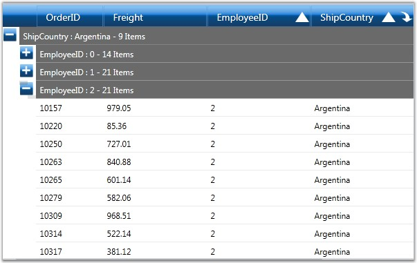

::: {style="DISPLAY: none"}
{#d2h_url_template}{#d2h_package_url style="WIDTH: 0px; DISPLAY: none; HEIGHT: 0px"}
:::

::: {.d2h_secondary_topic style="PADDING-BOTTOM: 10pt; MARGIN: 0pt; PADDING-LEFT: 0pt; PADDING-RIGHT: 0pt; PADDING-TOP: 0pt"}
##### Nested Groups {#nested-groups style="tab-stops: 0pt"}

**[]{style="FONT-FAMILY: 'Trebuchet MS','sans-serif'; COLOR: #15428b"}** 

When you have the grid data grouped against more than one column, the groups will be nested in different levels forming a hierarchical, multilevel structure. You can expand or collapse the underlying groups and records from a parent group by clicking the PlusMinus button preceding its group caption.

 

MultiColumn (Nested) groups can be easily created by simply adding multiple columns into the **GroupedColumns** collection. You can also generate multilevel groups by just dragging multiple column headers into the group drop area.

[]{style="FONT-FAMILY: 'Trebuchet MS','sans-serif'; COLOR: #15428b; FONT-SIZE: 9pt"} 

+-----------------------------------------------------------------------------------------------------------------------------------------------------------------------------------------------------------+
| **[\[C#\]]{style="FONT-FAMILY: 'Courier New'; COLOR: black"}**                                                                                                                                            |
|                                                                                                                                                                                                           |
| []{style="FONT-FAMILY: 'Courier New'; COLOR: black"}                                                                                                                                                      |
|                                                                                                                                                                                                           |
| [GridDataGroupColumn]{style="FONT-FAMILY: 'Courier New'; COLOR: #2b91af"}[ groupedCol1 = [new]{style="COLOR: blue"} [GridDataGroupColumn]{style="COLOR: #2b91af"}();]{style="FONT-FAMILY: 'Courier New'"} |
|                                                                                                                                                                                                           |
| [groupedCol1.ColumnName = [\"ShipCountry\"]{style="COLOR: #a31515"};]{style="FONT-FAMILY: 'Courier New'"}                                                                                                 |
|                                                                                                                                                                                                           |
| [dataGrid.GroupedColumns.Add(groupedCol1);]{style="FONT-FAMILY: 'Courier New'"}                                                                                                                           |
|                                                                                                                                                                                                           |
| []{style="FONT-FAMILY: 'Courier New'"}                                                                                                                                                                    |
|                                                                                                                                                                                                           |
| [GridDataGroupColumn]{style="FONT-FAMILY: 'Courier New'; COLOR: #2b91af"}[ groupedCol2 = [new]{style="COLOR: blue"} [GridDataGroupColumn]{style="COLOR: #2b91af"}();]{style="FONT-FAMILY: 'Courier New'"} |
|                                                                                                                                                                                                           |
| [groupedCol2.ColumnName = [\"EmployeeID\"]{style="COLOR: #a31515"};]{style="FONT-FAMILY: 'Courier New'"}                                                                                                  |
|                                                                                                                                                                                                           |
| [dataGrid.GroupedColumns.Add(groupedCol2);]{style="FONT-FAMILY: 'Courier New'"}                                                                                                                           |
+-----------------------------------------------------------------------------------------------------------------------------------------------------------------------------------------------------------+

[]{style="FONT-FAMILY: 'Trebuchet MS','sans-serif'; COLOR: #15428b; FONT-SIZE: 9pt"} 

{border="0"}

[]{style="FONT-FAMILY: 'Trebuchet MS','sans-serif'; COLOR: #15428b; FONT-SIZE: 9pt"} 

Figure 117: Nested Group created in Grid

***[]{style="FONT-FAMILY: 'Trebuchet MS','sans-serif'; COLOR: #15428b; FONT-SIZE: 9pt"}*** 

See Also

***[]{style="FONT-FAMILY: 'Trebuchet MS','sans-serif'; COLOR: #15428b; FONT-SIZE: 9pt"}*** 

[Creating Groups]{style="COLOR: windowtext; TEXT-DECORATION: none; text-underline: none"}

[]{#p243} 

 

[]{#related-topics}
:::
