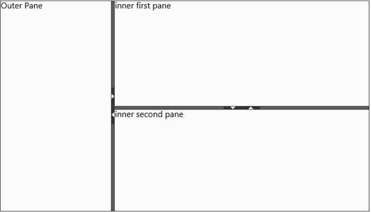

::: {style="DISPLAY: none"}
{#d2h_url_template}{#d2h_package_url style="WIDTH: 0px; DISPLAY: none; HEIGHT: 0px"}
:::

::: {.d2h_secondary_topic style="PADDING-BOTTOM: 10pt; MARGIN: 0pt; PADDING-LEFT: 0pt; PADDING-RIGHT: 0pt; PADDING-TOP: 0pt"}
#### Nested Splitter {#nested-splitter style="tab-stops: 0pt"}

The Splitter control supports a nested splitter bar structure.

The following steps explain how to define a nested splitter control.

1.   In the **view**, invoke the **Splitter** helper with the control ID as the first argument.

2.   Add the splitter panes to the outer splitter control and in any one of the panes nest another splitter control to make a nested structure. In **ContentTemplate** add the Splitter control to be nested and set its HTML attribute **border** to **0** pixels.

[]{style="COLOR: black"} 

+------------------------------------------------------------------------------------------------------------------------------------------------------------------------------------------------------------------------------------------------------------------------------------------------------------------------------------------------------------------------------------------------------------------------------------------------------------------+
| **[\[ASPX\]]{style="FONT-FAMILY: 'Courier New'"}**[]{style="FONT-FAMILY: 'Courier New'"}                                                                                                                                                                                                                                                                                                                                                                         |
|                                                                                                                                                                                                                                                                                                                                                                                                                                                                  |
| []{style="FONT-FAMILY: 'Courier New'"}                                                                                                                                                                                                                                                                                                                                                                                                                           |
|                                                                                                                                                                                                                                                                                                                                                                                                                                                                  |
| [\<%]{style="FONT-FAMILY: 'Courier New'; BACKGROUND: yellow"}[Html.Syncfusion().Splitter([\"splitter\"]{style="COLOR: #a31515"}).Orientation([SplitterOrientation ]{style="COLOR: #2b91af"}.Horizontal).Height(400).Width(700)]{style="FONT-FAMILY: Consolas; FONT-SIZE: 9.5pt"}                                                                                                                                                                                 |
|                                                                                                                                                                                                                                                                                                                                                                                                                                                                  |
| [    .SplitterPanes(panes=\>{        ]{style="FONT-FAMILY: Consolas; FONT-SIZE: 9.5pt"}                                                                                                                                                                                                                                                                                                                                                                          |
|                                                                                                                                                                                                                                                                                                                                                                                                                                                                  |
| [      [\<]{style="COLOR: blue"}[p]{style="COLOR: maroon"}[\>]{style="COLOR: blue"}Outer first pane[\</]{style="COLOR: blue"}[p]{style="COLOR: maroon"}[\>]{style="COLOR: blue"}]{style="FONT-FAMILY: Consolas; FONT-SIZE: 9.5pt"}                                                                                                                                                                                                                               |
|                                                                                                                                                                                                                                                                                                                                                                                                                                                                  |
| [panes.Add()    ]{style="FONT-FAMILY: Consolas; FONT-SIZE: 9.5pt"}                                                                                                                                                                                                                                                                                                                                                                                               |
|                                                                                                                                                                                                                                                                                                                                                                                                                                                                  |
| [      .PaneSize([Unit]{style="COLOR: #2b91af"}.Percentage(30)).ContentTemplate(()=\>{[%\>]{style="BACKGROUND: yellow"} [\<]{style="COLOR: blue"}[p]{style="COLOR: maroon"}[\>]{style="COLOR: blue"}Outer Pane[\</]{style="COLOR: blue"}[p]{style="COLOR: maroon"}[\>]{style="COLOR: blue"}]{style="FONT-FAMILY: Consolas; FONT-SIZE: 9.5pt"}                                                                                                                    |
|                                                                                                                                                                                                                                                                                                                                                                                                                                                                  |
| [                                                            ]{style="FONT-FAMILY: Consolas; FONT-SIZE: 9.5pt"}                                                                                                                                                                                                                                                                                                                                                  |
|                                                                                                                                                                                                                                                                                                                                                                                                                                                                  |
| [                                              [\<%]{style="BACKGROUND: yellow"}})]{style="FONT-FAMILY: Consolas; FONT-SIZE: 9.5pt"}                                                                                                                                                                                                                                                                                                                             |
|                                                                                                                                                                                                                                                                                                                                                                                                                                                                  |
| [      .SplitterBar(bar=\>bar.AllowSplitterBar([true]{style="COLOR: blue"}).CollapseMode([CollapseType.]{style="COLOR: #2b91af"}Both);     ]{style="FONT-FAMILY: Consolas; FONT-SIZE: 9.5pt"}                                                                                                                                                                                                                                                                    |
|                                                                                                                                                                                                                                                                                                                                                                                                                                                                  |
| [      ]{style="FONT-FAMILY: Consolas; FONT-SIZE: 9.5pt"}                                                                                                                                                                                                                                                                                                                                                                                                        |
|                                                                                                                                                                                                                                                                                                                                                                                                                                                                  |
| [      panes.Add().PaneSize([Unit]{style="COLOR: #2b91af"}.Percentage(20)).ContentTemplate(()=\>{[%\>]{style="BACKGROUND: yellow"}]{style="FONT-FAMILY: Consolas; FONT-SIZE: 9.5pt"}                                                                                                                                                                                                                                                                             |
|                                                                                                                                                                                                                                                                                                                                                                                                                                                                  |
| []{style="FONT-FAMILY: Consolas; FONT-SIZE: 9.5pt"}                                                                                                                                                                                                                                                                                                                                                                                                              |
|                                                                                                                                                                                                                                                                                                                                                                                                                                                                  |
| [                                    [\<%]{style="BACKGROUND: yellow"}Html.Syncfusion().Splitter([\"innerSplitter\"]{style="COLOR: #a31515"}, [new]{style="COLOR: blue"} { style = [\"border: 0\"]{style="COLOR: #a31515"} }).Height([Unit]{style="COLOR: #2b91af"}.Percentage(100)).Width([Unit]{style="COLOR: #2b91af"}.Percentage(100)).Orientation([SplitterOrientation]{style="COLOR: #2b91af"}.Vertical)]{style="FONT-FAMILY: Consolas; FONT-SIZE: 9.5pt"} |
|                                                                                                                                                                                                                                                                                                                                                                                                                                                                  |
| [                                    .SplitterPanes(panes1=\>{        ]{style="FONT-FAMILY: Consolas; FONT-SIZE: 9.5pt"}                                                                                                                                                                                                                                                                                                                                         |
|                                                                                                                                                                                                                                                                                                                                                                                                                                                                  |
| [                                                            panes1.Add().PaneSize([Unit]{style="COLOR: #2b91af"}.Percentage(50)).ContentTemplate(()=\>{[%\>]{style="BACKGROUND: yellow"}]{style="FONT-FAMILY: Consolas; FONT-SIZE: 9.5pt"}                                                                                                                                                                                                                      |
|                                                                                                                                                                                                                                                                                                                                                                                                                                                                  |
| [                                                            [\<]{style="COLOR: blue"}[p]{style="COLOR: maroon"}[\>]{style="COLOR: blue"}inner first pane[\</]{style="COLOR: blue"}[p]{style="COLOR: maroon"}[\>]{style="COLOR: blue"}]{style="FONT-FAMILY: Consolas; FONT-SIZE: 9.5pt"}                                                                                                                                                                         |
|                                                                                                                                                                                                                                                                                                                                                                                                                                                                  |
| [                                                            [\<%]{style="BACKGROUND: yellow"}}).SplitterBar(b=\>b.AllowSplitterBar([true]{style="COLOR: blue"}).CollapseMode([CollapseType]{style="COLOR: #2b91af"}.Both);]{style="FONT-FAMILY: Consolas; FONT-SIZE: 9.5pt"}                                                                                                                                                                                    |
|                                                                                                                                                                                                                                                                                                                                                                                                                                                                  |
| [           ]{style="FONT-FAMILY: Consolas; FONT-SIZE: 9.5pt"}                                                                                                                                                                                                                                                                                                                                                                                                   |
|                                                                                                                                                                                                                                                                                                                                                                                                                                                                  |
| [                                                            panes1.Add().PaneSize([Unit]{style="COLOR: #2b91af"}.Percentage(30)).ContentTemplate(()=\>{[%\>]{style="BACKGROUND: yellow"}]{style="FONT-FAMILY: Consolas; FONT-SIZE: 9.5pt"}                                                                                                                                                                                                                      |
|                                                                                                                                                                                                                                                                                                                                                                                                                                                                  |
| [                                                            [\<]{style="COLOR: blue"}[p]{style="COLOR: maroon"}[\>]{style="COLOR: blue"}inner second pane[\</]{style="COLOR: blue"}[p]{style="COLOR: maroon"}[\>]{style="COLOR: blue"}]{style="FONT-FAMILY: Consolas; FONT-SIZE: 9.5pt"}                                                                                                                                                                        |
|                                                                                                                                                                                                                                                                                                                                                                                                                                                                  |
| [                                                            [\<%]{style="BACKGROUND: yellow"}});]{style="FONT-FAMILY: Consolas; FONT-SIZE: 9.5pt"}                                                                                                                                                                                                                                                                                                              |
|                                                                                                                                                                                                                                                                                                                                                                                                                                                                  |
| [           ]{style="FONT-FAMILY: Consolas; FONT-SIZE: 9.5pt"}                                                                                                                                                                                                                                                                                                                                                                                                   |
|                                                                                                                                                                                                                                                                                                                                                                                                                                                                  |
| [                                     }).AutoFormat([Skins]{style="COLOR: #2b91af"}.Midnight).Render(); [%\>]{style="BACKGROUND: yellow"} ]{style="FONT-FAMILY: Consolas; FONT-SIZE: 9.5pt"}                                                                                                                                                                                                                                                                     |
|                                                                                                                                                                                                                                                                                                                                                                                                                                                                  |
| [     ]{style="FONT-FAMILY: Consolas; FONT-SIZE: 9.5pt"}                                                                                                                                                                                                                                                                                                                                                                                                         |
|                                                                                                                                                                                                                                                                                                                                                                                                                                                                  |
| [      [\<%]{style="BACKGROUND: yellow"}});]{style="FONT-FAMILY: Consolas; FONT-SIZE: 9.5pt"}                                                                                                                                                                                                                                                                                                                                                                    |
|                                                                                                                                                                                                                                                                                                                                                                                                                                                                  |
| [     }).AutoFormat([Skins]{style="COLOR: #2b91af"}.Midnight).Render();]{style="FONT-FAMILY: Consolas; FONT-SIZE: 9.5pt"}                                                                                                                                                                                                                                                                                                                                        |
|                                                                                                                                                                                                                                                                                                                                                                                                                                                                  |
| [ [%\>]{style="BACKGROUND: yellow"}]{style="FONT-FAMILY: 'Courier New'"}                                                                                                                                                                                                                                                                                                                                                                                         |
|                                                                                                                                                                                                                                                                                                                                                                                                                                                                  |
| []{style="FONT-FAMILY: 'Courier New'"}                                                                                                                                                                                                                                                                                                                                                                                                                           |
|                                                                                                                                                                                                                                                                                                                                                                                                                                                                  |
| [   ]{style="FONT-FAMILY: 'Courier New'"}                                                                                                                                                                                                                                                                                                                                                                                                                        |
+------------------------------------------------------------------------------------------------------------------------------------------------------------------------------------------------------------------------------------------------------------------------------------------------------------------------------------------------------------------------------------------------------------------------------------------------------------------+

[]{style="COLOR: black"} 

+---------------------------------------------------------------------------------------------------------------------------------------------------------------------------------------------------------------------------------------------------------------------------------------------------------------------------------------------------------------------------------------------------------------------------------+
| **[\[Razor\]]{style="FONT-FAMILY: 'Courier New'"}**[]{style="FONT-FAMILY: 'Courier New'"}                                                                                                                                                                                                                                                                                                                                       |
|                                                                                                                                                                                                                                                                                                                                                                                                                                 |
| []{style="FONT-FAMILY: 'Courier New'"}                                                                                                                                                                                                                                                                                                                                                                                          |
|                                                                                                                                                                                                                                                                                                                                                                                                                                 |
| [\@{]{style="FONT-FAMILY: 'Courier New'; BACKGROUND: yellow"}[Html.Syncfusion().Splitter([\"splitter\"]{style="COLOR: #a31515"}).Orientation([SplitterOrientation]{style="COLOR: #2b91af"}.Horizontal).Height(400).Width(700)]{style="FONT-FAMILY: Consolas; FONT-SIZE: 9.5pt"}                                                                                                                                                 |
|                                                                                                                                                                                                                                                                                                                                                                                                                                 |
| [    .SplitterPanes(panes=\>{        ]{style="FONT-FAMILY: Consolas; FONT-SIZE: 9.5pt"}                                                                                                                                                                                                                                                                                                                                         |
|                                                                                                                                                                                                                                                                                                                                                                                                                                 |
| [      [\<]{style="COLOR: blue"}[p]{style="COLOR: maroon"}[\>]{style="COLOR: blue"}Outer first pane[\</]{style="COLOR: blue"}[p]{style="COLOR: maroon"}[\>]{style="COLOR: blue"}]{style="FONT-FAMILY: Consolas; FONT-SIZE: 9.5pt"}                                                                                                                                                                                              |
|                                                                                                                                                                                                                                                                                                                                                                                                                                 |
| [panes.Add()         ]{style="FONT-FAMILY: Consolas; FONT-SIZE: 9.5pt"}                                                                                                                                                                                                                                                                                                                                                         |
|                                                                                                                                                                                                                                                                                                                                                                                                                                 |
| [      .PaneSize([Unit]{style="COLOR: #2b91af"}.Percentage(30)).ContentTemplate( [@]{style="BACKGROUND: yellow"}[\<]{style="COLOR: blue"}[p]{style="COLOR: maroon"}[\>]{style="COLOR: blue"}Outer Pane[\</]{style="COLOR: blue"}[p]{style="COLOR: maroon"}[\>]{style="COLOR: blue"}]{style="FONT-FAMILY: Consolas; FONT-SIZE: 9.5pt"}                                                                                           |
|                                                                                                                                                                                                                                                                                                                                                                                                                                 |
| [                                                            ]{style="FONT-FAMILY: Consolas; FONT-SIZE: 9.5pt"}                                                                                                                                                                                                                                                                                                                 |
|                                                                                                                                                                                                                                                                                                                                                                                                                                 |
| [                                              [\<%]{style="BACKGROUND: yellow"}})]{style="FONT-FAMILY: Consolas; FONT-SIZE: 9.5pt"}                                                                                                                                                                                                                                                                                            |
|                                                                                                                                                                                                                                                                                                                                                                                                                                 |
| [      .SplitterBar(bar=\>bar.AllowSplitterBar([true]{style="COLOR: blue"}).CollapseMode([CollapseType]{style="COLOR: #2b91af"}.Both));     ]{style="FONT-FAMILY: Consolas; FONT-SIZE: 9.5pt"}                                                                                                                                                                                                                                  |
|                                                                                                                                                                                                                                                                                                                                                                                                                                 |
| [      ]{style="FONT-FAMILY: Consolas; FONT-SIZE: 9.5pt"}                                                                                                                                                                                                                                                                                                                                                                       |
|                                                                                                                                                                                                                                                                                                                                                                                                                                 |
| [      panes.Add().PaneSize([Unit]{style="COLOR: #2b91af"}.Percentage(20)).ContentTemplate(()=\>]{style="FONT-FAMILY: Consolas; FONT-SIZE: 9.5pt"}                                                                                                                                                                                                                                                                              |
|                                                                                                                                                                                                                                                                                                                                                                                                                                 |
| []{style="FONT-FAMILY: Consolas; FONT-SIZE: 9.5pt"}                                                                                                                                                                                                                                                                                                                                                                             |
|                                                                                                                                                                                                                                                                                                                                                                                                                                 |
| [                                    Html.Syncfusion().Splitter([\"innerSplitter\"]{style="COLOR: #a31515"}, [new]{style="COLOR: blue"} { style = [\"border: 0\"]{style="COLOR: #a31515"} }).Height([Unit]{style="COLOR: #2b91af"}.Percentage(100)).Width([Unit]{style="COLOR: #2b91af"}.Percentage(100)).Orientation([SplitterOrientation]{style="COLOR: #2b91af"}.Vertical)]{style="FONT-FAMILY: Consolas; FONT-SIZE: 9.5pt"} |
|                                                                                                                                                                                                                                                                                                                                                                                                                                 |
| [                                    .SplitterPanes(panes1=\>{        ]{style="FONT-FAMILY: Consolas; FONT-SIZE: 9.5pt"}                                                                                                                                                                                                                                                                                                        |
|                                                                                                                                                                                                                                                                                                                                                                                                                                 |
| [                                                            panes1.Add().PaneSize([Unit]{style="COLOR: #2b91af"}.Percentage(50)).ContentTemplate(]{style="FONT-FAMILY: Consolas; FONT-SIZE: 9.5pt"}                                                                                                                                                                                                                            |
|                                                                                                                                                                                                                                                                                                                                                                                                                                 |
| [                                                            [@]{style="BACKGROUND: yellow"}[\<]{style="COLOR: blue"}[p]{style="COLOR: maroon"}[\>]{style="COLOR: blue"}inner first pane[\</]{style="COLOR: blue"}[p]{style="COLOR: maroon"}[\>]{style="COLOR: blue"}]{style="FONT-FAMILY: Consolas; FONT-SIZE: 9.5pt"}                                                                                                         |
|                                                                                                                                                                                                                                                                                                                                                                                                                                 |
| [                                                            ).SplitterBar(b=\>b.AllowSplitterBar([true]{style="COLOR: blue"}).CollapseMode([CollapseType]{style="COLOR: #2b91af"}.Both));]{style="FONT-FAMILY: Consolas; FONT-SIZE: 9.5pt"}                                                                                                                                                                                    |
|                                                                                                                                                                                                                                                                                                                                                                                                                                 |
| [           ]{style="FONT-FAMILY: Consolas; FONT-SIZE: 9.5pt"}                                                                                                                                                                                                                                                                                                                                                                  |
|                                                                                                                                                                                                                                                                                                                                                                                                                                 |
| [                                                            panes1.Add().PaneSize([Unit]{style="COLOR: #2b91af"}.Percentage(30)).ContentTemplate(]{style="FONT-FAMILY: Consolas; FONT-SIZE: 9.5pt"}                                                                                                                                                                                                                            |
|                                                                                                                                                                                                                                                                                                                                                                                                                                 |
| [                                                            [@]{style="BACKGROUND: yellow"}[\<]{style="COLOR: blue"}[p]{style="COLOR: maroon"}[\>]{style="COLOR: blue"}inner second pane[\</]{style="COLOR: blue"}[p]{style="COLOR: maroon"}[\>]{style="COLOR: blue"}]{style="FONT-FAMILY: Consolas; FONT-SIZE: 9.5pt"}                                                                                                        |
|                                                                                                                                                                                                                                                                                                                                                                                                                                 |
| [                                                            );]{style="FONT-FAMILY: Consolas; FONT-SIZE: 9.5pt"}                                                                                                                                                                                                                                                                                                               |
|                                                                                                                                                                                                                                                                                                                                                                                                                                 |
| [           ]{style="FONT-FAMILY: Consolas; FONT-SIZE: 9.5pt"}                                                                                                                                                                                                                                                                                                                                                                  |
|                                                                                                                                                                                                                                                                                                                                                                                                                                 |
| [                                     }).AutoFormat([Skins]{style="COLOR: #2b91af"}.Midnight).Render(); ]{style="FONT-FAMILY: Consolas; FONT-SIZE: 9.5pt"}                                                                                                                                                                                                                                                                      |
|                                                                                                                                                                                                                                                                                                                                                                                                                                 |
| [     ]{style="FONT-FAMILY: Consolas; FONT-SIZE: 9.5pt"}                                                                                                                                                                                                                                                                                                                                                                        |
|                                                                                                                                                                                                                                                                                                                                                                                                                                 |
| [      );]{style="FONT-FAMILY: Consolas; FONT-SIZE: 9.5pt"}                                                                                                                                                                                                                                                                                                                                                                     |
|                                                                                                                                                                                                                                                                                                                                                                                                                                 |
| [     }).AutoFormat([Skins]{style="COLOR: #2b91af"}.Midnight).Render();]{style="FONT-FAMILY: Consolas; FONT-SIZE: 9.5pt"}                                                                                                                                                                                                                                                                                                       |
|                                                                                                                                                                                                                                                                                                                                                                                                                                 |
| [}]{style="FONT-FAMILY: 'Courier New'; BACKGROUND: yellow"}                                                                                                                                                                                                                                                                                                                                                                     |
|                                                                                                                                                                                                                                                                                                                                                                                                                                 |
| []{style="FONT-FAMILY: 'Courier New'"}                                                                                                                                                                                                                                                                                                                                                                                          |
|                                                                                                                                                                                                                                                                                                                                                                                                                                 |
| [   ]{style="FONT-FAMILY: 'Courier New'"}                                                                                                                                                                                                                                                                                                                                                                                       |
+---------------------------------------------------------------------------------------------------------------------------------------------------------------------------------------------------------------------------------------------------------------------------------------------------------------------------------------------------------------------------------------------------------------------------------+

[]{style="COLOR: black"} 

[3.   ]{style="COLOR: black"}Build and run the application. []{style="COLOR: black"}

[]{style="COLOR: black"} 

{border="0"}

Figure 262: Nested Splitter Control[]{style="COLOR: black"}

[]{#related-topics}
:::
