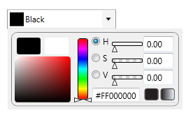
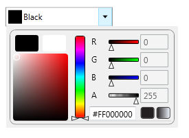
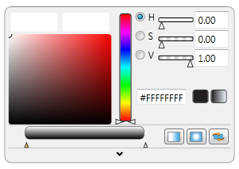
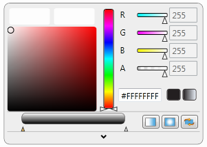
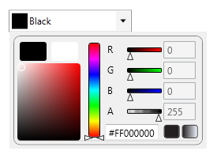
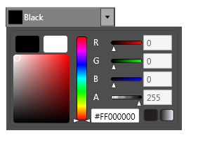
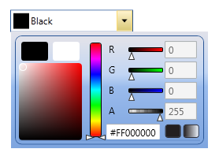
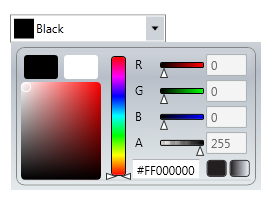
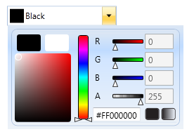
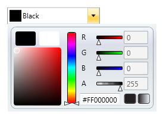

::: {style="DISPLAY: none"}
{#d2h_url_template}{#d2h_package_url style="WIDTH: 0px; DISPLAY: none; HEIGHT: 0px"}
:::

:::: {.d2h_secondary_topic style="PADDING-BOTTOM: 10pt; MARGIN: 0pt; PADDING-LEFT: 0pt; PADDING-RIGHT: 0pt; PADDING-TOP: 0pt"}
#### New User Interface Support {#new-user-interface-support style="tab-stops: 0pt"}

[]{#p84}The feature adds new additional User Interface to the Color Picker, so that you can have two more User Interfaces for the ColorPicker Control. Both will have same functionality, except that the User Interface will change. ColorPicker and ColorEdit controls can be displayed in four different modes. They are HSV, Classic HSV, RGB and Classic RGB modes. The VisualizationStyle property is used to switch between these modes. The HSV and RGB are the two User Interfaces which are user-friendly, more attractive and in general, it looks more professional.

 

Use Case Scenarios

New User Interface support enables you to create the ColorPicker control with a visually rich interface.

[]{style="FONT-FAMILY: 'Trebuchet MS','sans-serif'; COLOR: #15428b; FONT-SIZE: 9pt"} 

Adding New User Interface support to an Application

New User Interface support can be added to an application by using XAML or with C#.

**[]{style="FONT-FAMILY: 'Trebuchet MS','sans-serif'; COLOR: #15428b; FONT-SIZE: 9pt"}** 

Adding through XAML

The following code example illustrates how to add the New User Interface support feature to an application through XAML.

 

+--------------------------------------------------------------------------------------------------------------------------------------------------------------------------------------------------------------------------------------------------------------------------------------------------------------------------------------------------------------------------------------------------------------------------------------------------------------------------------------------------+
| **[\[XAML\]]{style="FONT-FAMILY: 'Courier New'"}**                                                                                                                                                                                                                                                                                                                                                                                                                                               |
|                                                                                                                                                                                                                                                                                                                                                                                                                                                                                                  |
| **[]{style="FONT-FAMILY: 'Courier New'"}**                                                                                                                                                                                                                                                                                                                                                                                                                                                       |
|                                                                                                                                                                                                                                                                                                                                                                                                                                                                                                  |
| [\<]{style="FONT-FAMILY: 'Courier New'; COLOR: blue"}[sync]{style="FONT-FAMILY: 'Courier New'; COLOR: #a31515"}[:]{style="FONT-FAMILY: 'Courier New'; COLOR: blue"}[ColorPicker]{style="FONT-FAMILY: 'Courier New'; COLOR: #a31515"}[ VisualizationStyle]{style="FONT-FAMILY: 'Courier New'; COLOR: red"}[=\"HSV\"]{style="FONT-FAMILY: 'Courier New'; COLOR: blue"}[ BrushMode]{style="FONT-FAMILY: 'Courier New'; COLOR: red"}[=\"Solid\"/\>]{style="FONT-FAMILY: 'Courier New'; COLOR: blue"} |
|                                                                                                                                                                                                                                                                                                                                                                                                                                                                                                  |
| []{style="FONT-FAMILY: 'Courier New'; COLOR: blue"}                                                                                                                                                                                                                                                                                                                                                                                                                                              |
|                                                                                                                                                                                                                                                                                                                                                                                                                                                                                                  |
| [\<]{style="FONT-FAMILY: 'Courier New'; COLOR: blue"}[sync]{style="FONT-FAMILY: 'Courier New'; COLOR: #a31515"}[:]{style="FONT-FAMILY: 'Courier New'; COLOR: blue"}[ColorEdit ]{style="FONT-FAMILY: 'Courier New'; COLOR: #a31515"}[VisualizationStyle]{style="FONT-FAMILY: 'Courier New'; COLOR: red"}[=\"HSV\"/\>]{style="FONT-FAMILY: 'Courier New'; COLOR: blue"}                                                                                                                            |
|                                                                                                                                                                                                                                                                                                                                                                                                                                                                                                  |
| []{style="FONT-FAMILY: 'Courier New'; COLOR: blue"}                                                                                                                                                                                                                                                                                                                                                                                                                                              |
|                                                                                                                                                                                                                                                                                                                                                                                                                                                                                                  |
| [              ]{style="FONT-FAMILY: 'Courier New'"}                                                                                                                                                                                                                                                                                                                                                                                                                                             |
+--------------------------------------------------------------------------------------------------------------------------------------------------------------------------------------------------------------------------------------------------------------------------------------------------------------------------------------------------------------------------------------------------------------------------------------------------------------------------------------------------+

 

Adding through C#

The following code example illustrates how to add the New User Interface support feature to an application through C#.

 

+-------------------------------------------------------------------------------------------------------------------------------------------------------------+
| **[\[C#\]]{style="FONT-FAMILY: 'Courier New'"}**                                                                                                            |
|                                                                                                                                                             |
| **[]{style="FONT-FAMILY: 'Courier New'"}**                                                                                                                  |
|                                                                                                                                                             |
| [   [ColorPicker]{style="COLOR: #2b91af"} Picker = [new]{style="COLOR: blue"} [ColorPicker]{style="COLOR: #2b91af"}();]{style="FONT-FAMILY: 'Courier New'"} |
|                                                                                                                                                             |
| [   Picker.VisualizationStyle = ]{style="FONT-FAMILY: 'Courier New'"}                                                                                       |
|                                                                                                                                                             |
| [                         Syncfusion.Windows.Tools.[ColorSelectionMode]{style="COLOR: #2b91af"}.HSV;]{style="FONT-FAMILY: 'Courier New'"}                   |
|                                                                                                                                                             |
| []{style="FONT-FAMILY: 'Courier New'"}                                                                                                                      |
|                                                                                                                                                             |
| [   [ColorEdit]{style="COLOR: #2b91af"} ColEdit = [new]{style="COLOR: blue"} [ColorEdit]{style="COLOR: #2b91af"}();]{style="FONT-FAMILY: 'Courier New'"}    |
|                                                                                                                                                             |
| [   ColEdit.VisualizationStyle = ]{style="FONT-FAMILY: 'Courier New'"}                                                                                      |
|                                                                                                                                                             |
| [                         Syncfusion.Windows.Tools.[ColorSelectionMode]{style="COLOR: #2b91af"}.HSV;]{style="FONT-FAMILY: 'Courier New'"}                   |
|                                                                                                                                                             |
| [   ]{style="FONT-FAMILY: 'Courier New'"}                                                                                                                   |
|                                                                                                                                                             |
| [           ]{style="FONT-FAMILY: 'Courier New'"}                                                                                                           |
+-------------------------------------------------------------------------------------------------------------------------------------------------------------+

 

 

{border="0"}

Figure 157: ColorPicker with VisualizationStyle is set to HSV

 

{border="0"}

Figure 158: ColorPicker with VisualizationStyle is set to RGB

[]{style="COLOR: #c00000"} 

{border="0"}

Figure 159: ColorEdit with VisualizationStyle is set to HSV

{border="0"}

Figure 160: ColorEdit with VisualizationStyle is set to RGB

**[]{style="FONT-FAMILY: 'Trebuchet MS','sans-serif'; COLOR: #15428b; FONT-SIZE: 9pt"}** 

Properties

Table 17: New User Interface Support Property Table

::: {align="center"}
  -------------------- --------------------------------------------------------------------------- -------------------- ------------------------ -----------------
  Property             Description                                                                 Type                 Data Type                Reference links
  VisualizationStyle   Specifies the style that can be used to set ColorPicker /or ColorEdit UI.   DependencyProperty   ColorSelectionMode.HSV   
  -------------------- --------------------------------------------------------------------------- -------------------- ------------------------ -----------------
:::

**[]{style="FONT-FAMILY: 'Trebuchet MS','sans-serif'; COLOR: #15428b; FONT-SIZE: 9pt"}** 

Sample Link

To view samples:

1.   Select Start -\> Programs -\> Syncfusion -\> Essential Studio x.x.xx -\> Dashboard.

2.   Select Run Locally Installed Samples in WPF Button.

3.   Now expand the DragAndDropManagerDemo tree-view item in the Sample Browser.

4.   Choose any one of the samples listed under it to launch.

 

Theme Appearance

The appearance of the ColorPicker can be customized using Styles. The following are the various built-in visual styles for ColorPicker.

[]{style="FONT-FAMILY: 'Trebuchet MS','sans-serif'; COLOR: #15428b; FONT-SIZE: 9pt"} 

{border="0"}

Figure 161: Default Style

 

{border="0"}

Figure 162: Blend Style

 

{border="0"}

Figure 163: Office2003 Style

 

{border="0"}

Figure 164: Office2007Black Style

 

{border="0"}

Figure 165: Office2007Blue Style

 

{border="0"}

Figure 166: Office2007Silver Style

 

 

 

[]{#related-topics}
::::
