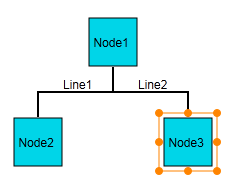
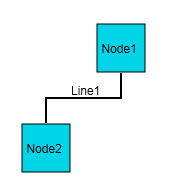

::: {style="DISPLAY: none"}
{#d2h_url_template}{#d2h_package_url style="WIDTH: 0px; DISPLAY: none; HEIGHT: 0px"}
:::

::::: {#nsbanner .d2h_main_nsbanner style="BORDER-BOTTOM: #999999 1px solid; POSITION: relative; PADDING-BOTTOM: 0px; BACKGROUND-COLOR: transparent; PADDING-LEFT: 0px; PADDING-RIGHT: 0px; DISPLAY: none; BORDER-TOP: #999999 1px solid; PADDING-TOP: 0px; LEFT: 0px"}
:::: {#TitleRow .d2h_main_titlerow style="PADDING-BOTTOM: 4px; BACKGROUND-COLOR: transparent; PADDING-LEFT: 22px; WIDTH: 100%; PADDING-RIGHT: 10px; DISPLAY: none; PADDING-TOP: 4px"}
::: {#ienav .d2h_main_ienav style="DISPLAY: none"}
{#D2HPrevious .D2HPreviousEnabled}  {#D2HNext .D2HNextEnabled}
:::
::::
:::::

::::: {#nstext .d2h_main_nstext style="PADDING-BOTTOM: 10px; BACKGROUND-COLOR: transparent; PADDING-LEFT: 22px; PADDING-RIGHT: 10px; HEIGHT: 100%; OVERFLOW: auto; PADDING-TOP: 5px" hasuserbackground="true" valign="bottom"}
::: {#d2h_breadcrumbs .d2h_breadcrumbs}
[Essential Studio User Guide Documentation](ms-xhelp:///?Id=12457748-09e3-4d74-a240-8e049cedf030){.d2h_breadcrumbsNormal}[ \> ]{.d2h_breadcrumbsLinkSeparator}[User Interface Edition](ms-xhelp:///?Id=c29296b7-531c-413b-a0ec-488ca1f7f669){.d2h_breadcrumbsNormal}[ \> ]{.d2h_breadcrumbsLinkSeparator}[Essential ASP.NET MVC](ms-xhelp:///?Id=4b14e7d1-65c4-4f67-b1aa-2c37709905a5){.d2h_breadcrumbsNormal}[ \> ]{.d2h_breadcrumbsLinkSeparator}[Essential Diagram]{.d2h_breadcrumbsContentsOnly}[ \> ]{.d2h_breadcrumbsLinkSeparator}[Concepts and Features](ms-xhelp:///?Id=04839cdf-94fc-4d24-9f6b-119fdbd7bbfb){.d2h_breadcrumbsNormal}[ \> ]{.d2h_breadcrumbsLinkSeparator}[Nodes](ms-xhelp:///?Id=1707ce52-b3af-4e98-81bf-f419bfe59d33){.d2h_breadcrumbsNormal}
:::

### Node Deletion {#node-deletion style="tab-stops: 0pt"}

[This feature allows you to delete ]{style="BACKGROUND: white"}a single node at a time [from the diagram page in Essential Diagram for ASP.NET MVC.]{style="BACKGROUND: white"}

 

Appearance and Structure

The following figures illustrate the appearance and funciton of the node deletion feature.

{border="0"}

Figure 44: Before Node Deletion

 

 

{border="0"}

Figure 45: After Node Deletion

::: {style="BORDER-BOTTOM: windowtext 1pt solid; BORDER-LEFT: medium none; PADDING-BOTTOM: 1pt; MARGIN-TOP: 9pt; PADDING-LEFT: 0pt; PADDING-RIGHT: 0pt; MARGIN-BOTTOM: 9pt; BORDER-TOP: windowtext 1pt solid; BORDER-RIGHT: medium none; PADDING-TOP: 1pt"}
 
:::

Where do I find the installed samples?

[To view the samples:]{style="BACKGROUND: white"}

1.   [Open the Essential Diagram sample browser from the dashboard. (Refer to the ]{style="BACKGROUND: white"}[Samples and Locations]{style="BACKGROUND: white"}[ section).]{style="BACKGROUND: white"}

2.   [Go to the **Getting Started** tab, and click **Flat Diagram**.]{style="BACKGROUND: white"}

 

Properties

+-------------+------------------------------------------------------------------+---------------------+----------------------+--------------+
| Property    | Description                                                      | Type of Property    | Value it Accepts     | Dependencies |
+-------------+------------------------------------------------------------------+---------------------+----------------------+--------------+
| AllowDelete | Gets or sets a value indicating whether the node can be deleted. | Dependency property | Boolean (true/false) | No           |
|             |                                                                  |                     |                      |              |
|             | The default value is set to true.                                |                     |                      |              |
|             |                                                                  |                     |                      |              |
|             |                                                                  |                     |                      |              |
+-------------+------------------------------------------------------------------+---------------------+----------------------+--------------+

 

Enabling node deletion in Diagram MVC

This section guides you through the process of enabling Node deletion in a diagram. You can implement this feature in either one of the following two ways:

[·      ]{style="FONT-FAMILY: Symbol"}Using builder

[·      ]{style="FONT-FAMILY: Symbol"}Using properties model

 

More:

[ ]{#related-topics}

[{border="0" align="absMiddle"}Using Builder](ms-xhelp:///?Id=01830448-942e-4b15-9a12-862e876f94cc){style="TEXT-DECORATION: none"}

[{border="0" align="absMiddle"}Using Properties Model](ms-xhelp:///?Id=ae21c15a-f55e-41c2-b338-581517e65fd9){style="TEXT-DECORATION: none"}
:::::
