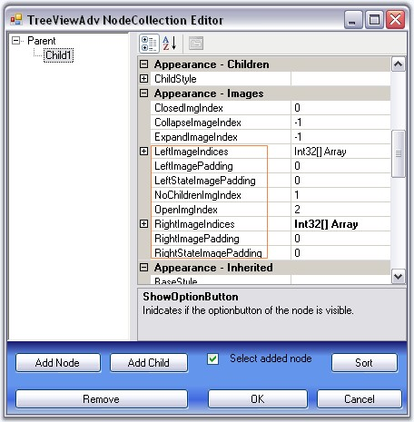
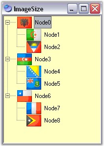
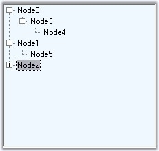
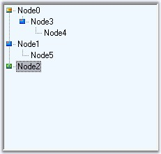
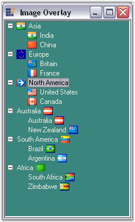
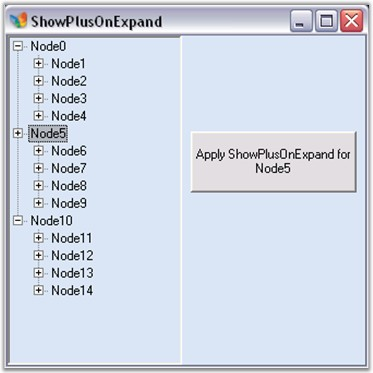

::: {style="DISPLAY: none"}
{#d2h_url_template}{#d2h_package_url style="WIDTH: 0px; DISPLAY: none; HEIGHT: 0px"}
:::

::::::::::::::: {.d2h_secondary_topic style="PADDING-BOTTOM: 10pt; MARGIN: 0pt; PADDING-LEFT: 0pt; PADDING-RIGHT: 0pt; PADDING-TOP: 0pt"}
##### Node Images {#node-images style="MARGIN-LEFT: 18pt; tab-stops: 18.0pt"}

**[]{style="COLOR: #15428b"}** 

TreeViewAdv control can be customized with images for each of its actions for example collapse / expand state, plus / minus of the tree etc., This section discusses about the below topics.

[]{style="COLOR: #15428b"} 

[·      ]{style="FONT-FAMILY: Symbol"}Left, Right and State Images

[·      ]{style="FONT-FAMILY: Symbol"}Expand and Collapse Image

[·      ]{style="FONT-FAMILY: Symbol"}Line Images

[·      ]{style="FONT-FAMILY: Symbol"}Image Overlaying

[·      ]{style="FONT-FAMILY: Symbol"}Plus Sign On ExpandMode

[]{style="COLOR: #15428b"} 

See Also

[]{style="COLOR: #15428b"} 

[[Node Images Events]{.UGHyperlink}](../../../../../../../../Documents%20and%20Settings/sylviap/Desktop/Tools%20-%20Part%202.docx#_Node_Images_Events)[]{.UGHyperlink}

 

 

 

 

###### []{#_Left,_Right_and}3.11.3.1.2.1    Left, Right and State Images {#left-right-and-state-images style="MARGIN-LEFT: 18pt; tab-stops: 18.0pt"}

[]{style="COLOR: #15428b"} 

This section discusses about adding Left, Right and State images to the nodes and various image settings for the TreeViewAdv control.

[]{style="COLOR: #15428b"} 

Left/Right Images

**[]{style="COLOR: #15428b"}** 

The tree nodes can be set with left / right images using **LeftImageList** and**[ ]{style="COLOR: black"}RightImageList** properties in the property window. Left / Right images for the individual nodes can be specified in **LeftImageIndices** and **RightImageIndices** properties of individual nodes, using the TreeViewAdv Nodes Collection Editor.

 

The nodes with the images can be given an enhanced appearance using **LeftImagePadding** and **RightImagePadding.**

**[]{style="COLOR: #15428b"}** 

::: {align="center"}
  ---------------------- ------------------------------------------------------------------------------------------
  TreeViewAdv Property   Description
  LeftImageList          Indicates the imagelist that holds the images to be drawn on the left of the Node.
  RightImageList         This indicates the imagelist that holds the images to be drawn on the right of the Node.
  ---------------------- ------------------------------------------------------------------------------------------
:::

[]{style="COLOR: #15428b"} 

::: {align="center"}
  ---------------------- -----------------------------------------------------------------------
  TreeNodeAdv Property   Description
  LeftImageIndices       It is the image index to be drawn on the left of the node\'s text.
  RightImageIndices      It is the image index to be drawn on the right of the node\'s text.
  LeftImagePadding       It is the space provided between the LeftImage of the node and node.
  RightImagePadding      It is the space provided between the RightImage of the node and node.
  ---------------------- -----------------------------------------------------------------------
:::

[]{style="COLOR: #15428b"} 

{border="0"}

[]{style="COLOR: #15428b"} 

Figure 1121: Left, Right and State Image Properties in Node Collection Editor

**[]{style="COLOR: #15428b"}** 

Setting State Images

[]{style="COLOR: #15428b"} 

Different images can be set for expand / collapse states of the node, using **StateImageList** property. To apply the left open and close images, set the **ClosedImgIndex** and the **OpenImgIndex** to the indices that points to the images in the StateImageList respectively. Nodes without child can be set with a separate image using **NoChildrenImageIndex.**

[]{style="COLOR: #15428b"} 

::: {align="center"}
  ---------------------- --------------------------------------------------------------------------------------------------------
  TreeViewAdv Property   Description
  ClosedImgIndex         It is the StateImageList index value of the image that is displayed, when a tree node is collapsed.
  NoChildrenImgIndex     It is the StateImageList index value of the image that is displayed, when a tree node has no children.
  NodeStateImageList     Indicates the imagelist with images that are displayed instead of expand / collapse button.
  OpenImgIndex           It is the StateImageList index value of the image that is displayed, when a tree node is expanded.
  StateImageList         This indicates the imagelist that holds the images to be drawn based on the state of the Node.
  ---------------------- --------------------------------------------------------------------------------------------------------
:::

[]{style="COLOR: #15428b"} 

::: {style="BORDER-BOTTOM: windowtext 1pt solid; BORDER-LEFT: medium none; PADDING-BOTTOM: 1pt; MARGIN: 9pt 0pt 9pt 18pt; PADDING-LEFT: 0pt; PADDING-RIGHT: 0pt; BORDER-TOP: windowtext 1pt solid; BORDER-RIGHT: medium none; PADDING-TOP: 1pt"}
{border="0"} Note: The above properties can also be set for individual nodes.
:::

[]{style="COLOR: #15428b"} 

::: {align="center"}
  ------------------------ -------------------------------------------------------------------------------------------------
  TreeNodeAdv Property     Description
  ClosedImageIndex         It is the imageindex in StateImageList where the node is collapsed.
  NoChildrenImgIndex       It is the imageindex indicating the image in the StateImageList where the node has no children.
  OpenImgIndex             It is the imageindex in StateImageList where the node is expanded.
  LeftStateImagePadding    It is the space provided between, the LeftStateImage of the node and node.
  RightStateImagePadding   It is the space provided between, the RightStateImage of the node and node.
  ------------------------ -------------------------------------------------------------------------------------------------
:::

[]{style="COLOR: #15428b"} 

Customizing the Image Size

[]{style="COLOR: #15428b"} 

The **ImageSize** property let you enhance the image size for a TreeNodeAdv. By default, the TreeViewAdv control displays the image size depending on the size of the image that is set in the image list.

[]{style="COLOR: #15428b"} 

+------------------------------------------------------------------------------------------------------------------------------------------------------------------------------------------------------------------------+
| **[\[]{style="FONT-FAMILY: 'Courier New'; COLOR: black"}[C#\]]{style="FONT-FAMILY: 'Courier New'; COLOR: black"}[]{style="FONT-FAMILY: 'Courier New'; COLOR: black"}**                                                 |
|                                                                                                                                                                                                                        |
| **[]{style="FONT-FAMILY: 'Courier New'; COLOR: black"}**                                                                                                                                                               |
|                                                                                                                                                                                                                        |
| [this]{style="FONT-FAMILY: 'Courier New'; COLOR: blue"}[.leftImageList.ImageSize = [new]{style="COLOR: blue"} System.Drawing.Size(16, 16);]{style="FONT-FAMILY: 'Courier New'"}                                        |
|                                                                                                                                                                                                                        |
| [this]{style="FONT-FAMILY: 'Courier New'; COLOR: blue"}[.rightImageList.ImageSize = [new]{style="COLOR: blue"} System.Drawing.Size(16, 16);]{style="FONT-FAMILY: 'Courier New'"}                                       |
|                                                                                                                                                                                                                        |
| [this]{style="FONT-FAMILY: 'Courier New'; COLOR: blue"}[.stateImageList.ImageSize = [new]{style="COLOR: blue"} System.Drawing.Size(16, 16);]{style="FONT-FAMILY: 'Courier New'"}[]{style="FONT-FAMILY: 'Courier New'"} |
+------------------------------------------------------------------------------------------------------------------------------------------------------------------------------------------------------------------------+

[]{#p962}[]{style="COLOR: #15428b"} 

+---------------------------------------------------------------------------------------------------------------------------------------------------------------------------------------------------------------------+
| **[\[VB.NET\]]{style="FONT-FAMILY: 'Courier New'; COLOR: black"}**                                                                                                                                                  |
|                                                                                                                                                                                                                     |
| **[]{style="FONT-FAMILY: 'Courier New'; COLOR: black"}**                                                                                                                                                            |
|                                                                                                                                                                                                                     |
| [Me]{style="FONT-FAMILY: 'Courier New'; COLOR: blue"}[.leftImageList.ImageSize = [New]{style="COLOR: blue"} System.Drawing.Size(16, 16)]{style="FONT-FAMILY: 'Courier New'"}                                        |
|                                                                                                                                                                                                                     |
| [Me]{style="FONT-FAMILY: 'Courier New'; COLOR: blue"}[.rightImageList.ImageSize = [New]{style="COLOR: blue"} System.Drawing.Size(16, 16)]{style="FONT-FAMILY: 'Courier New'"}                                       |
|                                                                                                                                                                                                                     |
| [Me]{style="FONT-FAMILY: 'Courier New'; COLOR: blue"}[.stateImageList.ImageSize = [New]{style="COLOR: blue"} System.Drawing.Size(15, 15)]{style="FONT-FAMILY: 'Courier New'"}[]{style="FONT-FAMILY: 'Courier New'"} |
+---------------------------------------------------------------------------------------------------------------------------------------------------------------------------------------------------------------------+

[]{style="COLOR: #15428b"} 

{border="0"}

[]{style="COLOR: #15428b"} 

Figure 1122: Image size customized in the TreeViewAdv

[]{style="COLOR: #15428b"} 

See Also

**[]{style="COLOR: #15428b"}** 

[[Line images]{.UGHyperlink}](../../../../../../../../Documents%20and%20Settings/sylviap/Desktop/Tools%20-%20Part%202.docx#_Line_Images)[, ]{.UGHyperlink}[[Expand and Collapse Image]{.UGHyperlink}](../../../../../../../../Documents%20and%20Settings/sylviap/Desktop/Tools%20-%20Part%202.docx#_Expand_and_Collapse)[, ]{.UGHyperlink}[[Styles Architecture]{.UGHyperlink}](../../../../../../../../Documents%20and%20Settings/sylviap/Desktop/Tools%20-%20Part%202.docx#_Styles_Architecture)[]{.UGHyperlink}

 

 

###### []{#p963}3.11.3.1.2.2    Expand and Collapse Image {#expand-and-collapse-image style="MARGIN-LEFT: 18pt; tab-stops: 18.0pt"}

[]{style="COLOR: #15428b"} 

When child nodes are added to a node, automatically the expand / collapse (+/-) images are set by default, to the parent node, which indicates whether the nodes are opened or closed. These default images can be replaced with custom images using **NodeStateImageList** property.

[]{style="COLOR: #15428b"} 

[·      ]{style="FONT-FAMILY: Symbol"}Images to be displayed for the expanded and collapsed nodes can be specified in the **DefaultExandImageIndex** and **DefaultCollapseImageIndex** properties respectively.

[·      ]{style="FONT-FAMILY: Symbol"}Images for individual nodes can be specified in **treeNodeAdv.ExpandImageIndex** / **treeNodeAdv.CollapseImageIndex** properties. Setting these properties will override the expand / collapse image settings that is applied for the control.

[]{style="COLOR: #15428b"} 

::: {align="center"}
  --------------------------- ---------------------------------------------------------------------------------------------
  TreeViewAdv Property        Description
  Expanded                    Indicates if the node is expanded.
  DefaultCollapseImageIndex   It is the default imageindex when a tree node is collapsed.
  DefaultExpandImageIndex     It is the default imageindex when a tree node is expanded.
  NodeStateImageList          Indicates the imagelist with images that are displayed instead of expand / collapse button.
  --------------------------- ---------------------------------------------------------------------------------------------
:::

[]{style="COLOR: #15428b"} 

These properties can be set at the node level using the below properties.[]{#p964}

[]{style="COLOR: #15428b"} 

::: {align="center"}
  ---------------------- -------------------------------------------
  TreeNodeAdv Property   Description
  CollapseImageIndex     It is the imageindex for collapse button.
  ExpandImageIndex       It is the imageindex for expand button.
  ---------------------- -------------------------------------------
:::

[]{style="COLOR: #15428b"} 

{border="0"}

[]{style="COLOR: #15428b"} 

Figure 1123: Default Expand and Collapse (+ / -) Image for the Node

[]{style="COLOR: #15428b"} 

{border="0"}

[]{style="COLOR: #15428b"} 

Figure 1124: Expand Collapse Images in TreeViewAdv with Node0 set with different Image

**[]{style="COLOR: #15428b"}** 

::: {style="BORDER-BOTTOM: windowtext 1pt solid; BORDER-LEFT: medium none; PADDING-BOTTOM: 1pt; MARGIN: 9pt 0pt 9pt 18pt; PADDING-LEFT: 0pt; PADDING-RIGHT: 0pt; BORDER-TOP: windowtext 1pt solid; BORDER-RIGHT: medium none; PADDING-TOP: 1pt"}
{border="0"} Note:[ ]{style="FONT-SIZE: 14pt"}You can customize the background of the plusminus control. Click [here]{style="COLOR: black; FONT-SIZE: 8pt"} to know more about this.
:::

**[]{style="COLOR: #15428b"}** 

See Also

**[]{style="COLOR: #15428b"}** 

[[Line Images]{.UGHyperlink}](../../../../../../../../Documents%20and%20Settings/sylviap/Desktop/Tools%20-%20Part%202.docx#_Line_Images)[]{.UGHyperlink}

 

 

 

 

###### []{#_Line_Images}3.11.3.1.2.3    Line Images {#line-images style="MARGIN-LEFT: 18pt; tab-stops: 18.0pt"}

[]{style="COLOR: #15428b"} 

TreeViewAdv control provides options to customize the lines which connects the nodes and also can hold custom images for expand / collapse operations. These properties are discussed in this section.

 

**Line and Plus/Minus images**

 

**ShowRootLines** when disabled, does not display the connecting lines for root items alone. That is, show lines will be displayed for rest of the items except for the level-1 items which will not be connected to one another with show lines.

 

**ShowLines** when disabled, does not display the connecting lines for the entire tree control. The hierarchical lines can be customized by setting the type of lines to be used and the color using the **LineStyle** and **LineColor** properties.

 

The standard +/- signs for the expand/collapse buttons in the TreeViewAdv can be replaced with custom images by setting the ImageList to the NodeStateImageList property of the TreeViewAdv. This is discussed [here]{style="FONT-FAMILY: 'Verdana','sans-serif'; COLOR: black; FONT-SIZE: 8pt"}.

 

**ShowPlusMinus** when disabled, does not display the plus / minus images for the parent nodes, i.e., the expand/collapse images will not be displayed.[]{#p965}

[]{style="COLOR: #15428b"} 

::: {align="center"}
  ---------------------- -------------------------------------------------------------------
  TreeViewAdv Property   Description
  LineColor              Indicates the color of the tree lines.
  LineStyle              Indicates the line styles of the tree lines.
  ShowLines              Indicates if the tree lines are visible.
  ShowPlusMinus          Indicates if the plus or minus controls are visible for the tree.
  ShowRootLines          Indicates whether lines are displayed between root nodes.
  ---------------------- -------------------------------------------------------------------
:::

[]{#p966}[]{style="COLOR: #15428b"} 

+-----------------------------------------------------------------------------------------------------------------------------------------------------------------------------------------------+
| **[\[C#\]]{style="FONT-FAMILY: 'Courier New'; COLOR: black"}**                                                                                                                                |
|                                                                                                                                                                                               |
| []{style="COLOR: #15428b"}                                                                                                                                                                    |
|                                                                                                                                                                                               |
| [this]{style="FONT-FAMILY: 'Courier New'; COLOR: blue"}[.treeViewAdv1.LineColor = System.Drawing.Color.Black;]{style="FONT-FAMILY: 'Courier New'"}                                            |
|                                                                                                                                                                                               |
| [this]{style="FONT-FAMILY: 'Courier New'; COLOR: blue"}[.treeViewAdv1.LineStyle = System.Drawing.Drawing2D.DashStyle.Dash;]{style="FONT-FAMILY: 'Courier New'"}                               |
|                                                                                                                                                                                               |
| [this]{style="FONT-FAMILY: 'Courier New'; COLOR: blue"}[.treeViewAdv1.ShowLines = [true]{style="COLOR: blue"};]{style="FONT-FAMILY: 'Courier New'"}                                           |
|                                                                                                                                                                                               |
| [this]{style="FONT-FAMILY: 'Courier New'; COLOR: blue"}[.treeViewAdv1.ShowPlusMinus = [true]{style="COLOR: blue"};]{style="FONT-FAMILY: 'Courier New'"}                                       |
|                                                                                                                                                                                               |
| [this]{style="FONT-FAMILY: 'Courier New'; COLOR: blue"}[.treeViewAdv1.ShowRootLines = [true]{style="COLOR: blue"};]{style="FONT-FAMILY: 'Courier New'"}[]{style="FONT-FAMILY: 'Courier New'"} |
+-----------------------------------------------------------------------------------------------------------------------------------------------------------------------------------------------+

[]{style="COLOR: #15428b"} 

+---------------------------------------------------------------------------------------------------------------------------------------------------------------------------------------------------------+
| **[\[VB.NET\]]{style="FONT-FAMILY: 'Courier New'; COLOR: black"}**                                                                                                                                      |
|                                                                                                                                                                                                         |
| []{style="COLOR: #15428b"}                                                                                                                                                                              |
|                                                                                                                                                                                                         |
| [Me]{style="FONT-FAMILY: 'Courier New'; COLOR: blue"}[.treeViewAdv1.LineColor = System.Drawing.Color.Black]{style="FONT-FAMILY: 'Courier New'"}                                                         |
|                                                                                                                                                                                                         |
| [Me]{style="FONT-FAMILY: 'Courier New'; COLOR: blue"}[.treeViewAdv1.LineStyle = System.Drawing.Drawing2D.DashStyle.Dash]{style="FONT-FAMILY: 'Courier New'"}                                            |
|                                                                                                                                                                                                         |
| [Me]{style="FONT-FAMILY: 'Courier New'; COLOR: blue"}[.treeViewAdv1.ShowLines = [True]{style="COLOR: blue"}]{style="FONT-FAMILY: 'Courier New'"}                                                        |
|                                                                                                                                                                                                         |
| [Me]{style="FONT-FAMILY: 'Courier New'; COLOR: blue"}[.treeViewAdv1.ShowPlusMinus = [True]{style="COLOR: blue"}]{style="FONT-FAMILY: 'Courier New'"}                                                    |
|                                                                                                                                                                                                         |
| [Me]{style="FONT-FAMILY: 'Courier New'; COLOR: blue"}[.treeViewAdv1.ShowRootLines = [True]{style="COLOR: blue"}]{style="FONT-FAMILY: 'Courier New'"}[]{style="FONT-FAMILY: 'Courier New'; COLOR: blue"} |
+---------------------------------------------------------------------------------------------------------------------------------------------------------------------------------------------------------+

[]{style="COLOR: #15428b"} 

::: {style="BORDER-BOTTOM: windowtext 1pt solid; BORDER-LEFT: medium none; PADDING-BOTTOM: 1pt; MARGIN: 9pt 0pt 9pt 18pt; PADDING-LEFT: 0pt; PADDING-RIGHT: 0pt; BORDER-TOP: windowtext 1pt solid; BORDER-RIGHT: medium none; PADDING-TOP: 1pt"}
{border="0"} Note: ShowPlusMinus properties can also be set for individual nodes.
:::

[]{style="COLOR: #15428b"} 

::: {align="center"}
  ---------------------- --------------------------------------------------------
  TreeNodeAdv Property   Description
  ShowPlusMinus          Indicates if the plus or minus of the node is visible.
  ---------------------- --------------------------------------------------------
:::

 

 

 

 

###### []{#_Image_Overlaying}3.11.3.1.2.4    Image Overlaying {#image-overlaying style="MARGIN-LEFT: 18pt; tab-stops: 18.0pt"}

[]{style="COLOR: #15428b"} 

The steps below will show how you could draw overlay images on the images associated with the tree nodes.

[]{style="COLOR: #15428b"} 

[·      ]{style="FONT-FAMILY: Symbol"}Set the TreeViewAdv\'s **OwnerDrawNodes** property to true.

[·      ]{style="FONT-FAMILY: Symbol"}Handle the TreeViewAdv\'s **AfterNodePaint** event as shown in code below to perform overlaying of images. The below code snippet shows overlaying LeftImages. The same code snippet can be used for overlaying RightImages and StateImages also by replacing LeftImagesX with RightImagesX and StateImagesX respectively.

[]{style="COLOR: #15428b"} 

+-----------------------------------------------------------------------------------------------------------------------------------------------------------------------------------------------------------------------------------------------------------------------------------------------------------------------------------+
| **[\[C#\]]{style="FONT-FAMILY: 'Courier New'; COLOR: black"}**                                                                                                                                                                                                                                                                    |
|                                                                                                                                                                                                                                                                                                                                   |
| **[]{style="FONT-FAMILY: 'Courier New'; COLOR: black"}**                                                                                                                                                                                                                                                                          |
|                                                                                                                                                                                                                                                                                                                                   |
| [private void]{style="FONT-FAMILY: 'Courier New'; COLOR: blue"}[ treeViewAdv1_AfterNodePaint(]{style="FONT-FAMILY: 'Courier New'; COLOR: black"}[object]{style="FONT-FAMILY: 'Courier New'; COLOR: blue"}[ sender, Syncfusion.Windows.Forms.Tools.TreeNodeAdvPaintEventArgs e)]{style="FONT-FAMILY: 'Courier New'; COLOR: black"} |
|                                                                                                                                                                                                                                                                                                                                   |
| [{]{style="FONT-FAMILY: 'Courier New'; COLOR: black"}                                                                                                                                                                                                                                                                             |
|                                                                                                                                                                                                                                                                                                                                   |
| [// Suppose you wish to draw an overlay image on the image associated with the]{style="FONT-FAMILY: 'Courier New'; COLOR: green"}[ ]{style="FONT-FAMILY: 'Courier New'; COLOR: black"}[selected node.]{style="FONT-FAMILY: 'Courier New'; COLOR: green"}                                                                          |
|                                                                                                                                                                                                                                                                                                                                   |
| [TreeNodeAdv node = ]{style="FONT-FAMILY: 'Courier New'; COLOR: black"}[this]{style="FONT-FAMILY: 'Courier New'; COLOR: blue"}[.treeViewAdv1.SelectedNode;]{style="FONT-FAMILY: 'Courier New'; COLOR: black"}                                                                                                                     |
|                                                                                                                                                                                                                                                                                                                                   |
| [// Get the position of the node\'s image.]{style="FONT-FAMILY: 'Courier New'; COLOR: green"}                                                                                                                                                                                                                                     |
|                                                                                                                                                                                                                                                                                                                                   |
| [Point point = ]{style="FONT-FAMILY: 'Courier New'; COLOR: black"}[new]{style="FONT-FAMILY: 'Courier New'; COLOR: blue"}[ Point(node.LeftImagesX, node.TextAndImageBounds.Y);]{style="FONT-FAMILY: 'Courier New'; COLOR: black"}                                                                                                  |
|                                                                                                                                                                                                                                                                                                                                   |
| [// Perform image drawing.]{style="FONT-FAMILY: 'Courier New'; COLOR: green"}                                                                                                                                                                                                                                                     |
|                                                                                                                                                                                                                                                                                                                                   |
| [e.Graphics.DrawImage(overlayImage, point);]{style="FONT-FAMILY: 'Courier New'; COLOR: black"}                                                                                                                                                                                                                                    |
|                                                                                                                                                                                                                                                                                                                                   |
| [}]{style="FONT-FAMILY: 'Courier New'; COLOR: black"}[]{style="FONT-FAMILY: 'Courier New'; COLOR: black"}                                                                                                                                                                                                                         |
+-----------------------------------------------------------------------------------------------------------------------------------------------------------------------------------------------------------------------------------------------------------------------------------------------------------------------------------+

[]{style="COLOR: #15428b"} 

+------------------------------------------------------------------------------------------------------------------------------------------------------------------------------------------------------------------------------------------------------------------------------------------------------------------------------------------------------------------------------------------------------------------------------------------------------------------------------------------------------------------------------------------------------------------------------------------+
| **[\[VB.NET\]]{style="FONT-FAMILY: 'Courier New'; COLOR: black"}**                                                                                                                                                                                                                                                                                                                                                                                                                                                                                                                       |
|                                                                                                                                                                                                                                                                                                                                                                                                                                                                                                                                                                                          |
| **[]{style="FONT-FAMILY: 'Courier New'; COLOR: black"}**                                                                                                                                                                                                                                                                                                                                                                                                                                                                                                                                 |
|                                                                                                                                                                                                                                                                                                                                                                                                                                                                                                                                                                                          |
| [Private Sub]{style="FONT-FAMILY: 'Courier New'; COLOR: blue"}[ treeViewAdv1_AfterNodePaint(sender ]{style="FONT-FAMILY: 'Courier New'; COLOR: black"}[As Object]{style="FONT-FAMILY: 'Courier New'; COLOR: blue"}[, e ]{style="FONT-FAMILY: 'Courier New'; COLOR: black"}[As]{style="FONT-FAMILY: 'Courier New'; COLOR: blue"}[ Syncfusion.Windows.Forms.Tools.TreeNodeAdvPaintEventArgs) ]{style="FONT-FAMILY: 'Courier New'; COLOR: black"}[Handles]{style="FONT-FAMILY: 'Courier New'; COLOR: blue"}[ treeViewAdv1.AfterNodePaint]{style="FONT-FAMILY: 'Courier New'; COLOR: black"} |
|                                                                                                                                                                                                                                                                                                                                                                                                                                                                                                                                                                                          |
| [\' Suppose you wish to draw an overlay image on]{style="FONT-FAMILY: 'Courier New'; COLOR: green"}[ the ]{style="FONT-FAMILY: 'Courier New'; COLOR: green"}[image associated with]{style="FONT-FAMILY: 'Courier New'; COLOR: green"}[ the ]{style="FONT-FAMILY: 'Courier New'; COLOR: green"}[selected node.]{style="FONT-FAMILY: 'Courier New'; COLOR: green"}                                                                                                                                                                                                                         |
|                                                                                                                                                                                                                                                                                                                                                                                                                                                                                                                                                                                          |
| [Dim]{style="FONT-FAMILY: 'Courier New'; COLOR: blue"}[ node]{style="FONT-FAMILY: 'Courier New'; COLOR: black"}[ As ]{style="FONT-FAMILY: 'Courier New'; COLOR: blue"}[TreeNodeAdv = ]{style="FONT-FAMILY: 'Courier New'; COLOR: black"}[Me]{style="FONT-FAMILY: 'Courier New'; COLOR: blue"}[.treeViewAdv1.SelectedNode]{style="FONT-FAMILY: 'Courier New'; COLOR: black"}                                                                                                                                                                                                              |
|                                                                                                                                                                                                                                                                                                                                                                                                                                                                                                                                                                                          |
| [\' Get]{style="FONT-FAMILY: 'Courier New'; COLOR: green"}[ the ]{style="FONT-FAMILY: 'Courier New'; COLOR: green"}[position of]{style="FONT-FAMILY: 'Courier New'; COLOR: green"}[ the ]{style="FONT-FAMILY: 'Courier New'; COLOR: green"}[node\'s image.]{style="FONT-FAMILY: 'Courier New'; COLOR: green"}                                                                                                                                                                                                                                                                            |
|                                                                                                                                                                                                                                                                                                                                                                                                                                                                                                                                                                                          |
| [Dim]{style="FONT-FAMILY: 'Courier New'; COLOR: blue"}[ point ]{style="FONT-FAMILY: 'Courier New'; COLOR: black"}[As New]{style="FONT-FAMILY: 'Courier New'; COLOR: blue"}[ Point(node.LeftImagesX, node.TextAndImageBounds.Y)]{style="FONT-FAMILY: 'Courier New'; COLOR: black"}                                                                                                                                                                                                                                                                                                        |
|                                                                                                                                                                                                                                                                                                                                                                                                                                                                                                                                                                                          |
| [\' Perform image drawing.]{style="FONT-FAMILY: 'Courier New'; COLOR: green"}                                                                                                                                                                                                                                                                                                                                                                                                                                                                                                            |
|                                                                                                                                                                                                                                                                                                                                                                                                                                                                                                                                                                                          |
| [e.Graphics.DrawImage(overlayImage, point)]{style="FONT-FAMILY: 'Courier New'; COLOR: black"}                                                                                                                                                                                                                                                                                                                                                                                                                                                                                            |
|                                                                                                                                                                                                                                                                                                                                                                                                                                                                                                                                                                                          |
| [End Sub]{style="FONT-FAMILY: 'Courier New'; COLOR: blue"}[ ]{style="FONT-FAMILY: 'Courier New'; COLOR: black"}[]{style="FONT-FAMILY: 'Courier New'; COLOR: black"}                                                                                                                                                                                                                                                                                                                                                                                                                      |
+------------------------------------------------------------------------------------------------------------------------------------------------------------------------------------------------------------------------------------------------------------------------------------------------------------------------------------------------------------------------------------------------------------------------------------------------------------------------------------------------------------------------------------------------------------------------------------------+

[]{style="COLOR: #15428b"} 

{border="0"}

[]{style="COLOR: #15428b"} 

Figure 1125: Overlaying Images in the TreeViewAdv

**[]{style="COLOR: #15428b"}** 

A sample demonstrating this feature is available in the below sample installation location.

 

***..\\My Documents\\Syncfusion\\EssentialStudio\\Version Number\\Windows\\Tools.Windows\\Samples\\2.0\\Tree Package\\ TreeViewAdvImageOverLayingDemo***

 

 

 

 

###### []{#_Plus_Sign_On}3.11.3.1.2.5    Plus Sign On ExpandMode {#plus-sign-on-expandmode style="MARGIN-LEFT: 18pt; tab-stops: 18.0pt"}

[]{style="COLOR: #15428b"} 

The nodes in the tree view, even when it is in the expanded state, can still display the PLUS (+) sign using the **ShowPlusOnExpand** property.

 

**LoadOnDemand** property should be set to true for this feature to be effected.

 

The **BeforeExpand** event will be raised when the plus is clicked again and when in expanded mode so that you can check the datasource for changes.

[]{style="COLOR: #15428b"} 

::: {align="center"}
  ---------------------- -----------------------------------------------------
  TreeNodeAdv Property   Description
  ShowPlusOnExpand       Indicates if the plus minus of the node is visible.
  ---------------------- -----------------------------------------------------
:::

[]{style="COLOR: #15428b"} 

This will effect only if the [[LoadOnDemand]{.UGHyperlink}](../../../../../../../../Documents%20and%20Settings/sylviap/Desktop/Tools%20-%20Part%202.docx#_LoadOnDemand) property is set to true.

[]{style="COLOR: #15428b"} 

+---------------------------------------------------------------------------------------------------------------------------------------------------------------------------------------------------------------------------------------------------------------------------------+
| **[\[C#\]]{style="FONT-FAMILY: 'Courier New'; COLOR: black"}**                                                                                                                                                                                                                  |
|                                                                                                                                                                                                                                                                                 |
| []{style="COLOR: #15428b"}                                                                                                                                                                                                                                                      |
|                                                                                                                                                                                                                                                                                 |
| [this]{style="FONT-FAMILY: 'Courier New'; COLOR: blue"}[.treeViewAdv1.LoadOnDemand = [true]{style="COLOR: blue"};]{style="FONT-FAMILY: 'Courier New'"}                                                                                                                          |
|                                                                                                                                                                                                                                                                                 |
| [private void]{style="FONT-FAMILY: 'Courier New'; COLOR: blue"}[ button1_Click(]{style="FONT-FAMILY: 'Courier New'; COLOR: black"}[object]{style="FONT-FAMILY: 'Courier New'; COLOR: blue"}[ sender, System.EventArgs e)]{style="FONT-FAMILY: 'Courier New'; COLOR: black"}     |
|                                                                                                                                                                                                                                                                                 |
| [{]{style="FONT-FAMILY: 'Courier New'; COLOR: black"}                                                                                                                                                                                                                           |
|                                                                                                                                                                                                                                                                                 |
| [     TreeNodeAdv node=]{style="FONT-FAMILY: 'Courier New'; COLOR: black"}[this]{style="FONT-FAMILY: 'Courier New'; COLOR: blue"}[.treeViewAdv1.Nodes\[2\];]{style="FONT-FAMILY: 'Courier New'; COLOR: black"}                                                                  |
|                                                                                                                                                                                                                                                                                 |
| [     // Setting ShowPlusOnExpand to true for the selected node.]{style="FONT-FAMILY: 'Courier New'; COLOR: green"}                                                                                                                                                             |
|                                                                                                                                                                                                                                                                                 |
| [     node.ShowPlusOnExpand=true;]{style="FONT-FAMILY: 'Courier New'; COLOR: black"}                                                                                                                                                                                            |
|                                                                                                                                                                                                                                                                                 |
| [     this]{style="FONT-FAMILY: 'Courier New'; COLOR: blue"}[.treeViewAdv1.SelectedNode=]{style="FONT-FAMILY: 'Courier New'; COLOR: black"}[this]{style="FONT-FAMILY: 'Courier New'; COLOR: blue"}[.treeViewAdv1.Nodes\[2\];]{style="FONT-FAMILY: 'Courier New'; COLOR: black"} |
|                                                                                                                                                                                                                                                                                 |
| [}]{style="FONT-FAMILY: 'Courier New'; COLOR: black"}[]{style="FONT-FAMILY: 'Courier New'; COLOR: black"}                                                                                                                                                                       |
+---------------------------------------------------------------------------------------------------------------------------------------------------------------------------------------------------------------------------------------------------------------------------------+

[]{#p967}[]{style="COLOR: #15428b"} 

+-------------------------------------------------------------------------------------------------------------------------------------------------------------------------------------------------------------------------------------------------------------------------------------------------------------------------------------------------------------------------------------------------------------------------------------------------------------------------------------------------------------------------------------------------------------------------------------------------------------------+
| **[\[VB.NET\]]{style="FONT-FAMILY: 'Courier New'; COLOR: black"}**                                                                                                                                                                                                                                                                                                                                                                                                                                                                                                                                                |
|                                                                                                                                                                                                                                                                                                                                                                                                                                                                                                                                                                                                                   |
| []{style="COLOR: #15428b"}                                                                                                                                                                                                                                                                                                                                                                                                                                                                                                                                                                                        |
|                                                                                                                                                                                                                                                                                                                                                                                                                                                                                                                                                                                                                   |
| [Me]{style="FONT-FAMILY: 'Courier New'; COLOR: blue"}[.treeViewAdv1.LoadOnDemand = [True]{style="COLOR: blue"}]{style="FONT-FAMILY: 'Courier New'"}                                                                                                                                                                                                                                                                                                                                                                                                                                                               |
|                                                                                                                                                                                                                                                                                                                                                                                                                                                                                                                                                                                                                   |
| [Private Sub]{style="FONT-FAMILY: 'Courier New'; COLOR: blue"}[ button1_Click(]{style="FONT-FAMILY: 'Courier New'; COLOR: black"}[ByVal]{style="FONT-FAMILY: 'Courier New'; COLOR: blue"}[ sender]{style="FONT-FAMILY: 'Courier New'; COLOR: black"}[ As Object]{style="FONT-FAMILY: 'Courier New'; COLOR: blue"}[, ]{style="FONT-FAMILY: 'Courier New'; COLOR: black"}[ByVal]{style="FONT-FAMILY: 'Courier New'; COLOR: blue"}[ e ]{style="FONT-FAMILY: 'Courier New'; COLOR: black"}[As]{style="FONT-FAMILY: 'Courier New'; COLOR: blue"}[ System.EventArgs)]{style="FONT-FAMILY: 'Courier New'; COLOR: black"} |
|                                                                                                                                                                                                                                                                                                                                                                                                                                                                                                                                                                                                                   |
| [    Dim]{style="FONT-FAMILY: 'Courier New'; COLOR: blue"}[ node ]{style="FONT-FAMILY: 'Courier New'; COLOR: black"}[As]{style="FONT-FAMILY: 'Courier New'; COLOR: blue"}[ TreeNodeAdv=]{style="FONT-FAMILY: 'Courier New'; COLOR: black"}[Me]{style="FONT-FAMILY: 'Courier New'; COLOR: blue"}[.treeViewAdv1.Nodes(2)]{style="FONT-FAMILY: 'Courier New'; COLOR: black"}                                                                                                                                                                                                                                         |
|                                                                                                                                                                                                                                                                                                                                                                                                                                                                                                                                                                                                                   |
| [   \' Setting ShowPlusOnExpand to true for the selected node.]{style="FONT-FAMILY: 'Courier New'; COLOR: green"}                                                                                                                                                                                                                                                                                                                                                                                                                                                                                                 |
|                                                                                                                                                                                                                                                                                                                                                                                                                                                                                                                                                                                                                   |
| [    node.ShowPlusOnExpand=]{style="FONT-FAMILY: 'Courier New'; COLOR: black"}[True]{style="FONT-FAMILY: 'Courier New'; COLOR: blue"}                                                                                                                                                                                                                                                                                                                                                                                                                                                                             |
|                                                                                                                                                                                                                                                                                                                                                                                                                                                                                                                                                                                                                   |
| [    Me]{style="FONT-FAMILY: 'Courier New'; COLOR: blue"}[.treeViewAdv1.SelectedNode=]{style="FONT-FAMILY: 'Courier New'; COLOR: black"}[Me]{style="FONT-FAMILY: 'Courier New'; COLOR: blue"}[.treeViewAdv1.Nodes(2)]{style="FONT-FAMILY: 'Courier New'; COLOR: black"}                                                                                                                                                                                                                                                                                                                                           |
|                                                                                                                                                                                                                                                                                                                                                                                                                                                                                                                                                                                                                   |
| [End Sub]{style="FONT-FAMILY: 'Courier New'; COLOR: blue"}[]{style="FONT-FAMILY: 'Courier New'; COLOR: blue"}                                                                                                                                                                                                                                                                                                                                                                                                                                                                                                     |
+-------------------------------------------------------------------------------------------------------------------------------------------------------------------------------------------------------------------------------------------------------------------------------------------------------------------------------------------------------------------------------------------------------------------------------------------------------------------------------------------------------------------------------------------------------------------------------------------------------------------+

[]{style="COLOR: #15428b"} 

Given below is a screen shot of this.

[]{style="COLOR: #15428b"} 

{border="0"}

[]{style="COLOR: #15428b"} 

Figure 1126: ShowPlusOnExpand property set to True

 

 

 

 

[]{#related-topics}
:::::::::::::::
