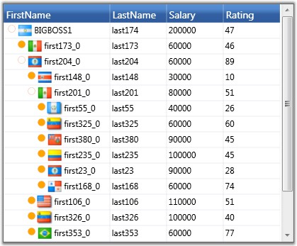

::: {style="DISPLAY: none"}
{#d2h_url_template}{#d2h_package_url style="WIDTH: 0px; DISPLAY: none; HEIGHT: 0px"}
:::

::: {.d2h_secondary_topic style="PADDING-BOTTOM: 10pt; MARGIN: 0pt; PADDING-LEFT: 0pt; PADDING-RIGHT: 0pt; PADDING-TOP: 0pt"}
##### Node Images {#node-images style="tab-stops: 0pt"}

You can display an image next to the expand glyph in the expand cell of the Grid Tree by setting the GridTreeControl.SupportNodeImages property to true. When this property is set to true, the Grid Tree will raise the RequestNodeImage event that allows you to provide an image for a given node. The EventArgs will provide you with the GridTreeNode object, and then the image can be set using the NodeImage property based on the given tree node.

 

The following code example illustrates how to handle the RequestNodeImage event.

 

+---------------------------------------------------------------------------------------------------------------------------------------------------------------------------------------------------------------------------------+
| [\[C#\]]{style="FONT-FAMILY: 'Courier New'; COLOR: black"}                                                                                                                                                                      |
|                                                                                                                                                                                                                                 |
| []{style="FONT-FAMILY: 'Courier New'; COLOR: blue"}                                                                                                                                                                             |
|                                                                                                                                                                                                                                 |
| [void]{style="FONT-FAMILY: 'Courier New'; COLOR: blue"}[ treeGrid_RequestNodeImage([object]{style="COLOR: blue"} sender, [GridTreeRequestNodeImageEventArgs]{style="COLOR: #2b91af"} args)]{style="FONT-FAMILY: 'Courier New'"} |
|                                                                                                                                                                                                                                 |
| [{]{style="FONT-FAMILY: 'Courier New'"}                                                                                                                                                                                         |
|                                                                                                                                                                                                                                 |
| [args.NodeImage = employees.GetItemBitmap(args.Item [as]{style="COLOR: blue"} Employee);]{style="FONT-FAMILY: 'Courier New'"}                                                                                                   |
|                                                                                                                                                                                                                                 |
| [}]{style="FONT-FAMILY: 'Courier New'"}                                                                                                                                                                                         |
+---------------------------------------------------------------------------------------------------------------------------------------------------------------------------------------------------------------------------------+

 

Here is a screen shot that shows custom glyphs and node images.

 

{border="0"}

Figure 262: Custom Glyphs and Node Images

 

 

 

[]{#related-topics}
:::
