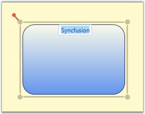
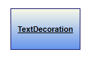

::: {style="DISPLAY: none"}
{#d2h_url_template}{#d2h_package_url style="WIDTH: 0px; DISPLAY: none; HEIGHT: 0px"}
:::

::::: {#nsbanner .d2h_main_nsbanner style="BORDER-BOTTOM: #999999 1px solid; POSITION: relative; PADDING-BOTTOM: 0px; BACKGROUND-COLOR: transparent; PADDING-LEFT: 0px; PADDING-RIGHT: 0px; DISPLAY: none; BORDER-TOP: #999999 1px solid; PADDING-TOP: 0px; LEFT: 0px"}
:::: {#TitleRow .d2h_main_titlerow style="PADDING-BOTTOM: 4px; BACKGROUND-COLOR: transparent; PADDING-LEFT: 22px; WIDTH: 100%; PADDING-RIGHT: 10px; DISPLAY: none; PADDING-TOP: 4px"}
::: {#ienav .d2h_main_ienav style="DISPLAY: none"}
{#D2HPrevious .D2HPreviousEnabled}  {#D2HNext .D2HNextEnabled}
:::
::::
:::::

:::::: {#nstext .d2h_main_nstext style="PADDING-BOTTOM: 10px; BACKGROUND-COLOR: transparent; PADDING-LEFT: 22px; PADDING-RIGHT: 10px; HEIGHT: 100%; OVERFLOW: auto; PADDING-TOP: 5px" hasuserbackground="true" valign="bottom"}
::: {#d2h_breadcrumbs .d2h_breadcrumbs}
[Essential Studio User Guide Documentation](ms-xhelp:///?Id=12457748-09e3-4d74-a240-8e049cedf030){.d2h_breadcrumbsNormal}[ \> ]{.d2h_breadcrumbsLinkSeparator}[User Interface Edition](ms-xhelp:///?Id=c29296b7-531c-413b-a0ec-488ca1f7f669){.d2h_breadcrumbsNormal}[ \> ]{.d2h_breadcrumbsLinkSeparator}[Essential Silverlight](ms-xhelp:///?Id=66221bd1-ba2e-43c2-94a7-618f50e01d24){.d2h_breadcrumbsNormal}[ \> ]{.d2h_breadcrumbsLinkSeparator}[Essential Diagram]{.d2h_breadcrumbsContentsOnly}[ \> ]{.d2h_breadcrumbsLinkSeparator}[Concepts and Features](ms-xhelp:///?Id=d592a058-dcc0-44a4-994e-e7901da8db52){.d2h_breadcrumbsNormal}[ \> ]{.d2h_breadcrumbsLinkSeparator}[Nodes](ms-xhelp:///?Id=0c8a3003-3786-4653-af8e-51b8d9f20219){.d2h_breadcrumbsNormal}
:::

### Node Label {#node-label style="tab-stops: 0pt"}

[]{style="FONT-FAMILY: 'Trebuchet MS','sans-serif'; COLOR: #15428b; FONT-SIZE: 9pt"} 

A label is a single line or multiline text that is displayed over the Node. This Label is used to textually represent a Node with a string that can be edited in run time,. There are many properties that are used to change the alignment and appearance settings. A Label can be represented as multiline text using the TextWrapping property.

 

Properties\
\

+-----------------------------+-----------------------------------------------------------------------------------------------------------------+-----------------------------------------------+-------------------------------+-----------------------------------------------------+
| Property                    | Description                                                                                                     | Type of the property                          | Value it Accept               | Any other dependencies/ sub properties associated   |
+=============================+=================================================================================================================+===============================================+===============================+=====================================================+
| IsLabelEditable             | Gets or sets a value indicating whether a node\'s label can be edited or not. The default value is set to true. | Dependency property                           | Boolean (true/ false)         | No[]{style="FONT-FAMILY: Consolas; FONT-SIZE: 8pt"} |
+-----------------------------+-----------------------------------------------------------------------------------------------------------------+-----------------------------------------------+-------------------------------+-----------------------------------------------------+
| Label                       | Gets or sets the node label                                                                                     | Dependency property                           | string                        | No                                                  |
+-----------------------------+-----------------------------------------------------------------------------------------------------------------+-----------------------------------------------+-------------------------------+-----------------------------------------------------+
| LabelVisibility             | Gets or sets the label visibility                                                                               | Dependency property                           | Visibility.Hidden             | No                                                  |
|                             |                                                                                                                 |                                               |                               |                                                     |
|                             |                                                                                                                 |                                               | Visibility.Collapsed          |                                                     |
|                             |                                                                                                                 |                                               |                               |                                                     |
|                             |                                                                                                                 |                                               | Visibility.Visible            |                                                     |
+-----------------------------+-----------------------------------------------------------------------------------------------------------------+-----------------------------------------------+-------------------------------+-----------------------------------------------------+
| LabelHorizontalAlignment    | Specifies the horizontal alignment for the node label                                                           | Dependency property                           | HorizontalAlignment.Center    | No                                                  |
|                             |                                                                                                                 |                                               |                               |                                                     |
|                             |                                                                                                                 |                                               | HorizontalAlignment.Left      |                                                     |
|                             |                                                                                                                 |                                               |                               |                                                     |
|                             |                                                                                                                 |                                               | HorizontalAlignment.Right     |                                                     |
|                             |                                                                                                                 |                                               |                               |                                                     |
|                             |                                                                                                                 |                                               | HorizontalAlignment.Stretch   |                                                     |
+-----------------------------+-----------------------------------------------------------------------------------------------------------------+-----------------------------------------------+-------------------------------+-----------------------------------------------------+
| LabelVerticalAlignment      | Specifies the vertical alignment for the node label                                                             | Dependency property                           | VerticalAlignment.Bottom      | No                                                  |
|                             |                                                                                                                 |                                               |                               |                                                     |
|                             |                                                                                                                 |                                               | VerticalAlignment.Center      |                                                     |
|                             |                                                                                                                 |                                               |                               |                                                     |
|                             |                                                                                                                 |                                               | VerticalAlignment.Stretch     |                                                     |
|                             |                                                                                                                 |                                               |                               |                                                     |
|                             |                                                                                                                 |                                               | VerticalAlignment.Top         |                                                     |
+-----------------------------+-----------------------------------------------------------------------------------------------------------------+-----------------------------------------------+-------------------------------+-----------------------------------------------------+
| LabelAngle                  | Gets or sets the angle of the node label                                                                        | Dependency property                           | double                        | No                                                  |
+-----------------------------+-----------------------------------------------------------------------------------------------------------------+-----------------------------------------------+-------------------------------+-----------------------------------------------------+
| LabelForeground             | Gets or sets the foreground of the label. The default value is Black.                                           | Dependency property                           | Brush                         | No                                                  |
+-----------------------------+-----------------------------------------------------------------------------------------------------------------+-----------------------------------------------+-------------------------------+-----------------------------------------------------+
| LabelBackground             | Gets or sets the background of the label. The default value is White.                                           | Dependency property                           | Brush                         | No                                                  |
+-----------------------------+-----------------------------------------------------------------------------------------------------------------+-----------------------------------------------+-------------------------------+-----------------------------------------------------+
| LabelFontStyle              | Gets or sets the background of the label. The default value is White.                                           | Dependency property                           | FontStyle                     | No                                                  |
+-----------------------------+-----------------------------------------------------------------------------------------------------------------+-----------------------------------------------+-------------------------------+-----------------------------------------------------+
| LabelFontFamily             | Gets or sets the font family of the label. The default value is Arial.                                          | Dependency property                           | FontFamily                    | No                                                  |
+-----------------------------+-----------------------------------------------------------------------------------------------------------------+-----------------------------------------------+-------------------------------+-----------------------------------------------------+
| LabelFontSize               | Gets or sets the font size of the label. The default value is 11.                                               | Dependency property                           | Double                        | No                                                  |
+-----------------------------+-----------------------------------------------------------------------------------------------------------------+-----------------------------------------------+-------------------------------+-----------------------------------------------------+
| LabelFontWeight             | Gets or sets the font weight of the label. The default value is SemiBold.                                       | Dependency property                           | FontWeight                    | No                                                  |
+-----------------------------+-----------------------------------------------------------------------------------------------------------------+-----------------------------------------------+-------------------------------+-----------------------------------------------------+
| LabelTextDecoration         | Gets or sets the text decoration of the label. []{style="COLOR: #c00000"}                                       | Dependency property[]{style="COLOR: #c00000"} | TextDecorations.Underline     | No[]{style="COLOR: #c00000"}                        |
|                             |                                                                                                                 |                                               |                               |                                                     |
| []{style="COLOR: #c00000"}  |                                                                                                                 |                                               | []{style="COLOR: #c00000"}    |                                                     |
+-----------------------------+-----------------------------------------------------------------------------------------------------------------+-----------------------------------------------+-------------------------------+-----------------------------------------------------+
| LabelTextWrapping           | Gets or sets the text wrapping of the label. The default value is NoWrap.                                       | Dependency property                           | TextWrapping.NoWrap           | No                                                  |
|                             |                                                                                                                 |                                               |                               |                                                     |
|                             |                                                                                                                 |                                               | TextWrapping.Wrap             |                                                     |
|                             |                                                                                                                 |                                               |                               |                                                     |
|                             |                                                                                                                 |                                               | TextWrapping.WrapWithOverflow |                                                     |
+-----------------------------+-----------------------------------------------------------------------------------------------------------------+-----------------------------------------------+-------------------------------+-----------------------------------------------------+
| LabelWidth                  | Gets or sets the width of the label. The default value is the node's width.                                     | Dependency property                           | Double                        | No                                                  |
+-----------------------------+-----------------------------------------------------------------------------------------------------------------+-----------------------------------------------+-------------------------------+-----------------------------------------------------+

[]{style="FONT-FAMILY: 'Trebuchet MS','sans-serif'; COLOR: #15428b; FONT-SIZE: 9pt"} 

**[]{style="FONT-FAMILY: 'Trebuchet MS','sans-serif'; COLOR: #15428b"}** 

The following is a list of topics explained subsequently:

[]{style="FONT-FAMILY: 'Trebuchet MS','sans-serif'; COLOR: #15428b; FONT-SIZE: 9pt"} 

[·      ]{style="FONT-FAMILY: Symbol"}Set Label for Node

[·      ]{style="FONT-FAMILY: Symbol"}Label Editing

[·      ]{style="FONT-FAMILY: Symbol"}Multi line label

[·      ]{style="FONT-FAMILY: Symbol; FONT-SIZE: 8pt"}Label Visibility[]{style="FONT-SIZE: 8pt"}

[·      ]{style="FONT-FAMILY: Symbol"}Label Angle

**[]{style="FONT-FAMILY: 'Trebuchet MS','sans-serif'; COLOR: #15428b"}** 

[]{style="FONT-FAMILY: 'Trebuchet MS','sans-serif'; COLOR: #15428b; FONT-SIZE: 9pt"} 

Set a label for the node using the **Label** property. The default value is an empty string. By default, the label is displayed at the top-center position.

[]{style="FONT-FAMILY: 'Trebuchet MS','sans-serif'; COLOR: #15428b; FONT-SIZE: 9pt"} 

+-------------------------------------------------------------------------------------------------------------------------------------------------------------------+
| **[\[C#\]]{style="FONT-FAMILY: 'Courier New'; COLOR: black"}**                                                                                                    |
|                                                                                                                                                                   |
| []{style="FONT-FAMILY: 'Courier New'; COLOR: black"}                                                                                                              |
|                                                                                                                                                                   |
| [Node]{style="FONT-FAMILY: 'Courier New'; COLOR: #2b91af"}[ n = [new]{style="COLOR: blue"} [Node]{style="COLOR: #2b91af"}();]{style="FONT-FAMILY: 'Courier New'"} |
|                                                                                                                                                                   |
| [n.OffsetX = 50;]{style="FONT-FAMILY: 'Courier New'"}                                                                                                             |
|                                                                                                                                                                   |
| [n.OffsetY = 50;]{style="FONT-FAMILY: 'Courier New'"}                                                                                                             |
|                                                                                                                                                                   |
| [n.Shape = [Shapes]{style="COLOR: #2b91af"}.FlowChart_Card;]{style="FONT-FAMILY: 'Courier New'"}                                                                  |
|                                                                                                                                                                   |
| [n.Label = [\"Silverlight\"]{style="COLOR: #a31515"};]{style="FONT-FAMILY: 'Courier New'"}                                                                        |
|                                                                                                                                                                   |
| [diagramModel.Nodes.Add(n);]{style="FONT-FAMILY: 'Courier New'"}                                                                                                  |
+-------------------------------------------------------------------------------------------------------------------------------------------------------------------+

[]{style="FONT-FAMILY: 'Trebuchet MS','sans-serif'; COLOR: #15428b; FONT-SIZE: 9pt"} 

+--------------------------------------------------------------------------------------------------------------------------------------------------------------------------------------+
| **[\[VB\]]{style="FONT-FAMILY: 'Courier New'; COLOR: black"}**                                                                                                                       |
|                                                                                                                                                                                      |
| []{style="FONT-FAMILY: 'Courier New'; COLOR: black"}                                                                                                                                 |
|                                                                                                                                                                                      |
| [Dim]{style="FONT-FAMILY: 'Courier New'; COLOR: blue"}[ n [As]{style="COLOR: blue"} [New]{style="COLOR: blue"} [Node]{style="COLOR: #2b91af"}()]{style="FONT-FAMILY: 'Courier New'"} |
|                                                                                                                                                                                      |
| [n.OffsetX = 50]{style="FONT-FAMILY: 'Courier New'"}                                                                                                                                 |
|                                                                                                                                                                                      |
| [n.OffsetY = 50]{style="FONT-FAMILY: 'Courier New'"}                                                                                                                                 |
|                                                                                                                                                                                      |
| [n.Shape = Shapes.FlowChart_Card]{style="FONT-FAMILY: 'Courier New'"}                                                                                                                |
|                                                                                                                                                                                      |
| [n.Label = \"Silverlight\"]{style="FONT-FAMILY: 'Courier New'"}                                                                                                                      |
|                                                                                                                                                                                      |
| [diagramModel.Nodes.Add(n)]{style="FONT-FAMILY: 'Courier New'"}[]{style="FONT-FAMILY: 'Courier New'"}                                                                                |
+--------------------------------------------------------------------------------------------------------------------------------------------------------------------------------------+

[]{style="FONT-FAMILY: 'Trebuchet MS','sans-serif'; COLOR: #15428b; FONT-SIZE: 9pt"} 

{border="0"}

Figure 37: Label[]{style="FONT-FAMILY: 'Trebuchet MS','sans-serif'; COLOR: #15428b"}

[]{#p30} 

 

Label Editing[]{style="FONT-SIZE: 11pt"}

[]{style="FONT-FAMILY: 'Trebuchet MS','sans-serif'; COLOR: #15428b; FONT-SIZE: 9pt"} 

A node\'s label can be edited at run time by setting IsLabelEditable property to *true*.

[]{style="FONT-FAMILY: 'Trebuchet MS','sans-serif'; COLOR: #15428b; FONT-SIZE: 9pt"} 

+-------------------------------------------------------------------------------------------------------------------------------------------------------------------+
| **[\[C#\]]{style="FONT-FAMILY: 'Courier New'; COLOR: black"}**                                                                                                    |
|                                                                                                                                                                   |
| []{style="FONT-FAMILY: 'Courier New'; COLOR: black"}                                                                                                              |
|                                                                                                                                                                   |
| [Node]{style="FONT-FAMILY: 'Courier New'; COLOR: #2b91af"}[ n = [new]{style="COLOR: blue"} [Node]{style="COLOR: #2b91af"}();]{style="FONT-FAMILY: 'Courier New'"} |
|                                                                                                                                                                   |
| [n.Shape = [Shapes]{style="COLOR: #2b91af"}.RoundedRectangle;]{style="FONT-FAMILY: 'Courier New'"}                                                                |
|                                                                                                                                                                   |
| [n.IsLabelEditable = [true]{style="COLOR: blue"};]{style="FONT-FAMILY: 'Courier New'"}                                                                            |
+-------------------------------------------------------------------------------------------------------------------------------------------------------------------+

[]{style="FONT-FAMILY: 'Trebuchet MS','sans-serif'; COLOR: #15428b; FONT-SIZE: 9pt"} 

+--------------------------------------------------------------------------------------------------------------------------------------------------------------------------------------+
| **[\[VB\]]{style="FONT-FAMILY: 'Courier New'; COLOR: black"}**                                                                                                                       |
|                                                                                                                                                                                      |
| []{style="FONT-FAMILY: 'Courier New'; COLOR: black"}                                                                                                                                 |
|                                                                                                                                                                                      |
| [Dim]{style="FONT-FAMILY: 'Courier New'; COLOR: blue"}[ n [As]{style="COLOR: blue"} [New]{style="COLOR: blue"} [Node]{style="COLOR: #2b91af"}()]{style="FONT-FAMILY: 'Courier New'"} |
|                                                                                                                                                                                      |
| [n.Shape = Shapes.RoundedRectangle]{style="FONT-FAMILY: 'Courier New'"}                                                                                                              |
|                                                                                                                                                                                      |
| [n.IsLabelEditable = [True]{style="COLOR: blue"}]{style="FONT-FAMILY: 'Courier New'"}[]{style="FONT-FAMILY: 'Courier New'"}                                                          |
+--------------------------------------------------------------------------------------------------------------------------------------------------------------------------------------+

[]{style="FONT-FAMILY: 'Trebuchet MS','sans-serif'; COLOR: #15428b; FONT-SIZE: 9pt"} 

A user can specify a label at run time by:

[]{style="FONT-FAMILY: 'Trebuchet MS','sans-serif'; COLOR: #15428b; FONT-SIZE: 9pt"} 

1.   Double-click the left mouse button on the node. A text box will appear with the cursor at the beginning.

2.   Now type the label name and press ENTER. The label will be displayed on the node. Press ESC key if you do not want to apply the new label value.

[]{style="FONT-FAMILY: 'Trebuchet MS','sans-serif'; COLOR: #15428b; FONT-SIZE: 9pt"} 

{border="0"}

Figure 38: LabelEditor**[]{style="FONT-STYLE: normal; FONT-FAMILY: 'Trebuchet MS','sans-serif'; COLOR: #15428b"}**

 

[]{#p31}See Also:

 

[[Customize the Label of Nodes and Line Connectors]{style="COLOR: blue"}]{.UGHyperlink}

 

[]{style="FONT-FAMILY: 'Trebuchet MS','sans-serif'; COLOR: #15428b; FONT-SIZE: 9pt"} 

Multiline label

**[]{style="FONT-FAMILY: 'Trebuchet MS','sans-serif'; COLOR: #15428b"}** 

Label text can be displayed in multiple lines using LabelTextWrapping property set to Wrap, if there is no enough space for the text to get displayed over the node in a single line, text will get wrapped within node boundaries and will start to display the label in multiple lines.

[]{style="FONT-FAMILY: 'Trebuchet MS','sans-serif'; COLOR: #15428b; FONT-SIZE: 9pt"} 

+-------------------------------------------------------------------------------------------------------------------------------------------------------------------+
| **[\[C#\]]{style="FONT-FAMILY: 'Courier New'; COLOR: black"}**                                                                                                    |
|                                                                                                                                                                   |
| []{style="FONT-FAMILY: 'Courier New'; COLOR: black"}                                                                                                              |
|                                                                                                                                                                   |
| [Node]{style="FONT-FAMILY: 'Courier New'; COLOR: #2b91af"}[ n = [new]{style="COLOR: blue"} [Node]{style="COLOR: #2b91af"}();]{style="FONT-FAMILY: 'Courier New'"} |
|                                                                                                                                                                   |
| [n.Shape = [Shapes]{style="COLOR: #2b91af"}.RoundedRectangle;]{style="FONT-FAMILY: 'Courier New'"}                                                                |
|                                                                                                                                                                   |
| [n.Label = [\"This is Multiline Label\"]{style="COLOR: #a31515"};]{style="FONT-FAMILY: 'Courier New'"}                                                            |
|                                                                                                                                                                   |
| [n.Width = 75;]{style="FONT-FAMILY: 'Courier New'"}                                                                                                               |
|                                                                                                                                                                   |
| [n.Height = 100;]{style="FONT-FAMILY: 'Courier New'"}                                                                                                             |
|                                                                                                                                                                   |
| [n.LabelTextWrapping = [TextWrapping]{style="COLOR: #2b91af"}.Wrap;]{style="FONT-FAMILY: 'Courier New'"}[]{style="FONT-FAMILY: Consolas"}                         |
|                                                                                                                                                                   |
| [n.IsLabelEditable = [true]{style="COLOR: blue"};]{style="FONT-FAMILY: 'Courier New'"}                                                                            |
+-------------------------------------------------------------------------------------------------------------------------------------------------------------------+

[]{style="FONT-FAMILY: 'Trebuchet MS','sans-serif'; COLOR: #15428b; FONT-SIZE: 9pt"} 

+--------------------------------------------------------------------------------------------------------------------------------------------------------------------------------------+
| **[\[VB\]]{style="FONT-FAMILY: 'Courier New'; COLOR: black"}**                                                                                                                       |
|                                                                                                                                                                                      |
| []{style="FONT-FAMILY: 'Courier New'; COLOR: black"}                                                                                                                                 |
|                                                                                                                                                                                      |
| [Dim]{style="FONT-FAMILY: 'Courier New'; COLOR: blue"}[ n [As]{style="COLOR: blue"} [New]{style="COLOR: blue"} [Node]{style="COLOR: #2b91af"}()]{style="FONT-FAMILY: 'Courier New'"} |
|                                                                                                                                                                                      |
| [n.Shape = Shapes.RoundedRectangle]{style="FONT-FAMILY: 'Courier New'"}                                                                                                              |
|                                                                                                                                                                                      |
| [n.Label = \"This [is]{style="COLOR: blue"} Multiline Label\"]{style="FONT-FAMILY: 'Courier New'"}                                                                                   |
|                                                                                                                                                                                      |
| [n.Width = 75]{style="FONT-FAMILY: 'Courier New'"}                                                                                                                                   |
|                                                                                                                                                                                      |
| [n.Height = 100]{style="FONT-FAMILY: 'Courier New'"}                                                                                                                                 |
|                                                                                                                                                                                      |
| [n.LabelTextWrapping = TextWrapping.Wrap]{style="FONT-FAMILY: 'Courier New'"}                                                                                                        |
|                                                                                                                                                                                      |
| [n.IsLabelEditable = [True]{style="COLOR: blue"}]{style="FONT-FAMILY: 'Courier New'"}[]{style="FONT-FAMILY: 'Courier New'"}                                                          |
+--------------------------------------------------------------------------------------------------------------------------------------------------------------------------------------+

[]{style="FONT-FAMILY: 'Trebuchet MS','sans-serif'; COLOR: #15428b; FONT-SIZE: 9pt"} 

{border="0"}

Figure 39: Multiline label**[]{style="FONT-STYLE: normal; FONT-FAMILY: 'Trebuchet MS','sans-serif'; COLOR: #15428b"}**

[]{style="FONT-FAMILY: 'Trebuchet MS','sans-serif'; COLOR: #15428b; FONT-SIZE: 9pt"} 

[]{style="FONT-FAMILY: 'Trebuchet MS','sans-serif'; COLOR: #15428b; FONT-SIZE: 9pt"} 

Label Visibility

**[]{style="FONT-FAMILY: 'Trebuchet MS','sans-serif'; COLOR: #15428b"}** 

A label\'s visibility can be changed using the **LabelVisibility** property. The default value is visible.

[]{style="FONT-FAMILY: 'Trebuchet MS','sans-serif'; COLOR: #15428b; FONT-SIZE: 9pt"} 

+-------------------------------------------------------------------------------------------------------------------------------------------------------------------+
| **[\[C#\]]{style="FONT-FAMILY: 'Courier New'; COLOR: black"}**                                                                                                    |
|                                                                                                                                                                   |
| []{style="FONT-FAMILY: 'Courier New'; COLOR: black"}                                                                                                              |
|                                                                                                                                                                   |
| [Node]{style="FONT-FAMILY: 'Courier New'; COLOR: #2b91af"}[ n = [new]{style="COLOR: blue"} [Node]{style="COLOR: #2b91af"}();]{style="FONT-FAMILY: 'Courier New'"} |
|                                                                                                                                                                   |
| [n.Shape = [Shapes]{style="COLOR: #2b91af"}.FlowChart_Card;]{style="FONT-FAMILY: 'Courier New'"}                                                                  |
|                                                                                                                                                                   |
| [n.Label = [\"Syncfusion\"]{style="COLOR: #a31515"};]{style="FONT-FAMILY: 'Courier New'"}                                                                         |
|                                                                                                                                                                   |
| [n.LabelVisibility = [Visibility]{style="COLOR: #2b91af"}.Hidden;]{style="FONT-FAMILY: 'Courier New'"}                                                            |
+-------------------------------------------------------------------------------------------------------------------------------------------------------------------+

[]{style="FONT-FAMILY: 'Trebuchet MS','sans-serif'; COLOR: #15428b; FONT-SIZE: 9pt"} 

+--------------------------------------------------------------------------------------------------------------------------------------------------------------------------------------+
| **[\[VB\]]{style="FONT-FAMILY: 'Courier New'; COLOR: black"}**                                                                                                                       |
|                                                                                                                                                                                      |
| []{style="FONT-FAMILY: 'Courier New'; COLOR: black"}                                                                                                                                 |
|                                                                                                                                                                                      |
| [Dim]{style="FONT-FAMILY: 'Courier New'; COLOR: blue"}[ n [As]{style="COLOR: blue"} [New]{style="COLOR: blue"} [Node]{style="COLOR: #2b91af"}()]{style="FONT-FAMILY: 'Courier New'"} |
|                                                                                                                                                                                      |
| [n.Shape = Shapes.FlowChart_Card]{style="FONT-FAMILY: 'Courier New'"}                                                                                                                |
|                                                                                                                                                                                      |
| [n.Label = \"Syncfusion\"]{style="FONT-FAMILY: 'Courier New'"}                                                                                                                       |
|                                                                                                                                                                                      |
| [n.LabelVisibility = Visibility.Hidden]{style="FONT-FAMILY: 'Courier New'"}[]{style="FONT-FAMILY: 'Courier New'"}                                                                    |
+--------------------------------------------------------------------------------------------------------------------------------------------------------------------------------------+

[]{style="FONT-FAMILY: 'Trebuchet MS','sans-serif'; COLOR: #15428b; FONT-SIZE: 9pt"} 

Label Vertical Alignment and Label Horizontal Alignment

[]{style="FONT-FAMILY: 'Trebuchet MS','sans-serif'; COLOR: #15428b; FONT-SIZE: 9pt"} 

Vertical and horizontal alignments of a label are specified using **LabelVerticalAlignment** and **LabelHorizontalAlignment** properties. By default, LabelVerticalAlignment is set to Top and LabelHorizontalAlignment is set to Center.

[]{style="FONT-FAMILY: 'Trebuchet MS','sans-serif'; COLOR: #15428b; FONT-SIZE: 9pt"} 

+-------------------------------------------------------------------------------------------------------------------------------------------------------------------+
| **[\[C#\]]{style="FONT-FAMILY: 'Courier New'; COLOR: black"}**                                                                                                    |
|                                                                                                                                                                   |
| []{style="FONT-FAMILY: 'Courier New'; COLOR: black"}                                                                                                              |
|                                                                                                                                                                   |
| [Node]{style="FONT-FAMILY: 'Courier New'; COLOR: #2b91af"}[ n = [new]{style="COLOR: blue"} [Node]{style="COLOR: #2b91af"}();]{style="FONT-FAMILY: 'Courier New'"} |
|                                                                                                                                                                   |
| [n.Shape = [Shapes]{style="COLOR: #2b91af"}.FlowChart_Card;]{style="FONT-FAMILY: 'Courier New'"}                                                                  |
|                                                                                                                                                                   |
| [n.Label = [\"Diagram\"]{style="COLOR: #a31515"};]{style="FONT-FAMILY: 'Courier New'"}                                                                            |
|                                                                                                                                                                   |
| [n.LabelHorizontalAlignment = [HorizontalAlignment]{style="COLOR: #2b91af"}.Center;]{style="FONT-FAMILY: 'Courier New'"}                                          |
|                                                                                                                                                                   |
| [n.LabelVerticalAlignment = [VerticalAlignment]{style="COLOR: #2b91af"}.Center;]{style="FONT-FAMILY: 'Courier New'"}                                              |
+-------------------------------------------------------------------------------------------------------------------------------------------------------------------+

[]{style="FONT-FAMILY: 'Trebuchet MS','sans-serif'; COLOR: #15428b; FONT-SIZE: 9pt"} 

+--------------------------------------------------------------------------------------------------------------------------------------------------------------------------------------+
| **[\[VB\]]{style="FONT-FAMILY: 'Courier New'; COLOR: black"}**                                                                                                                       |
|                                                                                                                                                                                      |
| []{style="FONT-FAMILY: 'Courier New'; COLOR: black"}                                                                                                                                 |
|                                                                                                                                                                                      |
| [Dim]{style="FONT-FAMILY: 'Courier New'; COLOR: blue"}[ n [As]{style="COLOR: blue"} [New]{style="COLOR: blue"} [Node]{style="COLOR: #2b91af"}()]{style="FONT-FAMILY: 'Courier New'"} |
|                                                                                                                                                                                      |
| [n.Shape = Shapes.FlowChart_Card]{style="FONT-FAMILY: 'Courier New'"}                                                                                                                |
|                                                                                                                                                                                      |
| [n.Label = \"Diagram\"]{style="FONT-FAMILY: 'Courier New'"}                                                                                                                          |
|                                                                                                                                                                                      |
| [n.LabelHorizontalAlignment = HorizontalAlignment.Center]{style="FONT-FAMILY: 'Courier New'"}                                                                                        |
|                                                                                                                                                                                      |
| [n.LabelVerticalAlignment = VerticalAlignment.Center]{style="FONT-FAMILY: 'Courier New'"}[]{style="FONT-FAMILY: 'Courier New'"}                                                      |
+--------------------------------------------------------------------------------------------------------------------------------------------------------------------------------------+

[]{style="FONT-FAMILY: 'Trebuchet MS','sans-serif'; COLOR: #15428b; FONT-SIZE: 9pt"} 

This will place the label at the center of the node.

[]{style="FONT-FAMILY: 'Trebuchet MS','sans-serif'; COLOR: #15428b; FONT-SIZE: 9pt"} 

{border="0"}

Figure 40: LabelAlignment**[]{style="FONT-STYLE: normal; FONT-FAMILY: 'Trebuchet MS','sans-serif'; COLOR: #15428b"}**

**[]{style="FONT-FAMILY: 'Trebuchet MS','sans-serif'; COLOR: #15428b; FONT-SIZE: 9pt"}** 

LabelAngle

**[]{style="FONT-FAMILY: 'Trebuchet MS','sans-serif'; COLOR: #15428b"}** 

The user can rotate the label by a specified angle and display it using the following code snippet.

[]{style="FONT-FAMILY: 'Trebuchet MS','sans-serif'; COLOR: #15428b; FONT-SIZE: 9pt"} 

+-------------------------------------------------------------------------------------------------------------------------------------------------------------------+
| **[\[C#\]]{style="FONT-FAMILY: 'Courier New'; COLOR: black"}**                                                                                                    |
|                                                                                                                                                                   |
| []{style="FONT-FAMILY: 'Courier New'; COLOR: black"}                                                                                                              |
|                                                                                                                                                                   |
| [Node]{style="FONT-FAMILY: 'Courier New'; COLOR: #2b91af"}[ n = [new]{style="COLOR: blue"} [Node]{style="COLOR: #2b91af"}();]{style="FONT-FAMILY: 'Courier New'"} |
|                                                                                                                                                                   |
| [n.Shape = [Shapes]{style="COLOR: #2b91af"}.FlowChart_Card;]{style="FONT-FAMILY: 'Courier New'"}                                                                  |
|                                                                                                                                                                   |
| [n.Label = [\"Diagram\"]{style="COLOR: #a31515"};]{style="FONT-FAMILY: 'Courier New'"}                                                                            |
|                                                                                                                                                                   |
| [n.LabelHorizontalAlignment = [HorizontalAlignment]{style="COLOR: #2b91af"}.Right;]{style="FONT-FAMILY: 'Courier New'"}                                           |
|                                                                                                                                                                   |
| [n.LabelVerticalAlignment = [VerticalAlignment]{style="COLOR: #2b91af"}.Top;]{style="FONT-FAMILY: 'Courier New'"}                                                 |
|                                                                                                                                                                   |
| [n.Label = 45;]{style="FONT-FAMILY: 'Courier New'"}                                                                                                               |
+-------------------------------------------------------------------------------------------------------------------------------------------------------------------+

[]{style="FONT-FAMILY: 'Trebuchet MS','sans-serif'; COLOR: #15428b; FONT-SIZE: 9pt"} 

+--------------------------------------------------------------------------------------------------------------------------------------------------------------------------------------+
| **[\[VB\]]{style="FONT-FAMILY: 'Courier New'; COLOR: black"}**                                                                                                                       |
|                                                                                                                                                                                      |
| []{style="FONT-FAMILY: 'Courier New'; COLOR: black"}                                                                                                                                 |
|                                                                                                                                                                                      |
| [Dim]{style="FONT-FAMILY: 'Courier New'; COLOR: blue"}[ n [As]{style="COLOR: blue"} [New]{style="COLOR: blue"} [Node]{style="COLOR: #2b91af"}()]{style="FONT-FAMILY: 'Courier New'"} |
|                                                                                                                                                                                      |
| [n.Shape = Shapes.FlowChart_Card]{style="FONT-FAMILY: 'Courier New'"}                                                                                                                |
|                                                                                                                                                                                      |
| [n.Label = \"Diagram\"]{style="FONT-FAMILY: 'Courier New'"}                                                                                                                          |
|                                                                                                                                                                                      |
| [n.LabelHorizontalAlignment = HorizontalAlignment.Right]{style="FONT-FAMILY: 'Courier New'"}                                                                                         |
|                                                                                                                                                                                      |
| [n.LabelVerticalAlignment = VerticalAlignment.Top]{style="FONT-FAMILY: 'Courier New'"}                                                                                               |
|                                                                                                                                                                                      |
| [n.Label = 45]{style="FONT-FAMILY: 'Courier New'"}[]{style="FONT-FAMILY: 'Courier New'"}                                                                                             |
+--------------------------------------------------------------------------------------------------------------------------------------------------------------------------------------+

[]{style="FONT-FAMILY: 'Trebuchet MS','sans-serif'; COLOR: #15428b; FONT-SIZE: 9pt"} 

{border="0"}

Figure 41: Label Angle**[]{style="FONT-STYLE: normal; FONT-FAMILY: 'Trebuchet MS','sans-serif'; COLOR: #15428b"}**

 

[]{#p32}Text Decoration for Label

Essential Diagram for Silverlight provides support to add text decorations to diagram labels. Using the **TextDecoration** property, the label of a node can be customized. The user can decorate the label by using the following code snippet:

+-----------------------------------------------------------------------------------------------------------------------------------------------------------------------------------------------------+
| **[\[C#\]]{style="FONT-FAMILY: 'Courier New'; COLOR: black; FONT-SIZE: 11pt"}**[\                                                                                                                   |
| ]{style="FONT-FAMILY: 'Courier New'; FONT-SIZE: 11pt"}[Node]{style="FONT-FAMILY: Consolas; COLOR: #2b91af; FONT-SIZE: 9.5pt"}[ node = [new]{style="COLOR: blue"} [Node]{style="COLOR: #2b91af"}();\ |
| node.LabelTextDecoration = [TextDecorations]{style="COLOR: #2b91af"}.Underline;]{style="FONT-FAMILY: Consolas; FONT-SIZE: 9.5pt"}[]{style="FONT-FAMILY: 'Courier New'; FONT-SIZE: 11pt"}            |
+-----------------------------------------------------------------------------------------------------------------------------------------------------------------------------------------------------+

 

{border="0"}

Figure 42:Text Decoration

 

Custom Label Support for Node

This feature enables you to customize the Label Position of the Nodes. The **IsLabelDragable** and **LabelDisplacement** property is used to customize the Label position of the node. **LabelDisplacement** property depends on LabelHorizontalAlignment and LabelVerticalAlignment.

 

+-------------------+--------------------------------------------------------------------------------------------------------+----------------------+------------------+----------------+---------------------------------------------------+
| Property          | Description                                                                                            | Type                 | Value It Accepts | Default Values | Any other dependencies/ sub properties associated |
+-------------------+--------------------------------------------------------------------------------------------------------+----------------------+------------------+----------------+---------------------------------------------------+
| IsLabelDragable   | Gets or sets the Label of Node to be Dragged or Not.                                                   | Dependency  property | bool(true/false) | False          | No                                                |
|                   |                                                                                                        |                      |                  |                |                                                   |
|                   |                                                                                                        |                      |                  |                |                                                   |
+-------------------+--------------------------------------------------------------------------------------------------------+----------------------+------------------+----------------+---------------------------------------------------+
| LabelDisplacement | Gets or sets the different between the Original position and the Current position of the Node's Label. | Dependency  property | Point            | Point(0,0)     | No                                                |
|                   |                                                                                                        |                      |                  |                |                                                   |
|                   |                                                                                                        |                      |                  |                |                                                   |
+-------------------+--------------------------------------------------------------------------------------------------------+----------------------+------------------+----------------+---------------------------------------------------+

[]{style="FONT-FAMILY: 'Calibri','sans-serif'; COLOR: black"} 

Adding Custom Label Enhancements for Node to an Application

 

Set the LabelDisplacement for Node

 

Label is aligned within the bounds of Node using LabelHorizontalAlignment and LabelVerticalAlignment property, the LabelDisplacement can be used as to displace the Label from this original position. This value can be positive or negative.

**[]{style="FONT-SIZE: 12pt"}** 

::: {align="center"}
+-------------------------------------------------------------------------------------------------------------------------------------------------------------------------------------------------------------------------------------------------------------+
| **[\[C#\]]{style="FONT-FAMILY: 'Courier New'"}**                                                                                                                                                                                                            |
|                                                                                                                                                                                                                                                             |
| [       ]{style="FONT-FAMILY: 'Courier New'; COLOR: #2b91af"}[(node [as]{style="COLOR: blue"} [Node]{style="COLOR: #2b91af"}).LabelDisplacement = [new]{style="COLOR: blue"} [Point]{style="COLOR: #2b91af"}(100,100);]{style="FONT-FAMILY: 'Courier New'"} |
|                                                                                                                                                                                                                                                             |
| []{style="FONT-FAMILY: 'Courier New'"}                                                                                                                                                                                                                      |
|                                                                                                                                                                                                                                                             |
| []{style="FONT-FAMILY: 'Courier New'"}                                                                                                                                                                                                                      |
+-------------------------------------------------------------------------------------------------------------------------------------------------------------------------------------------------------------------------------------------------------------+
:::

 

Label Dragging support for Node

The Label can be dragged from the Node at runtime, if this property is set to true. When a label is dragged, it will automatically update the LabelDisplacement value.

::: {align="center"}
+---------------------------------------------------------------------------------------------------------------------------------------------------------------------------------------------------------------------------------------------------------+
| **[\[C#\]]{style="FONT-FAMILY: 'Courier New'"}**                                                                                                                                                                                                        |
|                                                                                                                                                                                                                                                         |
| [       ]{style="FONT-FAMILY: 'Courier New'; COLOR: #2b91af"}[(node [as]{style="COLOR: blue"} [Node]{style="COLOR: #2b91af"}).IsLabelDragable = [true]{style="COLOR: blue"};]{style="FONT-FAMILY: 'Courier New'"}[]{style="FONT-FAMILY: 'Courier New'"} |
+---------------------------------------------------------------------------------------------------------------------------------------------------------------------------------------------------------------------------------------------------------+
:::

 

[]{#related-topics}
::::::
