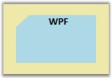
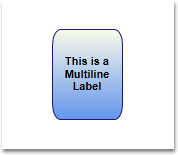
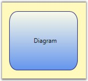
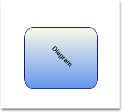
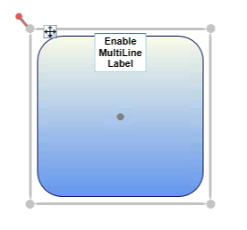

::: {style="DISPLAY: none"}
{#d2h_url_template}{#d2h_package_url style="WIDTH: 0px; DISPLAY: none; HEIGHT: 0px"}
:::

::::: {#nsbanner .d2h_main_nsbanner style="BORDER-BOTTOM: #999999 1px solid; POSITION: relative; PADDING-BOTTOM: 0px; BACKGROUND-COLOR: transparent; PADDING-LEFT: 0px; PADDING-RIGHT: 0px; DISPLAY: none; BORDER-TOP: #999999 1px solid; PADDING-TOP: 0px; LEFT: 0px"}
:::: {#TitleRow .d2h_main_titlerow style="PADDING-BOTTOM: 4px; BACKGROUND-COLOR: transparent; PADDING-LEFT: 22px; WIDTH: 100%; PADDING-RIGHT: 10px; DISPLAY: none; PADDING-TOP: 4px"}
::: {#ienav .d2h_main_ienav style="DISPLAY: none"}
{#D2HPrevious .D2HPreviousEnabled}  {#D2HNext .D2HNextEnabled}
:::
::::
:::::

:::::: {#nstext .d2h_main_nstext style="PADDING-BOTTOM: 10px; BACKGROUND-COLOR: transparent; PADDING-LEFT: 22px; PADDING-RIGHT: 10px; HEIGHT: 100%; OVERFLOW: auto; PADDING-TOP: 5px" hasuserbackground="true" valign="bottom"}
::: {#d2h_breadcrumbs .d2h_breadcrumbs}
[Essential Studio User Guide Documentation](ms-xhelp:///?Id=12457748-09e3-4d74-a240-8e049cedf030){.d2h_breadcrumbsNormal}[ \> ]{.d2h_breadcrumbsLinkSeparator}[User Interface Edition](ms-xhelp:///?Id=c29296b7-531c-413b-a0ec-488ca1f7f669){.d2h_breadcrumbsNormal}[ \> ]{.d2h_breadcrumbsLinkSeparator}[Essential WPF](ms-xhelp:///?Id=7f4f82c5-151c-4262-94d0-75c4626c77bc){.d2h_breadcrumbsNormal}[ \> ]{.d2h_breadcrumbsLinkSeparator}[Essential Diagram]{.d2h_breadcrumbsContentsOnly}[ \> ]{.d2h_breadcrumbsLinkSeparator}[Concepts and Features](ms-xhelp:///?Id=8625d466-6e21-495a-b811-4ecee754da81){.d2h_breadcrumbsNormal}[ \> ]{.d2h_breadcrumbsLinkSeparator}[Nodes](ms-xhelp:///?Id=7e75e8aa-0313-4d05-b2e7-d5794d3d90fd){.d2h_breadcrumbsNormal}
:::

### Node Label {#node-label style="tab-stops: 0pt"}

Label is a single line or multiline text that is displayed over the Node. This Label is used to textually represent a Node with a string that can be edited in run time, there are many properties used to change the alignment and appearance settings. Label can be represented as multiline text using the **TextWrapping** property.

Table 23: Property Table**[]{style="FONT-FAMILY: 'Trebuchet MS','sans-serif'; COLOR: #15428b"}**

+--------------------------+---------------------------------------------------------------------------------------------------------------+----------------------+---------------------------------------------------------+-----------------------------------------------------+
| Property                 | Description                                                                                                   | Type of the property | Value it Accept                                         | Any other dependencies/ sub properties associated   |
+--------------------------+---------------------------------------------------------------------------------------------------------------+----------------------+---------------------------------------------------------+-----------------------------------------------------+
| IsLabelEditable          | Gets or sets a value indicating whether node\'s label can be edited or not. The default value is set to True. | Dependency property  | Boolean (true/ false)                                   | No[]{style="FONT-FAMILY: Consolas; FONT-SIZE: 8pt"} |
+--------------------------+---------------------------------------------------------------------------------------------------------------+----------------------+---------------------------------------------------------+-----------------------------------------------------+
| Label                    | Gets or sets the node label.                                                                                  | Dependency property  | string                                                  | No                                                  |
+--------------------------+---------------------------------------------------------------------------------------------------------------+----------------------+---------------------------------------------------------+-----------------------------------------------------+
| LabelVisibility          | Gets or sets the label visibility.                                                                            | Dependency property  | Visibility.Hidden                                       | No                                                  |
|                          |                                                                                                               |                      |                                                         |                                                     |
|                          |                                                                                                               |                      | Visibility.Collapsed                                    |                                                     |
|                          |                                                                                                               |                      |                                                         |                                                     |
|                          |                                                                                                               |                      | Visibility.Visible                                      |                                                     |
+--------------------------+---------------------------------------------------------------------------------------------------------------+----------------------+---------------------------------------------------------+-----------------------------------------------------+
| LabelHorizontalAlignment | Specifies the horizontal alignment for the node label.                                                        | Dependency property  | HorizontalAlignment.Center                              | No                                                  |
|                          |                                                                                                               |                      |                                                         |                                                     |
|                          |                                                                                                               |                      | HorizontalAlignment.Left                                |                                                     |
|                          |                                                                                                               |                      |                                                         |                                                     |
|                          |                                                                                                               |                      | HorizontalAlignment.Right                               |                                                     |
|                          |                                                                                                               |                      |                                                         |                                                     |
|                          |                                                                                                               |                      | HorizontalAlignment.Stretch                             |                                                     |
+--------------------------+---------------------------------------------------------------------------------------------------------------+----------------------+---------------------------------------------------------+-----------------------------------------------------+
| LabelVerticalAlignment   | Specifies the vertical alignment for the node label.                                                          | Dependency property  | VerticalAlignment.Bottom                                | No                                                  |
|                          |                                                                                                               |                      |                                                         |                                                     |
|                          |                                                                                                               |                      | VerticalAlignment.Center                                |                                                     |
|                          |                                                                                                               |                      |                                                         |                                                     |
|                          |                                                                                                               |                      | VerticalAlignment.Stretch                               |                                                     |
|                          |                                                                                                               |                      |                                                         |                                                     |
|                          |                                                                                                               |                      | VerticalAlignment.Top                                   |                                                     |
+--------------------------+---------------------------------------------------------------------------------------------------------------+----------------------+---------------------------------------------------------+-----------------------------------------------------+
| LabelAngle               | Gets or sets the angle of the node label.                                                                     | Dependency property  | double                                                  | No                                                  |
+--------------------------+---------------------------------------------------------------------------------------------------------------+----------------------+---------------------------------------------------------+-----------------------------------------------------+
| LabelTextTrimming        | Gets or sets the text trimming style. Default value is CharacterEllipsis.                                     | Dependency property  | TextTrimming.CharacterEllipsis                          | No                                                  |
|                          |                                                                                                               |                      |                                                         |                                                     |
|                          |                                                                                                               |                      | TextTrimming.None                                       |                                                     |
|                          |                                                                                                               |                      |                                                         |                                                     |
|                          |                                                                                                               |                      | TextTrimming.WordEllipsis                               |                                                     |
+--------------------------+---------------------------------------------------------------------------------------------------------------+----------------------+---------------------------------------------------------+-----------------------------------------------------+
| LabelForeground          | Gets or sets the foreground of the label. Default value is Black.                                             | Dependency property  | Brush                                                   | No                                                  |
+--------------------------+---------------------------------------------------------------------------------------------------------------+----------------------+---------------------------------------------------------+-----------------------------------------------------+
| LabelBackground          | Gets or sets the background of the label. Default value is White.                                             | Dependency property  | Brush                                                   | No                                                  |
+--------------------------+---------------------------------------------------------------------------------------------------------------+----------------------+---------------------------------------------------------+-----------------------------------------------------+
| LabelFontStyle           | Gets or sets the background of the label. Default value is White.                                             | Dependency property  | FontStyle                                               | No                                                  |
+--------------------------+---------------------------------------------------------------------------------------------------------------+----------------------+---------------------------------------------------------+-----------------------------------------------------+
| LabelFontFamily          | Gets or sets the font family of the label. Default value is Arial.                                            | Dependency property  | FontFamily                                              | No                                                  |
+--------------------------+---------------------------------------------------------------------------------------------------------------+----------------------+---------------------------------------------------------+-----------------------------------------------------+
| LabelTextAlignment       | Gets or sets the text alignment of the label. Default value is Center.                                        | Dependency property  | TextAlignment.Center                                    | No                                                  |
|                          |                                                                                                               |                      |                                                         |                                                     |
|                          |                                                                                                               |                      | TextAlignment.Justify                                   |                                                     |
|                          |                                                                                                               |                      |                                                         |                                                     |
|                          |                                                                                                               |                      | TextAlignment.Left                                      |                                                     |
|                          |                                                                                                               |                      |                                                         |                                                     |
|                          |                                                                                                               |                      | TextAlignment.Right                                     |                                                     |
+--------------------------+---------------------------------------------------------------------------------------------------------------+----------------------+---------------------------------------------------------+-----------------------------------------------------+
| LabelFontSize            | Gets or sets the font size of the label. Default value is 11.                                                 | Dependency property  | Double                                                  | No                                                  |
+--------------------------+---------------------------------------------------------------------------------------------------------------+----------------------+---------------------------------------------------------+-----------------------------------------------------+
| LabelFontWeight          | Gets or sets the font weight of the label. Default value is SemiBold.                                         | Dependency property  | FontWeight                                              | No                                                  |
+--------------------------+---------------------------------------------------------------------------------------------------------------+----------------------+---------------------------------------------------------+-----------------------------------------------------+
| LabelTextWrapping        | Gets or sets the text wrapping of the label. Default value is NoWrap.                                         | Dependency property  | TextWrapping.NoWrap                                     | No                                                  |
|                          |                                                                                                               |                      |                                                         |                                                     |
|                          |                                                                                                               |                      | TextWrapping.Wrap                                       |                                                     |
|                          |                                                                                                               |                      |                                                         |                                                     |
|                          |                                                                                                               |                      | TextWrapping.WrapWithOverflow                           |                                                     |
+--------------------------+---------------------------------------------------------------------------------------------------------------+----------------------+---------------------------------------------------------+-----------------------------------------------------+
| LabelWidth               | Gets or sets the width of the label. Default value is node's width.                                           | Dependency property  | Double                                                  | No                                                  |
+--------------------------+---------------------------------------------------------------------------------------------------------------+----------------------+---------------------------------------------------------+-----------------------------------------------------+
| EnableMultilineLabel     | Gets or sets a value indicating whether the Node's label can be multiline or not. Default value is False.     | Dependency Property  | Boolean (True / False)                                  | No                                                  |
|                          |                                                                                                               |                      |                                                         |                                                     |
|                          |                                                                                                               |                      |                                                         |                                                     |
+--------------------------+---------------------------------------------------------------------------------------------------------------+----------------------+---------------------------------------------------------+-----------------------------------------------------+
| LabelTextDecorations     | Gets or sets the text alignment of the label. Default value is Center.                                        | Dependency property  | [TextDecorations]{style="COLOR: #2b91af"}.Underline     | No                                                  |
|                          |                                                                                                               |                      |                                                         |                                                     |
|                          |                                                                                                               |                      | [TextDecorations]{style="COLOR: #2b91af"}.Baseline      |                                                     |
|                          |                                                                                                               |                      |                                                         |                                                     |
|                          |                                                                                                               |                      | [TextDecorations]{style="COLOR: #2b91af"}.OverLine      |                                                     |
|                          |                                                                                                               |                      |                                                         |                                                     |
|                          |                                                                                                               |                      | [TextDecorations]{style="COLOR: #2b91af"}.Strikethrough |                                                     |
+--------------------------+---------------------------------------------------------------------------------------------------------------+----------------------+---------------------------------------------------------+-----------------------------------------------------+

[]{style="FONT-FAMILY: 'Trebuchet MS','sans-serif'; COLOR: #15428b; FONT-SIZE: 9pt"} 

Following is list of topics explained subsequently,

[]{style="FONT-FAMILY: 'Trebuchet MS','sans-serif'; COLOR: #15428b; FONT-SIZE: 9pt"} 

[·      ]{style="FONT-FAMILY: Symbol"}Set Label for Node

[·      ]{style="FONT-FAMILY: Symbol"}Label Editing

[·      ]{style="FONT-FAMILY: Symbol"}Multiline label

[·      ]{style="FONT-FAMILY: Symbol; FONT-SIZE: 8pt"}Label Visibility[]{style="FONT-SIZE: 8pt"}

[·      ]{style="FONT-FAMILY: Symbol"}Label Angle

**[]{style="FONT-FAMILY: 'Trebuchet MS','sans-serif'; COLOR: #15428b"}** 

Set a label for the node using the **Label** property. The default value is an empty string. By default, the label is displayed at the top-center position.

[]{style="FONT-FAMILY: 'Trebuchet MS','sans-serif'; COLOR: #15428b; FONT-SIZE: 9pt"} 

+-------------------------------------------------------------------------------------------------------------------------------------------------------------------+
| **[\[C#\]]{style="FONT-FAMILY: 'Courier New'; COLOR: black"}**                                                                                                    |
|                                                                                                                                                                   |
| []{style="FONT-FAMILY: 'Courier New'; COLOR: black"}                                                                                                              |
|                                                                                                                                                                   |
| [Node]{style="FONT-FAMILY: 'Courier New'; COLOR: #2b91af"}[ n = [new]{style="COLOR: blue"} [Node]{style="COLOR: #2b91af"}();]{style="FONT-FAMILY: 'Courier New'"} |
|                                                                                                                                                                   |
| [n.OffsetX = 50;]{style="FONT-FAMILY: 'Courier New'"}                                                                                                             |
|                                                                                                                                                                   |
| [n.OffsetY = 50;]{style="FONT-FAMILY: 'Courier New'"}                                                                                                             |
|                                                                                                                                                                   |
| [n.Shape = [Shapes]{style="COLOR: #2b91af"}.FlowChart_Card;]{style="FONT-FAMILY: 'Courier New'"}                                                                  |
|                                                                                                                                                                   |
| [n.Label = [\"WPF\"]{style="COLOR: #a31515"};]{style="FONT-FAMILY: 'Courier New'"}                                                                                |
|                                                                                                                                                                   |
| [diagramModel.Nodes.Add(n);]{style="FONT-FAMILY: 'Courier New'"}                                                                                                  |
+-------------------------------------------------------------------------------------------------------------------------------------------------------------------+

[]{style="FONT-FAMILY: 'Trebuchet MS','sans-serif'; COLOR: #15428b; FONT-SIZE: 9pt"} 

+--------------------------------------------------------------------------------------------------------------------------------------------------------------------------------------+
| **[\[VB\]]{style="FONT-FAMILY: 'Courier New'; COLOR: black"}**                                                                                                                       |
|                                                                                                                                                                                      |
| []{style="FONT-FAMILY: 'Courier New'; COLOR: black"}                                                                                                                                 |
|                                                                                                                                                                                      |
| [Dim]{style="FONT-FAMILY: 'Courier New'; COLOR: blue"}[ n [As]{style="COLOR: blue"} [New]{style="COLOR: blue"} [Node]{style="COLOR: #2b91af"}()]{style="FONT-FAMILY: 'Courier New'"} |
|                                                                                                                                                                                      |
| [n.OffsetX = 50]{style="FONT-FAMILY: 'Courier New'"}                                                                                                                                 |
|                                                                                                                                                                                      |
| [n.OffsetY = 50]{style="FONT-FAMILY: 'Courier New'"}                                                                                                                                 |
|                                                                                                                                                                                      |
| [n.Shape = Shapes.FlowChart_Card]{style="FONT-FAMILY: 'Courier New'"}                                                                                                                |
|                                                                                                                                                                                      |
| [n.Label = \"WPF\"]{style="FONT-FAMILY: 'Courier New'"}                                                                                                                              |
|                                                                                                                                                                                      |
| [diagramModel.Nodes.Add(n)]{style="FONT-FAMILY: 'Courier New'"}[]{style="FONT-FAMILY: 'Courier New'"}                                                                                |
+--------------------------------------------------------------------------------------------------------------------------------------------------------------------------------------+

[]{style="FONT-FAMILY: 'Trebuchet MS','sans-serif'; COLOR: #15428b; FONT-SIZE: 9pt"} 

{border="0"}

Figure 38:  Label[]{style="FONT-FAMILY: 'Trebuchet MS','sans-serif'; COLOR: #15428b"}

[]{style="FONT-FAMILY: 'Trebuchet MS','sans-serif'; COLOR: #15428b; FONT-SIZE: 9pt"} 

Label Editing[]{style="FONT-SIZE: 11pt"}

[]{style="FONT-FAMILY: 'Trebuchet MS','sans-serif'; COLOR: #15428b; FONT-SIZE: 9pt"} 

A node\'s label can be edited at run time by setting **IsLabelEditable** property to **True**.

[]{style="FONT-FAMILY: 'Trebuchet MS','sans-serif'; COLOR: #15428b; FONT-SIZE: 9pt"} 

+-------------------------------------------------------------------------------------------------------------------------------------------------------------------+
| **[\[C#\]]{style="FONT-FAMILY: 'Courier New'; COLOR: black"}**                                                                                                    |
|                                                                                                                                                                   |
| []{style="FONT-FAMILY: 'Courier New'; COLOR: black"}                                                                                                              |
|                                                                                                                                                                   |
| [Node]{style="FONT-FAMILY: 'Courier New'; COLOR: #2b91af"}[ n = [new]{style="COLOR: blue"} [Node]{style="COLOR: #2b91af"}();]{style="FONT-FAMILY: 'Courier New'"} |
|                                                                                                                                                                   |
| [n.Shape = [Shapes]{style="COLOR: #2b91af"}.RoundedRectangle;]{style="FONT-FAMILY: 'Courier New'"}                                                                |
|                                                                                                                                                                   |
| [n.IsLabelEditable = [true]{style="COLOR: blue"};]{style="FONT-FAMILY: 'Courier New'"}                                                                            |
+-------------------------------------------------------------------------------------------------------------------------------------------------------------------+

[]{style="FONT-FAMILY: 'Trebuchet MS','sans-serif'; COLOR: #15428b; FONT-SIZE: 9pt"} 

+--------------------------------------------------------------------------------------------------------------------------------------------------------------------------------------+
| **[\[VB\]]{style="FONT-FAMILY: 'Courier New'; COLOR: black"}**                                                                                                                       |
|                                                                                                                                                                                      |
| []{style="FONT-FAMILY: 'Courier New'; COLOR: black"}                                                                                                                                 |
|                                                                                                                                                                                      |
| [Dim]{style="FONT-FAMILY: 'Courier New'; COLOR: blue"}[ n [As]{style="COLOR: blue"} [New]{style="COLOR: blue"} [Node]{style="COLOR: #2b91af"}()]{style="FONT-FAMILY: 'Courier New'"} |
|                                                                                                                                                                                      |
| [n.Shape = Shapes.RoundedRectangle]{style="FONT-FAMILY: 'Courier New'"}                                                                                                              |
|                                                                                                                                                                                      |
| [n.IsLabelEditable = [True]{style="COLOR: blue"}]{style="FONT-FAMILY: 'Courier New'"}[]{style="FONT-FAMILY: 'Courier New'"}                                                          |
+--------------------------------------------------------------------------------------------------------------------------------------------------------------------------------------+

[]{style="FONT-FAMILY: 'Trebuchet MS','sans-serif'; COLOR: #15428b; FONT-SIZE: 9pt"} 

A user can specify a label at run time by following the below mentioned steps.

[]{style="FONT-FAMILY: 'Trebuchet MS','sans-serif'; COLOR: #15428b; FONT-SIZE: 9pt"} 

[·      ]{style="FONT-FAMILY: Symbol"}Double click the left mouse button on the node. A text box will appear with the cursor at the beginning.

[·      ]{style="FONT-FAMILY: Symbol"}Now type the label name and press ENTER. The label will be displayed on the node. Press ESC key if you do not want to apply the new label value.

[]{style="FONT-FAMILY: 'Trebuchet MS','sans-serif'; COLOR: #15428b; FONT-SIZE: 9pt"} 

{border="0"}

Figure 39: LabelEditor[]{style="FONT-FAMILY: 'Trebuchet MS','sans-serif'; COLOR: #15428b"}

[]{style="FONT-FAMILY: 'Trebuchet MS','sans-serif'; COLOR: #15428b; FONT-SIZE: 9pt"} 

 

[]{#p31}See Also:

 

[[[[Customize the Label of Nodes and Line Connectors Refer Concepts and Features -\> General -\> Customize the Label of Node and LineConnectors ]{style="COLOR: blue"}]{.underline}](ms-xhelp:///?Id=62160e8d-0d86-4d86-8f31-2e95d2adc964)]{.UGHyperlink}

 

Multiline label

**[]{style="FONT-FAMILY: 'Trebuchet MS','sans-serif'; COLOR: #15428b"}** 

Label text can be displayed in multiple lines using **LabelTextWrapping** property set to Wrap. If there is no enough space for the text to get displayed over the node in a single line then the text will get wrapped within the node boundaries and will start to display the label in multiple lines.

[]{style="FONT-FAMILY: 'Courier New'; COLOR: #15428b"} 

+-------------------------------------------------------------------------------------------------------------------------------------------------------------------+
| **[\[C#\]]{style="FONT-FAMILY: 'Courier New'; COLOR: black"}**                                                                                                    |
|                                                                                                                                                                   |
| []{style="FONT-FAMILY: 'Courier New'; COLOR: black"}                                                                                                              |
|                                                                                                                                                                   |
| [Node]{style="FONT-FAMILY: 'Courier New'; COLOR: #2b91af"}[ n = [new]{style="COLOR: blue"} [Node]{style="COLOR: #2b91af"}();]{style="FONT-FAMILY: 'Courier New'"} |
|                                                                                                                                                                   |
| [n.Shape = [Shapes]{style="COLOR: #2b91af"}.RoundedRectangle;]{style="FONT-FAMILY: 'Courier New'"}                                                                |
|                                                                                                                                                                   |
| [n.Label = [\"This is Multiline Label\"]{style="COLOR: #a31515"};]{style="FONT-FAMILY: 'Courier New'"}                                                            |
|                                                                                                                                                                   |
| [n.Width = 75;]{style="FONT-FAMILY: 'Courier New'"}                                                                                                               |
|                                                                                                                                                                   |
| [n.Height = 100;]{style="FONT-FAMILY: 'Courier New'"}                                                                                                             |
|                                                                                                                                                                   |
| [n.LabelTextWrapping = [TextWrapping]{style="COLOR: #2b91af"}.Wrap;]{style="FONT-FAMILY: 'Courier New'"}                                                          |
|                                                                                                                                                                   |
| [n.IsLabelEditable = [true]{style="COLOR: blue"};]{style="FONT-FAMILY: 'Courier New'"}                                                                            |
+-------------------------------------------------------------------------------------------------------------------------------------------------------------------+

[]{style="FONT-FAMILY: 'Trebuchet MS','sans-serif'; COLOR: #15428b; FONT-SIZE: 9pt"} 

+--------------------------------------------------------------------------------------------------------------------------------------------------------------------------------------+
| **[\[VB\]]{style="FONT-FAMILY: 'Courier New'; COLOR: black"}**                                                                                                                       |
|                                                                                                                                                                                      |
| []{style="FONT-FAMILY: 'Courier New'; COLOR: black"}                                                                                                                                 |
|                                                                                                                                                                                      |
| [Dim]{style="FONT-FAMILY: 'Courier New'; COLOR: blue"}[ n [As]{style="COLOR: blue"} [New]{style="COLOR: blue"} [Node]{style="COLOR: #2b91af"}()]{style="FONT-FAMILY: 'Courier New'"} |
|                                                                                                                                                                                      |
| [n.Shape = Shapes.RoundedRectangle]{style="FONT-FAMILY: 'Courier New'"}                                                                                                              |
|                                                                                                                                                                                      |
| [n.Label = \"This [is]{style="COLOR: blue"} Multiline Label\"]{style="FONT-FAMILY: 'Courier New'"}                                                                                   |
|                                                                                                                                                                                      |
| [n.Width = 75]{style="FONT-FAMILY: 'Courier New'"}                                                                                                                                   |
|                                                                                                                                                                                      |
| [n.Height = 100]{style="FONT-FAMILY: 'Courier New'"}                                                                                                                                 |
|                                                                                                                                                                                      |
| [n.LabelTextWrapping = TextWrapping.Wrap]{style="FONT-FAMILY: 'Courier New'"}                                                                                                        |
|                                                                                                                                                                                      |
| [n.IsLabelEditable = [True]{style="COLOR: blue"}]{style="FONT-FAMILY: 'Courier New'"}[]{style="FONT-FAMILY: 'Courier New'"}                                                          |
+--------------------------------------------------------------------------------------------------------------------------------------------------------------------------------------+

[]{style="FONT-FAMILY: 'Trebuchet MS','sans-serif'; COLOR: #15428b; FONT-SIZE: 9pt"} 

{border="0"}

Figure 40: Multi line label[]{style="FONT-FAMILY: 'Trebuchet MS','sans-serif'; COLOR: #15428b"}

[]{style="FONT-FAMILY: 'Trebuchet MS','sans-serif'; COLOR: #15428b; FONT-SIZE: 9pt"} 

[]{style="FONT-FAMILY: 'Trebuchet MS','sans-serif'; COLOR: #15428b; FONT-SIZE: 9pt"} 

Label Visibility

**[]{style="FONT-FAMILY: 'Trebuchet MS','sans-serif'; COLOR: #15428b"}** 

A label\'s visibility can be changed using the **LabelVisibility** property. The default value is visible.

[]{style="FONT-FAMILY: 'Trebuchet MS','sans-serif'; COLOR: #15428b; FONT-SIZE: 9pt"} 

+-------------------------------------------------------------------------------------------------------------------------------------------------------------------+
| **[\[C#\]]{style="FONT-FAMILY: 'Courier New'; COLOR: black"}**                                                                                                    |
|                                                                                                                                                                   |
| []{style="FONT-FAMILY: 'Courier New'; COLOR: black"}                                                                                                              |
|                                                                                                                                                                   |
| [Node]{style="FONT-FAMILY: 'Courier New'; COLOR: #2b91af"}[ n = [new]{style="COLOR: blue"} [Node]{style="COLOR: #2b91af"}();]{style="FONT-FAMILY: 'Courier New'"} |
|                                                                                                                                                                   |
| [n.Shape = [Shapes]{style="COLOR: #2b91af"}.FlowChart_Card;]{style="FONT-FAMILY: 'Courier New'"}                                                                  |
|                                                                                                                                                                   |
| [n.Label = [\"Syncfusion\"]{style="COLOR: #a31515"};]{style="FONT-FAMILY: 'Courier New'"}                                                                         |
|                                                                                                                                                                   |
| [n.LabelVisibility = [Visibility]{style="COLOR: #2b91af"}.Hidden;]{style="FONT-FAMILY: 'Courier New'"}                                                            |
+-------------------------------------------------------------------------------------------------------------------------------------------------------------------+

[]{style="FONT-FAMILY: 'Trebuchet MS','sans-serif'; COLOR: #15428b; FONT-SIZE: 9pt"} 

+--------------------------------------------------------------------------------------------------------------------------------------------------------------------------------------+
| **[\[VB\]]{style="FONT-FAMILY: 'Courier New'; COLOR: black"}**                                                                                                                       |
|                                                                                                                                                                                      |
| []{style="FONT-FAMILY: 'Courier New'; COLOR: black"}                                                                                                                                 |
|                                                                                                                                                                                      |
| [Dim]{style="FONT-FAMILY: 'Courier New'; COLOR: blue"}[ n [As]{style="COLOR: blue"} [New]{style="COLOR: blue"} [Node]{style="COLOR: #2b91af"}()]{style="FONT-FAMILY: 'Courier New'"} |
|                                                                                                                                                                                      |
| [n.Shape = Shapes.FlowChart_Card]{style="FONT-FAMILY: 'Courier New'"}                                                                                                                |
|                                                                                                                                                                                      |
| [n.Label = \"Syncfusion\"]{style="FONT-FAMILY: 'Courier New'"}                                                                                                                       |
|                                                                                                                                                                                      |
| [n.LabelVisibility = Visibility.Hidden]{style="FONT-FAMILY: 'Courier New'"}[]{style="FONT-FAMILY: 'Courier New'"}                                                                    |
+--------------------------------------------------------------------------------------------------------------------------------------------------------------------------------------+

[]{style="FONT-FAMILY: 'Trebuchet MS','sans-serif'; COLOR: #15428b; FONT-SIZE: 9pt"} 

Label Vertical Alignment & Label Horizontal Alignment

[]{style="FONT-FAMILY: 'Trebuchet MS','sans-serif'; COLOR: #15428b; FONT-SIZE: 9pt"} 

Vertical and horizontal alignments of a label is specified using **LabelVerticalAlignment** and **LabelHorizontalAlignment** properties. By default, **LabelVerticalAlignment** is set to Top and **LabelHorizontalAlignment** is set to Center.

[]{style="FONT-FAMILY: 'Trebuchet MS','sans-serif'; COLOR: #15428b; FONT-SIZE: 9pt"} 

+-------------------------------------------------------------------------------------------------------------------------------------------------------------------+
| **[\[C#\]]{style="FONT-FAMILY: 'Courier New'; COLOR: black"}**                                                                                                    |
|                                                                                                                                                                   |
| []{style="FONT-FAMILY: 'Courier New'; COLOR: black"}                                                                                                              |
|                                                                                                                                                                   |
| [Node]{style="FONT-FAMILY: 'Courier New'; COLOR: #2b91af"}[ n = [new]{style="COLOR: blue"} [Node]{style="COLOR: #2b91af"}();]{style="FONT-FAMILY: 'Courier New'"} |
|                                                                                                                                                                   |
| [n.Shape = [Shapes]{style="COLOR: #2b91af"}.FlowChart_Card;]{style="FONT-FAMILY: 'Courier New'"}                                                                  |
|                                                                                                                                                                   |
| [n.Label = [\"Diagram\"]{style="COLOR: #a31515"};]{style="FONT-FAMILY: 'Courier New'"}                                                                            |
|                                                                                                                                                                   |
| [n.LabelHorizontalAlignment = [HorizontalAlignment]{style="COLOR: #2b91af"}.Center;]{style="FONT-FAMILY: 'Courier New'"}                                          |
|                                                                                                                                                                   |
| [n.LabelVerticalAlignment = [VerticalAlignment]{style="COLOR: #2b91af"}.Center;]{style="FONT-FAMILY: 'Courier New'"}                                              |
+-------------------------------------------------------------------------------------------------------------------------------------------------------------------+

[]{style="FONT-FAMILY: 'Trebuchet MS','sans-serif'; COLOR: #15428b; FONT-SIZE: 9pt"} 

+--------------------------------------------------------------------------------------------------------------------------------------------------------------------------------------+
| **[\[VB\]]{style="FONT-FAMILY: 'Courier New'; COLOR: black"}**                                                                                                                       |
|                                                                                                                                                                                      |
| []{style="FONT-FAMILY: 'Courier New'; COLOR: black"}                                                                                                                                 |
|                                                                                                                                                                                      |
| [Dim]{style="FONT-FAMILY: 'Courier New'; COLOR: blue"}[ n [As]{style="COLOR: blue"} [New]{style="COLOR: blue"} [Node]{style="COLOR: #2b91af"}()]{style="FONT-FAMILY: 'Courier New'"} |
|                                                                                                                                                                                      |
| [n.Shape = Shapes.FlowChart_Card]{style="FONT-FAMILY: 'Courier New'"}                                                                                                                |
|                                                                                                                                                                                      |
| [n.Label = \"Diagram\"]{style="FONT-FAMILY: 'Courier New'"}                                                                                                                          |
|                                                                                                                                                                                      |
| [n.LabelHorizontalAlignment = HorizontalAlignment.Center]{style="FONT-FAMILY: 'Courier New'"}                                                                                        |
|                                                                                                                                                                                      |
| [n.LabelVerticalAlignment = VerticalAlignment.Center]{style="FONT-FAMILY: 'Courier New'"}[]{style="FONT-FAMILY: 'Courier New'"}                                                      |
+--------------------------------------------------------------------------------------------------------------------------------------------------------------------------------------+

[]{style="FONT-FAMILY: 'Trebuchet MS','sans-serif'; COLOR: #15428b; FONT-SIZE: 9pt"} 

This will place the label at the center of the node.

[]{style="FONT-FAMILY: 'Trebuchet MS','sans-serif'; COLOR: #15428b; FONT-SIZE: 9pt"} 

{border="0"}

Figure 41: LabelAlignment[]{style="FONT-FAMILY: 'Trebuchet MS','sans-serif'; COLOR: #15428b"}

[]{style="FONT-FAMILY: 'Trebuchet MS','sans-serif'; COLOR: #15428b; FONT-SIZE: 9pt"} 

LabelAngle

**[]{style="FONT-FAMILY: 'Trebuchet MS','sans-serif'; COLOR: #15428b"}** 

The user can rotate the label by a specified angle and display it using the below code snippet.

[]{style="FONT-FAMILY: 'Trebuchet MS','sans-serif'; COLOR: #15428b; FONT-SIZE: 9pt"} 

+-------------------------------------------------------------------------------------------------------------------------------------------------------------------+
| **[\[C#\]]{style="FONT-FAMILY: 'Courier New'; COLOR: black"}**                                                                                                    |
|                                                                                                                                                                   |
| []{style="FONT-FAMILY: 'Courier New'; COLOR: black"}                                                                                                              |
|                                                                                                                                                                   |
| [Node]{style="FONT-FAMILY: 'Courier New'; COLOR: #2b91af"}[ n = [new]{style="COLOR: blue"} [Node]{style="COLOR: #2b91af"}();]{style="FONT-FAMILY: 'Courier New'"} |
|                                                                                                                                                                   |
| [n.Shape = [Shapes]{style="COLOR: #2b91af"}.FlowChart_Card;]{style="FONT-FAMILY: 'Courier New'"}                                                                  |
|                                                                                                                                                                   |
| [n.Label = [\"Diagram\"]{style="COLOR: #a31515"};]{style="FONT-FAMILY: 'Courier New'"}                                                                            |
|                                                                                                                                                                   |
| [n.LabelHorizontalAlignment = [HorizontalAlignment]{style="COLOR: #2b91af"}.Right;]{style="FONT-FAMILY: 'Courier New'"}                                           |
|                                                                                                                                                                   |
| [n.LabelVerticalAlignment = [VerticalAlignment]{style="COLOR: #2b91af"}.Top;]{style="FONT-FAMILY: 'Courier New'"}                                                 |
|                                                                                                                                                                   |
| [n.Label = 45;]{style="FONT-FAMILY: 'Courier New'"}                                                                                                               |
+-------------------------------------------------------------------------------------------------------------------------------------------------------------------+

[]{style="FONT-FAMILY: 'Trebuchet MS','sans-serif'; COLOR: #15428b; FONT-SIZE: 9pt"} 

+--------------------------------------------------------------------------------------------------------------------------------------------------------------------------------------+
| **[\[VB\]]{style="FONT-FAMILY: 'Courier New'; COLOR: black"}**                                                                                                                       |
|                                                                                                                                                                                      |
| []{style="FONT-FAMILY: 'Courier New'; COLOR: black"}                                                                                                                                 |
|                                                                                                                                                                                      |
| [Dim]{style="FONT-FAMILY: 'Courier New'; COLOR: blue"}[ n [As]{style="COLOR: blue"} [New]{style="COLOR: blue"} [Node]{style="COLOR: #2b91af"}()]{style="FONT-FAMILY: 'Courier New'"} |
|                                                                                                                                                                                      |
| [n.Shape = Shapes.FlowChart_Card]{style="FONT-FAMILY: 'Courier New'"}                                                                                                                |
|                                                                                                                                                                                      |
| [n.Label = \"Diagram\"]{style="FONT-FAMILY: 'Courier New'"}                                                                                                                          |
|                                                                                                                                                                                      |
| [n.LabelHorizontalAlignment = HorizontalAlignment.Right]{style="FONT-FAMILY: 'Courier New'"}                                                                                         |
|                                                                                                                                                                                      |
| [n.LabelVerticalAlignment = VerticalAlignment.Top]{style="FONT-FAMILY: 'Courier New'"}                                                                                               |
|                                                                                                                                                                                      |
| [n.Label = 45]{style="FONT-FAMILY: 'Courier New'"}[]{style="FONT-FAMILY: 'Courier New'"}                                                                                             |
+--------------------------------------------------------------------------------------------------------------------------------------------------------------------------------------+

[]{style="FONT-FAMILY: 'Trebuchet MS','sans-serif'; COLOR: #15428b; FONT-SIZE: 9pt"} 

{border="0"}

Figure 42: LabelAngle[]{style="FONT-FAMILY: 'Trebuchet MS','sans-serif'; COLOR: #15428b"}

Multiline Label Support for LabelEditor:

 

Node's Label can be set as Multiline Label by setting the **EnableMultiline** property as True. The default Value is False.

[           ]{style="FONT-FAMILY: 'Verdana','sans-serif'"}

+---------------------------------------------------------------------------------------------------------------------------------------------------------------------------------------------------------------------------------------------------------------------------------------------------------------------------------------------------------------------------------------------------------------------------------------------------------------------------------------------------------------------------------------------------------------------------------------------------------------------------------------------------------------------------------------------------------------------------------------------------------------------------------------------------------------------------------------------------------------------------------------------------------------------------------------------------------------------------------------------------------------------------------------------------------------------------------------------------------------------------------------------------+
| **[\[XAML\]]{style="FONT-FAMILY: 'Courier New'; COLOR: black"}**                                                                                                                                                                                                                                                                                                                                                                                                                                                                                                                                                                                                                                                                                                                                                                                                                                                                                                                                                                                                                                                                                  |
|                                                                                                                                                                                                                                                                                                                                                                                                                                                                                                                                                                                                                                                                                                                                                                                                                                                                                                                                                                                                                                                                                                                                                   |
|                                                                                                                                                                                                                                                                                                                                                                                                                                                                                                                                                                                                                                                                                                                                                                                                                                                                                                                                                                                                                                                                                                                                                   |
|                                                                                                                                                                                                                                                                                                                                                                                                                                                                                                                                                                                                                                                                                                                                                                                                                                                                                                                                                                                                                                                                                                                                                   |
| [\<]{style="FONT-FAMILY: 'Courier New'; COLOR: blue"}[syncfusion]{style="FONT-FAMILY: 'Courier New'; COLOR: #a31515"}[:]{style="FONT-FAMILY: 'Courier New'; COLOR: blue"}[Node]{style="FONT-FAMILY: 'Courier New'; COLOR: #a31515"}[ Shape]{style="FONT-FAMILY: 'Courier New'; COLOR: red"}[=\"FlowChart_Card\"]{style="FONT-FAMILY: 'Courier New'; COLOR: blue"}[ Height]{style="FONT-FAMILY: 'Courier New'; COLOR: red"}[=\"100\"]{style="FONT-FAMILY: 'Courier New'; COLOR: blue"}[ Width]{style="FONT-FAMILY: 'Courier New'; COLOR: red"}[=\"100\"]{style="FONT-FAMILY: 'Courier New'; COLOR: blue"}[ OffsetX]{style="FONT-FAMILY: 'Courier New'; COLOR: red"}[=\"500\"]{style="FONT-FAMILY: 'Courier New'; COLOR: blue"}[ OffsetY]{style="FONT-FAMILY: 'Courier New'; COLOR: red"}[=\"500\" ]{style="FONT-FAMILY: 'Courier New'; COLOR: blue"}[Name]{style="FONT-FAMILY: 'Courier New'; COLOR: red"}[=\"Node1\"]{style="FONT-FAMILY: 'Courier New'; COLOR: blue"}[ EnableMultilineLabel]{style="FONT-FAMILY: 'Courier New'; COLOR: red"}[=\"true"/\>]{style="FONT-FAMILY: 'Courier New'; COLOR: blue"}[]{style="FONT-FAMILY: 'Courier New'"} |
+---------------------------------------------------------------------------------------------------------------------------------------------------------------------------------------------------------------------------------------------------------------------------------------------------------------------------------------------------------------------------------------------------------------------------------------------------------------------------------------------------------------------------------------------------------------------------------------------------------------------------------------------------------------------------------------------------------------------------------------------------------------------------------------------------------------------------------------------------------------------------------------------------------------------------------------------------------------------------------------------------------------------------------------------------------------------------------------------------------------------------------------------------+

[]{style="FONT-FAMILY: 'Verdana','sans-serif'"} 

+-------------------------------------------------------------------------------------------------------------------------------------------------------------------------------------------------------------+
| **[\[C#\]]{style="FONT-FAMILY: 'Courier New'; COLOR: black"}**                                                                                                                                              |
|                                                                                                                                                                                                             |
| []{style="FONT-FAMILY: 'Courier New'"}                                                                                                                                                                      |
|                                                                                                                                                                                                             |
| [Node]{style="FONT-FAMILY: 'Courier New'; COLOR: #2b91af"}[ node1 = [new]{style="COLOR: blue"} [Node]{style="COLOR: #2b91af"}();]{style="FONT-FAMILY: 'Courier New'"}[]{style="FONT-FAMILY: 'Courier New'"} |
|                                                                                                                                                                                                             |
| [node1.Shape = [Shapes]{style="COLOR: #2b91af"}.RoundedSquare;]{style="FONT-FAMILY: 'Courier New'"}                                                                                                         |
|                                                                                                                                                                                                             |
| [node1.OffsetX = 500;]{style="FONT-FAMILY: 'Courier New'"}                                                                                                                                                  |
|                                                                                                                                                                                                             |
| [node1.OffsetY = 500;]{style="FONT-FAMILY: 'Courier New'"}                                                                                                                                                  |
|                                                                                                                                                                                                             |
| [node1.Width = 100;]{style="FONT-FAMILY: 'Courier New'"}                                                                                                                                                    |
|                                                                                                                                                                                                             |
| [node1.Height = 100;]{style="FONT-FAMILY: 'Courier New'"}                                                                                                                                                   |
|                                                                                                                                                                                                             |
| [node1.EnableMultilineLabel = [true]{style="COLOR: blue"};]{style="FONT-FAMILY: 'Courier New'"}                                                                                                             |
|                                                                                                                                                                                                             |
| [diagramModel.Nodes.Add(node1);]{style="FONT-FAMILY: 'Courier New'"}[ ]{style="FONT-FAMILY: 'Courier New'"}                                                                                                 |
+-------------------------------------------------------------------------------------------------------------------------------------------------------------------------------------------------------------+

[]{style="FONT-FAMILY: 'Verdana','sans-serif'"} 

+------------------------------------------------------------------------------------------------------------------------------------------------------------------------------------------+
| **[\[VB\]]{style="FONT-FAMILY: 'Courier New'; COLOR: black"}**                                                                                                                           |
|                                                                                                                                                                                          |
| []{style="FONT-FAMILY: 'Courier New'"}                                                                                                                                                   |
|                                                                                                                                                                                          |
| [Dim]{style="FONT-FAMILY: 'Courier New'; COLOR: blue"}[ node1 [As]{style="COLOR: blue"} [New]{style="COLOR: blue"} [Node]{style="COLOR: #2b91af"}()]{style="FONT-FAMILY: 'Courier New'"} |
|                                                                                                                                                                                          |
| [node1.Shape = [Shapes]{style="COLOR: #2b91af"}.RoundedSquare]{style="FONT-FAMILY: 'Courier New'"}                                                                                       |
|                                                                                                                                                                                          |
| [node1.OffsetX = 500  ]{style="FONT-FAMILY: 'Courier New'"}                                                                                                                              |
|                                                                                                                                                                                          |
| [node1.OffsetY = 500]{style="FONT-FAMILY: 'Courier New'"}                                                                                                                                |
|                                                                                                                                                                                          |
| [node1.Width = 100]{style="FONT-FAMILY: 'Courier New'"}                                                                                                                                  |
|                                                                                                                                                                                          |
| [node1.Height = 100]{style="FONT-FAMILY: 'Courier New'"}                                                                                                                                 |
|                                                                                                                                                                                          |
| [node1.EnableMultilineLabel = [True]{style="COLOR: blue"}]{style="FONT-FAMILY: 'Courier New'"}                                                                                           |
|                                                                                                                                                                                          |
| [diagramModel.Nodes.Add(node1)]{style="FONT-FAMILY: 'Courier New'"}[ ]{style="FONT-FAMILY: 'Courier New'"}                                                                               |
+------------------------------------------------------------------------------------------------------------------------------------------------------------------------------------------+

[]{style="FONT-FAMILY: 'Verdana','sans-serif'"} 

{border="0"}

Figure 43: MultilineLabel for Node

 

 

 

Custom Label Support for Node

This feature enables you to customize the Label Position of the Nodes. The **IsLabelDragable** and **LabelDisplacement** property is used to customize the Label position of the node. **LabelDisplacement** property depends on LabelHorizontalAlignment and LabelVerticalAlignment.

 

Table 24: Properties Table

+-----------------------+--------------------------------------------------------------------------------------------------------+----------------------+------------------+----------------+
| Property              | Description                                                                                            | Type                 | Value It Accepts | Default Values |
+-----------------------+--------------------------------------------------------------------------------------------------------+----------------------+------------------+----------------+
| **IsLabelDragable**   | Gets or sets the Label of the Node to be  Dragged or Not.                                              | Dependency  property | bool(true/false) | False          |
|                       |                                                                                                        |                      |                  |                |
|                       |                                                                                                        |                      |                  |                |
+-----------------------+--------------------------------------------------------------------------------------------------------+----------------------+------------------+----------------+
| **LabelDisplacement** | Gets or sets the different between the Original position and the Current position of the Node's Label. | Dependency  property | Point            | Point(0,0)     |
|                       |                                                                                                        |                      |                  |                |
|                       |                                                                                                        |                      |                  |                |
+-----------------------+--------------------------------------------------------------------------------------------------------+----------------------+------------------+----------------+

[]{style="FONT-FAMILY: 'Calibri','sans-serif'; COLOR: black"} 

Adding Custom Label Enhancements for Node to an Application

**[]{style="FONT-SIZE: 12pt"}** 

Set the LabelDisplacement for Node

Label is aligned within the bounds of Node using LabelHorizontalAlignment and LabelVerticalAlignment property, the LabelDisplacement can be used as to displace the Label from this original position. This value can be positive or negative.

**[]{style="FONT-SIZE: 12pt"}** 

::: {align="center"}
+-------------------------------------------------------------------------------------------------------------------------------------------------------------------------------------------------------------------------------------------------------------+
| **[\[C#\]]{style="FONT-FAMILY: 'Courier New'"}**                                                                                                                                                                                                            |
|                                                                                                                                                                                                                                                             |
| [       ]{style="FONT-FAMILY: 'Courier New'; COLOR: #2b91af"}[(node [as]{style="COLOR: blue"} [Node]{style="COLOR: #2b91af"}).LabelDisplacement = [new]{style="COLOR: blue"} [Point]{style="COLOR: #2b91af"}(100,100);]{style="FONT-FAMILY: 'Courier New'"} |
|                                                                                                                                                                                                                                                             |
| []{style="FONT-FAMILY: 'Courier New'"}                                                                                                                                                                                                                      |
|                                                                                                                                                                                                                                                             |
| []{style="FONT-FAMILY: 'Courier New'"}                                                                                                                                                                                                                      |
+-------------------------------------------------------------------------------------------------------------------------------------------------------------------------------------------------------------------------------------------------------------+
:::

 

Label Dragging support for Node

The Label can be dragged from the Node at runtime, if this property is set to true. When a label is dragged, it will automatically update the LabelDisplacement value.

::: {align="center"}
+---------------------------------------------------------------------------------------------------------------------------------------------------------------------------------------------------------------------------------------------------------+
| **[\[C#\]]{style="FONT-FAMILY: 'Courier New'"}**                                                                                                                                                                                                        |
|                                                                                                                                                                                                                                                         |
| [       ]{style="FONT-FAMILY: 'Courier New'; COLOR: #2b91af"}[(node [as]{style="COLOR: blue"} [Node]{style="COLOR: #2b91af"}).IsLabelDragable = [true]{style="COLOR: blue"};]{style="FONT-FAMILY: 'Courier New'"}[]{style="FONT-FAMILY: 'Courier New'"} |
+---------------------------------------------------------------------------------------------------------------------------------------------------------------------------------------------------------------------------------------------------------+
:::

 

 

[]{#related-topics}
::::::
