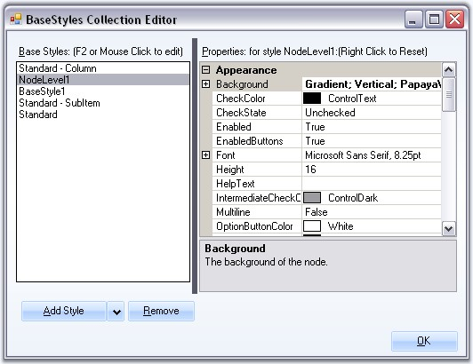

::: {style="DISPLAY: none"}
{#d2h_url_template}{#d2h_package_url style="WIDTH: 0px; DISPLAY: none; HEIGHT: 0px"}
:::

::: {.d2h_secondary_topic style="PADDING-BOTTOM: 10pt; MARGIN: 0pt; PADDING-LEFT: 0pt; PADDING-RIGHT: 0pt; PADDING-TOP: 0pt"}
##### Node Level Style {#node-level-style style="MARGIN-LEFT: 18pt; tab-stops: 18.0pt"}

[]{style="COLOR: #15428b"} 

Setting a Common Style for all the Nodes in a Level

 

TreeView lets you add node level styles using the BaseStyles Collection Editor. By default this style will be applied to all the nodes in the Level1 for NodeLevel1 style, Level2 for NodeLevel2 style and so on.

[]{style="COLOR: #15428b"} 

{border="0"}

[]{style="COLOR: #15428b"} 

Figure 1201: Node Level Style

**[]{style="COLOR: #15428b"}** 

You can apply this style to any of the node by using **TreeNodeAdv.BaseStyle** property for a particular node. Refer to Style Settings table in Node Specific Style.

 

 

 

 

[]{#related-topics}
:::
