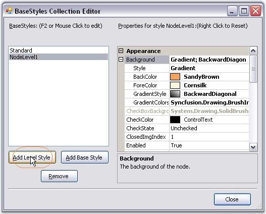
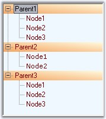
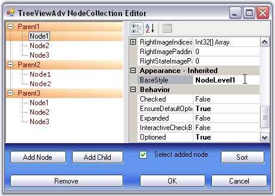

::: {style="DISPLAY: none"}
{#d2h_url_template}{#d2h_package_url style="WIDTH: 0px; DISPLAY: none; HEIGHT: 0px"}
:::

::: {.d2h_secondary_topic style="PADDING-BOTTOM: 10pt; MARGIN: 0pt; PADDING-LEFT: 0pt; PADDING-RIGHT: 0pt; PADDING-TOP: 0pt"}
##### Node Level Style {#node-level-style style="MARGIN-LEFT: 18pt; tab-stops: 18.0pt"}

[]{style="COLOR: #15428b"} 

Setting a Common Style for all the Nodes in a Level

 

TreeView lets you add node level styles using the BaseStyles Collection Editor.

[]{style="COLOR: #15428b"} 

{border="0"}

***[]{style="COLOR: #15428b"}*** 

Figure 1162: Node Level Styles added by using the BaseStyles Collection Editor

[]{style="COLOR: #15428b"} 

By default this style will be applied to the first level nodes as shown in the image below.

[]{style="COLOR: #15428b"} 

[{border="0"}]{style="COLOR: #15428b"}[]{style="COLOR: #15428b"}

[]{style="COLOR: #15428b"} 

Figure 1163: NodeLevelStyle applied by default to the First Level Nodes

**[]{style="COLOR: #15428b"}** 

You can also apply this style to any of the node by using **TreeNodeAdv.BaseStyle** property for a particular node.

[]{style="COLOR: #15428b"} 

{border="0"}

[]{style="COLOR: #15428b"} 

Figure 1164: NodeLevelStyle set to Node1

 

 

 

 

[]{#related-topics}
:::
