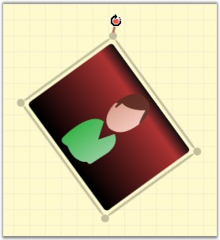
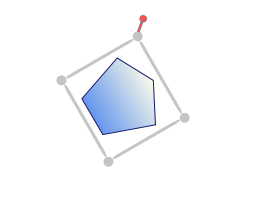
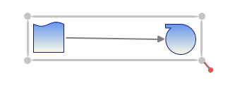

::: {style="DISPLAY: none"}
{#d2h_url_template}{#d2h_package_url style="WIDTH: 0px; DISPLAY: none; HEIGHT: 0px"}
:::

::::: {#nsbanner .d2h_main_nsbanner style="BORDER-BOTTOM: #999999 1px solid; POSITION: relative; PADDING-BOTTOM: 0px; BACKGROUND-COLOR: transparent; PADDING-LEFT: 0px; PADDING-RIGHT: 0px; DISPLAY: none; BORDER-TOP: #999999 1px solid; PADDING-TOP: 0px; LEFT: 0px"}
:::: {#TitleRow .d2h_main_titlerow style="PADDING-BOTTOM: 4px; BACKGROUND-COLOR: transparent; PADDING-LEFT: 22px; WIDTH: 100%; PADDING-RIGHT: 10px; DISPLAY: none; PADDING-TOP: 4px"}
::: {#ienav .d2h_main_ienav style="DISPLAY: none"}
{#D2HPrevious .D2HPreviousEnabled}  {#D2HNext .D2HNextEnabled}
:::
::::
:::::

:::: {#nstext .d2h_main_nstext style="PADDING-BOTTOM: 10px; BACKGROUND-COLOR: transparent; PADDING-LEFT: 22px; PADDING-RIGHT: 10px; HEIGHT: 100%; OVERFLOW: auto; PADDING-TOP: 5px" hasuserbackground="true" valign="bottom"}
::: {#d2h_breadcrumbs .d2h_breadcrumbs}
[Essential Studio User Guide Documentation](ms-xhelp:///?Id=12457748-09e3-4d74-a240-8e049cedf030){.d2h_breadcrumbsNormal}[ \> ]{.d2h_breadcrumbsLinkSeparator}[User Interface Edition](ms-xhelp:///?Id=c29296b7-531c-413b-a0ec-488ca1f7f669){.d2h_breadcrumbsNormal}[ \> ]{.d2h_breadcrumbsLinkSeparator}[Essential WPF](ms-xhelp:///?Id=7f4f82c5-151c-4262-94d0-75c4626c77bc){.d2h_breadcrumbsNormal}[ \> ]{.d2h_breadcrumbsLinkSeparator}[Essential Diagram]{.d2h_breadcrumbsContentsOnly}[ \> ]{.d2h_breadcrumbsLinkSeparator}[Concepts and Features](ms-xhelp:///?Id=8625d466-6e21-495a-b811-4ecee754da81){.d2h_breadcrumbsNormal}[ \> ]{.d2h_breadcrumbsLinkSeparator}[Nodes](ms-xhelp:///?Id=7e75e8aa-0313-4d05-b2e7-d5794d3d90fd){.d2h_breadcrumbsNormal}
:::

### Node Rotate {#node-rotate style="tab-stops: 0pt"}

A node can be rotated to any angle by dragging the rotate thumb. A node always rotates on its center.

[]{style="FONT-FAMILY: 'Trebuchet MS','sans-serif'; COLOR: #15428b; FONT-SIZE: 9pt"} 

Table 20: Property Table []{style="FONT-FAMILY: 'Trebuchet MS','sans-serif'; COLOR: #15428b"}

  ------------- ------------------------------------------------------------------------------------------------------- ---------------------- ----------------------- ---------------------------------------------------
  Property      Description                                                                                             Type of the property   Value it Accept         Any other dependencies/ sub properties associated
  AllowRotate   Gets or sets a value indicating whether node can be rotated or not. The default value is set to True.   Dependency property    Boolean (true/ false)   No[]{style="FONT-FAMILY: 'Courier New'"}
  ------------- ------------------------------------------------------------------------------------------------------- ---------------------- ----------------------- ---------------------------------------------------

[]{style="FONT-FAMILY: 'Trebuchet MS','sans-serif'; COLOR: #15428b; FONT-SIZE: 9pt"} 

Rotate Node

[]{style="FONT-FAMILY: 'Trebuchet MS','sans-serif'; COLOR: #15428b; FONT-SIZE: 9pt"} 

The steps to rotate a node are as follows.

[]{style="FONT-FAMILY: 'Trebuchet MS','sans-serif'; COLOR: #15428b; FONT-SIZE: 9pt"} 

[·      ]{style="FONT-FAMILY: Symbol"}Select the node to be rotated. The rotate thumb will be displayed in the top left corner.

[·      ]{style="FONT-FAMILY: Symbol"}Click the rotate thumb and drag it clockwise or counterclockwise; the node will rotate correspondingly.

[]{style="FONT-FAMILY: 'Trebuchet MS','sans-serif'; COLOR: #15428b; FONT-SIZE: 9pt"} 

{border="0"}

Figure 33: Node Rotation[]{style="FONT-FAMILY: 'Trebuchet MS','sans-serif'; COLOR: #15428b"}

[]{#p27} 

**AllowRotate\
\**

The AllowRotate property can be used to enable/disable rotation of the node.\
\

Node rotation is enabled when this property is set to True. Otherwise the rotation is disabled. The default value is True.

 

The AllowRotate property can be set in the following way.

[]{style="FONT-FAMILY: 'Trebuchet MS','sans-serif'; COLOR: #15428b; FONT-SIZE: 9pt"} 

+-------------------------------------------------------------------------------------------------------------------------------------------------------------------------------------------------------------------------------+
| **[\[C#\]\                                                                                                                                                                                                                    |
| ]{style="FONT-FAMILY: 'Courier New'; COLOR: black"}**[\                                                                                                                                                                       |
| ]{style="FONT-FAMILY: 'Courier New'; COLOR: black"}[Node]{style="FONT-FAMILY: 'Courier New'; COLOR: #2b91af"}[ nodeobject = [new]{style="COLOR: blue"} [Node]{style="COLOR: #2b91af"}();]{style="FONT-FAMILY: 'Courier New'"} |
|                                                                                                                                                                                                                               |
| [nodeobject.AllowRotate = [false]{style="COLOR: blue"};]{style="FONT-FAMILY: 'Courier New'"}                                                                                                                                  |
+-------------------------------------------------------------------------------------------------------------------------------------------------------------------------------------------------------------------------------+

 

+--------------------------------------------------------------------------------------------------------------------------------------------------------------------------------------------------------------------------------------------------+
| []{#p33}**[\[VB\]\                                                                                                                                                                                                                               |
| ]{style="FONT-FAMILY: 'Courier New'; COLOR: black"}**[\                                                                                                                                                                                          |
| ]{style="FONT-FAMILY: 'Courier New'; COLOR: black"}[Dim]{style="FONT-FAMILY: 'Courier New'; COLOR: blue"}[ nodeobject [As]{style="COLOR: blue"} [New]{style="COLOR: blue"} [Node]{style="COLOR: #2b91af"}()]{style="FONT-FAMILY: 'Courier New'"} |
|                                                                                                                                                                                                                                                  |
| [nodeobject.AllowRotate = [False]{style="COLOR: blue"}]{style="FONT-FAMILY: 'Courier New'"}[]{style="FONT-FAMILY: 'Courier New'"}                                                                                                                |
+--------------------------------------------------------------------------------------------------------------------------------------------------------------------------------------------------------------------------------------------------+

 

Rotation through Codebehind

Rotate angle property enables the rotation of the selected object with a specified angle. It enables the support to rotate all the selected Nodes.

 

Table 21: Property Table []{style="FONT-FAMILY: 'Trebuchet MS','sans-serif'; COLOR: #15428b"}

+-------------+------------------------------------------+----------------------+------------------+---------------------------------------------------+
| Property    | Description                              | Type of the property | Value it accepts | Any other dependencies/ sub properties associated |
+-------------+------------------------------------------+----------------------+------------------+---------------------------------------------------+
| RotateAngle | Gets or sets the angle for the Rotation. | Dependency property  | Double           | No                                                |
|             |                                          |                      |                  |                                                   |
|             |                                          |                      |                  |                                                   |
+-------------+------------------------------------------+----------------------+------------------+---------------------------------------------------+
|             |                                          |                      |                  |                                                   |
+-------------+------------------------------------------+----------------------+------------------+---------------------------------------------------+
|             |                                          |                      |                  |                                                   |
+-------------+------------------------------------------+----------------------+------------------+---------------------------------------------------+
|             |                                          |                      |                  |                                                   |
+-------------+------------------------------------------+----------------------+------------------+---------------------------------------------------+

 

After Rotating the Node:

{border="0"}

Figure 34: RotateAngle with 60 degree

 

After rotating the Group

 

{border="0"}

Figure 35: RotateAngle with 180 degree

 

 

[]{#related-topics}
::::
