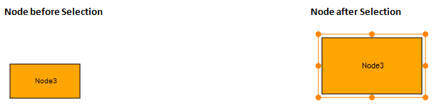

::: {style="DISPLAY: none"}
{#d2h_url_template}{#d2h_package_url style="WIDTH: 0px; DISPLAY: none; HEIGHT: 0px"}
:::

::::: {#nsbanner .d2h_main_nsbanner style="BORDER-BOTTOM: #999999 1px solid; POSITION: relative; PADDING-BOTTOM: 0px; BACKGROUND-COLOR: transparent; PADDING-LEFT: 0px; PADDING-RIGHT: 0px; DISPLAY: none; BORDER-TOP: #999999 1px solid; PADDING-TOP: 0px; LEFT: 0px"}
:::: {#TitleRow .d2h_main_titlerow style="PADDING-BOTTOM: 4px; BACKGROUND-COLOR: transparent; PADDING-LEFT: 22px; WIDTH: 100%; PADDING-RIGHT: 10px; DISPLAY: none; PADDING-TOP: 4px"}
::: {#ienav .d2h_main_ienav style="DISPLAY: none"}
{#D2HPrevious .D2HPreviousEnabled}  {#D2HNext .D2HNextEnabled}
:::
::::
:::::

:::: {#nstext .d2h_main_nstext style="PADDING-BOTTOM: 10px; BACKGROUND-COLOR: transparent; PADDING-LEFT: 22px; PADDING-RIGHT: 10px; HEIGHT: 100%; OVERFLOW: auto; PADDING-TOP: 5px" hasuserbackground="true" valign="bottom"}
::: {#d2h_breadcrumbs .d2h_breadcrumbs}
[Essential Studio User Guide Documentation](ms-xhelp:///?Id=12457748-09e3-4d74-a240-8e049cedf030){.d2h_breadcrumbsNormal}[ \> ]{.d2h_breadcrumbsLinkSeparator}[User Interface Edition](ms-xhelp:///?Id=c29296b7-531c-413b-a0ec-488ca1f7f669){.d2h_breadcrumbsNormal}[ \> ]{.d2h_breadcrumbsLinkSeparator}[Essential ASP.NET MVC](ms-xhelp:///?Id=4b14e7d1-65c4-4f67-b1aa-2c37709905a5){.d2h_breadcrumbsNormal}[ \> ]{.d2h_breadcrumbsLinkSeparator}[Essential Diagram]{.d2h_breadcrumbsContentsOnly}[ \> ]{.d2h_breadcrumbsLinkSeparator}[Concepts and Features](ms-xhelp:///?Id=04839cdf-94fc-4d24-9f6b-119fdbd7bbfb){.d2h_breadcrumbsNormal}[ \> ]{.d2h_breadcrumbsLinkSeparator}[Nodes](ms-xhelp:///?Id=1707ce52-b3af-4e98-81bf-f419bfe59d33){.d2h_breadcrumbsNormal}
:::

###  Node Selection  {#node-selection style="tab-stops: 0pt"}

A selected node is indicated using a rectangular resizer over the node's border. Interactions using the mouse will affect elements that are currently selected.  

 

Property

  ------------- ------------------------------------------------------------------------------------------------------------ ---------------------- ---------------------- ---------------------------------------------------
  Property      Description                                                                                                  Type of the Property   Value it Accepts       Any Other Dependencies/ Sub-Properties Associated
  AllowSelect   Gets or sets a value indicating whether the node can be selected or not. The default value is set to True.   Dependency property    Boolean (true/false)   No
  ------------- ------------------------------------------------------------------------------------------------------------ ---------------------- ---------------------- ---------------------------------------------------

 

A node can be selected at run time just by clicking on the node.

{border="0"}

Figure 42: Node Selection

                                                                

The two images above differentiate the appearance of the node before and after selection.[]{style="FONT-FAMILY: 'Calibri','sans-serif'"}

**[]{style="COLOR: black"}** 

AllowSelect 

The **AllowSelect** property can be used to enable and disable the node selection. When this property is set to **true**, it is possible to select the node. Otherwise, the node cannot be selected. The default value is **true**.

 

The **AllowSelect** property can be set in the following way:

More:

[ ]{#related-topics}

[{border="0" align="absMiddle"}Using Builder](ms-xhelp:///?Id=de5311dd-9bb4-4be5-aa04-7940c1a3edde){style="TEXT-DECORATION: none"}

[{border="0" align="absMiddle"}Using Properties Model](ms-xhelp:///?Id=b1d5daaf-9649-4723-9f96-3b28612ca76a){style="TEXT-DECORATION: none"}
::::
