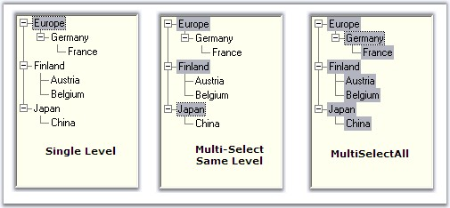

::: {style="DISPLAY: none"}
{#d2h_url_template}{#d2h_package_url style="WIDTH: 0px; DISPLAY: none; HEIGHT: 0px"}
:::

:::::::: {.d2h_secondary_topic style="PADDING-BOTTOM: 10pt; MARGIN: 0pt; PADDING-LEFT: 0pt; PADDING-RIGHT: 0pt; PADDING-TOP: 0pt"}
##### Node Selection {#node-selection style="MARGIN-LEFT: 18pt; tab-stops: 18.0pt"}

[]{#p973}[]{style="COLOR: #15428b"} 

During drag and drop operation of the tree nodes, a single node or same level nodes or multi level nodes can be selected and dragged based on the selection mode set for the treeview control. **SelectionMode** property is used for this purpose.

[]{style="COLOR: #15428b"} 

::: {align="center"}
+-----------------------------------+----------------------------------------------------------------------------------------------------------------------------+
| TreeViewAdv Properties            | Description                                                                                                                |
+-----------------------------------+----------------------------------------------------------------------------------------------------------------------------+
| SelectionMode                     | Specifies the selection mode of the treeview.                                                                              |
|                                   |                                                                                                                            |
|                                   | Options are,                                                                                                               |
|                                   |                                                                                                                            |
|                                   |                                                                                                                            |
|                                   |                                                                                                                            |
|                                   | *Single* - The user can only select one node at a time and implement the drag-drop operation in the TreeViewAdv (Default). |
|                                   |                                                                                                                            |
|                                   | *MultiSelectSameLevel* - The user can only select nodes of the same level, i.e. only child nodes or only parent nodes.     |
|                                   |                                                                                                                            |
|                                   | *MultiSelectAll* - The user can select multiple nodes for implementing the DragDrop operation in the TreeViewAdv.          |
+-----------------------------------+----------------------------------------------------------------------------------------------------------------------------+
:::

[]{style="COLOR: #15428b"} 

+----------------------------------------------------------------------------------------------------------------------------------------------------------------------------------------------------------+
| **[\[C#\]]{style="FONT-FAMILY: 'Courier New'; COLOR: black"}**                                                                                                                                           |
|                                                                                                                                                                                                          |
| []{style="COLOR: black"}                                                                                                                                                                                 |
|                                                                                                                                                                                                          |
| [this]{style="FONT-FAMILY: 'Courier New'; COLOR: blue"}[.treeViewAdv1.SelectionMode = TreeSelectionMode.MultiSelectSameLevel;]{style="FONT-FAMILY: 'Courier New'"}[]{style="FONT-FAMILY: 'Courier New'"} |
+----------------------------------------------------------------------------------------------------------------------------------------------------------------------------------------------------------+

[]{style="COLOR: #15428b"} 

+-------------------------------------------------------------------------------------------------------------------------------------------------------------------------------------------------------+
| **[\[VB.NET\]]{style="FONT-FAMILY: 'Courier New'; COLOR: black"}**                                                                                                                                    |
|                                                                                                                                                                                                       |
| []{style="COLOR: #15428b"}                                                                                                                                                                            |
|                                                                                                                                                                                                       |
| [Me]{style="FONT-FAMILY: 'Courier New'; COLOR: blue"}[.treeViewAdv1.SelectionMode = TreeSelectionMode.MultiSelectSameLevel]{style="FONT-FAMILY: 'Courier New'"}[]{style="FONT-FAMILY: 'Courier New'"} |
+-------------------------------------------------------------------------------------------------------------------------------------------------------------------------------------------------------+

**[]{style="COLOR: #15428b"}** 

{border="0"}

[]{style="COLOR: #15428b"} 

Figure 1137: Various Selection mode of TreeView Control

**[]{style="COLOR: #15428b"}** 

Extending the Selection

 

We can extend the selection of the nodes using ExtendSelectionTo method. []{#p974}

[]{style="COLOR: #15428b"} 

::: {align="center"}
+-----------------------------------+------------------------------------------------------------------------------------------------------+
| Methods                           | Parameter                                                                                            |
+-----------------------------------+------------------------------------------------------------------------------------------------------+
| ExtendSelectionTo                 | Extends the selection of the node to a specified node.                                               |
|                                   |                                                                                                      |
|                                   |                                                                                                      |
|                                   |                                                                                                      |
|                                   | *SelNode* - Represents a treeNodeAdv.                                                                |
+-----------------------------------+------------------------------------------------------------------------------------------------------+
| ExtendSelectionTo (Overloaded)    | *SelNode* - Represents a treeNodeAdv.                                                                |
|                                   |                                                                                                      |
|                                   | *removeCurrentMultipleSelection* - Indicates whether or not any current selection should be removed. |
+-----------------------------------+------------------------------------------------------------------------------------------------------+
:::

[]{style="COLOR: #15428b"} 

::: {style="BORDER-BOTTOM: windowtext 1pt solid; BORDER-LEFT: medium none; PADDING-BOTTOM: 1pt; MARGIN: 9pt 0pt 9pt 18pt; PADDING-LEFT: 0pt; PADDING-RIGHT: 0pt; BORDER-TOP: windowtext 1pt solid; BORDER-RIGHT: medium none; PADDING-TOP: 1pt"}
{border="0"} Note : This method will be effective only when the SelectionMode is MultiSelectSameLevel or MultiSelectAll.
:::

[]{style="COLOR: #15428b"} 

+------------------------------------------------------------------------------------------------------------------------------------------------------------------------------------------------------------------------------------------+
| **[\[C#\]]{style="FONT-FAMILY: 'Courier New'; COLOR: black"}**                                                                                                                                                                           |
|                                                                                                                                                                                                                                          |
| []{style="COLOR: black"}                                                                                                                                                                                                                 |
|                                                                                                                                                                                                                                          |
| [//Extend Selection using below method]{style="FONT-FAMILY: 'Courier New'; COLOR: green"}                                                                                                                                                |
|                                                                                                                                                                                                                                          |
| [this]{style="FONT-FAMILY: 'Courier New'; COLOR: blue"}[.treeViewAdv1.ExtendSelectionTo([this]{style="COLOR: blue"}.treenode1);]{style="FONT-FAMILY: 'Courier New'"}                                                                     |
|                                                                                                                                                                                                                                          |
| [//Overloaded Method]{style="FONT-FAMILY: 'Courier New'; COLOR: green"}                                                                                                                                                                  |
|                                                                                                                                                                                                                                          |
| [this]{style="FONT-FAMILY: 'Courier New'; COLOR: blue"}[.treeViewAdv1.ExtendSelectionTo([this]{style="COLOR: blue"}.treenode1, [false]{style="COLOR: blue"});]{style="FONT-FAMILY: 'Courier New'"}[]{style="FONT-FAMILY: 'Courier New'"} |
+------------------------------------------------------------------------------------------------------------------------------------------------------------------------------------------------------------------------------------------+

[]{style="COLOR: #15428b"} 

+-----------------------------------------------------------------------------------------------------------------------------------------------------------------------------------------------+
| **[\[]{style="FONT-FAMILY: 'Courier New'; COLOR: black"}[VB.NET\]]{style="FONT-FAMILY: 'Courier New'; COLOR: black"}[]{style="FONT-FAMILY: 'Courier New'; COLOR: black"}**                    |
|                                                                                                                                                                                               |
| []{style="COLOR: #15428b"}                                                                                                                                                                    |
|                                                                                                                                                                                               |
| [\'Extend Selection using below method]{style="FONT-FAMILY: 'Courier New'; COLOR: green"}                                                                                                     |
|                                                                                                                                                                                               |
| [Me]{style="FONT-FAMILY: 'Courier New'; COLOR: blue"}[.treeViewAdv1.ExtendSelectionTo([Me]{style="COLOR: blue"}.treenode1)]{style="FONT-FAMILY: 'Courier New'"}                               |
|                                                                                                                                                                                               |
| [\'Overloaded Method]{style="FONT-FAMILY: 'Courier New'; COLOR: green"}                                                                                                                       |
|                                                                                                                                                                                               |
| [Me]{style="FONT-FAMILY: 'Courier New'; COLOR: blue"}[.treeViewAdv1.ExtendSelectionTo([Me]{style="COLOR: blue"}.treenode1, [False]{style="COLOR: blue"})]{style="FONT-FAMILY: 'Courier New'"} |
+-----------------------------------------------------------------------------------------------------------------------------------------------------------------------------------------------+

[]{style="COLOR: #15428b"} 

On Focus / Off Focus

 

::: {align="center"}
  ------------------------- -----------------------------------------------------------------------------------------------------------------------------------------
  TreeViewAdv Properties    Description
  ShouldSelectNodeOnEnter   Indicates whether a default node should be selected when the treeviewadv control gains focus. By default this property is true.
  HideSelection             Indicates if the treeviewadv hides its selected nodes when not focussed. This should be set to false to highlight the select the nodes.
  ------------------------- -----------------------------------------------------------------------------------------------------------------------------------------
:::

[]{style="COLOR: #15428b"} 

See Also

[]{style="COLOR: #15428b"} 

[[How to select a particular node as a first visible node?]{.UGHyperlink}](../../../../../../../../Documents%20and%20Settings/sylviap/Desktop/Tools%20-%20Part%202.docx#_How_to_select)[]{style="COLOR: black"}

 

 

 

 

###### []{#p975}[]{#_Mouse_and_Keyboard}3.11.3.2.3.1    Mouse and Keyboard Based Selection {#mouse-and-keyboard-based-selection style="MARGIN-LEFT: 18pt; tab-stops: 18.0pt"}

[]{style="COLOR: #15428b"} 

Setting **AllowKeyboardSearch** property of the treeview to true, will allow the user to search for a node by typing the name of the node using the keyboard. User have to ensure that the TreeViewAdv control is focussed while searching.

 

By setting the **AllowMouseBasedSelection** property to true, multiple nodes can be selected with mouse down and these selected nodes can be dragged.

[]{style="COLOR: #15428b"} 

::: {align="center"}
  -------------------------- --------------------------------------------------------------------------------
  TreeViewAdv Properties     Description
  AllowKeyboardSearch        Gets or sets a value indicating if keyboard based searching should be allowed.
  AllowMouseBasedSelection   Indicates if multiple nodes can be selected with mouse down and drag.
  -------------------------- --------------------------------------------------------------------------------
:::

[]{style="COLOR: #15428b"} 

+-------------------------------------------------------------------------------------------------------------------------------------------------------------------------------------------------------------------------------------------------+
| **[\[C#\]]{style="FONT-FAMILY: 'Courier New'; COLOR: black"}**                                                                                                                                                                                  |
|                                                                                                                                                                                                                                                 |
| []{style="FONT-FAMILY: 'Courier New'; COLOR: black"}                                                                                                                                                                                            |
|                                                                                                                                                                                                                                                 |
| [this]{style="FONT-FAMILY: 'Courier New'; COLOR: blue"}[.treeViewAdv1.AllowKeyboardSearch = [false]{style="COLOR: blue"};]{style="FONT-FAMILY: 'Courier New'"}                                                                                  |
|                                                                                                                                                                                                                                                 |
| [this]{style="FONT-FAMILY: 'Courier New'; COLOR: blue"}[.treeViewAdv1.AllowMouseBasedSelection = [true]{style="COLOR: blue"};[ ]{style="COLOR: black"}]{style="FONT-FAMILY: 'Courier New'"}[]{style="FONT-FAMILY: 'Courier New'; COLOR: black"} |
+-------------------------------------------------------------------------------------------------------------------------------------------------------------------------------------------------------------------------------------------------+

[]{style="COLOR: #15428b"} 

+--------------------------------------------------------------------------------------------------------------------------------------------------------------------------------------------------------------------+
| **[\[VB.NET\]]{style="FONT-FAMILY: 'Courier New'; COLOR: black"}**                                                                                                                                                 |
|                                                                                                                                                                                                                    |
| []{style="COLOR: #15428b"}                                                                                                                                                                                         |
|                                                                                                                                                                                                                    |
| [Me]{style="FONT-FAMILY: 'Courier New'; COLOR: blue"}[.treeViewAdv1.AllowKeyboardSearch = [False]{style="COLOR: blue"}]{style="FONT-FAMILY: 'Courier New'"}                                                        |
|                                                                                                                                                                                                                    |
| [Me]{style="FONT-FAMILY: 'Courier New'; COLOR: blue"}[.treeViewAdv1.AllowMouseBasedSelection = [True]{style="COLOR: blue"}]{style="FONT-FAMILY: 'Courier New'"}[]{style="FONT-FAMILY: 'Courier New'; COLOR: blue"} |
+--------------------------------------------------------------------------------------------------------------------------------------------------------------------------------------------------------------------+

 

 

 

 

[]{#related-topics}
::::::::
