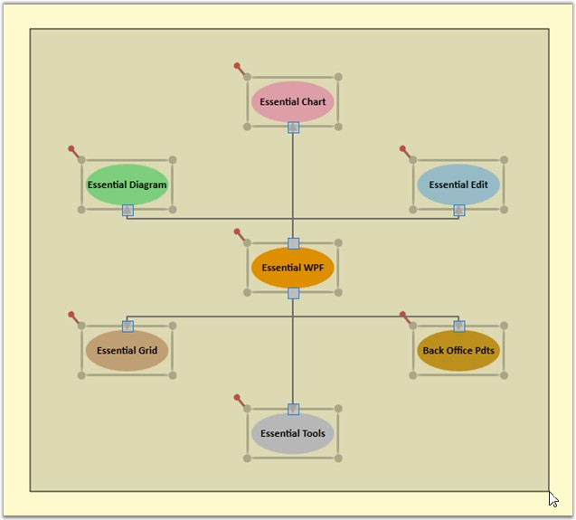

::: {style="DISPLAY: none"}
{#d2h_url_template}{#d2h_package_url style="WIDTH: 0px; DISPLAY: none; HEIGHT: 0px"}
:::

::::: {#nsbanner .d2h_main_nsbanner style="BORDER-BOTTOM: #999999 1px solid; POSITION: relative; PADDING-BOTTOM: 0px; BACKGROUND-COLOR: transparent; PADDING-LEFT: 0px; PADDING-RIGHT: 0px; DISPLAY: none; BORDER-TOP: #999999 1px solid; PADDING-TOP: 0px; LEFT: 0px"}
:::: {#TitleRow .d2h_main_titlerow style="PADDING-BOTTOM: 4px; BACKGROUND-COLOR: transparent; PADDING-LEFT: 22px; WIDTH: 100%; PADDING-RIGHT: 10px; DISPLAY: none; PADDING-TOP: 4px"}
::: {#ienav .d2h_main_ienav style="DISPLAY: none"}
{#D2HPrevious .D2HPreviousEnabled}  {#D2HNext .D2HNextEnabled}
:::
::::
:::::

::::: {#nstext .d2h_main_nstext style="PADDING-BOTTOM: 10px; BACKGROUND-COLOR: transparent; PADDING-LEFT: 22px; PADDING-RIGHT: 10px; HEIGHT: 100%; OVERFLOW: auto; PADDING-TOP: 5px" hasuserbackground="true" valign="bottom"}
::: {#d2h_breadcrumbs .d2h_breadcrumbs}
[Essential Studio User Guide Documentation](ms-xhelp:///?Id=12457748-09e3-4d74-a240-8e049cedf030){.d2h_breadcrumbsNormal}[ \> ]{.d2h_breadcrumbsLinkSeparator}[User Interface Edition](ms-xhelp:///?Id=c29296b7-531c-413b-a0ec-488ca1f7f669){.d2h_breadcrumbsNormal}[ \> ]{.d2h_breadcrumbsLinkSeparator}[Essential WPF](ms-xhelp:///?Id=7f4f82c5-151c-4262-94d0-75c4626c77bc){.d2h_breadcrumbsNormal}[ \> ]{.d2h_breadcrumbsLinkSeparator}[Essential Diagram]{.d2h_breadcrumbsContentsOnly}[ \> ]{.d2h_breadcrumbsLinkSeparator}[Concepts and Features](ms-xhelp:///?Id=8625d466-6e21-495a-b811-4ecee754da81){.d2h_breadcrumbsNormal}[ \> ]{.d2h_breadcrumbsLinkSeparator}[Nodes](ms-xhelp:///?Id=7e75e8aa-0313-4d05-b2e7-d5794d3d90fd){.d2h_breadcrumbsNormal}
:::

### Node Selection {#node-selection style="tab-stops: 0pt"}

A selected node is indicated using a rectangular resizer over the node's border. Many interactions using keyboard, mouse commands will affect the elements that is currently selected.

 

Table 26: Property Table

  ------------- -------------------------------------------------------------------------------------------------------- ---------------------- ----------------------- -----------------------------------------------------
  Property      Description                                                                                              Type of the property   Value it Accept         Any other dependencies/ sub properties associated
  AllowSelect   Gets or sets a value indicating whether node can be selected or not. The default value is set to True.   Dependency property    Boolean (true/ false)   No[]{style="FONT-FAMILY: Consolas; FONT-SIZE: 8pt"}
  IsSelected    Gets or sets a value indicating whether this instance is selected.                                       Dependency property    Boolean (true/ false)   No[]{style="FONT-FAMILY: Consolas; FONT-SIZE: 8pt"}
  ------------- -------------------------------------------------------------------------------------------------------- ---------------------- ----------------------- -----------------------------------------------------

 

A node can be selected in two ways,

 

[·      ]{style="FONT-FAMILY: Symbol"}At run time

[·      ]{style="FONT-FAMILY: Symbol"}Through Code

 

Node can be selected at run time just by clicking on the node.

 

{border="0"}

Figure 46: Node befor selecion

 

 

{border="0"}

 

Figure 47: Node after selecion

 

The above two images differentiates the appearance of the node before and after selection.

 

Node can also be selected using the IsSelected property of the Node.

 

[]{style="FONT-FAMILY: 'Trebuchet MS','sans-serif'; COLOR: #15428b; FONT-SIZE: 9pt"} 

+----------------------------------------------------------------------------------------------------------------------------------------------------------------------------------------------------------------------------------------------------------------------------------------------------------------------------------------------------------------------------------------------------+
| **[\[C#\]]{style="FONT-FAMILY: 'Courier New'; COLOR: black"}**                                                                                                                                                                                                                                                                                                                                     |
|                                                                                                                                                                                                                                                                                                                                                                                                    |
| [\                                                                                                                                                                                                                                                                                                                                                                                                 |
| ]{style="FONT-FAMILY: 'Courier New'; COLOR: black"}[Node]{style="FONT-FAMILY: 'Courier New'; COLOR: #2b91af"}[ n = ]{style="FONT-FAMILY: 'Courier New'; COLOR: black"}[new]{style="FONT-FAMILY: 'Courier New'; COLOR: blue"}[ ]{style="FONT-FAMILY: 'Courier New'; COLOR: black"}[Node]{style="FONT-FAMILY: 'Courier New'; COLOR: #2b91af"}[();]{style="FONT-FAMILY: 'Courier New'; COLOR: black"} |
|                                                                                                                                                                                                                                                                                                                                                                                                    |
| [n.Shape = [Shapes]{style="COLOR: #2b91af"}.FlowChart_Card;]{style="FONT-FAMILY: 'Courier New'"}                                                                                                                                                                                                                                                                                                   |
|                                                                                                                                                                                                                                                                                                                                                                                                    |
| [n.IsSelected = [true]{style="COLOR: blue"};]{style="FONT-FAMILY: 'Courier New'"}                                                                                                                                                                                                                                                                                                                  |
|                                                                                                                                                                                                                                                                                                                                                                                                    |
| [diagramModel.Nodes.Add(n);]{style="FONT-FAMILY: 'Courier New'; COLOR: black"}                                                                                                                                                                                                                                                                                                                     |
+----------------------------------------------------------------------------------------------------------------------------------------------------------------------------------------------------------------------------------------------------------------------------------------------------------------------------------------------------------------------------------------------------+

 

+-----------------------------------------------------------------------------------------------------------------------------------------------------------------------------------------------------------------------------------------+
| **[\[VB\]]{style="FONT-FAMILY: 'Courier New'; COLOR: black"}**                                                                                                                                                                          |
|                                                                                                                                                                                                                                         |
| [\                                                                                                                                                                                                                                      |
| ]{style="FONT-FAMILY: 'Courier New'; COLOR: black"}[Dim]{style="FONT-FAMILY: 'Courier New'; COLOR: blue"}[ n [As]{style="COLOR: blue"} [New]{style="COLOR: blue"} [Node]{style="COLOR: #2b91af"}()]{style="FONT-FAMILY: 'Courier New'"} |
|                                                                                                                                                                                                                                         |
| [n.Shape = Shapes.FlowChart_Card]{style="FONT-FAMILY: 'Courier New'"}                                                                                                                                                                   |
|                                                                                                                                                                                                                                         |
| [n.IsSelected = [True]{style="COLOR: blue"}]{style="FONT-FAMILY: 'Courier New'"}                                                                                                                                                        |
|                                                                                                                                                                                                                                         |
| [diagramModel.Nodes.Add(n)]{style="FONT-FAMILY: 'Courier New'"}**[]{style="FONT-FAMILY: 'Courier New'; COLOR: black"}**                                                                                                                 |
+-----------------------------------------------------------------------------------------------------------------------------------------------------------------------------------------------------------------------------------------+

 

Node Multi-Selection

[]{style="FONT-FAMILY: 'Trebuchet MS','sans-serif'; COLOR: #15428b; FONT-SIZE: 9pt"} 

Multiple items on the drawing area can be selected.

 

Multiple selection can be performed by following the below mentioned steps.

[]{style="FONT-FAMILY: 'Trebuchet MS','sans-serif'; COLOR: #15428b; FONT-SIZE: 9pt"} 

[·      ]{style="FONT-FAMILY: Symbol"}Items on the drawing area are selected only if they fall within the bounds of the drag adorner.

[·      ]{style="FONT-FAMILY: Symbol"}The drag adorner is displayed when you click anywhere on the page and start dragging the pointer.

[·      ]{style="FONT-FAMILY: Symbol"}The rectangle formed with the drag start-point as one of its points, and the point where the mouse button was released as its second point, defines the drag adorner\'s bounds.

[·      ]{style="FONT-FAMILY: Symbol"}Nodes connected to one or more nodes are selected only if one of the connected nodes is also within the drag adorner bounds. The nodes and the connector connecting them act as a single selection.

[]{style="FONT-FAMILY: 'Trebuchet MS','sans-serif'; COLOR: #15428b; FONT-SIZE: 9pt"} 

::: {style="BORDER-BOTTOM: windowtext 1pt solid; BORDER-LEFT: medium none; PADDING-BOTTOM: 1pt; MARGIN-TOP: 9pt; PADDING-LEFT: 0pt; PADDING-RIGHT: 0pt; MARGIN-BOTTOM: 9pt; BORDER-TOP: windowtext 1pt solid; BORDER-RIGHT: medium none; PADDING-TOP: 1pt"}
{border="0"}Note: Resizing or moving any one item affects the other items by the same factor. However, rotating affects only the current node.
:::

[]{style="FONT-FAMILY: 'Trebuchet MS','sans-serif'; COLOR: #15428b; FONT-SIZE: 9pt"} 

Items can be deselected by clicking on any part of the drawing area other than the selected items.

[]{style="FONT-FAMILY: 'Trebuchet MS','sans-serif'; COLOR: #15428b; FONT-SIZE: 9pt"} 

{border="0"}

Figure 48: Multiple Selections

 

[]{#p28} 

[]{#_How_to_Specify_6}[]{#_How_to_Edit}[]{#_How_to_Specify_7}[]{#_How_to_Specify_8}[]{#_How_to_Specify_9}[]{#_How_to_Specify_11}[]{#_How_to_Specify_10}AllowSelect

[]{style="FONT-FAMILY: 'Trebuchet MS','sans-serif'; COLOR: #15428b; FONT-SIZE: 9pt"} 

The **AllowSelect** property can be used to enable/disable the node selection.\
\
When this property is set to **True**, it is possible to select the node. Otherwise the node cannot be selected.\
The default value is **True**.

 

The **AllowSelect** property can be set in the following way:

[]{style="FONT-FAMILY: 'Trebuchet MS','sans-serif'; COLOR: #15428b; FONT-SIZE: 9pt"} 

+-------------------------------------------------------------------------------------------------------------------------------------------------------------------------------------------------------------------------------+
| **[\[C#\]]{style="FONT-FAMILY: 'Courier New'; COLOR: black"}**                                                                                                                                                                |
|                                                                                                                                                                                                                               |
| [\                                                                                                                                                                                                                            |
| ]{style="FONT-FAMILY: 'Courier New'; COLOR: black"}[Node]{style="FONT-FAMILY: 'Courier New'; COLOR: #2b91af"}[ nodeobject = [new]{style="COLOR: blue"} [Node]{style="COLOR: #2b91af"}();]{style="FONT-FAMILY: 'Courier New'"} |
|                                                                                                                                                                                                                               |
| [nodeobject.AllowSelect = [false]{style="COLOR: blue"};]{style="FONT-FAMILY: 'Courier New'"}                                                                                                                                  |
+-------------------------------------------------------------------------------------------------------------------------------------------------------------------------------------------------------------------------------+

 

+--------------------------------------------------------------------------------------------------------------------------------------------------------------------------------------------------------------------------------------------------+
| **[\[VB\]]{style="FONT-FAMILY: 'Courier New'; COLOR: black"}**                                                                                                                                                                                   |
|                                                                                                                                                                                                                                                  |
| [\                                                                                                                                                                                                                                               |
| ]{style="FONT-FAMILY: 'Courier New'; COLOR: black"}[Dim]{style="FONT-FAMILY: 'Courier New'; COLOR: blue"}[ nodeobject [As]{style="COLOR: blue"} [New]{style="COLOR: blue"} [Node]{style="COLOR: #2b91af"}()]{style="FONT-FAMILY: 'Courier New'"} |
|                                                                                                                                                                                                                                                  |
| [nodeobject.AllowSelect = [False]{style="COLOR: blue"}]{style="FONT-FAMILY: 'Courier New'"}[]{style="FONT-FAMILY: 'Courier New'"}                                                                                                                |
+--------------------------------------------------------------------------------------------------------------------------------------------------------------------------------------------------------------------------------------------------+

 

[]{#p36}See Also:

\
[[Select Nodes and Connectors]{.UGHyperlink}](ms-xhelp:///?Id=e790ccb5-2590-411f-96de-a90a2aae9389) Refer Concepts and Features -\> General -\> Select Nodes and Connectors

 

[]{#related-topics}
:::::
