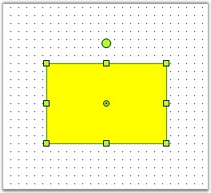
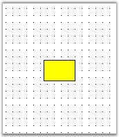
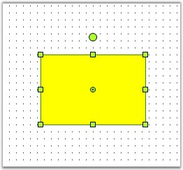
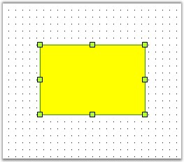

::: {style="DISPLAY: none"}
{#d2h_url_template}{#d2h_package_url style="WIDTH: 0px; DISPLAY: none; HEIGHT: 0px"}
:::

::::: {#nsbanner .d2h_main_nsbanner style="BORDER-BOTTOM: #999999 1px solid; POSITION: relative; PADDING-BOTTOM: 0px; BACKGROUND-COLOR: transparent; PADDING-LEFT: 0px; PADDING-RIGHT: 0px; DISPLAY: none; BORDER-TOP: #999999 1px solid; PADDING-TOP: 0px; LEFT: 0px"}
:::: {#TitleRow .d2h_main_titlerow style="PADDING-BOTTOM: 4px; BACKGROUND-COLOR: transparent; PADDING-LEFT: 22px; WIDTH: 100%; PADDING-RIGHT: 10px; DISPLAY: none; PADDING-TOP: 4px"}
::: {#ienav .d2h_main_ienav style="DISPLAY: none"}
{#D2HPrevious .D2HPreviousEnabled}  {#D2HNext .D2HNextEnabled}
:::
::::
:::::

:::::: {#nstext .d2h_main_nstext style="PADDING-BOTTOM: 10px; BACKGROUND-COLOR: transparent; PADDING-LEFT: 22px; PADDING-RIGHT: 10px; HEIGHT: 100%; OVERFLOW: auto; PADDING-TOP: 5px" hasuserbackground="true" valign="bottom"}
::: {#d2h_breadcrumbs .d2h_breadcrumbs}
[Essential Studio User Guide Documentation](ms-xhelp:///?Id=12457748-09e3-4d74-a240-8e049cedf030){.d2h_breadcrumbsNormal}[ \> ]{.d2h_breadcrumbsLinkSeparator}[User Interface Edition](ms-xhelp:///?Id=c29296b7-531c-413b-a0ec-488ca1f7f669){.d2h_breadcrumbsNormal}[ \> ]{.d2h_breadcrumbsLinkSeparator}[Essential Windows](ms-xhelp:///?Id=e60759d8-47a4-4570-9d7a-16a68d63f2ea){.d2h_breadcrumbsNormal}[ \> ]{.d2h_breadcrumbsLinkSeparator}[Essential Diagram]{.d2h_breadcrumbsContentsOnly}[ \> ]{.d2h_breadcrumbsLinkSeparator}[Concepts And Features](ms-xhelp:///?Id=008cec4b-5177-4859-8616-c062751d8fb6){.d2h_breadcrumbsNormal}[ \> ]{.d2h_breadcrumbsLinkSeparator}[Advanced Features](ms-xhelp:///?Id=f661be94-4825-49a2-ac75-df5e8495098e){.d2h_breadcrumbsNormal}
:::

### Node Selections {#node-selections style="tab-stops: 0pt"}

[]{style="FONT-FAMILY: 'Trebuchet MS','sans-serif'; COLOR: #15428b; FONT-SIZE: 9pt"} 

A node\'s behavior can be customized and modified using the EditStyle collection properties which can be used for the following:

[]{style="FONT-FAMILY: 'Trebuchet MS','sans-serif'; COLOR: #15428b; FONT-SIZE: 9pt"} 

[·      ]{style="FONT-FAMILY: Symbol"}To prohibit selection, rotation and deletion of nodes, by using **AllowSelect**, **AllowRotate** and **AllowDelete** properties.

[·      ]{style="FONT-FAMILY: Symbol"}To restrict a node\'s movement along the x or y axis, by using **AllowMoveX** and **AllowMoveY** properties.

[·      ]{style="FONT-FAMILY: Symbol"}To prevent re-sizing the height and width of the node, by using **AllowChangeHeight** and **AllowChangeWidth** and **AllowResize** properties.

[]{style="FONT-FAMILY: 'Trebuchet MS','sans-serif'; COLOR: #15428b; FONT-SIZE: 9pt"} 

::: {align="center"}
  -------------------- -------------------------------------------------------------------------------------------------------------------
  EditStyle Property   Description
  AllowChangeHeight    Specifies whether or not to allow the height to be changed. Default value is ***True***.
  AllowChangeWidth     Specifies whether or not to allow the width to be changed. Default value is ***True***.
  AllowDelete          Specifies whether or not to allow the node to be deleted on clicking the DELETE key. Default value is ***True***.
  AllowMoveX           Specifies whether or not to allow the node to be moved along the x-axis. Default value is ***True***.
  AllowMoveY           Specifies whether or not to allow the node to be moved along the y-axis. Default value is ***True***.
  AllowRotate          Specifies whether or not to rotate the node using the PinPoint. Default value is ***True***.
  AllowSelect          Specifies whether or not to select the node on mouse click. Default value is ***True***.
  -------------------- -------------------------------------------------------------------------------------------------------------------
:::

[]{style="FONT-FAMILY: 'Trebuchet MS','sans-serif'; COLOR: #15428b; FONT-SIZE: 9pt"} 

Programmatically, the properties can be set as follows:

[]{style="FONT-FAMILY: 'Trebuchet MS','sans-serif'; COLOR: #15428b; FONT-SIZE: 9pt"} 

+-------------------------------------------------------------------------------------------------------+
| **[\[C#\]]{style="FONT-FAMILY: 'Courier New'; COLOR: black"}**                                        |
|                                                                                                       |
| []{style="FONT-FAMILY: 'Courier New'"}                                                                |
|                                                                                                       |
| [rect.EditStyle.AllowChangeHeight = [true]{style="COLOR: blue"};]{style="FONT-FAMILY: 'Courier New'"} |
|                                                                                                       |
| [rect.EditStyle.AllowChangeWidth = [true]{style="COLOR: blue"};]{style="FONT-FAMILY: 'Courier New'"}  |
|                                                                                                       |
| [rect.EditStyle.AllowDelete = [false]{style="COLOR: blue"};]{style="FONT-FAMILY: 'Courier New'"}      |
|                                                                                                       |
| [rect.EditStyle.AllowMoveX = [true]{style="COLOR: blue"};]{style="FONT-FAMILY: 'Courier New'"}        |
|                                                                                                       |
| [rect.EditStyle.AllowMoveY = [false]{style="COLOR: blue"};]{style="FONT-FAMILY: 'Courier New'"}       |
|                                                                                                       |
| [rect.EditStyle.AllowRotate = [true]{style="COLOR: blue"};]{style="FONT-FAMILY: 'Courier New'"}       |
|                                                                                                       |
| [rect.EditStyle.AllowSelect = [true]{style="COLOR: blue"};]{style="FONT-FAMILY: 'Courier New'"}       |
+-------------------------------------------------------------------------------------------------------+

[]{style="FONT-FAMILY: 'Courier New'"} 

+------------------------------------------------------------------------------------------------------+
| **[\[VB\]]{style="FONT-FAMILY: 'Courier New'; COLOR: black"}**                                       |
|                                                                                                      |
| []{style="FONT-FAMILY: 'Courier New'"}                                                               |
|                                                                                                      |
| [rect.EditStyle.AllowChangeHeight = [True]{style="COLOR: blue"}]{style="FONT-FAMILY: 'Courier New'"} |
|                                                                                                      |
| [rect.EditStyle.AllowChangeWidth = [True]{style="COLOR: blue"}]{style="FONT-FAMILY: 'Courier New'"}  |
|                                                                                                      |
| [rect.EditStyle.AllowDelete = [False]{style="COLOR: blue"}]{style="FONT-FAMILY: 'Courier New'"}      |
|                                                                                                      |
| [rect.EditStyle.AllowMoveX = [True]{style="COLOR: blue"}]{style="FONT-FAMILY: 'Courier New'"}        |
|                                                                                                      |
| [rect.EditStyle.AllowMoveY = [False]{style="COLOR: blue"}]{style="FONT-FAMILY: 'Courier New'"}       |
|                                                                                                      |
| [rect.EditStyle.AllowRotate = [True]{style="COLOR: blue"}]{style="FONT-FAMILY: 'Courier New'"}       |
|                                                                                                      |
| [rect.EditStyle.AllowSelect = [True]{style="COLOR: blue"}]{style="FONT-FAMILY: 'Courier New'"}       |
+------------------------------------------------------------------------------------------------------+

**[]{style="FONT-FAMILY: 'Trebuchet MS','sans-serif'; COLOR: #15428b; FONT-SIZE: 9pt"}** 

In the above code snippets, the properties are set to the Rectangular node (rect) created through the code.

[]{style="FONT-FAMILY: 'Trebuchet MS','sans-serif'; COLOR: #15428b; FONT-SIZE: 9pt"} 

Behavior Settings

**[]{style="FONT-FAMILY: 'Trebuchet MS','sans-serif'; COLOR: #15428b"}** 

::: {align="center"}
+---------------------------------------------------------------------------------------+---------------------------------------------------------------------------------------------------------------------------------------------------------------------------------------------------------------------------------------------+
|  Property                                                                             | Description                                                                                                                                                                                                                                 |
+---------------------------------------------------------------------------------------+---------------------------------------------------------------------------------------------------------------------------------------------------------------------------------------------------------------------------------------------+
| AspectRatio                                                                           | Specifies whether to maintain the height and width ratio when the node is resized.                                                                                                                                                          |
+---------------------------------------------------------------------------------------+---------------------------------------------------------------------------------------------------------------------------------------------------------------------------------------------------------------------------------------------+
| DefaultHandleEditMode                                                                 | Specifies the mode in which the node should be handled. The default value for links and lines is Vertex and for all other nodes and polyline the default value is Resize. To move the nodes, DefaultHandleEditMode should be set to Resize. |
|                                                                                       |                                                                                                                                                                                                                                             |
| []{style="FONT-FAMILY: 'Trebuchet MS','sans-serif'; COLOR: #15428b; FONT-SIZE: 9pt"}  |                                                                                                                                                                                                                                             |
|                                                                                       |                                                                                                                                                                                                                                             |
|                                                                                       | The options provided are as follows.                                                                                                                                                                                                        |
|                                                                                       |                                                                                                                                                                                                                                             |
|                                                                                       | []{style="FONT-FAMILY: 'Trebuchet MS','sans-serif'; COLOR: #15428b; FONT-SIZE: 9pt"}                                                                                                                                                        |
|                                                                                       |                                                                                                                                                                                                                                             |
|                                                                                       | [·      ]{style="FONT-FAMILY: Symbol"}None                                                                                                                                                                                                  |
|                                                                                       |                                                                                                                                                                                                                                             |
|                                                                                       | [·      ]{style="FONT-FAMILY: Symbol"}Resize                                                                                                                                                                                                |
|                                                                                       |                                                                                                                                                                                                                                             |
|                                                                                       | [·      ]{style="FONT-FAMILY: Symbol"}Vertex                                                                                                                                                                                                |
+---------------------------------------------------------------------------------------+---------------------------------------------------------------------------------------------------------------------------------------------------------------------------------------------------------------------------------------------+
| Enabled                                                                               | Specifies whether the node is enabled. Default value is ***True***.                                                                                                                                                                         |
+---------------------------------------------------------------------------------------+---------------------------------------------------------------------------------------------------------------------------------------------------------------------------------------------------------------------------------------------+
| AllowVertexEdit                                                                       | Specifies whether or not to edit the vertex. Default value is ***True***.                                                                                                                                                                   |
+---------------------------------------------------------------------------------------+---------------------------------------------------------------------------------------------------------------------------------------------------------------------------------------------------------------------------------------------+
| HidePinPoint                                                                          | Specifies whether to show or hide the PinPoint. Default value is ***False***.                                                                                                                                                               |
+---------------------------------------------------------------------------------------+---------------------------------------------------------------------------------------------------------------------------------------------------------------------------------------------------------------------------------------------+
| HideRotationHandle                                                                    | Specifies whether to show or hide the RotationHandle in order to control the rotation of the node. Default value is ***False***.                                                                                                            |
+---------------------------------------------------------------------------------------+---------------------------------------------------------------------------------------------------------------------------------------------------------------------------------------------------------------------------------------------+
:::

[]{style="FONT-FAMILY: 'Trebuchet MS','sans-serif'; COLOR: #15428b; FONT-SIZE: 9pt"} 

Programmatically these properties can be set as follows:

[]{style="FONT-FAMILY: 'Trebuchet MS','sans-serif'; COLOR: #15428b; FONT-SIZE: 9pt"} 

+--------------------------------------------------------------------------------------------------------+
| **[\[C#\]]{style="FONT-FAMILY: 'Courier New'; COLOR: black"}**                                         |
|                                                                                                        |
| []{style="FONT-FAMILY: 'Courier New'"}                                                                 |
|                                                                                                        |
| [rect.EditStyle.AspectRatio = [true]{style="COLOR: blue"};]{style="FONT-FAMILY: 'Courier New'"}        |
|                                                                                                        |
| [rect.EditStyle.DefaultHandleEditMode =HandleEditMode.Resize;]{style="FONT-FAMILY: 'Courier New'"}     |
|                                                                                                        |
| [rect.EditStyle.Enabled = [true]{style="COLOR: blue"};]{style="FONT-FAMILY: 'Courier New'"}            |
|                                                                                                        |
| [rect.EditStyle.AllowVertexEdit = [true]{style="COLOR: blue"};]{style="FONT-FAMILY: 'Courier New'"}    |
|                                                                                                        |
| [rect.EditStyle.DefaultHandleEditMode =HandleEditMode.Vertex;]{style="FONT-FAMILY: 'Courier New'"}     |
|                                                                                                        |
| [rect.EditStyle.HidePinPoint = [true]{style="COLOR: blue"};]{style="FONT-FAMILY: 'Courier New'"}       |
|                                                                                                        |
| [rect.EditStyle.HideRotationHandle = [true]{style="COLOR: blue"};]{style="FONT-FAMILY: 'Courier New'"} |
+--------------------------------------------------------------------------------------------------------+

[]{style="FONT-FAMILY: 'Courier New'"} 

+-------------------------------------------------------------------------------------------------------+
| **[\[VB\]]{style="FONT-FAMILY: 'Courier New'; COLOR: black"}**                                        |
|                                                                                                       |
| **[]{style="FONT-FAMILY: 'Courier New'; COLOR: black"}**                                              |
|                                                                                                       |
| [rect.EditStyle.AspectRatio = [True]{style="COLOR: blue"}]{style="FONT-FAMILY: 'Courier New'"}        |
|                                                                                                       |
| [rect.EditStyle.DefaultHandleEditMode = HandleEditMode.Resize]{style="FONT-FAMILY: 'Courier New'"}    |
|                                                                                                       |
| [rect.EditStyle.Enabled = [True]{style="COLOR: blue"}]{style="FONT-FAMILY: 'Courier New'"}            |
|                                                                                                       |
| [rect.EditStyle.AllowVertexEdit = [True]{style="COLOR: blue"}]{style="FONT-FAMILY: 'Courier New'"}    |
|                                                                                                       |
| [rect.EditStyle.DefaultHandleEditMode = HandleEditMode.Vertex]{style="FONT-FAMILY: 'Courier New'"}    |
|                                                                                                       |
| [rect.EditStyle.HidePinPoint = [True]{style="COLOR: blue"}]{style="FONT-FAMILY: 'Courier New'"}       |
|                                                                                                       |
| [rect.EditStyle.HideRotationHandle = [True]{style="COLOR: blue"}]{style="FONT-FAMILY: 'Courier New'"} |
+-------------------------------------------------------------------------------------------------------+

**[]{style="FONT-FAMILY: 'Trebuchet MS','sans-serif'; COLOR: #15428b; FONT-SIZE: 9pt"}** 

In the above code snippets, the properties are set to the Rectangular node (rect) created through the code.

**[         ]{style="FONT-FAMILY: 'Trebuchet MS','sans-serif'; COLOR: #15428b; FONT-SIZE: 9pt"}**

{border="0"}

**[]{style="FONT-FAMILY: 'Trebuchet MS','sans-serif'; COLOR: #15428b; FONT-SIZE: 9pt"}** 

Figure 64: Default Handle Edit Mode

**[]{style="FONT-FAMILY: 'Trebuchet MS','sans-serif'; COLOR: #15428b; FONT-SIZE: 9pt"}** 

{border="0"}

**[]{style="FONT-FAMILY: 'Trebuchet MS','sans-serif'; COLOR: #15428b; FONT-SIZE: 9pt"}** 

Figure 65: Default Handle Edit mode with Resize

**[]{style="FONT-FAMILY: 'Trebuchet MS','sans-serif'; COLOR: #15428b; FONT-SIZE: 9pt"}** 

{border="0"}

**[]{style="FONT-FAMILY: 'Trebuchet MS','sans-serif'; COLOR: #15428b; FONT-SIZE: 9pt"}** 

Figure 66: Pinpoint and Rotation Handle

**[]{style="FONT-FAMILY: 'Trebuchet MS','sans-serif'; COLOR: #15428b; FONT-SIZE: 9pt"}** 

{border="0"}

**[]{style="FONT-FAMILY: 'Trebuchet MS','sans-serif'; COLOR: #15428b; FONT-SIZE: 9pt"}** 

Figure 67: Hide Point and Rotation Handle

[]{#p43}[]{style="FONT-FAMILY: 'Trebuchet MS','sans-serif'; FONT-SIZE: 12pt"} 

[]{#related-topics}
::::::
