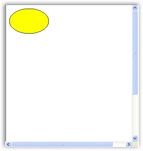
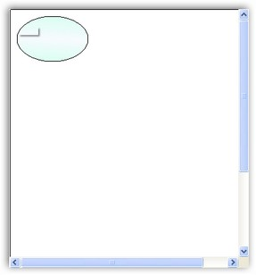
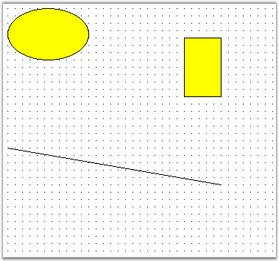

::: {style="DISPLAY: none"}
{#d2h_url_template}{#d2h_package_url style="WIDTH: 0px; DISPLAY: none; HEIGHT: 0px"}
:::

::: {.d2h_secondary_topic style="PADDING-BOTTOM: 10pt; MARGIN: 0pt; PADDING-LEFT: 0pt; PADDING-RIGHT: 0pt; PADDING-TOP: 0pt"}
#### Nodes or Shapes {#nodes-or-shapes style="tab-stops: 0pt"}

[]{style="FONT-FAMILY: 'Trebuchet MS','sans-serif'; COLOR: #15428b; FONT-SIZE: 9pt"} 

DiagramWebControl provides support for the following types of nodes.

[]{style="FONT-FAMILY: 'Trebuchet MS','sans-serif'; COLOR: #15428b; FONT-SIZE: 9pt"} 

[·      ]{style="FONT-FAMILY: Symbol"}TextNode

[·      ]{style="FONT-FAMILY: Symbol"}Shape

[·      ]{style="FONT-FAMILY: Symbol"}Symbol

[·      ]{style="FONT-FAMILY: Symbol"}ControlNode

[·      ]{style="FONT-FAMILY: Symbol"}PathNode

[·      ]{style="FONT-FAMILY: Symbol"}BitmapNode

[·      ]{style="FONT-FAMILY: Symbol"}RichTextNode

[·      ]{style="FONT-FAMILY: Symbol"}MetafileNode

[·      ]{style="FONT-FAMILY: Symbol"}Group

[·      ]{style="FONT-FAMILY: Symbol"}PseudoGroup

[·      ]{style="FONT-FAMILY: Symbol"}FilledPath

[·      ]{style="FONT-FAMILY: Symbol"}FilledShape

[·      ]{style="FONT-FAMILY: Symbol"}RoundRect

[·      ]{style="FONT-FAMILY: Symbol"}Polygon

[·      ]{style="FONT-FAMILY: Symbol"}Rectangle

[·      ]{style="FONT-FAMILY: Symbol"}ClosedCurveNode

[·      ]{style="FONT-FAMILY: Symbol"}Ellipse

[·      ]{style="FONT-FAMILY: Symbol"}PolylineNode

[·      ]{style="FONT-FAMILY: Symbol"}CurveNode

[·      ]{style="FONT-FAMILY: Symbol"}Line

[·      ]{style="FONT-FAMILY: Symbol"}SplineNode

[·      ]{style="FONT-FAMILY: Symbol"}Arc

[·      ]{style="FONT-FAMILY: Symbol"}BezierCurve

[·      ]{style="FONT-FAMILY: Symbol"}MeasureLine

[·      ]{style="FONT-FAMILY: Symbol"}Polyline

[·      ]{style="FONT-FAMILY: Symbol"}OrthogonalConnector

[·      ]{style="FONT-FAMILY: Symbol"}LineConnector

[·      ]{style="FONT-FAMILY: Symbol"}OrthogonalLine

[·      ]{style="FONT-FAMILY: Symbol"}Link

[·      ]{style="FONT-FAMILY: Symbol"}PolyLineConnector

[]{style="FONT-FAMILY: 'Trebuchet MS','sans-serif'; COLOR: #15428b; FONT-SIZE: 9pt"} 

Creating a Node at Run Time

[]{style="FONT-FAMILY: 'Trebuchet MS','sans-serif'; COLOR: #15428b; FONT-SIZE: 9pt"} 

To create and connect nodes, follow the below steps.

[]{style="FONT-FAMILY: 'Trebuchet MS','sans-serif'; COLOR: #15428b; FONT-SIZE: 9pt"} 

1.   Drag the DiagramWebControl onto the web page.

2.   Modify the code for the Page_Load function in the aspx.cs file as follows. (Ellipse is used in the current sample).

[]{style="FONT-FAMILY: 'Trebuchet MS','sans-serif'; COLOR: #15428b; FONT-SIZE: 9pt"} 

+------------------------------------------------------------------------------------------------------------------------------------------------------------------------------------------------------------------------------------+
| **[\[C#\]]{style="FONT-FAMILY: 'Courier New'"}**                                                                                                                                                                                   |
|                                                                                                                                                                                                                                    |
| []{style="FONT-FAMILY: 'Courier New'"}                                                                                                                                                                                             |
|                                                                                                                                                                                                                                    |
| [protected]{style="FONT-FAMILY: 'Courier New'; COLOR: blue"}[ [void]{style="COLOR: blue"} Page_Load([object]{style="COLOR: blue"} sender, [EventArgs]{style="COLOR: #2b91af"} e)]{style="FONT-FAMILY: 'Courier New'"}              |
|                                                                                                                                                                                                                                    |
| [{]{style="FONT-FAMILY: 'Courier New'"}                                                                                                                                                                                            |
|                                                                                                                                                                                                                                    |
| [Syncfusion.Windows.Forms.Diagram.[Ellipse]{style="COLOR: #2b91af"} ellipse = [new]{style="COLOR: blue"} Syncfusion.Windows.Forms.Diagram.[Ellipse]{style="COLOR: #2b91af"}(10, 10, 110, 70);]{style="FONT-FAMILY: 'Courier New'"} |
|                                                                                                                                                                                                                                    |
| [DiagramWebControl1.Model.AppendChild(ellipse);]{style="FONT-FAMILY: 'Courier New'"}                                                                                                                                               |
|                                                                                                                                                                                                                                    |
| [}]{style="FONT-FAMILY: 'Courier New'"}                                                                                                                                                                                            |
+------------------------------------------------------------------------------------------------------------------------------------------------------------------------------------------------------------------------------------+

[]{style="FONT-FAMILY: 'Trebuchet MS','sans-serif'; COLOR: #15428b; FONT-SIZE: 9pt"} 

{border="0"}

[    ]{style="FONT-FAMILY: 'Trebuchet MS','sans-serif'; COLOR: #15428b; FONT-SIZE: 9pt"}

 Figure 5: Diagram with Node

[]{style="FONT-FAMILY: 'Trebuchet MS','sans-serif'; COLOR: #15428b; FONT-SIZE: 9pt"} 

Node Property Settings

[]{style="FONT-FAMILY: 'Trebuchet MS','sans-serif'; COLOR: #15428b; FONT-SIZE: 9pt"} 

The following example illustrates how to set the Node Property Settings for the DiagramWebControl.

[]{style="FONT-FAMILY: 'Trebuchet MS','sans-serif'; COLOR: #15428b; FONT-SIZE: 9pt"} 

+------------------------------------------------------------------------------------------------------------------------------------------------------------------------------------------------------------------------------------+
| **[\[C#\]]{style="FONT-FAMILY: 'Courier New'"}**                                                                                                                                                                                   |
|                                                                                                                                                                                                                                    |
| []{style="FONT-FAMILY: 'Courier New'"}                                                                                                                                                                                             |
|                                                                                                                                                                                                                                    |
| [private]{style="FONT-FAMILY: 'Courier New'; COLOR: blue"}[ [void]{style="COLOR: blue"} Form1_Load([object]{style="COLOR: blue"} sender, [EventArgs]{style="COLOR: #2b91af"} e)]{style="FONT-FAMILY: 'Courier New'"}               |
|                                                                                                                                                                                                                                    |
| [{]{style="FONT-FAMILY: 'Courier New'"}                                                                                                                                                                                            |
|                                                                                                                                                                                                                                    |
| [Syncfusion.Windows.Forms.Diagram.[Ellipse]{style="COLOR: #2b91af"} ellipse = [new]{style="COLOR: blue"} Syncfusion.Windows.Forms.Diagram.[Ellipse]{style="COLOR: #2b91af"}(10, 10, 110, 70);]{style="FONT-FAMILY: 'Courier New'"} |
|                                                                                                                                                                                                                                    |
| [DiagramWebControl1.Model.AppendChild(ellipse);]{style="FONT-FAMILY: 'Courier New'"}                                                                                                                                               |
|                                                                                                                                                                                                                                    |
| [ellipse.FillStyle.Color = System.Drawing.[Color]{style="COLOR: #2b91af"}.AliceBlue;]{style="FONT-FAMILY: 'Courier New'"}                                                                                                          |
|                                                                                                                                                                                                                                    |
| [ellipse.FillStyle.ColorAlphaFactor = 100;]{style="FONT-FAMILY: 'Courier New'"}                                                                                                                                                    |
|                                                                                                                                                                                                                                    |
| [ellipse.FillStyle.ForeColor = System.Drawing.[Color]{style="COLOR: #2b91af"}.Aquamarine;]{style="FONT-FAMILY: 'Courier New'"}                                                                                                     |
|                                                                                                                                                                                                                                    |
| [ellipse.FillStyle.ForeColorAlphaFactor = 70;]{style="FONT-FAMILY: 'Courier New'"}                                                                                                                                                 |
|                                                                                                                                                                                                                                    |
| [ellipse.FillStyle.Type = FillStyleType.PathGradient;]{style="FONT-FAMILY: 'Courier New'"}                                                                                                                                         |
|                                                                                                                                                                                                                                    |
| [ellipse.FillStyle.PathBrushStyle = PathGradientBrushStyle.RectangleCenter;]{style="FONT-FAMILY: 'Courier New'"}                                                                                                                   |
|                                                                                                                                                                                                                                    |
| [ellipse.FillStyle.Type = FillStyleType.LinearGradient;]{style="FONT-FAMILY: 'Courier New'"}                                                                                                                                       |
|                                                                                                                                                                                                                                    |
| [ellipse.FillStyle.GradientAngle = 95;]{style="FONT-FAMILY: 'Courier New'"}                                                                                                                                                        |
|                                                                                                                                                                                                                                    |
| [ellipse.FillStyle.GradientCenter = 0.5f;]{style="FONT-FAMILY: 'Courier New'"}                                                                                                                                                     |
|                                                                                                                                                                                                                                    |
| [ellipse.EditStyle.AllowChangeHeight = [true]{style="COLOR: blue"};]{style="FONT-FAMILY: 'Courier New'"}                                                                                                                           |
|                                                                                                                                                                                                                                    |
| [ellipse.EditStyle.AllowChangeWidth = [true]{style="COLOR: blue"};]{style="FONT-FAMILY: 'Courier New'"}                                                                                                                            |
|                                                                                                                                                                                                                                    |
| [ellipse.EditStyle.AllowDelete = [false]{style="COLOR: blue"};]{style="FONT-FAMILY: 'Courier New'"}                                                                                                                                |
|                                                                                                                                                                                                                                    |
| [ellipse.EditStyle.AllowMoveX = [true]{style="COLOR: blue"};]{style="FONT-FAMILY: 'Courier New'"}                                                                                                                                  |
|                                                                                                                                                                                                                                    |
| [ellipse.EditStyle.AllowMoveY = [false]{style="COLOR: blue"};]{style="FONT-FAMILY: 'Courier New'"}                                                                                                                                 |
|                                                                                                                                                                                                                                    |
| [ellipse.EditStyle.AllowRotate = [false]{style="COLOR: blue"};]{style="FONT-FAMILY: 'Courier New'"}                                                                                                                                |
|                                                                                                                                                                                                                                    |
| [ellipse.EditStyle.AllowSelect = [true]{style="COLOR: blue"};]{style="FONT-FAMILY: 'Courier New'"}                                                                                                                                 |
|                                                                                                                                                                                                                                    |
| [}]{style="FONT-FAMILY: 'Courier New'"}                                                                                                                                                                                            |
+------------------------------------------------------------------------------------------------------------------------------------------------------------------------------------------------------------------------------------+

[]{style="FONT-FAMILY: 'Trebuchet MS','sans-serif'; COLOR: #15428b; FONT-SIZE: 9pt"} 

{border="0"}

[         ]{style="FONT-FAMILY: 'Trebuchet MS','sans-serif'; COLOR: #15428b; FONT-SIZE: 9pt"}

Figure 6: Diagram with Node Property Settings

[]{style="FONT-FAMILY: 'Trebuchet MS','sans-serif'; COLOR: #15428b; FONT-SIZE: 9pt"} 

Creating Nodes and Links

[]{style="FONT-FAMILY: 'Trebuchet MS','sans-serif'; COLOR: #15428b; FONT-SIZE: 9pt"} 

The following code example illustrates how to create nodes and links.

[]{style="FONT-FAMILY: 'Trebuchet MS','sans-serif'; COLOR: #15428b; FONT-SIZE: 9pt"} 

+----------------------------------------------------------------------------------------------------------------------------------------------------------------------------------------------------------------------------------------------------------------------------------------------------------------------------------------------------------------------------------------------------------------+
| **[\[C#\]]{style="FONT-FAMILY: 'Courier New'"}**                                                                                                                                                                                                                                                                                                                                                               |
|                                                                                                                                                                                                                                                                                                                                                                                                                |
| **[]{style="FONT-FAMILY: 'Courier New'"}**                                                                                                                                                                                                                                                                                                                                                                     |
|                                                                                                                                                                                                                                                                                                                                                                                                                |
| [protected]{style="FONT-FAMILY: 'Courier New'; COLOR: blue"}[ [void]{style="COLOR: blue"} Page_Load([object]{style="COLOR: blue"} sender, [EventArgs]{style="COLOR: #2b91af"} e)]{style="FONT-FAMILY: 'Courier New'"}                                                                                                                                                                                          |
|                                                                                                                                                                                                                                                                                                                                                                                                                |
| [{]{style="FONT-FAMILY: 'Courier New'"}                                                                                                                                                                                                                                                                                                                                                                        |
|                                                                                                                                                                                                                                                                                                                                                                                                                |
| [Syncfusion.Windows.Forms.Diagram.[Ellipse]{style="COLOR: #2b91af"} ellipse = [new]{style="COLOR: blue"} Syncfusion.Windows.Forms.Diagram.[Ellipse]{style="COLOR: #2b91af"}(10, 10, 110, 70);]{style="FONT-FAMILY: 'Courier New'"}                                                                                                                                                                             |
|                                                                                                                                                                                                                                                                                                                                                                                                                |
| [Syncfusion.Windows.Forms.Diagram.[Rectangle]{style="COLOR: #2b91af"} rectangle = [new]{style="COLOR: blue"} Syncfusion.Windows.Forms.Diagram.[Rectangle]{style="COLOR: #2b91af"}(300, 50, 50, 80);]{style="FONT-FAMILY: 'Courier New'"}                                                                                                                                                                       |
|                                                                                                                                                                                                                                                                                                                                                                                                                |
| [Syncfusion.Windows.Forms.Diagram.[LineConnector]{style="COLOR: #2b91af"} lineconnector = [new]{style="COLOR: blue"} Syncfusion.Windows.Forms.Diagram.[LineConnector]{style="COLOR: #2b91af"}([new]{style="COLOR: blue"} System.Drawing.[PointF]{style="COLOR: #2b91af"}(10, 200), [new]{style="COLOR: blue"} System.Drawing.[PointF]{style="COLOR: #2b91af"}(300, 250));]{style="FONT-FAMILY: 'Courier New'"} |
|                                                                                                                                                                                                                                                                                                                                                                                                                |
| [this]{style="FONT-FAMILY: 'Courier New'; COLOR: blue"}[.DiagramWebControl1.Model.AppendChild(ellipse);]{style="FONT-FAMILY: 'Courier New'"}                                                                                                                                                                                                                                                                   |
|                                                                                                                                                                                                                                                                                                                                                                                                                |
| [this]{style="FONT-FAMILY: 'Courier New'; COLOR: blue"}[.DiagramWebControl1.Model.AppendChild(rectangle);]{style="FONT-FAMILY: 'Courier New'"}                                                                                                                                                                                                                                                                 |
|                                                                                                                                                                                                                                                                                                                                                                                                                |
| [this]{style="FONT-FAMILY: 'Courier New'; COLOR: blue"}[.DiagramWebControl1.Model.AppendChild(lineconnector);]{style="FONT-FAMILY: 'Courier New'"}                                                                                                                                                                                                                                                             |
|                                                                                                                                                                                                                                                                                                                                                                                                                |
| [}]{style="FONT-FAMILY: 'Courier New'"}                                                                                                                                                                                                                                                                                                                                                                        |
+----------------------------------------------------------------------------------------------------------------------------------------------------------------------------------------------------------------------------------------------------------------------------------------------------------------------------------------------------------------------------------------------------------------+

[]{style="FONT-FAMILY: 'Trebuchet MS','sans-serif'; COLOR: #15428b; FONT-SIZE: 9pt"} 

{border="0"}

[]{style="FONT-FAMILY: 'Trebuchet MS','sans-serif'; COLOR: #15428b; FONT-SIZE: 9pt"} 

  Figure 7: Diagram with Node and Link

[]{#p15} 

[]{#related-topics}
:::
