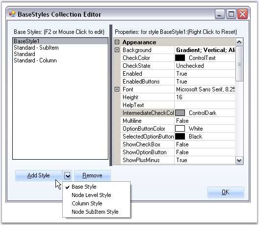
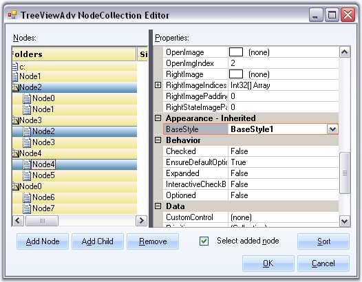
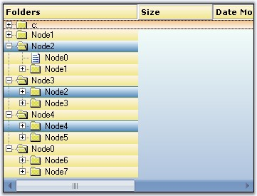

::: {style="DISPLAY: none"}
{#d2h_url_template}{#d2h_package_url style="WIDTH: 0px; DISPLAY: none; HEIGHT: 0px"}
:::

:::: {.d2h_secondary_topic style="PADDING-BOTTOM: 10pt; MARGIN: 0pt; PADDING-LEFT: 0pt; PADDING-RIGHT: 0pt; PADDING-TOP: 0pt"}
##### Node Specific Style {#node-specific-style style="MARGIN-LEFT: 18pt; tab-stops: 18.0pt"}

[]{#p1044}[]{style="COLOR: #15428b"} 

Make a Node\'s Style Inherit from Another Base Style

 

Apart from the default style ([[Standard Style]{.UGHyperlink}](../../../../../../../../Documents%20and%20Settings/sylviap/Desktop/Tools%20-%20Part%202.docx#_Node_Specific_Style_1)), we can also create custom Base styles using the BaseStyles Collection Editor. Select the Base Style option, then click Add Style.

[]{style="COLOR: #15428b"} 

{border="0"}

[]{style="COLOR: #15428b"} 

Figure 1198: Base Style option Selected

[]{style="COLOR: #15428b"} 

This new base style can be applied to any of the nodes, using **TreeNodeAdv.BaseStyle** property of the respective nodes.

[]{style="COLOR: #15428b"} 

{border="0"}

***[]{style="COLOR: #15428b"}*** 

Figure 1199: BaseStyle property in the TreeNodeAdv NodeCollection Editor

[]{style="COLOR: #15428b"} 

This overrides the [[Standard Style]{.UGHyperlink}](../../../../../../../../Documents%20and%20Settings/sylviap/Desktop/Tools%20-%20Part%202.docx#_Standard_Style_1)[ ]{style="COLOR: #15428b"}settings for the specified nodes and displays the image as follows.[]{style="COLOR: #15428b"}

[]{style="COLOR: #15428b"} 

{border="0"}

[]{style="COLOR: #15428b"} 

Figure 1200: Node Style inherited from another Base Style

**[]{style="COLOR: #15428b"}** 

Style Settings

 

The below properties lets you customize the Base style settings.

[]{style="COLOR: #15428b"} 

::: {align="center"}
  -------------------------------------- -------------------------------------------------------------------------------------
  TreeNodeAdvSubItemStyleInfo Property   Description
  Background                             Sets the background for the node.
  CheckColor                             Indicates the check color.
  CheckState                             Indicates the Check state of the node.
  Enabled                                Specifies if the node is enabled.
  EnabledButtons                         Specifies if the buttons are enabled for the node.
  Font                                   Sets the font for the node text.
  Height                                 Sets the height for the node.
  HelpText                               Sets the tooltip for the node.
  IntermediateCheckColor                 Specifies the color of intermediate check symbol.
  Multiline                              Indicate whether multiline is enabled for the node.
  OptionButtonColor                      Sets the color of the option button.
  SelectedOptionButtonColor              Sets the color of the selected option button.
  ShowCheckBox                           Sets the visibility of the Checkbox.
  ShowOptionButton                       Sets the visibility of the option button.
  ShowPlusMinus                          Sets the visibility of the plus / minus control.
  TextColor                              Sets the text color.
  ThemesEnabled                          Indicated if the node\'s controls will be themed.
  BaseStyle                              Specifies the base style of the node.
  EnsureDefaultOptionedChild             Specifies if at least one child of the parent node should be optioned at all times.
  InteractiveCheckbox                    Sets the visibility of the InteractiveCheckbox for the node.
  ClosedImageIndex                       Indicates the imageindex for closed node.
  CollapseImageIndex                     Indicates the imageindex in the NodeStateImageList, when the node is collapsed.
  ExpandImageIndex                       Indicates the imageindex in the NodeStateImageList, when the node is Expanded.
  LeftImageIndices                       Specifies the ImageIndex for the left image.
  LeftImagePadding                       Padding for the left image.
  LeftStateImagePadding                  Padding for the left state image.
  NoChildrenImageIndex                   Indicates the imageindex in the StateImageList where node has no children.
  OpenImageIndex                         Indicates the imageindex for the open node.
  RightImageIndices                      Specifies the imageindex for the right image.
  RightImagePadding                      Padding for the right image.
  RightStateImagePadding                 Padding for the right state image.
  ComparerOptions                        Comparer options during sorting.
  Comparer                               IComparer object that compares two nodes.
  Culture                                Indicates the culture of the nodes during sorting.
  SortOrder                              Specifies the sort order of the node.
  SortType                               Specifies the sort type of the node.
  -------------------------------------- -------------------------------------------------------------------------------------
:::

 

 

 

 

[]{#related-topics}
::::
