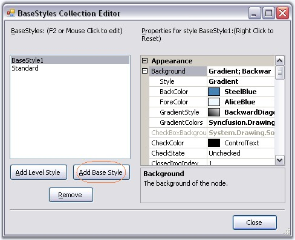
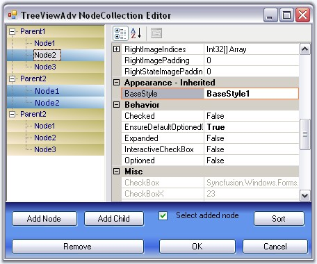
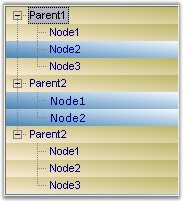

::: {style="DISPLAY: none"}
{#d2h_url_template}{#d2h_package_url style="WIDTH: 0px; DISPLAY: none; HEIGHT: 0px"}
:::

::: {.d2h_secondary_topic style="PADDING-BOTTOM: 10pt; MARGIN: 0pt; PADDING-LEFT: 0pt; PADDING-RIGHT: 0pt; PADDING-TOP: 0pt"}
##### Node Specific Style {#node-specific-style style="MARGIN-LEFT: 18pt; tab-stops: 18.0pt"}

[]{style="COLOR: #15428b"} 

Make a Node\'s Style Inherit from Another Base Style

[]{style="COLOR: #15428b"} 

 Apart from the default style ([[Standard Style]{style="COLOR: windowtext; TEXT-DECORATION: none; text-underline: none"}](../../../../../../../../Documents%20and%20Settings/sylviap/Desktop/Tools%20-%20Part%202.docx#_Standard_Style)),we can also create custom Base styles using the Base Styles Collection Editor. Clicking the Add Base Style button, will add a new BaseStyle whose properties can be edited.

[]{style="COLOR: #15428b"} 

{border="0"}

***[]{style="COLOR: #15428b"}*** 

Figure 1157: Base Styles added by using the BaseStyles Collection Editor

[]{style="COLOR: #15428b"} 

This new base style can be applied to any of the nodes, using **TreeNodeAdv.BaseStyle** property of the respective nodes.

[]{style="COLOR: #15428b"} 

{border="0"}

***[]{style="COLOR: #15428b"}*** 

Figure 1158: BaseStyle property in the TreeViewAdv NodeCollection Editor

[]{style="COLOR: #15428b"} 

This overrides the [[Standard Style]{.UGHyperlink}](../../../../../../../../Documents%20and%20Settings/sylviap/Desktop/Tools%20-%20Part%202.docx#_Standard_Style)[ ]{style="COLOR: #15428b"}settings for the specified nodes and displays the image as follows.[]{style="COLOR: #15428b"}

[]{style="COLOR: #15428b"} 

{border="0"}

[]{style="COLOR: #15428b"} 

Figure 1159: Node Style inherited from another Base Style

 

 

 

 

[]{#related-topics}
:::
